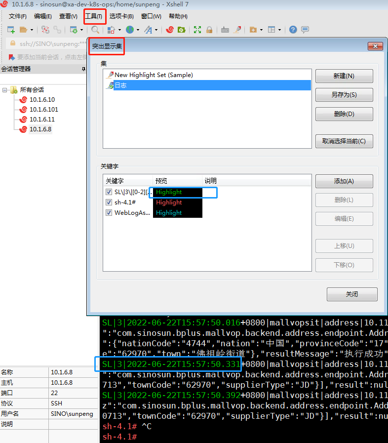

### 一、 查看文件

#### 1、查看文件

| 命令 | 解释                   | 常用                    | 解释             |
| ---- | ---------------------- | ----------------------- | ---------------- |
| cat  | 从第一行开始显示       | **cat filename**        | -n可以显示行号   |
| tac  | 从最后一行开始显示     |                         |                  |
| more | 一页一页的显示档案内容 |                         | d：向前翻页      |
| less | 相比more，可以翻页     | shift+g 移动到最后一行  | b：向后翻页      |
| head | 只看头几行             | head-n 20 filename      | 头10页，默认为10 |
| tail | 只看尾巴几行           | **tail -n 20 filename** | 尾10页，默认为10 |

#### 2、 cat

1. 命令格式：

   cat [选项] [文件]...

2. 命令功能：

   cat主要有三大功能：

   1. 一次显示整个文件: cat filename

   2. 从键盘创建一个文件: cat > filename 只能创建新文件,不能编辑已有文件.

   3. 将几个文件合并为一个文件: cat file1 file2 > file

3. 命令参数：

   -n, --number   对输出的所有行编号,由1开始对所有输出的行数编号

refreshSkuInfo


### 二、过滤 grep

```sh
grep  "[关键字]" [filename] -[参数] --color=auto
grep "word" address.log					 #word
grep "word1|word2" address.log           #word1|word2
grep "word1|word2" address.log -E        #word1或word2
grep "word1.*word2" address.log 		 #word1...word2 (正则表达式)
grep "word1" address.log | grep "word2"  #word1且word2 (多次过滤)
grep "word" address.log -C 5             #前后5行 (-A后，-B前，-C前后)
grep "word" address.log --color=auto     #高亮显示过滤的字符串
grep "word" log -r                       #进入目录
```


### 三、vi

1）上下翻动：向上箭头、向下箭头：每次滚动一条日志，这条日这可能占据多行

2）前后翻页：ctrl+f、ctrl+b：f就是forword，b就是backward

3）首行末行：首行（gg），末行（shift+g）

4）查找：?string：查找字符串，N向前，n向后

5）分页分屏：k8s中的vi也支持分页/分屏操作

6) 全局替换：:%s/[from]/[to]/g


### 四、命令

#### 1、linux基本命令

```sh
#基本命令
mv {source} {target}
cp {source} {target}
mkdir {目录}
rm {文件}
rm -ef {目录}

#软件
yum [options] [command] [package ...]
1. 列出所有可更新的软件清单命令：yum check-update
2. 更新所有软件命令：yum update
3. 仅安装指定的软件命令：yum install <package_name>
4. 仅更新指定的软件命令：yum update <package_name>
5. 列出所有可安裝的软件清单命令：yum list
6. 删除软件包命令：yum remove <package_name>
7. 查找软件包命令：yum search <keyword>

wegt {url} #下载
tar -zxf {.tar压缩包} #解压

#进程
ps -ef    #查询进程
jmap -heap pid   #查询堆内存

#网络
ip addr   #查询ip
ifconfig  #查询ip

#其他
uname -v  #查询虚拟机内核版本

#系统配置
#目前app: firewalld mysqld docker
systemctl status [app]  # 查看状态
systemctl start [app] # 开启
systemctl stop [app] # 关闭 
systemctl restart [app] #重启
systemctl is-enabled [app] # 查看开机是否启动
systemctl disable [app] # 关闭开机启用
systemctl enable [app] # 开机启用

#网络配置
cd /etc/sysconfig/network-scripts #网络配置文件位置
vim ifcfg-ens33 #网络配置文件
nmcli c reload #重启网卡

#=============================================远程==========================================
#远程复制：和cp的主要区别就是要指定路径
scp [file] [ip]:[path/[new-file]] 
scp t1.txt 10.1.20.237:/etc/yum.repos.d/ #复制到/etc/yum.repos.d目录下
scp t1.txt 10.1.20.237:. #复制到家目录下
#远程登录
ssh [user]@[ip]
ssh root@10.1.20.237
ps -ef | grep ssh #是否启动


#=============================================网络端口=================================================
netstat -anp #显示系统端口使用情况
netstat -tulpn #UDP类型和TCP类型的端口
netstat -nupl #UDP类型的端口
netstat -ntpl #TCP类型的端口
```

#### 2、window基本命令

```sh
ipconfig  #查询ip
ping {ip}
tcping {ip} {port}
```


### 五、虚拟机

- VMware：好像需要破解

- VirtualBox6.3：好像开源，Oracle的，官网下载


no  default or ui configuration directive found

/isolinux/vmlinuz initrd=/isolinux/initrd.img


## Centos

- 新建虚拟机
  - 选择系统安装位置，系统类型，系统版本：red hat(64-bit)
  - 选择内存大小
  - 现在创建虚拟硬盘，文件类型选择VDI，动态分配，虚拟硬盘位置不要选在C盘

- 配置安装
  - 存储 -》没有盘片 -》分配光驱 -》选择本地的iso
  - 系统 -》启动顺序 -》把光驱排在第一个

- 安装
  - 确定安装，安装语言选择中文（这里设置的仅仅是安装语言）
  - 安装位置 -》 本地标准盘 -》 自动分配分区 -> 完成 -》 开始安装
  - root密码 -》 root:root -》完成 -》重启

```sh
#网络：桥接模式
#网卡:开机启动，将动态获取ip改为静态获取
ip addr #10.1.20.89
vi /etc/sysconfig/network-scripts/ifcfg-enp0s3
TYPE=Ethernet 						
	PROXY_METHOD=none
	BROWSER_ONLY=no
	BOOTPROTO=static
	IPADDR=10.1.20.89
	NETMASK=255.255.255.0
	GATEWAY=10.1.20.1
	DNS1=114.114.114.114
	DEFROUTE=yes
	IPV4_FAILURE_FATAL=no
	IPV6INIT=yes
	IPV6_AUTOCONF=yes
	IPV6_DEFROUTE=yes
	IPV6_FAILURE_FATAL=no
	IPV6_ADDR_GEN_MODE=stable-privacy
	NAME=enp0s3                           
	UUID=b351fca8-3596-4168-a35f-cc927c09e2c4
	DEVICE=enp0s3
	ONBOOT=yes                       
nmcli connection reload #centos7重载网卡
systemctl restart network #centos8重载网卡

#关闭防火墙
systmectl stop firewalld    # 关闭
systmectl disable firewalld # 关闭开机启用

#下载vim
yum -y install vim*

#版本
cat /etc/redhat-release #CentOS Linux release 7.9.2009 (Core)
uname -r  #3.10.0-1160.el7.x86_64
#内存：2g
#存储：50g
#网络：桥接模式

vim ~/.bashrc
	PS1='\[\e[35;40m\][\u@\h \w]\$: \[\e[m\]'
		\d ：#代表日期，格式为weekday month date，例如："Mon Aug 1"
		\H ：#完整的主机名称
		\h ：#仅取主机的第一个名字
		\t ：#显示时间为24小时格式，如：HH：MM：SS
		\T ：#显示时间为12小时格式
		\A ：#显示时间为24小时格式：HH：MM
		\u ：#当前用户的账号名称
		\v ：#BASH的版本信息
		\w ：#完整的工作目录名称
		\W ：#利用basename取得工作目录名称，所以只会列出最后一个目录
		\# ：#下达的第几个命令
		\$ ：#提示字符，如果是root时，提示符为：# ，普通用户则为：$
\[\e[35;40m\]: 颜色，其中“F“为字体颜色，编号为30-37，“B”为背景颜色，编号为40-47
\[\e[m\]：后面不设置
source /root/.bashrc
```

- 导出虚拟机

  - 选择模板（centos7）

  - 开放式虚拟化格式1.0，导出位置，仅包含NAT网卡的MAC地址，写入Manifest地址
  - 导出成ova格式

- 导入虚拟机

  - 选择系统和存储的安装路径
  - 重命名虚拟机

```sh
timedatectl set-timezone Asia/Shanghai
hostnamectl set-hostname [new-hostname] #vim /etc/hostname
vim /etc/hosts
	10.1.20.235  master
	10.1.20.236  node1
	10.1.20.237  node2
reboot #重启虚拟机
```


## 网络

### 网络基础

IPv4的ip地址资源比较紧张，实际上整个互联网就是一个巨大的局域网，ip地址有限，那么通过划分子网，如何再在子网里面分配ip地址给子网的主机，这个时候同一一个ip就可以给一整个子网所共用，就解决了互联网ip不够的问题

ip=网络号（网络部分+子网部分）+主机号

子网掩码：区分哪段是网络，哪段是主机号

A类保留给政府机构（0.0.0.0到127.255.255.255）
B类分配给中等规模的公司（128.0.0.0到191.255.255.255）
C类分配给任何需要的人（192.0.0.0到223.255.255.255）
D类用于组播（224.0.0.0---239.255.255.255）
E类用于实验（240.0.0.0---247.255.255.255）


### 网络模式

| 虚拟机        | 主机                       | 局域网   | 互联网                             |
| ------------- | -------------------------- | -------- | ---------------------------------- |
| 桥接模式      | 相互通讯                   | 相互通讯 | 可以上网，被访问需要暴漏在互联网上 |
| NAT模式       | 可以访问主机，但不能被访问 | 不知道   | 可以上网，被访问需要暴漏在互联网上 |
| Host-Only模式 | 相互通讯                   | 不知道   | 不可以上网                         |

- 桥接模式：实现虚拟机在真实的网络上；
- NAT模式：实现虚拟机隐藏在物理机之后，能上网，但不能访问物理机；
- Host-Only模式：实现虚拟机隐藏在物理机之后，不能上网，但可以访问物理机；


### 网卡

```sh
vim /etc/sysconfig/network-scripts/ifcfg-enp0s3
#网卡基本信息
	TYPE=Ethernet 							#以太网
	PROXY_METHOD=none
	BROWSER_ONLY=no
	BOOTPROTO=dhcp 							#动态ip
	DEFROUTE=yes
	IPV4_FAILURE_FATAL=no
	IPV6INIT=yes
	IPV6_AUTOCONF=yes
	IPV6_DEFROUTE=yes
	IPV6_FAILURE_FATAL=no
	IPV6_ADDR_GEN_MODE=stable-privacy
	NAME=enp0s3                            #网卡名称
	UUID=b351fca8-3596-4168-a35f-cc927c09e2c4
	DEVICE=enp0s3
	ONBOOT=yes                             #是否开机启动
#将动态获取ip改为静态获取ip：BOOTPROTO=dhcp->static
	BOOTPROTO=static
	IPADDR=10.1.20.112
	NETMASK=255.255.255.0
	GATEWAY=10.1.20.1
	DNS1=114.114.114.114
	
nmcli connection reload #重载网卡
nmcli connection up ens33 #激活网卡ens33
nmcli connection down ens33 #停用网卡ens33
```


### 六、linux

#### 1、centos8.2

- CentOS-8.0：好像开源，下载地址：http://mirrors.163.com/【网易镜像地址】

  安装：

  - 虚拟机新建操作系统： 新建操作系统 -》设置内存、存储。
  - 加载：选择要加载的镜像 -》加载
  - 操作系统配置：选择存储、root用户设置 -》重启
  - 个性化设置：等等。
  - 网络设置：1.网络设置； 2.网络配置文件修改

#### 1.1 网络

#### 1.2 yum

```sh
###安装新源
#特别是：centos8官方源已下线，需要切换centos-vault源
mv /etc/yum.repos.d/CentOS-Base.repo /etc/yum.repos.d/CentOS-Base.repo.backup #备份原有
wget -O /etc/yum.repos.d/CentOS-Base.repo https://mirrors.aliyun.com/repo/Centos-6.repo #安装信源
yum clean all #跟新缓存
yum makecache #如提示AppStream下载失败，更新文件CentOS-AppStream.repo

###更新CentOS-AppStream.repo
#centos8相比centos7多了CentOS-AppStream.repo，所以centos8换源后还要更新CentOS-AppStream.repo
#将CentOS-Base.repo中的[AppStream]复制到CentOS-AppStream.repo
```


#### 5. centos测速

```sh
#安装git
yum -y install git
#git克隆speedtest
git clone https://github.com/sivel/speedtest-cli.git
#进入speedtest-cli
cd speedtest-cli
#修改speedtest.py，由于现在一般python都是python3，所以#!/usr/bin/env python -》 #!/usr/bin/env python3
vi speedtest.py
#执行speedtest-cli
./speedtest-cli
```

可能报错：./speedtest-cli执行失败，没有python

```sh
#检查python版本
python -version
python3 -version
#安装python3
dnf install python3
```

设置全局

```sh
#增加读写执行权限及移动到全局操作目录
chmod +rx speedtest.py
sudo mv speedtest.py /usr/local/bin/speedtest-cli
sudo chown root:root /usr/local/bin/speedtest-cli
speedtest.py #任意位置执行
```


### 其他软件安装

#### 1、jdk

```sh
#查看是否安装、安装版本
java -version

#安装
yum install java-1.8.0-openjdk* -y #yum安装方法会自动配置环境变量
#默认安装位置 /usr/lib/jvm
```


```sh
#查询所有进程
ps -a
ps -aux
ps -ef
#根据条件查询进程
ps -aux | grep "[条件]"
ps -ef | grep "[条件]"

#杀死进程
kill -9 [pid] #通过信号的方式杀死进程

#守护进程
#kill杀死不了守护进程，会有其他信号不断重启守护进程，一般守护进程都带d，如mysqld

```


### 六、XShell

#### 1、使用

##### 1.1 xshell突出显示




- 字符串

  红色部分：sh-4.1#

- 正则表达式

  绿色部分：

  ```
  SL\|3\|[0-2][0-9][0-9][0-9]-[0-1][0-9]-[0-3][0-9]T[0-9][0-9]:[0-9][0-9]:[0-9][0-9].[0-9][0-9][0-9]
  ```

##### 


