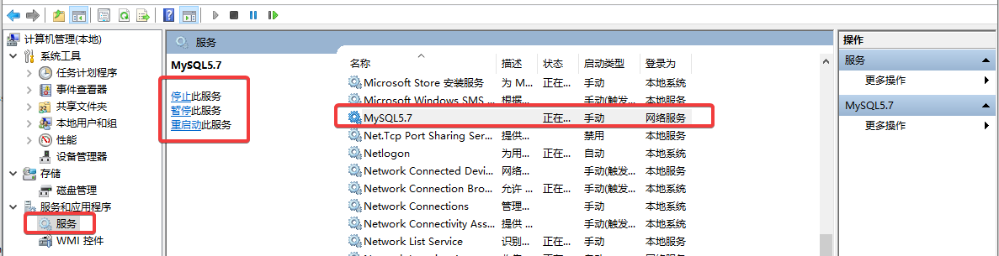
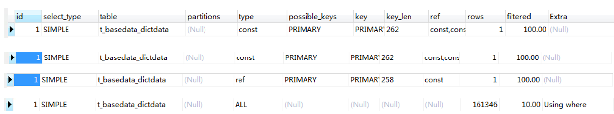

# 快速使用

## 1、启动

```sh
#===========================================一、启动虚拟机mysql===========================================
#1.启动mysql-server
systemctl start mysqld
systemctl stop mysqld   #守护进程，kill杀不死
#2.启动mysql-client
mysql -uroot -proot

#===========================================二、启动容器mysql===========================================
systemctl start docker
docker run -d --name mysql-3307 -p 3307:3306 -e MYSQL_ROOT_PASSWORD=root mysql:5.7
```

## 2、sql语句

```mysql
-- ==========================================用户&权限====================================
#1.查询
SELECT user,host FROM mysql.user; #查询所有用户
SELECT * FROM mysql.user WHERE user='root'\G #查询具体用户
#\g 相当于’;’
#\G使每个字段打印到单独的行，也有’;'的作用
#2.用户
insert user 'userName'@'host'; #增
drop user 'username'@'host';   #删
#3.权限
UPDATE mysql.user SET user.Host='%' where user.User='root'; # %表示任意主机，不然只有本地主机可以连接
FLUSH PRIVILEGES;


-- ===========================================数据库=====================================
show databases; #查
create database [new-databaseName];
drop database [databaseName];
use databasesName; 


-- ============================================表=======================================
create table tableName(属性名 类型 [约束] [备注]，==== ，====); #创建表和表的属性
drop table tableName;
alter table tableName1 rename tableName2;
show tables;
show create table [tableName]; #查


-- ==========================================columns=====================================
alter table [tableName] add column [columnName] varchar(10) comment ['注释'];#增
alter [tableName] drop column [columnName]; #删
show columns from [tableName]; #查


-- ===========================================数据==========================================
insert into tableName(,,) values(,,),(,,);
insert into tableName set id=3,name="sunpeng";
delete from tableName where id>2;
select * from tableName;
update tableName set name="sunyue" where id=1;


-- ==========================================索引==============================================
create INDEX [index_name] ON table_name (column1, column2, column3); #增
alter table table_name add index [index_name] (column1, column2, column3); #增
alter table table_name add unique (column1, column2, column3); #增
alter table table_name drop index index_name; #删


-- =========================================count==============================================
select count(*) from [tableName]; #统计个数
select count([columnName]) from [tableName]; #统计个数,columnName=null不计入统计
select [columnName], count([columnName]) from [tableName] group by [columnName]; #按columnName分组并并统计


-- ===========================================as==============================================
#别名：可以用于表名，也可以用于字段名，起完别名后就不允许用原名了
select * from [tableName] as [other-tableName] where [other-tableName].id<5;


-- ===========================================in====================================================
select * from student where age IN (select age from student where score>60) 在score>60
select * from student where age IN(20,21,22)


-- ========================================join 连接（多表查询）===========================================
-- 内连接
select *  from  [表A] a  inner  join  [表B] b  on  a.key = b.key;
-- 左连接/左外连接
select  *  from  [表A] a  left  join  [表B] a  on  a.key = b.key;
-- 右连接/右外连接
select  *  from  [表A] a  right join  [表B] b  on  a.key = b.key;
-- 全连接/全外连接
select * from  [表A] a  left join  [表B] b  on  a.key = b.key 
union
select * from  [表A] a  right join  [表B] b  on  a.key = b.key;
-- 单独左连接
select  *  from  [表A] a  left  join  [表B] b  on  a.key = b.key  where  b.key is null;
-- 单独右连接
select  *  from  [表A] a  right join [表B] b  on  a.key = b.key  where  a.key is null;
-- 单独全连接
select * from  [表A] a  left join  [表B] b  on  a.key = b.key where b.key is null
union
select * from  [表A] a  right join  [表B] b  on  a.key = b.key where a.key is null;


-- ============================复合sql：根据select编辑insert/update/delete数据=================================
-- 一条sql中如果通知存在查询和编辑，需要重命名，不然会报错：you can't specify target table 【tableName】 for update in from clause
-- 1.查询(不需要为查询的结果重命名，因为没有编辑，进士在查询)
select * from t_basedata_dictdata where bd_type=6 and parent_bd_code=-1 and bd_code not in (select bd_code from t_basedata_dictdata where bd_type=7 and parent_bd_code=-1)
-- 2.删除(需要为查询的结果重命名)
Delete from t_basedata_dictdata where bd_type=6 and parent_bd_code=-1 and bd_code not in (select bd_code from (select bd_code from t_basedata_dictdata where bd_type=7 and parent_bd_code=-1) bc)
-- 3.新增(需要为查询的结果重命名)
INSERT INTO `t_system_system_resource`(`pid`, `url`, `content`, `create_time`, `state`, `grade`, `front_path`, `sort`) VALUES ((SELECT resource_id FROM ( SELECT resource_id FROM t_system_system_resource WHERE front_path = '/sysset_notice_set') ri), '/', '活动推送', now(), 1, 3, '/sysset_notice_set/advert', 0);
-- 4.新增(不需要为查询的结果重命名，因为操作的不是同一张表)
INSERT INTO `t_system_system_resource_role`(`resource_id`, `role_id`, `create_time`) VALUES ((SELECT MAX(resource_id) FROM t_system_system_resource), 1, NOW());


-- =================================explain 解释(是否命中索引)==============================================
explain select * from t_basedata_dictdata where bd_code = 1010000 and bd_type = 2;


-- ======================================LIMIT 分页======================================================
select * from table_name LIMIT [pageNum], [pageSize];
-- 参数：pageNum表示从第几条（与java.page不一样：第几页），pageSize表示查询几条，
-- 当数据库过大，第一个参数越大查询越慢，需要注意。


-- =========================================进程======================================================
-- 展示正在运行的sql
show processlist
-- 强制停止
kill [id]


-- =========================================不等于==================================================
-- mysql中不等于 <>  和 != 都可以表示不等于，不过 <> 在所有的sql语句中都是通用的。
```


# 一、MySQl

## 1、安装

### 1.1 linux

```sh
#1.安装
dnf install @mysql
mysqld -v #查询版本号

#2.启动mysql-server
systemctl enable --now mysqld
systemctl status mysqld

#3.启动mysql-client
/usr/bin/mysqladmin -u root password ['newPassword'] #初始root用户没有密码，可以修改密码
mysql -u root -p
	->mysql UPDATE mysql.user SET user.Host='%' where user.User='root'; #授予任意主机登录的权力
```

### 1.2 window

- 启动

  window：我的电脑 --》管理 --》 服务和应用程序 --》 服务  --》 选中mysql，再点击启动

  启动成功：

  


## 2、其他

### 多表查询

- inner join: 内连接，又叫等值连接。SELECT * FROM students s INNER JOIN classes c ON s.class_id = c.id; 

 SELECT * FROM students s, classes c where s.cid = c.id; 

 SELECT * FROM students s INNER JOIN classes c where s.cid = c.id; 

三者结果一样，“，”代替INNER JOIN，where代替on，但是其他链接中不能代替，“,”表示不了外链接的含义，where代替on的语法会报错。

注1：另外：inner join后面也可以不跟on 或者 where，结果就变成笛卡尔链接。

SELECT * FROM students cross join classes; 《=》 SELECT * FROM students, classes; 

注2：mysql也支持cross join，它和inner join的用法结果一模一样。

- left join :左连接，返回左表中所有的记录以及右表中连接字段相等的记录。

- right join :右连接，返回右表中所有的记录以及左表中连接字段相等的记录。

- full join:外连接，返回两个表中的行：left join + right join。但mysql不支持

- inner join: 内连接，又叫等值连接。SELECT * FROM students s INNER JOIN classes c ON s.class_id = c.id; 


### mysql约束

| 约束         | 约束(中文) | 说明               |
| ------------ | ---------- | ------------------ |
| primary  key | 主键约束   | 标识每一条数据     |
| foreign  key | 外键约束   | 用于链接两个表     |
| not  null    | 非空约束   | 此属性不能为空     |
| unique       | 唯一性约束 | 此属性不能有相同的 |
| default      | 默认键约束 | 设定此属性的默认值 |

设置缺省值。null也要设置，因为不设置，默认就真的是空白。


### 锁

乐观锁：乐观锁是一种思想，表中有一个版本字段，第一次读的时候，获取到这个字段。处理完业务逻辑开始更新的时候，需要再次查看该字段的值是否和第一次的一样。如果一样更新，反之拒绝。之所以叫乐观，因为这个模式没有从数据库加锁。数据版本记录机制的实现。

悲观锁：分为共享锁和排它锁。

共享锁：(读锁)事务A上共享锁后，其他事务还可以上共享锁，但共享锁只能读。

排他锁：（写锁）事务A上了排他锁后，其他事务都无法再上锁，但排他锁读写都行。


### explain

t_basedata_dictdata (PK: bd_type, bd_code)

```sql
explain select * from t_basedata_dictdata where bd_code = 1010000 and bd_type = 2;
explain select * from t_basedata_dictdata where bd_type = 2 and bd_code = 1010000;
explain select * from t_basedata_dictdata where bd_code = 1010000;
explain select * from t_basedata_dictdata where bd_type = 2;
```




### 事务

```sql
show variables like "%%"
select @@autocommit --查询是否自动开启
set autocommit=1  --设置自动开启

start TRANSACTION --开启事务
ROLLBACK -- 回滚
COMMIT --提交事务

SELECT @@transaction_isolation --查询隔离级别
set session transaction isolation level read uncommitted; --设置隔离级别
```


事务，原子性，隔离性


- 第1级别：Read Uncommitted(读取未提交内容)
- 第2级别：Read Committed(读取提交内容)
- 第3级别：Repeatable Read(可重读)
- 第4级别：Serializable(可串行化)


未授权读取 Lost update ： **有一个事务正在改行其他的就不能再改行**

Read Uncommitted(读取未提交内容)

- 原因：事务B在事务A执行时更改了数据，导致事务B的修改没生效
- 解决方法：行锁，写锁 

- 出现此问题时：Lock wait timeout exceeded; try restarting transaction

脏读 Dirty Reads  : **没有提交就不真的去改行**

- 原因：事务A在事务B执行时读取数据，但是实际事务B发生了回滚，导致事务B读取的是脏数据
- 解决方法：行锁，读锁（有修改时不可读）

不可重复度 Non-repeatable Reads ： **没有提交就不真的去读行**

- 事务A在事务B执行时，前后读取数据的结果不一样
- 解决方法：行锁，读锁（事务未完成不可读）

幻读 ：**有一个事务正在读库其他的就不能再改库**

- 原因：统计数据时得到的结果不一致，和不可重复度的不同点在于，他涉及整个表
- 解决方法：表锁，读锁


# 二、Navicat

## 1、快捷键

| **快捷键**                                         | **功能**                     |
| -------------------------------------------------- | ---------------------------- |
| Ctrl+Q/N                                           | 打开一个新的查询窗口         |
| Ctrl+W                                             | 关闭一个查询窗口             |
| F6                                                 | 打开一个mysql命令行窗口      |
|                                                    |                              |
| Ctrl+/                                             | 注释sql语句                  |
| Ctrl+Shift +/                                      | 解除注释                     |
|                                                    |                              |
| Ctrl+r                                             | 运行选中的sql语句            |
| 1.定位到行首(home)， 2.从行首连选到行尾(Shift+end) | 选中当前行{从行首连选到行尾} |
|                                                    |                              |
| Ctrl+L                                             | 删除一行                     |
| Ctrl+D                                             | 复制当前行                   |
|                                                    |                              |
|                                                    |                              |


## 2、翻车日记

### 2.1 字段与mysql关键字重名

坑：使用Navicat Premium图形化界面建表，没有用mysql语句建表，使得即使重名也能建表成功。

导致：后面再使用Navicat Premium操作表，如增删行不会，不会报错，

但是，使用mysql语句插入，会报错，但由于mysql语句时自己当场写的，这个错还很直接，查看mysql语句总会发现。

但是，使用springboot和jpa和mysql框架时：根本找不到错误再哪里？控制台会报sql语句出错，但这样完全不直观，根本想不通sql哪里出错了。


