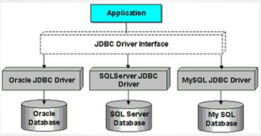

# 快速使用

## 1、概念

jpa：是orm框架的规范(解决持久层设计上的差异)，仅定义了一些接口

Hibermate：是对jpa规范的实现；

springData：不是jpa规范的实现，仅是抽象上的含义。

jdba：是访问数据库的规范(解决各个数据库使用的差异)与实现


# 一、jdbc

## 1、概述

JDBC（Java DataBase Connectivity,  Java数据库连接） ,是一种用于执行SQL语句的Java API，为多种关系数据库提供统一访问,它由一组用Java语言编写的类和接口组成。

SUN公司是JDBC规范制定者（连接数据库规范），数据库厂商都遵守这个规范。从代码角度上说，jdbc就是接口，数据库提供jar包实现这些接口。




## 2、使用

### 2.1 步骤

- 加载一个Driver驱动
- 创建数据库连接（Connection）
- 创建SQL命令发送器Statement
- 通过Statement发送SQL命令并得到结果
- 处理结果（select语句）
- 关闭数据库资源ResultSet  Statement  Connection

### 2.2 示例

```java
//启动
Class.forName("com.mysql.jdbc.Driver");
//连接
Connection connection = DriverManager.getConnection("jdbc:mysql://127.0.0.1:3306/mydatabase?useUnicode=true&characterEncoding=utf-8", "root", "610527");
//发送器
Statement statement = connection.createStatement();
//发送
statement.executeUpdate("SQL"); //增删改
statement.executeQuery("SQL");  //查
//关闭连接
statement.close();
connection.close();
```


## 3、预编译

### 3.1 示例

```java
String sql = "insert into student values(?, ?,) ";
PreparedStatement preparedStatement = connection.prepareStatement(sql);
preparedStatement.setLong(1, 106);
preparedStatement.setString(2, "yi");
ResultSet resultSet = preparedStatement.executeQuery();
```

### 3.2 作用

- 防止注入攻击

  ```java
  //场景，登录是通过特殊账户和密码破坏sql语句
  //普通sql拼接
  String name = "guest";
  String password = "' or 'a' = 'a"; 
  String sql = "select * from account where name = '"+name+"' and password='"+password+"'";
  //select * from account where name = 'guest' and password='' or 'a' = 'a'
  
  //预编译
  String sql = "select * from account where name = ? and password = ? ";
  PreparedStatement preparedStatement = connection.prepareStatement(sql);
  preparedStatement.setString(1, name);
  preparedStatement.setString(2, password);
  ResultSet resultSet = preparedStatement.executeQuery();
  //SELECT * FROM users WHERE  userName = 'xiaoming' AND password = 'anything\'   OR\'x\'=\'x\''
  ```

- 提高效率

  - 多条语句插入时。重复编译同样的sql语句浪费效率。可以把编译好的sql的字节码文件存在内存上，提高效率。

  - 使用预编译不是一定会缓存sql语句，还需要开启此功能。需在Connection中url中添加参数

    ```java
    "&useServerPrepStmts=true&cachePrepStmts=true"; 
    ```


## 4、事务

- connection.setAutoCommit(false);  //关闭自动提交
- connection.rollback(); //回滚
- connection.commit();  //提交
- 一般关闭自动提交后，不用写回滚和提交，系统会帮我们完成。但是如果异常后try...catch掉异常，并且不显式地回滚，然后再显式地提交connection.commit();，会使得数据不一致

```java
//场景：转账时，转入转出必须保持一致。
public void test1() throws ClassNotFoundException, SQLException {
        Class.forName("com.mysql.jdbc.Driver");
        String url = "jdbc:mysql://127.0.0.1:3306/mydatabase?useUnicode=true&characterEncoding=utf-8";
        Connection connection = DriverManager.getConnection(url, "root", "610527");
        connection.setAutoCommit(false);  //关闭自动提交
        String sql="update account set money =money- ? where id = ?";
        PreparedStatement ps = connection.prepareStatement(sql);

        try {
            //转入
            ps.setDouble(1, 100);
            ps.setLong(2,1);
            ps.executeUpdate();
            //异常
            int a = 1/0;
            //转出
            ps.setDouble(1, -100);
            ps.setLong(2,2);
            ps.executeUpdate();
        }catch (Exception e){
            connection.rollback(); //回滚
        }finally {
            connection.commit();  //提交
        }
        connection.close();
    }

```


## 5、api

| api                                                          | 作用                     |
| ------------------------------------------------------------ | ------------------------ |
| Connection connection = DriverManager.getConnection(url, 账号, 密码); | 获取连接                 |
|                                                              |                          |
| Connection                                                   |                          |
| Statement connection.createStatement()                       | 获取Statement            |
| PreparedStatement prepareStatement(String sql)               | 获取预编译的Statement    |
| void setAutoCommit (boolean autoCommit)                      | 启停自动提交             |
| void rollback();                                             | 回滚                     |
| void commit();                                               | 提交                     |
|                                                              |                          |
| int rows =  statement.executeUpdate(sql);                    | 增删改，返回修改的行数   |
| ResultSet resultSet = statement.executeQuery(sql);           | 查                       |
| int rows =  preparedStatement.executeUpdate(sql);            | 增删改，返回修改的行数   |
| ResultSet resultSet = preparedStatement.executeQuery();      | 查                       |
| preparedStatement.setInt(int pos, Int value);                | 为sql中的?按照顺序设置值 |
| preparedStatement.setString(int pos, String value);          | 为sql中的?按照顺序设置值 |
|                                                              |                          |
| ResultSet                                                    |                          |
| Long getLong(String parameter);                              | 根据字段名从结果中取数据 |
| Long getString(String parameter);                            | 根据字段名从结果中取数据 |


## 6、连接池

- 作用：和数据库的连接不断创建和修改，会耗费大量的资源。
- 实现：维护一个连接池，用了拿，不用了放回来，用完了新创建，放满了就销毁。
- 代码：逻辑有错，暂不修改

```java
//逻辑有错，暂不修改
package com.mysql.test;

import org.junit.Test;
import java.sql.Connection;
import java.sql.DriverManager;
import java.sql.SQLException;
import java.util.LinkedList;

public class ConnectionPool {

    private static LinkedList<Connection> connectionList;

    private static String driver ="com.mysql.jdbc.Driver";
    private static String url="jdbc:mysql://127.0.0.1:3306/mydatabase?useUnicode=true&characterEncoding=utf-8";
    private static String user="root";
    private static String password="610527";
    private static int connectionNum = 3;

    /**
     * 初始化
     */
    static {
        try {
            Class.forName(driver);
        } catch (ClassNotFoundException e) {
            e.printStackTrace();
        }
        connectionList = new LinkedList<>();
        for (int i = 0; i < connectionNum; i++) {
            connectionList.add(initConnection());
        }
        System.out.println(connectionList.size());
    }

    /**
     * 连接
     * @return
     */
    private static Connection initConnection(){
        try {
            return DriverManager.getConnection(url, user, password);
        } catch (SQLException e) {
            e.printStackTrace();
        }
        return null;
    }

    /**
     * 对外提供获取连接的
     * @return
     */
    public Connection getConnection(){
        if(connectionList.isEmpty()){
            System.out.println("获取成功：连接已使用完,创建新的连接"+connectionList.size());
             return this.initConnection();
        }
        System.out.println("获取成功：从连接池中获取连接"+connectionList.size());
        return connectionList.remove();
    }

    /**
     * 对外提供关闭连接
     * @param connection
     */
    public void closeConnection(Connection connection){
        if(connectionList.size() < connectionNum){
            System.out.println("关闭成功：实际并没有关闭，而是回到连接池中"+connectionList.size());
            connectionList.add(connection);
        }else {
            try {
                System.out.println("关闭成功：连接池已满，关闭此连接" +connectionList.size() );
                connection.close();
            } catch (SQLException e) {
                e.printStackTrace();
            }
        }
    }

    @Test
    public void testConnectionPool(){
        getConnection();
        getConnection();
        getConnection();
        getConnection();
        getConnection();
        Connection connection = getConnection();
        closeConnection(connection);
    }
}

```


# 二、jpa

## 1、实例

#### 1、依赖

```xml
<dependency>
    <groupId>org.springframework.boot</groupId>
    <artifactId>spring-boot-starter-data-jpa</artifactId>
    <version>2.1.5.RELEASE</version>
</dependency>

<dependency>
    <groupId>mysql</groupId>
    <artifactId>mysql-connector-java</artifactId>
    <version>5.1.21</version>
</dependency>
```

#### 2、entity

```java
import javax.persistence.*;

@Entity                    //表示跟表映射
@Table(name = "student")  //同样，表名和类名相同的话可省略
public class Student {

    @Id                                                   //表示主键
    @GeneratedValue(strategy = GenerationType.IDENTITY)   //自动增加
    private Long id;
    @Column
    private String name;
    @Column
    private Double score;
    @Column
    private Integer age;
}
```

#### 3、dao

```java
import com.entity.Student;
import org.springframework.data.domain.Example;
import org.springframework.data.jpa.repository.JpaRepository;
import org.springframework.data.jpa.repository.JpaSpecificationExecutor;
import org.springframework.data.jpa.repository.Query;
import org.springframework.data.repository.query.Param;

import javax.persistence.criteria.CriteriaBuilder;
import java.util.List;

public interface StudentRepository extends JpaRepository<Student, Long>, JpaSpecificationExecutor<Student> {

//查2. 自定义函数接口： Or And In Like Between等
    //public Student getById(Long id);
    public List<Student> getById(Long id);
    public List<Student> getByAge(int age);
    public List<Student> getByName(String name);

    public Student getByNameAndScore(String name, Double score);
    public List<Student> getByNameOrScore(String name, Double score);
    public List<Student> findByNameLike(String name);

    public List<Student> findByScoreLessThan(Double max);
    public List<Student> findByAgeBetween(int min, int max);

//查3. jpal查询
    //占位从1开始：？1
    @Query("from Student  where  name = ?1 or age = ?2")
    List<Student> findByCondition2(String name, Integer age);

    @Query("from Student  where  name = :name or age = :age")
    List<Student> findByCondition3(@Param("name") String untitled1, @Param("age") Integer untitled2);
    //:name 和 @Param("name") 名字必须一样，和String untitled1可以不一样

    //传入对象Bean，那么jpql的写法为：固定写法，没有为什么
    @Query("from Student s where  s.name = :#{#student.name} or s.age = :#{#student.age}")
    List<Student> findByCondition4(@Param("student") Student student);

//查4. mysql查询
    @Query(value = "select * from student s where  s.name = ?1 or s.age = ?2", nativeQuery = true)
    List<Student> findByMysql(String name, Integer age);
}
```


#### 4、jpa

```java
import com.Repository.StudentRepository;
import com.entity.Student;
import org.springframework.beans.factory.annotation.Autowired;
import org.springframework.data.domain.*;
import org.springframework.data.jpa.domain.Specification;
import org.springframework.web.bind.annotation.*;

import javax.persistence.criteria.CriteriaBuilder;
import javax.persistence.criteria.CriteriaQuery;
import javax.persistence.criteria.Predicate;
import javax.persistence.criteria.Root;
import java.util.ArrayList;
import java.util.List;


@RestController
@RequestMapping("/student")
public class StudentHandle {

    @Autowired
    private StudentRepository studentRepository;


//问2：@GetMapping、@PostMapping等标识的区分有什么用呢？按理标识@Mapping("网址映射")这样就以经能标识出来具体执行哪个方法了，再去区分增啥改查又有什么用
//增删改
    @PostMapping("/save")
    public Student save(@RequestBody Student s1){
        return studentRepository.save(s1);
    }

    @PutMapping("/put")
    public Student updata(@RequestBody Student s1){
        return studentRepository.save(s1);
    }

    @DeleteMapping("/delete/{id}")
    public String deleteById(@PathVariable("id") Long id){
        studentRepository.deleteById(id);
        return "delete success";
    }

//查1. 继承接口JpaRepository：主要方法findAll
    @GetMapping("/findAll")
    public List<Student> findAll(){
        return studentRepository.findAll();
    }
    //分页查询
    @GetMapping("/findByIdPage")
    public Page<Student> findByIdPage(){
        Pageable pageable = PageRequest.of(0,4);
        return studentRepository.findAll(pageable);
    }
    //排序
    @GetMapping("/findAllSort")
    public List<Student> findAllSort(){
        Sort sort = new Sort(Sort.Direction.ASC, "score");
        return studentRepository.findAll(sort);
    }
    //分页查询
    @GetMapping("/findByIdPageSort")
    public Page<Student> findByIdPageSort(){
        Sort sort = new Sort(Sort.Direction.DESC, "score");
        Pageable pageable = PageRequest.of(0,4, sort);
        return studentRepository.findAll(pageable);
    }
    //findAllById
    @GetMapping("/findAllById")
    private List<Student> findAllById(){
        List<Long> ids = new ArrayList<Long>();
        ids.add(4L);
        ids.add(5L);
        return studentRepository.findAllById(ids);
    }
    //求数目
    @GetMapping("/AllCount")
    public long AllCount(){
        return studentRepository.count();
    }

//查2. 自定义函数接口： Or And In Like Between等
    @GetMapping("/findbyId/{id}")
    public List<Student> findbyId(@PathVariable("id") Long id){
        return studentRepository.getById(id);
    }
    @GetMapping("/findByAge")
    public List<Student> findByAge(){
        return studentRepository.getByAge(76);
    }
    @GetMapping("/findByName")
    public List<Student> findByName(){
        return studentRepository.getByName("sp1");
    }
    //Or
    @GetMapping("/findByNameOrScore/{name}/{score}")
    public List<Student> findByNameOrScore(
            @PathVariable("name") String name,
            @PathVariable("score") Double score){
        return studentRepository.getByNameOrScore(name, score);
    }
    //And
    @GetMapping("/findByNameAndScore")
    public Student findByNameAndScore(){
        return studentRepository.getByNameAndScore("sp1", 50D);
    }
    //like
    @GetMapping("/findByNameLike")
    private List<Student> findByNameLike(){
        return studentRepository.findByNameLike("%un%");
    }
    //<
    @GetMapping("/findByScoreLessThan")
    public List<Student> findByScoreLessThan(){
        return studentRepository.findByScoreLessThan(80D);
    }
    //Between

    @GetMapping("/findByAgeBetween")
    public List<Student> findByAgeBetween(){
        return studentRepository.findByAgeBetween(20, 100);
    }

//查3. jpal查询
    @GetMapping("/findByCondition2")
    List<Student> findByCondition2(String name, Integer age){
        return  studentRepository.findByCondition2("sp1", 73);
    }
    @GetMapping("/findByCondition3")
    List<Student> findByCondition3(){
        return studentRepository.findByCondition3("sp1", 73);
    }
    @GetMapping("/findByCondition4")
    List<Student> findByCondition4(){
        Student student = new Student();
        student.setName("sp1");
        student.setAge(73);
        return studentRepository.findByCondition4(student);
    }

//查4. mysql查询
    @GetMapping("/findByMysql")
    public List<Student> findByMysql(String name, Integer age){    //必须要有public，否则就只是本包作用域，就无法和外卖呢的mysql对接
        return  studentRepository.findByMysql("sp2", 73);
    }

//5. Specifications动态查询   //问3：还有很多内容
    @GetMapping("/FindSpecification")
    public List<Student> FindSpecification(){

        final String name = null;
        final Integer age = 0;

        //root: 实体对象，可以通过它获取属性值
        //criteriaQuery：用于生成sql语句
        //criteriaBuilder：用于拼接查询条件
        List<Student> students = studentRepository.findAll(new Specification<Student>() {
            public Predicate toPredicate(Root<Student> root, CriteriaQuery<?> criteriaQuery, CriteriaBuilder criteriaBuilder) {
                List<Predicate> predicates = new ArrayList<Predicate>();
                if(name != null){
                    predicates.add(criteriaBuilder.equal(root.get("name"), name));
                }
                if(age != 0){
                    predicates.add(criteriaBuilder.equal(root.get("age"), age));
                }
                return criteriaBuilder.and(predicates.toArray(new Predicate[]{})); //and全部 , or为空
                //criteriaQuery用法：return criteriaQuery.where(predicates.toArray(new Predicate[predicates.size()])).getRestriction();
            }
        });
        return students;
    }

    @GetMapping("/FindSpecificationPage")
    public Page<Student> FindSpecificationPage(){

        final String name = null;
        final Integer age = 0;
        Pageable pageable = PageRequest.of(0, 4);

        Page<Student> students = studentRepository.findAll(new Specification<Student>() {

            public Predicate toPredicate(Root<Student> root, CriteriaQuery<?> criteriaQuery, CriteriaBuilder criteriaBuilder) {
                List<Predicate> predicates = new ArrayList<Predicate>();
                if(name != null){
                    predicates.add(criteriaBuilder.equal(root.get("name"), name));
                }
                if(age != 0){
                    predicates.add(criteriaBuilder.equal(root.get("age"), age));
                }
                return criteriaBuilder.and(predicates.toArray(new Predicate[]{})); //and全部 , or为空
            }
        }, pageable);

        return students;
    }


//6. Example动态查询
    public void findByExample1(){
        Student student = new Student();
        student.setId(1L);
        //studentRepository.findAll(Example.of(student));  //问4：Example.of报错
    }

}

/*
查询总结：
1.使用父接口
    1.1 findAllById 根据主键查
    1.2 findAll() 重载，可以排序，分页
2.方法命名规则
    例2.1：findByName("sunpeng") ，系统解析：
        1.去掉findBy，
        2.将剩余的 Name("sunpeng") 与 select * from student where 拼接
        3. 拼接的结果为select * from student where Name = sunpeng;
    例2.2：findByNameLike("%un%"),系统解析为select * from student where Name like un;
    注2.1：findByIdIn(id1,id2)、findByIdIn(List<id>)和findAllById(List<id>)的用途一样
    注2.2：OrderBy 与 findAll(sort)一样
3.jpql查询
    它是jpa定义的语言，用来统一不同sql语句之间的差异，使用起来和mysql一模一样，只需把表名换成类名，表的字段换成类的字段
    3.1 占位从1开始：？1
        如：@Query("from Student s where  s.name = ?1 or s.age = ?2")
    3.2 :name 和 @Param("name") 名字必须一样，和String untitled1可以不一样
        @Query("from Student  where  name = :name or age = :age")
        List<Student> findByCondition3(@Param("name") String untitled1, @Param("age") Integer untitled2);
    3.3 传入对象Bean，那么jpql的写法为：固定写法，没有为什么
        @Query("from Student s where  s.name = :#{#student.name} or s.age = :#{#student.age}")
        List<Student> findByCondition4(@Param("student") Student student);
4.本地sql查询
    @Query中写原生的sql语句，这样的话也就是针对单一的数据库了
5.Specifications动态查询
 */

```


#### 5、配置

```yml
spring:
  datasource:
    url: jdbc:mysql://127.0.0.1:3306/mydatabase?useUnicode=true&characterEncoding=utf-8
    username: root
    password: 610527
    driver-class-name: com.mysql.jdbc.Driver
  jpa:
    show-sql: true #打印sql日志
    hibernate:
      format_sql: ture #漂亮的sql日志
      ddl-auto: update #更新或者创建数据表结构
        
```


#### 6、总结

##### 6.1 mysql版本

mysql server 5.7   <==> mysql-connector-java 5.1.17 <==>  driver: com.mysql.jdbc.Driver


### 2、其他

#### 2.1 自动更新时间

entity

```java
import javax.persistence.EntityListeners;
import javax.persistence.MappedSuperclass;
import java.util.Date;

@EntityListeners(AuditingEntityListener.class)
@MappedSuperclass
@Data
public class BaseEntity {
    @CreatedDate
    private Date createTime;
    @LastModifiedDate
    private Date updateTime;
}
```

appliation

```java
@SpringBootApplication
@EnableJpaAuditing
public class MyApplication {
    public static void main(String[] args) {
        SpringApplication.run(MyApplication.class, args);
    }
}
```

#### 2.2 回滚

```java
@Service
public class UserService {

    @Autowired
    UserDao userDao;

    @Transactional(isolation = Isolation.SERIALIZABLE)
    public void getCount(){
        long count1 = userDao.count();
        System.out.println(count1);

        try {
            Thread.sleep(10000);
        } catch (InterruptedException e) {
            e.printStackTrace();
        }

        long count2 = userDao.count();
        System.out.println(count2);
    }

    public void add(){
        User user = new User();
        user.setName("sp1");
        userDao.save(user);
        System.out.println(user);
    }


    public void update(){
        User user = userDao.getOne(1L);
        user.setName("haoyun");
        user.setMoney("105");
        userDao.save(user);
        System.out.println(user);
    }

    @Transactional(isolation = Isolation.READ_COMMITTED)
    public void get() {
        User user = userDao.getOne(1L);
        System.out.println(user);
        try {
            Thread.sleep(5*1000);
        } catch (InterruptedException e) {
            e.printStackTrace();
        }
        User newUser = userDao.getOne(1L);
        System.out.println(newUser);
    }

    public static void main(String[] args) {
        Integer storebb = 1;
        long storebb2 = 1L;
        System.out.println(Objects.equals(storebb, storebb2));
        System.out.println(storebb == storebb2);
    }


}
```

#### 2.3 Specification

cb.and(predicate1, null)

cd.and：and毋庸置疑就是且，但是 predicate1 and null 结果是 predicate1 

cd.or：or毋庸置疑就是或，但是 predicate1 or null 结果是 null

综上所述，Specification认为null表示所有，而非一个没有


####  2.4 事务

```java
  @Modifying
  @Transactional
  @Query("delete from User u where u.active = false")
  void deleteInactiveUsers();
```

- @Modifying的主要作用是声明执行的SQL语句是更新（增删改）操作，（仅仅只是声明）。
- @Transactional的主要作用是提供事务支持（JPA默认会依赖JDBC默认隔离级别，即默认只读，所以增删改需要此注解支持）


# 三、mybatis

### 1、mysql依赖和配置

注：mysql server使用的是5.7版本

#### mysql-connector-java 8.0.15

```xml
<dependency>
    <groupId>mysql</groupId>
    <artifactId>mysql-connector-java</artifactId>
    <version>8.0.15</version>
</dependency>
```

```properties
spring.datasource.driver=com.mysql.cj.jdbc.Driver
spring.datasource.url=jdbc:mysql://127.0.0.1:3306/mydatabase?useSSL=false&useUnicode=true&characterEncoding=utf-8&serverTimezone=Asia/Shanghai
spring.datasource.username=root
spring.datasource.password=610527
```

#### mysql-connector-java 5.1.47

```xml
<dependency>
    <groupId>mysql</groupId>
    <artifactId>mysql-connector-java</artifactId>
    <version>5.1.47</version>
</dependency>
```

```properties
spring.datasource.driver=com.mysql.jdbc.Driver
spring.datasource.url=jdbc:mysql://127.0.0.1:3306/mydatabase
spring.datasource.username=root
spring.datasource.password=610527
```

#### 错误一

场景：mysql-connector-java 5.1.47 配置 driver=com.mysql.cj.jdbc.Driver

错误：启动报错，com.mysql.cj.jdbc.Driver not found

补充：反之，只会报个警告。

#### 错误二

场景：mysql-connector-java 8.0.15 配置 url=jdbc:mysql://127.0.0.1:3306/mydatabase

错误：执行中当使用数据库时报错：无法识别多个时区，需要在jdbc配置时区（即使没有用到datatime）。


### 2、入门搭建

#### 1.建项目导包

##### 1.1 新建maven项目

##### 1.2 pom.xml

```xml
<?xml version="1.0" encoding="UTF-8"?>
<project xmlns="http://maven.apache.org/POM/4.0.0"
         xmlns:xsi="http://www.w3.org/2001/XMLSchema-instance"
         xsi:schemaLocation="http://maven.apache.org/POM/4.0.0 http://maven.apache.org/xsd/maven-4.0.0.xsd">
    <parent>
        <artifactId>mybatis</artifactId>
        <groupId>com-sunpeng</groupId>
        <version>1.0-SNAPSHOT</version>
    </parent>
    <modelVersion>4.0.0</modelVersion>

    <artifactId>simpleMyBatis</artifactId>

    <dependencies>
        <dependency>
            <groupId>org.mybatis</groupId>
            <artifactId>mybatis</artifactId>
            <version>3.5.4</version>
        </dependency>

        <dependency>
            <groupId>mysql</groupId>
            <artifactId>mysql-connector-java</artifactId>
            <version>8.0.15</version>
        </dependency>

        <dependency>
            <groupId>junit</groupId>
            <artifactId>junit</artifactId>
            <version>4.13</version>
        </dependency>
    </dependencies>
</project>
```

#### 2.mybaties全局配置：mybaties-config.xml

##### 2.1 mybaties-config.xml

```xml
<?xml version="1.0" encoding="UTF-8" ?>
<!DOCTYPE configuration
        PUBLIC "-//mybatis.org//DTD Config 3.0//EN"
        "http://mybatis.org/dtd/mybatis-3-config.dtd">
<configuration>
    <properties resource="db.properties"></properties>
    <environments default="development">
        <environment id="development">
            <transactionManager type="JDBC"/>
            <dataSource type="POOLED">
                <property name="driver" value="${driver}"/>
                <property name="url" value="${url}"/>
                <property name="username" value="${username}"/>
                <property name="password" value="${password}"/>
            </dataSource>
        </environment>
    </environments>
    <mappers>
        <mapper resource="StudentMapper.xml"/>
    </mappers>
</configuration>
```

##### 2.2 db.properties

```properties
driver=com.mysql.cj.jdbc.Driver
url=jdbc:mysql://127.0.0.1:3306/mydatabase?useSSL=false&useUnicode=true&characterEncoding=utf-8&serverTimezone=Asia/Shanghai
username=root
password=610527
```

#### 3.编码与sql映射

##### 3.1 entity

```java
public class Student {
    private Long id;
    private String name;
    private Double score;
    private Integer age;
    
    //get、set
}
```

##### 3.2 Mapper.java

```java
package com.sunpeng.dao;
import com.sunpeng.entity.Student;
public interface StudentMapper {
    public void select();
    public Integer insert();
    public Integer update();
    public Integer delete();
    public Student selectById( Integer id);
}
```

##### 3.2 Mapper.xml

```xml
<?xml version="1.0" encoding="UTF-8" ?>
<!DOCTYPE mapper
        PUBLIC "-//mybatis.org//DTD Mapper 3.0//EN"
        "http://mybatis.org/dtd/mybatis-3-mapper.dtd">
<mapper namespace="com.sunpeng.dao.StudentMapper">

    <select id="selectById" resultType="com.sunpeng.entity.Student">
      select * from student where id = #{id}
    </select>

</mapper>
```

#### 4.启动测试

```java
public class Test01 {

    @Test
    public void test01() throws IOException {
        String resource = "mybatis-config.xml";
        InputStream inputStream = Resources.getResourceAsStream(resource);
        SqlSessionFactory sqlSessionFactory = new SqlSessionFactoryBuilder().build(inputStream);

        SqlSession sqlSession = sqlSessionFactory.openSession();
        StudentMapper mapper = sqlSession.getMapper(StudentMapper.class);
        Student student = mapper.selectById(10);

        System.out.println(student);
    }
}
```


# 四、springboot整合mybatis-plus

## 1、入门

### 1.1 pom

```xml
	 <parent>
        <groupId>org.springframework.boot</groupId>
        <artifactId>spring-boot-starter-parent</artifactId>
        <version>2.6.11</version>
    </parent>

    <dependencies>
        <dependency>
            <groupId>org.springframework.boot</groupId>
            <artifactId>spring-boot-starter-web</artifactId>
        </dependency>

        <dependency>
            <groupId>com.baomidou</groupId>
            <artifactId>mybatis-plus-boot-starter</artifactId>
            <version>3.5.2</version>
        </dependency>
        <dependency>
            <groupId>mysql</groupId>
            <artifactId>mysql-connector-java</artifactId>
        </dependency>

        <dependency>
            <groupId>org.projectlombok</groupId>
            <artifactId>lombok</artifactId>
        </dependency>
    </dependencies>
```

### 1.2 application.yaml

```yml
spring:
  datasource:
    username: root
    password: root
    url: jdbc:mysql://127.0.0.1:3306/sp?useSSL=false&useUnicode=true&characterEncoding=utf-8&serverTimezone=Asia/Shanghai
    driver-class-name: com.mysql.cj.jdbc.Driver

mybatis-plus:
  mapper-locations: classpath:mapper/*.xml

#mybatis-plus的sql日志是debug级别
logging:
  level:
    com.sp.mapper: debug
```

### 1.3 Application.class

```java
import org.mybatis.spring.annotation.MapperScan;
import org.springframework.boot.SpringApplication;
import org.springframework.boot.autoconfigure.SpringBootApplication;

@SpringBootApplication
@MapperScan("com.sunpeng.mybatis.mapper")
public class MybatisApplication {
    public static void main(String[] args) {
        SpringApplication.run(MybatisApplication.class, args);
    }
}
```

## 2、entity

```java
@Data
@TableName(value = "mybatis_plus_person")
public class Person {
    @TableId(type = IdType.INPUT)
    private Integer personId;
    private String name;
    private Integer age;
    private String fatherName;
}
```

### 2.1 @TableName 表名

`@TableName(value = "mybatis_plus_user")`

> 映射表名，如果类名是 MybatisPlusPerson 可以自动转换，那么就可以省略此注解。

### 2.2 @TableId 主键

`@TableId(type = IdType.INPUT)`

> 如果实体类中没有声明主键，框架默认主键是`id`，如果字段`id`不存在或者不是主键，程序就会出错。
>
> IdType.AUTO 数据库自增；数据库上也要勾上自增
>
> IdType.ASSIGN_ID 委派(自定义)，如果没有没有自定义，默认实现算法是雪花算法。

### 2.3 字段

实体类的字段可少不可多


## 3、Mapper.xml

```java
@Repository
public interface UserMapper extends BaseMapper<User> {

    User selectByAliasName(@Param("name") String aliasName);

    User selectByName(String name);

    List<User> selectSort(String orderBy);
}
```

```xml
<?xml version="1.0" encoding="UTF-8" ?>
<!DOCTYPE mapper
        PUBLIC "-//mybatis.org//DTD Mapper 3.0//EN"
        "http://mybatis.org/dtd/mybatis-3-mapper.dtd">
<mapper namespace="com.sp.mapper.UserMapper">

    <select id="selectByName" resultType="com.sp.entity.User">
        select * from mybatis_plus_user where name = #{name}
    </select>

    <select id="selectByAliasName" resultType="com.sp.entity.User">
        select * from mybatis_plus_user where name = #{name}
    </select>

    <select id="selectSort" resultType="com.sp.entity.User">
        select * from mybatis_plus_user order by ${orderBy}
    </select>

</mapper>
```

### 3.1 @Param 别名

```
@Param 别名
User selectByAliasName(@Param("name") String aliasName);
User selectByName(String name);
```

### 3.2 $ and # #

```sql
SELECT * FROM t_system_system_resource where state = #{state} and grade = #{grade} order by ${orderBy}
```

`#`相比`$`可以防sql注入，比如`grade = 1(int)`，但是某些情况并不适用，比如 order by sort(String)，此时排序就会失效。

### 3.3 limit 

```sql
SELECT * FROM t_system_system_resource ORDER BY sort ASC limit 1, 5
SELECT * FROM t_system_system_resource limit 1, 5 ORDER BY sort ASC 
```

第二种sql语法错误，但是在mybatis-plus中，会忽略排序，让sql生效，好像不是这样的，记错了。


## 4、BaseMapper

```java
@Repository
public interface PersonMapper extends BaseMapper<Person> {
}
```

```java
package com.sp.controller;

import com.baomidou.mybatisplus.core.conditions.query.QueryWrapper;
import com.baomidou.mybatisplus.extension.plugins.pagination.Page;
import com.sp.entity.Person;
import com.sp.mapper.PersonMapper;
import org.springframework.beans.factory.annotation.Autowired;
import org.springframework.util.StringUtils;
import org.springframework.web.bind.annotation.GetMapping;
import org.springframework.web.bind.annotation.RequestMapping;
import org.springframework.web.bind.annotation.RestController;

import java.util.*;

@RestController
@RequestMapping("/person")
public class PersonController {

    @Autowired
    private PersonMapper personMapper;

    @GetMapping("/allList")
    public List<Person> allList(){
        return personMapper.selectList(null);
    }

    @GetMapping("/selectList")
    public List<Person> selectList(String name, String fatherName){
        return personMapper.selectList(new QueryWrapper<Person>()
                .eq("name", name)
                .eq("father_name", fatherName));
    }

    @GetMapping("/dynamicSelect")
    public List<Person> dynamicSelect(String name, String fatherName){
        QueryWrapper<Person> wrapper = new QueryWrapper<Person>()
                .eq(!StringUtils.isEmpty(name),"name", name)
                .eq(!StringUtils.isEmpty(fatherName),"father_name", fatherName);
        return personMapper.selectList(wrapper);
    }

    @GetMapping("/selectByMap")
    public List<Person> selectByMap(String name, String fatherName){
        Map<String, Object> map = new HashMap<>();
        map.put("name", name);
        map.put("father_name", fatherName);
        return personMapper.selectByMap(map);
    }

    @GetMapping("/selectBatchIds")
    public List<Person> selectBatchIds(String ids){
        List<String> idList = Arrays.asList(ids.split(","));
        return personMapper.selectBatchIds(idList);
    }

    @GetMapping("/selectPage")
    public Page<Person> selectPage(long current, long size){
        return personMapper.selectPage(new Page<Person>(current, size), null);
    }


    @GetMapping("/like")
    public List<Person> like(String name){
        return personMapper.selectList(new QueryWrapper<Person>()
                .like(!StringUtils.isEmpty(name),"name", name));
    }

    @GetMapping("/sort")
    public List<Person> sort(){
        return personMapper.selectList(new QueryWrapper<Person>()
                .orderByAsc("age")
                .orderByDesc("person_id")
        );
    }

    @GetMapping("/selectNull1")
    public List<Person> selectNull1(){
        return personMapper.selectList(null);
    }

    @GetMapping("/selectNull2")
    public List<Person> selectNull2(){
        return personMapper.selectList(new QueryWrapper<Person>());
    }

    // 错误示例，不支持逗号分隔
    @GetMapping("/selectIn")
    public List<Person> selectIn(){
        return personMapper.selectList(new QueryWrapper<Person>().in("person_id", "1,3"));
    }

    @GetMapping("/selectInList")
    public List<Person> selectInList(){
        String ids = "1,3";
        final List<String> list = Arrays.asList(ids.split(","));
        return personMapper.selectList(new QueryWrapper<Person>().in("person_id", list));
    }

    
    // deleteById 入参是空不会全表删除
    @GetMapping("/deleteByIdNull")
    public Integer deleteByIdNull(){
        Integer id = null;
        return personMapper.deleteById(id);
    }
    
   //update
    @GetMapping("/updateById")
    public int updateById(Person person){
        System.out.println(person);
        return personMapper.updateById(person);
    }
}
```

### 4.1 方法

```java
package com.baomidou.mybatisplus.core.mapper;

import com.baomidou.mybatisplus.core.conditions.Wrapper;
import com.baomidou.mybatisplus.core.metadata.IPage;
import com.baomidou.mybatisplus.core.toolkit.CollectionUtils;
import com.baomidou.mybatisplus.core.toolkit.ExceptionUtils;
import java.io.Serializable;
import java.util.Collection;
import java.util.List;
import java.util.Map;
import org.apache.ibatis.annotations.Param;

public interface BaseMapper<T> extends Mapper<T> {
    int insert(T entity);

    int deleteById(Serializable id);

    int deleteById(T entity);

    int deleteByMap(@Param("cm") Map<String, Object> columnMap);

    int delete(@Param("ew") Wrapper<T> queryWrapper);

    int deleteBatchIds(@Param("coll") Collection<?> idList);

    int updateById(@Param("et") T entity);

    int update(@Param("et") T entity, @Param("ew") Wrapper<T> updateWrapper);

    T selectById(Serializable id);

    List<T> selectBatchIds(@Param("coll") Collection<? extends Serializable> idList);

    //通过map中元素查询，只能判断equal，不能根据字段是否非空而拼接sql
    List<T> selectByMap(@Param("cm") Map<String, Object> columnMap);

    default T selectOne(@Param("ew") Wrapper<T> queryWrapper) {
        List<T> ts = this.selectList(queryWrapper);
        if (CollectionUtils.isNotEmpty(ts)) {
            if (ts.size() != 1) {
                throw ExceptionUtils.mpe("One record is expected, but the query result is multiple records", new Object[0]);
            } else {
                return ts.get(0);
            }
        } else {
            return null;
        }
    }

    default boolean exists(Wrapper<T> queryWrapper) {
        Long count = this.selectCount(queryWrapper);
        return null != count && count > 0L;
    }

    Long selectCount(@Param("ew") Wrapper<T> queryWrapper);

    List<T> selectList(@Param("ew") Wrapper<T> queryWrapper);

    List<Map<String, Object>> selectMaps(@Param("ew") Wrapper<T> queryWrapper);

    List<Object> selectObjs(@Param("ew") Wrapper<T> queryWrapper);

    <P extends IPage<T>> P selectPage(P page, @Param("ew") Wrapper<T> queryWrapper);

    <P extends IPage<Map<String, Object>>> P selectMapsPage(P page, @Param("ew") Wrapper<T> queryWrapper);
}
```


### 4.2 queryWrapper

示例

```java
	@GetMapping("/dynamicSelect")
    public List<Person> dynamicSelect(String name, String fatherName){
        QueryWrapper<Person> wrapper = new QueryWrapper<Person>()
                .eq(!StringUtils.isEmpty(name),"name", name)
                .eq(!StringUtils.isEmpty(fatherName),"father_name", fatherName);
        return personMapper.selectList(wrapper);
    }
```

mybatis-plus中QueryWrapper常用的条件参数

| **条件参数名** | **用法及作用**                    |
| -------------- | --------------------------------- |
| setSqlSelect   | 设置 SELECT 查询字段              |
| where          | WHERE 语句，拼接 + WHERE 条件     |
| andNew         | AND 语句，拼接 + AND (字段=值)    |
| and            | AND 语句，拼接 + AND 字段=值      |
| or             | OR 语句，拼接 + OR 字段=值        |
| orNew          | OR 语句，拼接 + OR (字段=值)      |
| eq             | 等于=                             |
| allEq          | 基于 map 内容等于=                |
| ne             | 不等于<>                          |
| gt             | 大于>                             |
| ge             | 大于等于>=                        |
| lt             | 小于<                             |
| le             | 小于等于<=                        |
| like           | 模糊查询 LIKE                     |
| notLike        | 模糊查询 NOT LIKE                 |
| in             | IN 查询                           |
| notIn          | NOT IN 查询                       |
| isNull         | NULL 值查询                       |
| isNotNull      | IS NOT NULL                       |
| groupBy        | 分组 GROUP BY                     |
| having         | HAVING 关键词                     |
| orderBy        | 排序 ORDER BY                     |
| orderAsc       | ASC 排序 ORDER BY                 |
| orderDesc      | DESC 排序 ORDER BY                |
| exists         | EXISTS 条件语句                   |
| notExists      | NOT EXISTS 条件语句               |
| between        | BETWEEN 条件语句                  |
| notBetween     | NOT BETWEEN 条件语句              |
| addFilter      | 自由拼接 SQL                      |
| last           | 拼接在最后，例如：last(“LIMIT 1”) |

#### 4.2.1 like

变量不用加百分号

#### 4.3.2 last

```java
	public void handlePage(QueryWrapper<T> queryWrapper, Page page) {
        long pageSize = page.getSize();
        if (pageSize > 500) {
            String str = "limit %s offset %s ";
            String lastLimit = String.format(str, pageSize, (page.getCurrent() - 1) * pageSize);
            queryWrapper.last(lastLimit);
            page.setSize(-1);
        }
    }
```


### 4.3 page

```java
    @GetMapping("/selectPage")
    public Page<Person> selectPage(long current, long size){
        return personMapper.selectPage(new Page<Person>(current, size), null);
    }
```

#### 4.3.1 首页

0,1 都是第一页，2是第二页


### 4.4 all & null

- 属性是空：即sql中某个字段==null，可以分为三种情况（接口都是一样的）：
  - 主键是空：selectById(null)   updateById(null) 
  - queryWrapper某个字段是空：new QueryWrapper<Person>() .eq("name", null)
  - xml中的sql属性是空：select * from mybatis_plus_user where id = null
  - 属性是对象，就是查询 字段 = null 的数据。**如果业务中有这个字段等于空的数据，会被查询和修改，需要注意。**
  - 属性是基本类型，就是查询 字段 = 0 的数据。**如果业务中有这个字段等于零的数据，会被查询和修改，需要注意。**

- queryWrapper是空，可以分为两种：
  - 空：personMapper.selectList(null); 
  - 空对象：personMapper.selectList(new QueryWrapper<Person>());
  - 结果：它们查询的都是全部
  - **注意：写操作，比如`delete(null)`会删除全表，一定要注意，一般业务只会根据主键删除`deleteById()`**


## 3、其他

### 3.1 之前版本分页最多500

> 解决方方法是配置分页，或者升级版本，或者不用包装类，直接写sql


### 3.2 自定义主键生成策略

- 实例类设置主键类型：`@TableId(type = IdType.ASSIGN_ID)`

  ```java
  @Data
  @TableName(value = "mybatis_plus_son")
  public class Son {
      @TableId(type = IdType.ASSIGN_ID)
      private Long sonId;
      private String name;
  }
  ```

- 生成策略，实现接口：`IdentifierGenerator`

  ```java
  @Component
  public class CustomIdGenerator implements IdentifierGenerator {
      @Override
      public Number nextId(Object entity) {
          System.out.println("下一个id");
          return 104L;
      }
  }
  ```


### 3.3 配置工厂

> 微服务在开发过程中，分服务可能使用基础组件的方式不同，为此，需要统一配置，各服务再引入配置工厂。数据库相关配置就是如此。
>
> 注意：使用配置工厂后，服务自己的配置就不会生效，比如持久层的主键生成策略配置，创建修改时间配置，等等。

```java
import com.baomidou.mybatisplus.annotation.DbType;
import com.baomidou.mybatisplus.annotation.IdType;
import com.baomidou.mybatisplus.autoconfigure.MybatisPlusAutoConfiguration;
import com.baomidou.mybatisplus.core.MybatisConfiguration;
import com.baomidou.mybatisplus.core.config.GlobalConfig;
import com.baomidou.mybatisplus.core.toolkit.StringUtils;
import com.baomidou.mybatisplus.extension.plugins.MybatisPlusInterceptor;
import com.baomidou.mybatisplus.extension.plugins.inner.OptimisticLockerInnerInterceptor;
import com.baomidou.mybatisplus.extension.plugins.inner.PaginationInnerInterceptor;
import com.baomidou.mybatisplus.extension.spring.MybatisSqlSessionFactoryBean;
import com.sp.config.CustomIdGenerator;
import com.zaxxer.hikari.HikariDataSource;
import org.apache.ibatis.type.EnumTypeHandler;
import org.slf4j.Logger;
import org.slf4j.LoggerFactory;
import org.springframework.beans.factory.annotation.Autowired;
import org.springframework.beans.factory.annotation.Qualifier;
import org.springframework.boot.autoconfigure.condition.ConditionalOnClass;
import org.springframework.boot.autoconfigure.condition.ConditionalOnMissingClass;
import org.springframework.boot.autoconfigure.condition.ConditionalOnProperty;
import org.springframework.boot.context.properties.EnableConfigurationProperties;
import org.springframework.boot.orm.jpa.hibernate.SpringImplicitNamingStrategy;
import org.springframework.boot.orm.jpa.hibernate.SpringPhysicalNamingStrategy;
import org.springframework.boot.web.servlet.ServletComponentScan;
import org.springframework.context.annotation.Bean;
import org.springframework.context.annotation.Configuration;
import org.springframework.context.annotation.DependsOn;
import org.springframework.context.annotation.Primary;
import org.springframework.core.Ordered;
import org.springframework.core.annotation.Order;
import org.springframework.core.io.Resource;
import org.springframework.core.io.support.PathMatchingResourcePatternResolver;
import org.springframework.transaction.annotation.EnableTransactionManagement;

import javax.sql.DataSource;
import java.io.IOException;
import java.util.concurrent.TimeUnit;


/**
 * 数据库工厂bean配置
 */
@Configuration(proxyBeanMethods = false)
@EnableConfigurationProperties(BizcloudDataSourceProperties.class)
@ConditionalOnProperty(name = "enable", prefix = "bizcloud.starter.datasource", havingValue = "true")
@EnableTransactionManagement
@ServletComponentScan
public class BizcloudDataSourceAutoConfiguration {

    private static final Logger log = LoggerFactory.getLogger(BizcloudDataSourceAutoConfiguration.class);

    @Autowired
    private BizcloudDataSourceProperties bizcloudDataSourceProperties;


    @Bean(value = "bizcloudDataSource")
    @Order(Ordered.HIGHEST_PRECEDENCE)
    @Primary
    public DataSource dataSource() {
        HikariDataSource hikariDataSource = new HikariDataSource();
        hikariDataSource.setDriverClassName(bizcloudDataSourceProperties.getDriverClassName());
        hikariDataSource.setJdbcUrl(bizcloudDataSourceProperties.getUrl());
        hikariDataSource.setUsername(bizcloudDataSourceProperties.getUsername());
        hikariDataSource.setPassword(bizcloudDataSourceProperties.getPassword());
        HikariProperties hikari = bizcloudDataSourceProperties.getHikari();
        hikariDataSource.setMinimumIdle(hikari.getMinimumIdle());
        hikariDataSource.setMaximumPoolSize(hikari.getMaximumPoolSize());
        hikariDataSource.setMaxLifetime(TimeUnit.SECONDS.toMillis(hikari.getMaxLifetime()));
        hikariDataSource.setIdleTimeout(TimeUnit.SECONDS.toMillis(hikari.getIdleTimeout()));
        hikariDataSource.setPoolName(hikari.getPoolName());
        hikariDataSource.setConnectionTestQuery(hikari.getConnectionTestQuery());
        log.info("bizcloud hikariDataSource config: \r\n jdbcUrl:[{}] minIdle:[{}] maxPoolSize:[{}] maxLifetime:[{}] idleTimeout:[{}] poolName:[{}]",
                hikariDataSource.getJdbcUrl(), hikariDataSource.getMinimumIdle(), hikariDataSource.getMaximumPoolSize()
                , hikariDataSource.getMaxLifetime(), hikariDataSource.getIdleTimeout(), hikariDataSource.getPoolName());
        log.info("bizcloud-starter dataSource init success ...");
        return hikariDataSource;
    }


    @Configuration
    @ConditionalOnClass(value = {MybatisPlusAutoConfiguration.class})
    @DependsOn("bizcloudDataSource")
    public class BizCloudMybatisPlusAutoConfiguration {

        @Autowired
        @Qualifier("bizcloudDataSource")
        private DataSource bizcloudDataSource;

        @Bean("bizcloudSqlSessionFactory")
        public MybatisSqlSessionFactoryBean sqlSessionFactory() throws IOException {
            // 1.数据源
            MybatisSqlSessionFactoryBean bizcloudSqlSessionFactory = new MybatisSqlSessionFactoryBean();
            bizcloudSqlSessionFactory.setDataSource(bizcloudDataSource);
            Resource[] resources = new PathMatchingResourcePatternResolver().getResources(StringUtils.isBlank(bizcloudDataSourceProperties.getMybatisMapperLocations()) ?
                    "classpath:mapper/**/*.xml" : bizcloudDataSourceProperties.getMybatisMapperLocations());
            bizcloudSqlSessionFactory.setMapperLocations(resources);

            // 2.
            MybatisConfiguration mybatisConfiguration = new MybatisConfiguration();
            mybatisConfiguration.setMapUnderscoreToCamelCase(true);
            //mybatisConfiguration.setLogImpl(org.apache.ibatis.logging.log4j2.Log4j2Impl.class);
            mybatisConfiguration.setDefaultEnumTypeHandler(org.apache.ibatis.type.BaseTypeHandler.class);
            mybatisConfiguration.setMapUnderscoreToCamelCase(true);
            //设置枚举类型映射用 name
            mybatisConfiguration.setDefaultEnumTypeHandler(EnumTypeHandler.class);
            bizcloudSqlSessionFactory.setConfiguration(mybatisConfiguration);

            // 3.配置
            GlobalConfig globalConfig = new GlobalConfig();
            //自定义id生成器
            globalConfig.setIdentifierGenerator(new CustomIdGenerator());
            //id自增策略
            GlobalConfig.DbConfig dbConfig = new GlobalConfig.DbConfig();
            dbConfig.setIdType(IdType.AUTO);
            globalConfig.setDbConfig(dbConfig);
            bizcloudSqlSessionFactory.setGlobalConfig(globalConfig);
            log.info("bizcloud-mybatis-plus init success ...");

            // 4.过滤器
            MybatisPlusInterceptor interceptor = new MybatisPlusInterceptor();
            // 分页
            interceptor.addInnerInterceptor(new PaginationInnerInterceptor(DbType.MYSQL));
            // 乐观锁
            interceptor.addInnerInterceptor(new OptimisticLockerInnerInterceptor());
            bizcloudSqlSessionFactory.setPlugins(interceptor);

            return bizcloudSqlSessionFactory;
        }

    }
}
```


