# 快速使用

## 1、基础命令

```sh
#============================================虚拟机基本信息==========================================
uname -a  #查询linux内核版本
cat /etc/redhat-release #查询操作系统版本，适用于centos和redhat


#============================================基本命令===============================================
mv [source] target]
cp {source} [target]
mkdir [目录]
rm [文件]
rm -ef [目录]

#============================================软件安装下载============================================
yum [options] [command] [package ...]
1. 列出所有可更新的软件清单命令：yum check-update
2. 更新所有软件命令：yum update
3. 仅安装指定的软件命令：yum install <package_name>
4. 仅更新指定的软件命令：yum update <package_name>
5. 列出所有可安裝的软件清单命令：yum list
6. 删除软件包命令：yum remove <package_name>
7. 查找软件包命令：yum search <keyword>

wegt [url] #下载
tar -zxf [.tar压缩包] #解压

#===========================================系统监控================================================
top #查看状态信息：top(基本)，task(线程)，cpu，mem(内存)，swap(交换分区，虚拟内存)

#进程
ps -ef | grep [keyword]  #查看进程
kill [pid] #根据pid杀死进程

#内存
free -m    


#============================================网络====================================================
#ip
ip addr   #查询ip
ifconfig  #查询ip
#port
netstat -anp #显示系统端口使用情况
netstat -tulpn #UDP类型和TCP类型的端口
netstat -nupl #UDP类型的端口
netstat -ntpl #TCP类型的端口
#网络配置
cd /etc/sysconfig/network-scripts #网络配置文件位置
vim ifcfg-ens33 #网络配置文件
nmcli c reload #重启网卡


#===========================================centos系统命令===============================================
#目前app: firewalld mysqld docker
systemctl status [app]  # 查看状态
systemctl start [app] # 开启
systemctl stop [app] # 关闭 
systemctl restart [app] #重启
systemctl is-enabled [app] # 查看开机是否启动
systemctl disable [app] # 关闭开机启用
systemctl enable [app] # 开机启用


#=============================================远程=======================================================
#远程复制：和cp的主要区别就是要指定路径
scp [file] [username]@[ip]:[path/[new-file]] 
scp t1.txt 10.1.20.237:/etc/yum.repos.d/ #复制到/etc/yum.repos.d目录下
scp t1.txt 10.1.20.237:. #复制到家目录下
scp dump.hprof sunpeng@10.1.6.8:/home/sunpeng/
#远程登录
ssh [user]@[ip]
ssh root@10.1.20.237
ps -ef | grep ssh #是否启动


```

## 2、window基本命令

```sh
ipconfig  #查询ip
ping {ip}
tcping {ip} {port}
```


## 3、快速使用

```sh
#========================================版本=================================================
docker -version #19.03.12
docker-compose -version #1.29.2
kubectl version #1.17.17

#=========================================启动==============================================
#docker
systemctl status docker
systemctl start docker
#k8s
systemctl status kubelet
systemctl start kubelet
#nfs：共享数据
systemctl start nfs.service #master
systemctl start rpcbind.service #master
#rinetd：端口转发
netstat -tulpn | grep rinetd #查看映射，具体产看看三.2

#图形化界面dashboard http://10.1.20.235:32000/
```


# 一、linux

## 1、虚拟机

- VMware：好像需要破解

- VirtualBox6.3：好像开源，Oracle的，官网下载


### 1.1 centos

#### 1.1.1 安装

- 新建虚拟机
  - 选择系统安装位置，系统类型，系统版本：red hat(64-bit)
  - 选择内存大小
  - 现在创建虚拟硬盘，文件类型选择VDI，动态分配，虚拟硬盘位置不要选在C盘

- 配置安装
  - 存储 -》没有盘片 -》分配光驱 -》选择本地的iso
  - 系统 -》启动顺序 -》把光驱排在第一个

- 安装
  - 确定安装，安装语言选择中文（这里设置的仅仅是安装语言）
  - 安装位置 -》 本地标准盘 -》 自动分配分区 -> 完成 -》 开始安装
  - root密码 -》 root:root -》完成 -》重启

```sh
#网络：桥接模式
#网卡:开机启动，将动态获取ip改为静态获取
ip addr #10.1.20.89
vi /etc/sysconfig/network-scripts/ifcfg-enp0s3
TYPE=Ethernet 						
	PROXY_METHOD=none
	BROWSER_ONLY=no
	BOOTPROTO=static
	IPADDR=10.1.20.89
	NETMASK=255.255.255.0
	GATEWAY=10.1.20.1
	DNS1=114.114.114.114
	DEFROUTE=yes
	IPV4_FAILURE_FATAL=no
	IPV6INIT=yes
	IPV6_AUTOCONF=yes
	IPV6_DEFROUTE=yes
	IPV6_FAILURE_FATAL=no
	IPV6_ADDR_GEN_MODE=stable-privacy
	NAME=enp0s3                           
	UUID=b351fca8-3596-4168-a35f-cc927c09e2c4
	DEVICE=enp0s3
	ONBOOT=yes                       
nmcli connection reload #centos7重载网卡
systemctl restart network #centos8重载网卡

#关闭防火墙
systmectl stop firewalld    # 关闭
systmectl disable firewalld # 关闭开机启用

#下载vim
yum -y install vim*

#版本
cat /etc/redhat-release #CentOS Linux release 7.9.2009 (Core)
uname -r  #3.10.0-1160.el7.x86_64
#内存：2g
#存储：50g
#网络：桥接模式

vim ~/.bashrc
	PS1='\[\e[35;40m\][\u@\h \w]\$: \[\e[m\]'
		\d ：#代表日期，格式为weekday month date，例如："Mon Aug 1"
		\H ：#完整的主机名称
		\h ：#仅取主机的第一个名字
		\t ：#显示时间为24小时格式，如：HH：MM：SS
		\T ：#显示时间为12小时格式
		\A ：#显示时间为24小时格式：HH：MM
		\u ：#当前用户的账号名称
		\v ：#BASH的版本信息
		\w ：#完整的工作目录名称
		\W ：#利用basename取得工作目录名称，所以只会列出最后一个目录
		\# ：#下达的第几个命令
		\$ ：#提示字符，如果是root时，提示符为：# ，普通用户则为：$
\[\e[35;40m\]: 颜色，其中“F“为字体颜色，编号为30-37，“B”为背景颜色，编号为40-47
\[\e[m\]：后面不设置
source /root/.bashrc
```

- 导出虚拟机

  - 选择模板（centos7）

  - 开放式虚拟化格式1.0，导出位置，仅包含NAT网卡的MAC地址，写入Manifest地址
  - 导出成ova格式

- 导入虚拟机

  - 选择系统和存储的安装路径
  - 重命名虚拟机

- 设置静态网络
  - 将动态ip改为静态或为静态ip重新选个ip

```sh
timedatectl set-timezone Asia/Shanghai
hostnamectl set-hostname [new-hostname] #vim /etc/hostname
vim /etc/hosts
	10.1.20.235  master
	10.1.20.236  node1
	10.1.20.237  node2
reboot #重启虚拟机
```


#### 1.1.2 centos-yum

```sh
###安装新源
#特别是：centos8官方源已下线，需要切换centos-vault源
mv /etc/yum.repos.d/CentOS-Base.repo /etc/yum.repos.d/CentOS-Base.repo.backup #备份原有
wget -O /etc/yum.repos.d/CentOS-Base.repo https://mirrors.aliyun.com/repo/Centos-6.repo #安装信源
yum clean all #跟新缓存
yum makecache #如提示AppStream下载失败，更新文件CentOS-AppStream.repo

###更新CentOS-AppStream.repo
#centos8相比centos7多了CentOS-AppStream.repo，所以centos8换源后还要更新CentOS-AppStream.repo
#将CentOS-Base.repo中的[AppStream]复制到CentOS-AppStream.repo
```


#### 1.1.3. centos测速

```sh
#安装git
yum -y install git
#git克隆speedtest
git clone https://github.com/sivel/speedtest-cli.git
#进入speedtest-cli
cd speedtest-cli
#修改speedtest.py，由于现在一般python都是python3，所以#!/usr/bin/env python -》 #!/usr/bin/env python3
vi speedtest.py
#执行speedtest-cli
./speedtest-cli
```

可能报错：./speedtest-cli执行失败，没有python

```sh
#检查python版本
python -version
python3 -version
#安装python3
dnf install python3
```

设置全局

```sh
#增加读写执行权限及移动到全局操作目录
chmod +rx speedtest.py
sudo mv speedtest.py /usr/local/bin/speedtest-cli
sudo chown root:root /usr/local/bin/speedtest-cli
speedtest.py #任意位置执行
```


### 1.2 XShell

#### 1.2.1 突出显示


- 字符串

  红色部分：sh-4.1#

- 正则表达式

  绿色部分：

  ```
  SL\|3\|[0-2][0-9][0-9][0-9]-[0-1][0-9]-[0-3][0-9]T[0-9][0-9]:[0-9][0-9]:[0-9][0-9].[0-9][0-9][0-9] 
  ```


### 1.3 jdk安装

```sh
#查看是否安装、安装版本
java -version

#安装
yum install java-1.8.0-openjdk* -y #yum安装方法会自动配置环境变量
#默认安装位置 /usr/lib/jvm
```


## 2、 文件

### 2.1 查看文件

| 命令 | 解释                   | 常用                    | 补充             |
| ---- | ---------------------- | ----------------------- | ---------------- |
| cat  | 从第一行开始显示       | **cat filename**        | -n可以显示行号   |
| tac  | 从最后一行开始显示     |                         |                  |
| more | 一页一页的显示档案内容 |                         | d：向前翻页      |
| less | 相比more，可以翻页     | shift+g 移动到最后一行  | b：向后翻页      |
| head | 只看头几行             | head-n 20 filename      | 头20页，默认为10 |
| tail | 只看尾巴几行           | **tail -n 20 filename** | 尾20页，默认为10 |

### 2.2 cat

1. 命令格式：

   cat [选项] [文件]...

2. 命令功能：

   cat主要有三大功能：

   1. 一次显示整个文件: cat filename

   2. 从键盘创建一个文件: cat > filename 只能创建新文件,不能编辑已有文件.

   3. 将几个文件合并为一个文件: cat file1 file2 > file

3. 命令参数：

   -n, --number   对输出的所有行编号,由1开始对所有输出的行数编号

refreshSkuInfo

### 2.3 vi & vim

1）上下翻动：向上箭头、向下箭头：每次滚动一条日志，这条日这可能占据多行

2）前后翻页：ctrl+f、ctrl+b：f就是forword，b就是backward

3）首行末行：首行（gg），末行（shift+g）

4）查找：?string：查找字符串，N向前，n向后

5）分页分屏：k8s中的vi也支持分页/分屏操作

6) 全局替换：:%s/[from]/[to]/g


### 2.4 grep

```sh
grep  "[关键字]" [filename] -[参数] --color=auto
grep "word" address.log					 #word
grep "word1|word2" address.log           #word1|word2
grep "word1|word2" address.log -E        #word1或word2
grep "word1.*word2" address.log 		 #word1...word2 (正则表达式)
grep "word1" address.log | grep "word2"  #word1且word2 (多次过滤)
grep "word" address.log -C 5             #前后5行 (-A后，-B前，-C前后)
grep "word" address.log --color=auto     #高亮显示过滤的字符串
grep "word" log -r                       #进入目录
```


### 2.5 chmod

```sh
chmod -777 [file] #全部权限
chmod a+x [file]  #执行权限
```


## 3、网络

### 3.1 网络基础

IPv4的ip地址资源比较紧张，实际上整个互联网就是一个巨大的局域网，ip地址有限，那么通过划分子网，如何再在子网里面分配ip地址给子网的主机，这个时候同一一个ip就可以给一整个子网所共用，就解决了互联网ip不够的问题

ip=网络号（网络部分+子网部分）+主机号

子网掩码：区分哪段是网络，哪段是主机号

A类保留给政府机构（0.0.0.0到127.255.255.255）
B类分配给中等规模的公司（128.0.0.0到191.255.255.255）
C类分配给任何需要的人（192.0.0.0到223.255.255.255）
D类用于组播（224.0.0.0---239.255.255.255）
E类用于实验（240.0.0.0---247.255.255.255）


### 3.2 网络模式

| 虚拟机        | 主机                       | 局域网   | 互联网                             |
| ------------- | -------------------------- | -------- | ---------------------------------- |
| 桥接模式      | 相互通讯                   | 相互通讯 | 可以上网，被访问需要暴漏在互联网上 |
| NAT模式       | 可以访问主机，但不能被访问 | 不知道   | 可以上网，被访问需要暴漏在互联网上 |
| Host-Only模式 | 相互通讯                   | 不知道   | 不可以上网                         |

- 桥接模式：实现虚拟机在真实的网络上；
- NAT模式：实现虚拟机隐藏在物理机之后，能上网，但不能访问物理机；
- Host-Only模式：实现虚拟机隐藏在物理机之后，不能上网，但可以访问物理机；


### 3.3 网卡

```sh
vim /etc/sysconfig/network-scripts/ifcfg-enp0s3
#网卡基本信息
	TYPE=Ethernet 							#以太网
	PROXY_METHOD=none
	BROWSER_ONLY=no
	BOOTPROTO=dhcp 							#动态ip
	DEFROUTE=yes
	IPV4_FAILURE_FATAL=no
	IPV6INIT=yes
	IPV6_AUTOCONF=yes
	IPV6_DEFROUTE=yes
	IPV6_FAILURE_FATAL=no
	IPV6_ADDR_GEN_MODE=stable-privacy
	NAME=enp0s3                            #网卡名称
	UUID=b351fca8-3596-4168-a35f-cc927c09e2c4
	DEVICE=enp0s3
	ONBOOT=yes                             #是否开机启动
#将动态获取ip改为静态获取ip：BOOTPROTO=dhcp->static
	BOOTPROTO=static
	IPADDR=10.1.20.112
	NETMASK=255.255.255.0
	GATEWAY=10.1.20.1
	DNS1=114.114.114.114
	
nmcli connection reload #重载网卡
nmcli connection up ens33 #激活网卡ens33
nmcli connection down ens33 #停用网卡ens33
```


## 4、监控

### 4.1 ps & kill

```sh
#查询所有进程
ps -a
ps -aux
ps -ef
#根据条件查询进程
ps -aux | grep "[条件]"
ps -ef | grep "[条件]"

#杀死进程
kill -9 [pid] #通过信号的方式杀死进程

#守护进程
#kill杀死不了守护进程，会有其他信号不断重启守护进程，一般守护进程都带d，如mysqld

```

### 4.2 top

```sh
top        #显示系统状态，每3s刷新一次
top -d 10  #显示系统状态，每10s刷新一次
```


结果分析：

- top 基本信息
  - 15:58:24  当前时间
  - up 8 days,  2:37,   运行时间
  - 1 user  使用者
  -  load average: 1.37, 1.47, 1.33   系统在1分钟，5分钟，15分钟的平均负载，小于1健康，大于1超出负荷

- Tasks: 268 total   进程   
  - 4 running   正在运行的进程
  - 264 sleeping  睡眠的进程
  - 0 stopped  结束的进程
  - 0 zombie  僵尸进程

- %Cpu(s)   cpu占用率
  - 18.3 us  用户cpu使用率
  - 3.2 sy  系统cpu使用率
  - 0.0 ni,
  - 78.0 id  空闲cpu
  - 0.3 wa  IO百分比
  - 0.0 hi,  
  - 0.2 si,  
  - 0.0 st
- KiB Mem :  内存(单位kb)
  - 8009172 total,   全部内存
  - 363144 free,  空闲内存
  - 4901268 used,   已使用内存
  - 2744760 buff/cache
- KiB Swap:   交换分区，虚拟内存     
  - 0 total,        
  - 0 free,        
  - 0 used.  
  - 2718820 avail Mem 


## 5、window

```sh
#=============================================进程===========================================
netstat -aon|findstr "port"   #通过端口号查看PID
tasklist|findstr [PID]        #通过PID查看信息
taskkill /T /F /PID [PID]     #通过PID杀死进程
#任务管理器方式：任务管理器：win10【详细信息】、win7【进程，如果没有PID字段，则查看->选择列->勾选PID】

#杀死8080端口的进程
netstat -ano | findstr 8080 
taskkill /F /PID [pid]
```


| linux  | win/doc命令                                                |
| ------ | ---------------------------------------------------------- |
| 根目录 | 盘符，切换盘符：D:  d:  C:  c:，不通盘符下不能直接切换目录 |
| cd     | cd  不通盘符下不能直接切换目录，必须先切换盘符，再切换目录 |
| ls     | dir                                                        |
| clear  | cls                                                        |
| mkdir  | md                                                         |
| rm -r  | rd                                                         |
| cp     | copy                                                       |
| rm     | del                                                        |


# 二、docker

https://docs.docker.com/

https://hub.docker.com/search

## 1、安装

```sh
# 安装
yum install -y yum-utils device-mapper-persistent-data lvm2 wget
wget -O /etc/yum.repos.d/docker-ce.repo https://download.docker.com/linux/centos/docker-ce.repo
sed -i 's+download.docker.com+mirrors.tuna.tsinghua.edu.cn/docker-ce+' /etc/yum.repos.d/docker-ce.repo
yum -y makecache fast
yum -y install docker-ce-18.09.9
docker -v

# 配置阿里镜像
vim /etc/docker/daemon.json
	{
  		"registry-mirrors": ["https://h45068lf.mirror.aliyuncs.com"]
	}
systemctl daemon-reload #重启
systemctl restart docker #重启

#启动
systemctl start docker #启动
systemctl stop docker  #停止
systemctl status docker #状态
systemctl enable docker #自启动
systemctl disable docker #取消自启动
systemctl is-enabled docker #是否自启动

#docker信息
/var/lib/docker/image #镜像位置
/var/lib/docker/containers #容器位置
docker -version #19.03.12
docker-compose -version #1.29.2
```


## 2、docker命令

```sh
#==========================================一、镜像===============================================
docker search [keyword] #搜索镜像 eg：docker search mysql
docker pull [image]:[tag]   #拉取镜像 eg：docker pull mysql:5.7
docker images  #查
docker rmi id  #删除
docker build -t [image-name] [image-source-path] #构建镜像，-t:重命名


#==========================================二、容器===============================================
#创建并运行容器
docker run -d --name m1 -p 3307:3306 -e MYSQL_ROOT_PASSWORD=root mysql:5.7
	-d: 后台运行容器，并返回容器ID；
	-p: 指定端口映射，格式为：主机(宿主)端口:容器端口
	--name=[name]: 为容器指定一个名称；
	-e [环境变量key]=[环境变量value]: 设置环境变量；
docker logs [docker-id|docker-name] #查看容器日志

#增删
docker create [image]:[tag] #创建容器，一般都被run替代
docker ps -a #查询容器，-a:所有镜像，包括没有运行的镜像
docker rm -f id #删除容器，-f:强制删除容器（删除正在运行的容器）

#启停
docker start [docker-id|docker-name] #开启容器
docker stop [docker-id|docker-name] #关闭容器
docker restart [docker-id|docker-name] #重启容器
docker ps #查询正在运行的容器
docker inspect [id|name] #查询容器详情，比如 port, ip

#进入容器
docker exec -it [docker-id|docker-name] /bin/bash #进入容器。-it:以交互的模式进入
#tomcat404原因可能版本问题，需要将webapps.dist下的内容全部复制到webapps中


#==========================================三、网络===============================================
#网络：docker会为每个容器分配虚拟地址，容器间网络本身就互通，但是由于容器创建销毁频繁简单，虚拟ip不断变化，所以希望通过容器名联通网络，所以就需要网桥
docker network ls
docker network  create --driver bridge [new-bridge-name]#创建网桥
docker run -d --name [new-docker-name] -p 8888:8080 --network [bridge-name] tomcat
#测试：进入容器 ping 其他容器的名字


#==========================================四、共享地址===============================================
#容器直接映射地址
docker run -p 8000:8080 --name v1 -v /usr/local/dockershare:/usr/local/tomcat/webapps tomcat 
#通过共享容器映射地址
docker create --name webpage -v /usr/local/dockershare:/usr/local/tomcat/webapps tomcat /bin/true 
docker run --name t3 -d --volumes-from webpage -p 8005:8080 tomcat


#==========================================五、容器和宿主机交互===============================================
#文件交互
docker cp /usr/docker/test/keumserver.war 5afa30495e63:/usr/local/tomcat/webapps
```


## 3、dockerfile

用户构建镜像：docker build -t [image-name] [image-source-path]，此命令执行时会执行Dockerfile文件

```Dockerfile
#==========================================一、命令===============================================
FROM tomcat:latest #制作基准镜像
WORKDIR /usr/local/tomcat/webapps #切换工作目录，没有就会创建
ADD docker-web ./docker-web #ADD&COPY 将宿主机文件复制到容器中，当前容器路径是（./）就是WORKDIR目录
ENV [] #设置环境变量
EXPOSE [port] #暴露端口，现有程序的默认端口
RUN [shell] #构建镜像时执行shell命令
ENTRYPOINT [shell] #容器启动时执行shell命令，只会执行最后一个，且不会被命令行替换
CMD [shell]  #容器启动时执行shell命令，只会执行最后一个，但会被命令行替换

#=========================================二、示例：redis=============================================
FROM centos
RUN ["yum" , "install" , "-y" ,"gcc","gcc-c++","net-tools","make"]
WORKDIR /usr/local
ADD redis-4.0.14.tar.gz .
WORKDIR /usr/local/redis-4.0.14/src
RUN make && make install
WORKDIR /usr/local/redis-4.0.14
ADD redis-7000.conf .
EXPOSE 7000
CMD ["redis-server","redis-7000.conf"]
```


## 4、docker-compose

微服务有多个镜像和容器，Dockerfile是启动配置，compose是自动化部署

- app-Dockerfile

```Dockerfile
FROM openjdk:8u222-jre
WORKDIR /usr/local/bsbdj
ADD bsbdj.jar .
ADD application.yml .
ADD application-dev.yml .
EXPOSE 80 #暴露端口
CMD ["java","-jar","bsbdj.jar"]
```

- db-Dockerfile

```Dockerfile
FROM mysql:5.7
WORKDIR /docker-entrypoint-initdb.d
ADD init-db.sql .
```

- docker-compose.yaml

```yaml
version: '3.3'
services:
  db:
    build: ./bsbdj-db/ #构建镜像
    restart: always    #容器挂了就重启
    environment:
      MYSQL_ROOT_PASSWORD: root #容器启动时的环境变量
  app:
    build: ./bsbdj-app/
    depends_on:       #依赖的容器，让app可以访问db
      - db
    ports:
      - "80:80"
    restart: always
```

```sh
cd /usr/local/demo/bsbdj
docker-compose up -d #运行
docker-compose logs -f [id|name] #查看日志,不断滚动
docker-compose down #下线
dokcer-compose restart #重启
```


# 三、k8s

容器编排工具

- 自动化容器的部署和复制
- 随时扩展或收缩容器的规模
- 容器分组group，并且提供容器间的负载均衡
- 实时监控，即使故障发现，自动替换

名词

**Master**：集群控制节点，每个集群需要至少一个master节点负责集群的管控

**Node**：工作负载节点，由master分配容器到这些node工作节点上，然后node节点上的docker负责容器的运行

**Pod**：kubernetes的最小控制单元，容器都是运行在pod中的，一个pod中可以有1个或者多个容器

**Controller**：控制器，通过它来实现对pod的管理，比如启动pod、停止pod、伸缩pod的数量等等

**Service**：pod对外服务的统一入口，下面可以维护者同一类的多个pod

**Label**：标签，用于对pod进行分类，同一类pod会拥有相同的标签

**NameSpace**：命名空间，用来隔离pod的运行环境


## 1、安装

```sh
#=============================================1.准备===================================================
#1.1关闭交换区
swapoff -a #关闭交换分区
vi /etc/fstab 
   #swap 注释
#1.2 配置网桥
cat <<EOF >  /etc/sysctl.d/k8s.conf
net.bridge.bridge-nf-call-ip6tables = 1
net.bridge.bridge-nf-call-iptables = 1
EOF
sysctl --system #查看

#====================================2.安装 kubelet kubeadm kubectl======================================
vim /etc/yum.repos.d #k8s的yum源
#------------
[kubernetes]
name=Kubernetes
baseurl=https://mirrors.aliyun.com/kubernetes/yum/repos/kubernetes-el7-x86_64/
enabled=1
gpgcheck=0
#------------
yum install -y kubelet-1.17.17 kubeadm-1.17.17 kubectl-1.17.17  #kubeadm：容器集群部署工具，kubectl：命令
rpm -qa | grep kube #查看
systemctl start kubelet
systemctl enable kubelet


#====================================3.构建集群：master==================================================
#构建集群
kubeadm init --kubernetes-version=v1.17.17 --pod-network-cidr=10.244.0.0/16
##如果内存报错：--ignore-preflight-errors=NumCPU
##过程：1.自动下载k8s需要的镜像并启动（docker镜像源需要配置好）；2.创建集群
#执行kubeadm init打印出的命令
mkdir -p $HOME/.kube
sudo cp -i /etc/kubernetes/admin.conf $HOME/.kube/config
sudo chown $(id -u):$(id -g) $HOME/.kube/config

#安装flannel网络组件
kubectl create -f kube-flannel.yml #安装flannel网络组件
kubectl get pod --all-namespaces #查看

#开启dashboard
kubectl apply -f kubernetes-dashboard.yaml
kubectl apply -f admin-role.yaml
kubectl apply -f kubernetes-dashboard-admin.rbac.yaml
kubectl get svc -n kube-system #查看
#访问http://192.168.163.132:32000 

#===========================================4.加入集群：node=============================================
#执行master节点构建集权式的输出
kubeadm join 10.1.20.235:6443 --token f5jryy.c9uut9rxhokzlj9o \
    --discovery-token-ca-cert-hash sha256:ed4005bc79fd7be8d7d53eb06fd00e1833d79b127d8e06bfaa080ef1a148282e 
#如果忘记，在master上执行查看，再在node中加入
kubeadm token list #master执行：查看token
kubeadm token create #master执行：如果没有或失效了创建token
kubeadm join 192.168.163.132:6443 --token aoeout.9k0ybvrfy09q1jf6 --discovery-token-unsafe-skip-ca-verification #node执行：无token方式加入集群

```


## 2、kubectl

```sh
node
namesapce ns
deploy
pod
service
persistentVolume pv
persistentVolumeClaim pvc
configmap cm
secret

create (-f)
apply 
get (-o wide)
describe 
delete
top 


#=============================================top 资源============================================
kubectl top node 
kubectl top pod

#=============================================secret==============================================
kubectl get secret -n kube-system | grep token
kubectl describe secret [secret-name] -n kube-system

#=============================================namespace==============================================
kubectl get ns

#=============================================node==============================================
kubectl get nodes

#=============================================deploy==============================================
kubectl get deploy
kubectl create -f [deploy.yml]
kubectl apply -f [deploy.yml]
kubectl delete deploy [deploy-name]
kubectl describe deploy [deploy-name]

#=============================================pod==============================================
kubectl get pod --all-namespaces
kubectl get pod -n [namespace]
kubectl get pod -o wide
kubectl describe pod [pod-name]
kubectl logs [pod-name] #容器启动日志
kubectl exec -it [pod-name] #进入容器

#=============================================service==============================================
kubectl get service
kubectl create -f [service.yml]
kubectl delete service [service-name]
kubectl describe service [service-name]
curl [service-ip]:[service-port]/test/index.jsp #使用service的ip:port范文命令

#=============================================nfs 共享数据==============================================
#master安装
yum install -y nfs-utils rpcbind
mkdir data
cd data
mkdir www-data
vim /etc/exports
	/usr/local/data/www-data 10.1.20.235/24(rw,sync)
systemctl start nfs.service
systemctl start rpcbind.service
systemctl enable nfs.service
systemctl enable rpcbind.service
exportfs #验证
#node安装
yum install nfs-utils -y
#node验证：node可以像本地一样访问远程，实际访问中还是要用网络
showmount -e 10.1.20.235 #查询
mount 10.1.20.235:/usr/local/data/www-data /mnt #映射
#查看/mnt下是否有master映射的文件


#结合k8s
kubectl create -f [yml]
kubectl exec -it [pod-name] #查看挂在文件

#=============================================rinetd 端口转发==========================================
#安装
yum install -y gcc #环境，有gcc可以不执行
cd /usr/local
tar -zxvf 
cd rinetd
sed -i 's/65536/65535/g' rinetd.c
mkdir -p /usr/man
make && make install

#映射
vim /etc/rinetd.conf
	0.0.0.0 8000 10.104.210.162 8000
rinetd -c /etc/rinetd.conf #执行映射配置
netstat -tulpn | grep rinetd #查看映射
#当映射文件更新时，再此执行rinetd -c /etc/rinetd.conf只会新建映射，可能造成端口重复，所有需要删除原来的
ps ax | grep rinetd #查看映射的进程
kill -9 [pid] #删除

#测试
kubectl create -f [yml]
#http://[ip]:[serivice-port]/test/index.jsp

```


## 3、deploy-部署

### 3.1 pod

```yaml
apiVersion: v1
kind: Pod
metadata:
  name: pod-cpu-limits
  labels:
    app: test
    tier: frontend
spec:
  containers:
  - name: myapp
    image: ikubernetes/stress-ng
    command: ["/usr/bin/stress-ng","-c 1","--metrics-brief"]
    resources:
      requests:
        cpu: "500m"
        memory: "512Mi"
      limits:
        cpu: "500m"
        memory: "512Mi"
```

### 3.2 deployment

```yaml
#基本
apiVersion: extensions/v1beta1
kind: Deployment
metadata:
  name: tomcat-deploy
spec:
  replicas: 2
  template:
    metadata:
      labels:
        app: tomcat-cluster-pod
    spec:
      containers:
      - name: tomcat-cluster-container
        image: tomcat:latest
        ports:
        - containerPort: 8080
        resources:
      	  requests: #资源需求（最小限制）：pod启动起来的最低需求
            cpu: "500m"
        	memory: "512Mi"
      	  limits:  #资源限额（最大限制）：即运行Pod期间，可能内存使用量会增加，那最多能使用多少内存，这就是资源限额
            cpu: "1000m"
            memory: "1024Mi"
```


## 4、service-网络

### 4.1 service

在kubernetes中，pod是应用程序的载体，我们可以通过pod的ip来访问应用程序，但是pod的ip地址不是固定的，这也就意味着不方便直接采用pod的ip对服务进行访问。

为了解决这个问题，kubernetes提供了Service资源，Service会对提供同一个服务的多个pod进行聚合，并且提供一个统一的入口地址。通过访问Service的入口地址就能访问到后面的pod服务。


Service在很多情况下只是一个概念，真正起作用的其实是kube-proxy服务进程，每个Node节点上都运行着一个kube-proxy服务进程。当创建Service的时候会通过api-server向etcd写入创建的service的信息，而kube-proxy会基于监听的机制发现这种Service的变动，然后**它会将最新的Service信息转换成对应的访问规则**。


```
# 10.97.97.97:80 是service提供的访问入口
# 当访问这个入口的时候，可以发现后面有三个pod的服务在等待调用，
# kube-proxy会基于rr（轮询）的策略，将请求分发到其中一个pod上去
# 这个规则会同时在集群内的所有节点上都生成，所以在任何一个节点上访问都可以。
[root@node1 ~]# ipvsadm -Ln
IP Virtual Server version 1.2.1 (size=4096)
Prot LocalAddress:Port Scheduler Flags
  -> RemoteAddress:Port           Forward Weight ActiveConn InActConn
TCP  10.97.97.97:80 rr
  -> 10.244.1.39:80               Masq    1      0          0
  -> 10.244.1.40:80               Masq    1      0          0
  -> 10.244.2.33:80               Masq    1      0          0
```

kube-proxy目前支持三种工作模式:

- userspace 
- iptables 
- ipvs 

### 4.2 service类型

- service的资源清单文件

```yaml
kind: Service  # 资源类型
apiVersion: v1  # 资源版本
metadata: # 元数据
  name: service # 资源名称
spec: # 描述
  selector: # 标签选择器，用于确定当前service代理哪些pod
    app: nginx
  clusterIP:  # 虚拟服务的ip地址，不指定就会随机分配
  type: ClusterIP #service的访问方式：ClusterIP（默认） NodePort LoadBalancer ExternalName
  ports: # 端口信息
    - protocol: TCP 
      port: 3017  # service端口
      targetPort: 5003 # pod端口
      nodePort: 31122 # 宿主机端口，不指定就会随机分配
```

- ClusterIP：默认值，它是Kubernetes系统自动分配的虚拟IP，只能在集群内部访问

- NodePort：将Service通过指定的Node上的端口暴露给外部，通过此方法，就可以在集群外部访问服务

- LoadBalancer：使用外接负载均衡器完成到服务的负载分发，注意此模式需要外部云环境支持

- ExternalName： 把集群外部的服务引入集群内部，直接使用

  

## 5、volume-数据存储

### 5.1 基本存储

#### 5.1.1 EmptyDir

EmptyDir是最基础的Volume类型，一个EmptyDir就是Host上的一个空目录。

EmptyDir是在Pod被分配到Node时创建的，它的初始内容为空，并且无须指定宿主机上对应的目录文件，因为kubernetes会自动分配一个目录，当Pod销毁时， EmptyDir中的数据也会被永久删除。 EmptyDir用途如下：

- 临时空间，例如用于某些应用程序运行时所需的临时目录，且无须永久保留
- 一个容器需要从另一个容器中获取数据的目录（多容器共享目录）

接下来，通过一个容器之间文件共享的案例来使用一下EmptyDir。

在一个Pod中准备两个容器nginx和busybox，然后声明一个Volume分别挂在到两个容器的目录中，然后nginx容器负责向Volume中写日志，busybox中通过命令将日志内容读到控制台。


创建一个volume-emptydir.yaml

```yaml
apiVersion: v1
kind: Pod
metadata:
  name: volume-emptydir
  namespace: dev
spec:
  containers:
  - name: nginx
    image: nginx:1.17.1
    ports:
    - containerPort: 80
    volumeMounts:  # 将logs-volume挂在到nginx容器中，对应的目录为 /var/log/nginx
    - name: logs-volume
      mountPath: /var/log/nginx
  - name: busybox
    image: busybox:1.30
    command: ["/bin/sh","-c","tail -f /logs/access.log"] # 初始命令，动态读取指定文件中内容
    volumeMounts:  # 将logs-volume 挂在到busybox容器中，对应的目录为 /logs
    - name: logs-volume
      mountPath: /logs
  volumes: # 声明volume， name为logs-volume，类型为emptyDir
  - name: logs-volume
    emptyDir: {}
```

#### 5.1.2 HostPath

上节课提到，EmptyDir中数据不会被持久化，它会随着Pod的结束而销毁，如果想简单的将数据持久化到主机中，可以选择HostPath。

HostPath就是将Node主机中一个实际目录挂在到Pod中，以供容器使用，这样的设计就可以保证Pod销毁了，但是数据依据可以存在于Node主机上。


```yaml
apiVersion: v1
kind: Pod
metadata:
  name: volume-hostpath
  namespace: dev
spec:
  containers:
  - name: nginx
    image: nginx:1.17.1
    ports:
    - containerPort: 80
    volumeMounts:
    - name: logs-volume
      mountPath: /var/log/nginx
  - name: busybox
    image: busybox:1.30
    command: ["/bin/sh","-c","tail -f /logs/access.log"]
    volumeMounts:
    - name: logs-volume
      mountPath: /logs
  volumes:
  - name: logs-volume
    hostPath: 
      path: /root/logs
      
```

#### 5.1.3 nfs

HostPath可以解决数据持久化的问题，但是一旦Node节点故障了，Pod如果转移到了别的节点，又会出现问题了，此时需要准备单独的网络存储系统，比较常用的用NFS、CIFS。

NFS是一个网络文件存储系统，可以搭建一台NFS服务器，然后将Pod中的存储直接连接到NFS系统上，这样的话，无论Pod在节点上怎么转移，只要Node跟NFS的对接没问题，数据就可以成功访问。


- 安装

```sh
#=============================================nfs服务器=============================================
#nfs服务器安装启动
yum install -y nfs-utils rpcbind
systemctl start nfs.service
systemctl start rpcbind.service
systemctl enable nfs.service
systemctl enable rpcbind.service
#配置
vim /etc/exports
	/usr/local/data/www-data 10.1.20.0/24(rw,sync)
exportfs -r #使配置生效
exportfs #查看配置

#=============================================其他服务器=============================================
yum install -y nfs-utils
mount 10.1.20.235:/usr/local/data/www-data /mnt #配置映射
showmount -e 10.1.20.235 #查看映射

#=============================================测试===============================================
#nfs服务器上，在/usr/local/data/www-data目录下新建文件，在其他服务器上查看/mnt下是否有相应的文件
```

- 部署

```yaml
apiVersion: v1
kind: Pod
metadata:
  name: volume-nfs
  namespace: dev
spec:
  containers:
  - name: nginx
    image: nginx:1.17.1
    ports:
    - containerPort: 80
    volumeMounts:
    - name: logs-volume
      mountPath: /var/log/nginx
  - name: busybox
    image: busybox:1.30
    command: ["/bin/sh","-c","tail -f /logs/access.log"] 
    volumeMounts:
    - name: logs-volume
      mountPath: /logs
  volumes:
  - name: logs-volume
    nfs:
      server: 10.1.20.253  #nfs服务器地址
      path: /usr/local/data/www-data #共享文件路径，需要nfs预先设置
```


### 5.2 k8s存储

- 前面已经学习了使用NFS提供存储，此时就要求用户会搭建NFS系统，并且会在yaml配置nfs。由于kubernetes支持的存储系统有很多，要求客户全都掌握，显然不现实。为了能够屏蔽底层存储实现的细节，方便用户使用， kubernetes引入PV和PVC两种资源对象。

  - PV（Persistent Volume）是持久化卷的意思，是对底层的共享存储的一种抽象。一般情况下PV由kubernetes管理员进行创建和配置，它与底层具体的共享存储技术有关，并通过插件完成与共享存储的对接。

  - PVC（Persistent Volume Claim）是持久卷声明的意思，是用户对于存储需求的一种声明。换句话说，PVC其实就是用户向kubernetes系统发出的一种资源需求申请。

  

  使用了PV和PVC之后，工作可以得到进一步的细分：

  - 存储：存储工程师维护
  - PV： kubernetes管理员维护
  - PVC：kubernetes用户维护

#### 5.2.1 pv

```yml
apiVersion: v1
kind: PersistentVolume
metadata:
  name:  themes
spec:
  capacity:
    storage: 3Gi
  accessModes:
  - ReadWriteMany
  persistentVolumeReclaimPolicy: Retain
  nfs:
    path: /data/sunpeng/themes
    server: 10.1.20.253
```

PV 的关键配置参数说明：

- **存储类型**

  底层实际存储的类型，kubernetes支持多种存储类型，每种存储类型的配置都有所差异

- **存储能力（capacity）**

目前只支持存储空间的设置( storage=1Gi )，不过未来可能会加入IOPS、吞吐量等指标的配置

- **访问模式（accessModes）**

  用于描述用户应用对存储资源的访问权限，访问权限包括下面几种方式：

  - ReadWriteOnce（RWO）：读写权限，但是只能被单个节点挂载
  - ReadOnlyMany（ROX）： 只读权限，可以被多个节点挂载
  - ReadWriteMany（RWX）：读写权限，可以被多个节点挂载

  `需要注意的是，底层不同的存储类型可能支持的访问模式不同`

- **回收策略（persistentVolumeReclaimPolicy）**

  当PV不再被使用了之后，对其的处理方式。目前支持三种策略：

  - Retain （保留） 保留数据，需要管理员手工清理数据
  - Recycle（回收） 清除 PV 中的数据，效果相当于执行 rm -rf /thevolume/*
  - Delete （删除） 与 PV 相连的后端存储完成 volume 的删除操作，当然这常见于云服务商的存储服务

  `需要注意的是，底层不同的存储类型可能支持的回收策略不同`

- **存储类别**

  PV可以通过storageClassName参数指定一个存储类别

  - 具有特定类别的PV只能与请求了该类别的PVC进行绑定
  - 未设定类别的PV则只能与不请求任何类别的PVC进行绑定

- **状态（status）**

  一个 PV 的生命周期中，可能会处于4中不同的阶段：

  - Available（可用）： 表示可用状态，还未被任何 PVC 绑定
  - Bound（已绑定）： 表示 PV 已经被 PVC 绑定
  - Released（已释放）： 表示 PVC 被删除，但是资源还未被集群重新声明
  - Failed（失败）： 表示该 PV 的自动回收失败

#### 5.2.1 pvc

```yaml
apiVersion: v1
kind: PersistentVolumeClaim
metadata:
  name: themes
spec:
  accessModes:
  - ReadWriteMany
  resources:
    requests:
      storage: 1Gi
```

PVC 的关键配置参数说明：

- **访问模式（accessModes）**

用于描述用户应用对存储资源的访问权限

- **选择条件（selector）**

  通过Label Selector的设置，可使PVC对于系统中己存在的PV进行筛选

- **存储类别（storageClassName）**

  PVC在定义时可以设定需要的后端存储的类别，只有设置了该class的pv才能被系统选出

- **资源请求（Resources ）**

  描述对存储资源的请求

#### 5.2.3 生命周期

PVC和PV是一一对应的，PV和PVC之间的相互作用遵循以下生命周期：

- **资源供应**：管理员手动创建底层存储和PV

- **资源绑定**：用户创建PVC，kubernetes负责根据PVC的声明去寻找PV，并绑定

  在用户定义好PVC之后，系统将根据PVC对存储资源的请求在已存在的PV中选择一个满足条件的

  - 一旦找到，就将该PV与用户定义的PVC进行绑定，用户的应用就可以使用这个PVC了
  - 如果找不到，PVC则会无限期处于Pending状态，直到等到系统管理员创建了一个符合其要求的PV

  PV一旦绑定到某个PVC上，就会被这个PVC独占，不能再与其他PVC进行绑定了

- **资源使用**：用户可在pod中像volume一样使用pvc

  Pod使用Volume的定义，将PVC挂载到容器内的某个路径进行使用。

- **资源释放**：用户删除pvc来释放pv

  当存储资源使用完毕后，用户可以删除PVC，与该PVC绑定的PV将会被标记为“已释放”，但还不能立刻与其他PVC进行绑定。通过之前PVC写入的数据可能还被留在存储设备上，只有在清除之后该PV才能再次使用。

- **资源回收**：kubernetes根据pv设置的回收策略进行资源的回收

  对于PV，管理员可以设定回收策略，用于设置与之绑定的PVC释放资源之后如何处理遗留数据的问题。只有PV的存储空间完成回收，才能供新的PVC绑定和使用


#### 

### 5.3 配置存储

- configmap：一般存储一些配置信息
- secret：一般存储加密的信息，比如账号密码

#### 5.3.1 configmap

```yaml
apiVersion: v1
kind: ConfigMap
metadata:
  name: configmap
  namespace: dev
data:
  info: |
    username:admin
    password:123456
```

#### 5.3.2 secret

```yaml
apiVersion: v1
kind: Secret
metadata:
  name: secret
  namespace: dev
type: Opaque
data:
  username: YWRtaW4=
  password: MTIzNDU2
```


# 四、jenkins

## 1、free

tag参数


源码管理


构建


构建后操作


jenkins

```sh
cd /usr/local/test/docker
mv ../target/springboottest.jar ./
docker-compose down
docker-compose up -d --build  #--build不使用缓存
docker image prune -f  #相同的镜像新的会覆盖老的，老的变成none，此命令就是删除所有的none
```

deploy.sh

```sh
harbor_url=$1
harbor_project_name=$2
project_name=$3
tag=$4
port=$5

imageName=$harbor_url/$harbor_project_name/$project_name:$tag

containerId=`docker ps -a | grep ${project_name} | awk '{print $1}'`
if [ "$containerId" != "" ] ; then
    docker stop $containerId
    docker rm $containerId
    echo "Delete Container Success"
fi

imageId=`docker images | grep ${project_name} | awk '{print $3}'`

if [ "$imageId" != "" ] ; then
    docker rmi -f $imageId
    echo "Delete Image Success"
fi

docker login -u sunpeng -p Sp610527 $harbor_url

docker pull $imageName

docker run -d -p $port:8080 --name $project_name $imageName

echo "Start Container Success"
echo $project_name
```

- jenkins工程构建

  

  ```sh
  deploy.sh $harbor_url $harbor_project_name $project_name $tag $port
  ```

  

## 2、pipeline

#### 1.7.1 新建流水线项目

流水线方式一：通过脚本


流水线方式二：通过git中的脚本（git中的jenkinsfile文件）


#### 1.7.2 脚本文件

##### 1.7.2.1 示例

```groovy
pipeline {       //工程名称
    agent any    //任意jenkins节点
    
    environment{  //环境变量
        user = 'sunpeng'
    }

    stages {     //所有步骤
        stage('Hello') {  //步骤1，Hello:步骤名
			echo 'Hello World'     //打印 Hello World
            echo "Hello ${user}"   //打印 Hello sunpeng
        }
    }
}
```

##### 1.7.2.2 本项目

```groovy
pipeline {
    agent any

    environment{
        harbor_url = '10.1.20.235:80'
        harbor_project_name = 'repository'
        harborUser = 'sunpeng'
        harborPasswd = 'Sp610527'
    }

    stages {
        stage('通过git拉取代码') {
            steps {
                checkout([$class: 'GitSCM', branches: [[name: '${tag}']], extensions: [], userRemoteConfigs: [[url: 'http://10.1.20.235:8929/root/springboottest.git']]])            }
        }
        stage('通过maven打包') {
            steps {
                sh '/var/jenkins_home/maven/bin/mvn clean package'
            }
        }
        stage('通过docker构建镜像') {
            steps {
                sh '''mv target/*.jar docker/
                docker build -t ${harbor_url}/${harbor_project_name}/${JOB_NAME}:${tag} docker/
                docker image prune -f'''
            }
        }
        stage('向harbor推送代码') {
            steps {
                sh '''docker login -u ${harborUser} -p ${harborPasswd} $harbor_url
                docker push ${harbor_url}/${harbor_project_name}/${JOB_NAME}:${tag}'''
            }
        }
        stage('通知宿主机执行任务') {
            steps {
                sshPublisher(publishers: [sshPublisherDesc(configName: 'test', transfers: [sshTransfer(cleanRemote: false, excludes: '', execCommand: "deploy.sh $harbor_url $harbor_project_name $JOB_NAME $tag $port", execTimeout: 120000, flatten: false, makeEmptyDirs: false, noDefaultExcludes: false, patternSeparator: '[, ]+', remoteDirectory: '', remoteDirectorySDF: false, removePrefix: '', sourceFiles: '')], usePromotionTimestamp: false, useWorkspaceInPromotion: false, verbose: false)])
            }
        }
    }


}

```

##### 1.7.2.3 groovy语法：字符串中的变量

```groovy
pipeline {
    agent any

    environment{
        harbor_url = '10.1.20.235:80'
        harbor_project_name = 'repository'
        harborUser = 'sunpeng'
        harborPasswd = 'Sp610527'
    }
    stages {
        stage('Hello') {
			echo 'Hello World'    //字符串中：无变量用单引号 
            echo "Hello ${user}"  //字符串中：有变量用双引号 
            sh '/var/jenkins_home/maven/bin/mvn clean package' //sh命令中：无变量用单引号
            sh '''docker build -t ${harbor_url}/${harbor_project_name}/${JOB_NAME}:${tag} docker/'''//sh命令中：有变量用三引号
        }
        
        // 特殊情况：execCommand: "deploy.sh $harbor_url $harbor_project_name $JOB_NAME $tag $port"，这里用双引号，且不用${}，只用$
        stage('通知宿主机执行任务') {
            steps {
                sshPublisher(publishers: [sshPublisherDesc(configName: 'test', transfers: [sshTransfer(cleanRemote: false, excludes: '', execCommand: "deploy.sh $harbor_url $harbor_project_name $JOB_NAME $tag $port", execTimeout: 120000, flatten: false, makeEmptyDirs: false, noDefaultExcludes: false, patternSeparator: '[, ]+', remoteDirectory: '', remoteDirectorySDF: false, removePrefix: '', sourceFiles: '')], usePromotionTimestamp: false, useWorkspaceInPromotion: false, verbose: false)])
            }
        }
    }


}
```


#### 1.7.3 构建结果

采用 pipeline script for SRC 方式的项目


# 五、devops

## 1、从零开始构建一套基础环境

> 本次搭建的时一套自动挂部署环境，用到的主要组件有：gitlab docker jenkins harbor k8s，已下是些声明：
>
> 1）操作系统采用 centos7.9，一共三台主机，分别是： cicd、k8s-master、k8s-node1
>
> 2）jenkins 采用pipeline方式构建项目，自动化方式是ci
>
> 

### 1.1 虚拟机安装

#### 1.1.1 创建一个模板机

- 新建虚拟机
  - 选择系统安装位置，系统类型，系统版本：red hat(64-bit)
  - 选择内存大小：8G
  - 现在创建虚拟硬盘，文件类型选择VDI，动态分配，虚拟硬盘位置不要选在C盘：100G

- 配置安装
  - 存储 -》没有盘片 -》分配光驱 -》选择本地的iso
  - 系统 -》启动顺序 -》把光驱排在第一个

- 安装
  - 确定安装，安装语言选择中文（这里设置的仅仅是安装语言）
  - 安装位置 -》 本地标准盘 -》 自动分配分区 -> 完成 -》 开始安装
  - root密码 -》 root:root -》完成 -》重启

```sh
#网络：桥接模式
#网卡:开机启动，将动态获取ip改为静态获取
ip addr
vi /etc/sysconfig/network-scripts/ifcfg-enp0s3
TYPE=Ethernet 						
	PROXY_METHOD=none
	BROWSER_ONLY=no
	BOOTPROTO=static
	IPADDR=10.1.20.89
	NETMASK=255.255.255.0
	GATEWAY=10.1.20.1
	DNS1=114.114.114.114
	DEFROUTE=yes
	IPV4_FAILURE_FATAL=no
	IPV6INIT=yes
	IPV6_AUTOCONF=yes
	IPV6_DEFROUTE=yes
	IPV6_FAILURE_FATAL=no
	IPV6_ADDR_GEN_MODE=stable-privacy
	NAME=enp0s3                           
	UUID=b351fca8-3596-4168-a35f-cc927c09e2c4
	DEVICE=enp0s3
	ONBOOT=yes                       
nmcli connection reload #centos7重载网卡
systemctl restart network #centos8重载网卡

#关闭防火墙
systmectl stop firewalld    # 关闭
systmectl disable firewalld # 关闭开机启用

#下载vim
yum -y install vim*

#版本
cat /etc/redhat-release #CentOS Linux release 7.9.2009 (Core)
uname -r  #3.10.0-1160.el7.x86_64
#内存：2g
#存储：50g
#网络：桥接模式

vim ~/.bashrc
	PS1='\[\e[35;40m\][\u@\h \w]\$: \[\e[m\]'
		\d ：#代表日期，格式为weekday month date，例如："Mon Aug 1"
		\H ：#完整的主机名称
		\h ：#仅取主机的第一个名字
		\t ：#显示时间为24小时格式，如：HH：MM：SS
		\T ：#显示时间为12小时格式
		\A ：#显示时间为24小时格式：HH：MM
		\u ：#当前用户的账号名称
		\v ：#BASH的版本信息
		\w ：#完整的工作目录名称
		\W ：#利用basename取得工作目录名称，所以只会列出最后一个目录
		\# ：#下达的第几个命令
		\$ ：#提示字符，如果是root时，提示符为：# ，普通用户则为：$
\[\e[35;40m\]: 颜色，其中“F“为字体颜色，编号为30-37，“B”为背景颜色，编号为40-47
\[\e[m\]：后面不设置
source /root/.bashrc
```

#### 1.1.2 克隆三台主机

- 导出虚拟机（将1.1.1创建的虚拟机导出成模板机）
  - 选择模板（centos7）

  - 开放式虚拟化格式1.0，导出位置，仅包含NAT网卡的MAC地址，写入Manifest地址
  - 导出成ova格式
- 导入虚拟机（通过导入的方式克隆出三台一摸一样的虚拟机）

  - 选择系统和存储的安装路径
  - 重命名虚拟机
- 设置静态ip
  
- 将动态ip改为静态或为静态ip重新选个ip
  
- 设置主机信息和主机互联

  ```java
  timedatectl set-timezone Asia/Shanghai
  hostnamectl set-hostname [new-hostname] #vim /etc/hostname
  vim /etc/hosts
  	10.1.20.235  master
  	10.1.20.236  node1
  	10.1.20.237  node2
  reboot #重启虚拟机
  ```

- 小结（最终得到三台虚拟机）

  | hostname   | ip          | 内存 | 硬盘 | cpu  |
  | ---------- | ----------- | ---- | ---- | ---- |
  | cicd       | 10.1.20.235 | 8G   | 100G | 单核 |
  | k8s-master | 10.1.20.236 | 8G   | 100G | 单核 |
  | k8s-node1  | 10.1.20.237 | 4G   | 100G | 单核 |

  

### 1.2 docker安装

#### 1.2.1 dcoker安装

```sh
#下载Docker依赖组件
yum -y install yum-utils device-mapper-persistent-data lvm2
#设置下载Docker的镜像源为阿里云
yum-config-manager --add-repo http://mirrors.aliyun.com/docker-ce/linux/centos/docker-ce.repo
#安装Docker服务（没有版本号，默认最新版本）
yum -y install docker-ce
#docker版本
docker version
# 启动Docker服务
systemctl start docker
# 设置开机自动启动
systemctl enable docker

#配置docker的镜像源
vim /etc/docker/daemon.json
```

- daemon.json

  ```json
  {
      "registry-mirrors": [
          "https://pee6w651.mirror.aliyuncs.com",
          "https://h45068lf.mirror.aliyuncs.com"
      ]
  }
  ```

#### 1.2.2 docker-compose安装

> docker-compose下载得到就是可执行文件，只需授权，重命名，设置全局即可

```sh
#下载资源：https://github.com/docker/compose （已下载并保存了资源，在resourse目录下）
# 设置文件权限
chmod a+x docker-compose-Linux-x86_64
# 移动到/usr/bin目录下，并重命名为docker-compose
mv docker-compose-Linux-x86_64 /usr/bin/docker-compose
```


### 1.3 gitlab安装

#### 1.3.1 安装

> 在dockers中安装

```sh
#1.拉取GitLab镜像
docker search gitlab
docker pull gitlab/gitlab-ce
docker images

#2.启动
cd /usr/local/docker/gitlab
vim docker-compose.yml #见下文
docker-compose up -d

#3.登录
#稍等一小会
#访问http://101.20.235:8929
#初始用户 root
docker exec -it gitlab cat /etc/gitlab/initial_root_password #初始密码
#第一次登录需要修改密码:见下图
#修改后账户密码 root:sp610527
```

- 准备docker-compose.yml文件

  ```yml
  version: '3.1'
  services:
    gitlab:
      image: 'gitlab/gitlab-ce:latest'
      container_name: gitlab
      restart: always
      environment:
        GITLAB_OMNIBUS_CONFIG: |
          external_url 'http://192.168.11.11:8929'
          gitlab_rails['gitlab_shell_ssh_port'] = 2224
      ports:
        - '8929:8929'
        - '2224:2224'
      volumes:
        - './config:/etc/gitlab'
        - './logs:/var/log/gitlab'
        - './data:/var/opt/gitlab'
  ```

- 修改密码

  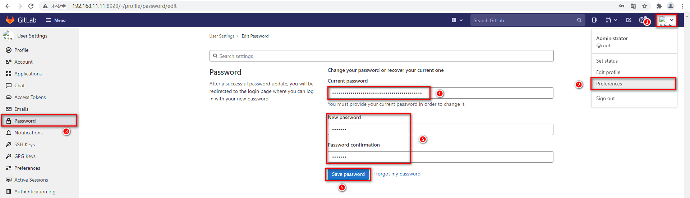

  

#### 1.3.2 使用

- gitlab创建项目：记录clone地址

- idea新建项目citest，编写代码

  ```java
  package com.controller;
  
  import org.springframework.web.bind.annotation.GetMapping;
  import org.springframework.web.bind.annotation.RestController;
  
  @RestController
  public class HelloController {
  
      @GetMapping("/hello")
      public String hello(){
          return "hello world 1";
      }
  
  }
  ```

- 设置本地git的用户名和邮箱（已有的不用重复设置）

- 初始化本地git

- 推到本地仓库，注意添加 .gitgnore 文件

- 推到远程仓库，第一次退需要设置远程仓库地址，使用http的方式，用户名密码：root:sp610527


### 1.4 jenkins安装

#### 1.4.1 安装

```sh
#=======================================1.拉取jenkins镜像======================================
docker pull jenkins/jenkins

#=============================================2.启动=======================================
cd /usr/local/docker/jenkins
vim docker-compose.yml #见下文
mkdir data   #创建数据映射目录
chmod -R a+w data/ #为映射目录授权
docker-compose up -d

#=============================================3.初始化=======================================
#访问：10.1.20.235:8080
#稍等一会，页面访问通后，证明jenkins正常启动。

#输入默认密码
docker exec -it jenkins cat /var/jenkins_home/secrets/initialAdminPassword #查看jenkins默认密码

#安装插件
#修改插件的下载源
vim /uar/local/docker/jenkins/data/hudson.model.UpdateCenter.xml #见下文: 替换下载源
#选择：安装推荐的插件

#创建用户
#root:root
```

- 编写docker-compose.yml

  ```yml
  version: "3.1"
  services:
    jenkins:
      image: jenkins/jenkins
      container_name: jenkins
      ports:
        - 8080:8080
        - 50000:50000
      volumes:
        - ./data/:/var/jenkins_home/
  ```

- hudson.model.UpdateCenter.xml

  ```xml
  <?xml version='1.1' encoding='UTF-8'?>
  <sites>
    <site>
      <id>default</id>
      <url>http://mirror.esuni.jp/jenkins/updates/update-center.json</url>
    </site>
  </sites>
  <!--清华大学的插件源也可以https://mirrors.tuna.tsinghua.edu.cn/jenkins/updates/update-center.json-->
  ```


#### 1.4.2 使用

- 创建一个pipeline风格的任务，任务名为：citest

  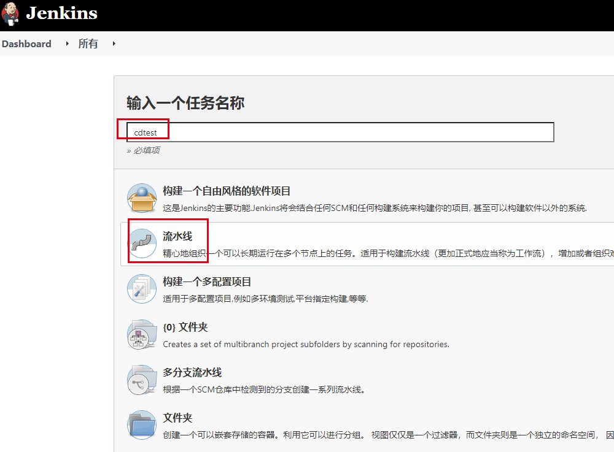

- 任务配置

  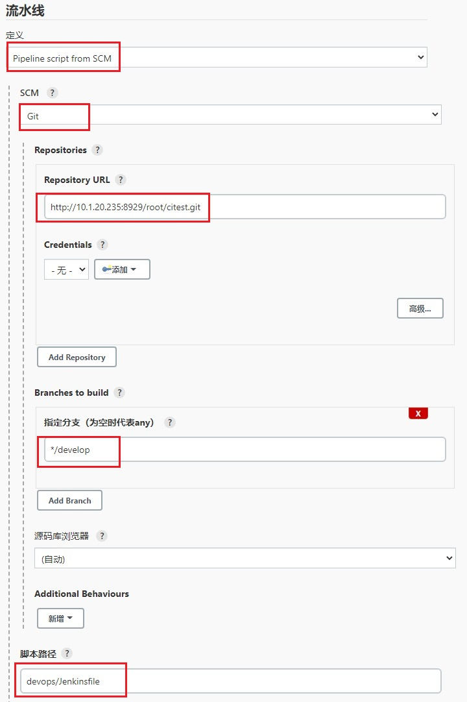


### 1.5 jenkins从gitlab拉取代码

- idea中，根目录下新建包devlop，然后新建文件 Jenkinsfile，文件内容

  ```groovy
  pipeline {
      agent any
  
      environment{
          service_name = 'citest'
          project_name = 'test'
          git_url = 'http://10.1.20.235:8929/root/citest.git'
          harbor_url = '10.1.20.235:80'
          harbor_project_name = "${project_name}"
          harbor_user = 'admin'
          harbor_passwd = 'Harbor12345'
          deployment_file = "${service_name}-deployment.yaml"
          deployment_name = "${service_name}"
          k8s_namespace = "${project_name}"
      }
  
      stages {
          stage('通过git拉取代码') {
              steps {
                  git branch: "${branch}", url: "${git_url}"
              }
          }
      }
  }
  
  ```

- 推送到git

- jenkins中citest任务：配置参数branch

  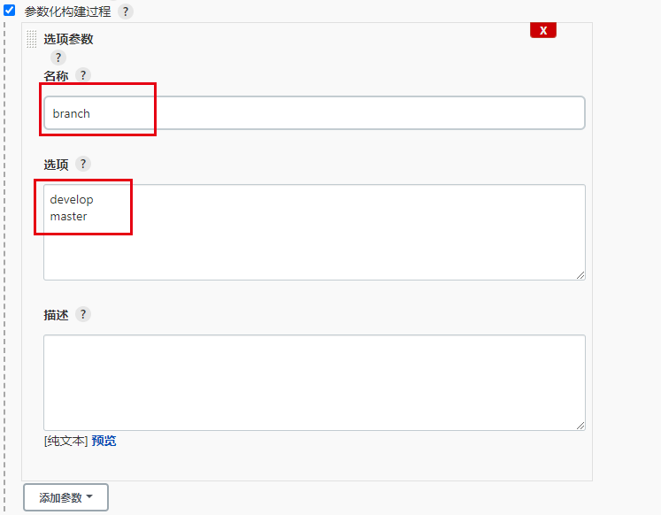

- 启动citest任务，得到：

  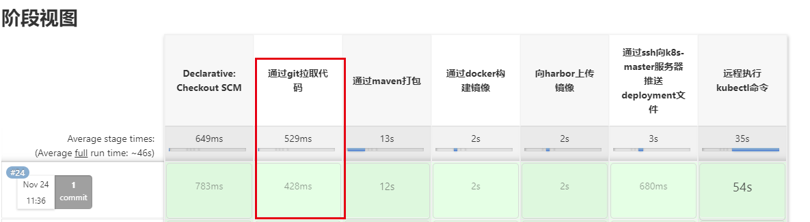


### 1.6 gitlab通知jenkins代码变更

#### 1.6.1 jenkins支持gitlab

- jenkins安装插件gitlab

  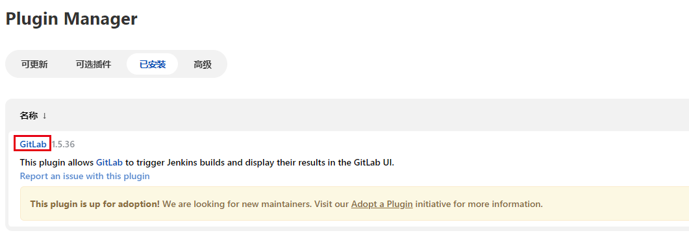

- jenkins中citest任务：配置，当gitlab变更时启动任务

  

#### 1.6.2 gitlab向jenkins发送消息

- gitlab全局配置：允许发送消息

  gitlabs admin设置 允许通知 gitlab -> Menu -> admin -> setting -> network -> outbound requests

  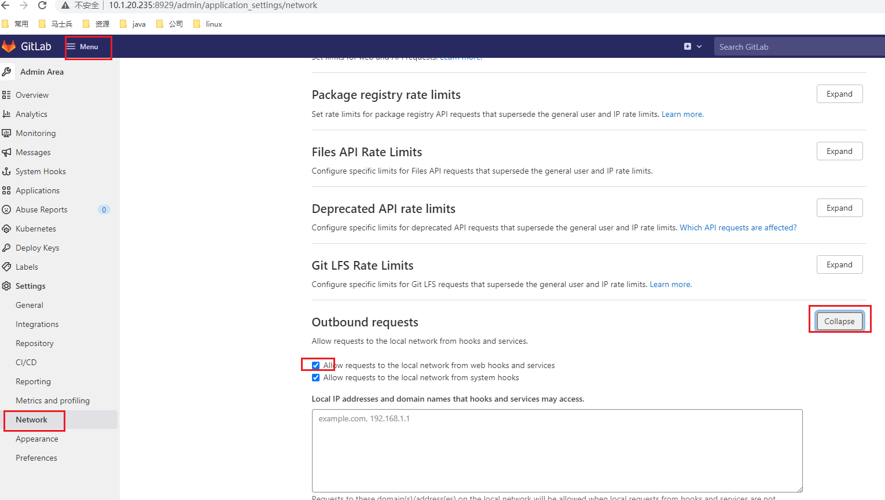

- gitlab的仓库citest配置：连接jenkins

  gitlab -> 项目 -> setting -> Integrations -> jenkins

  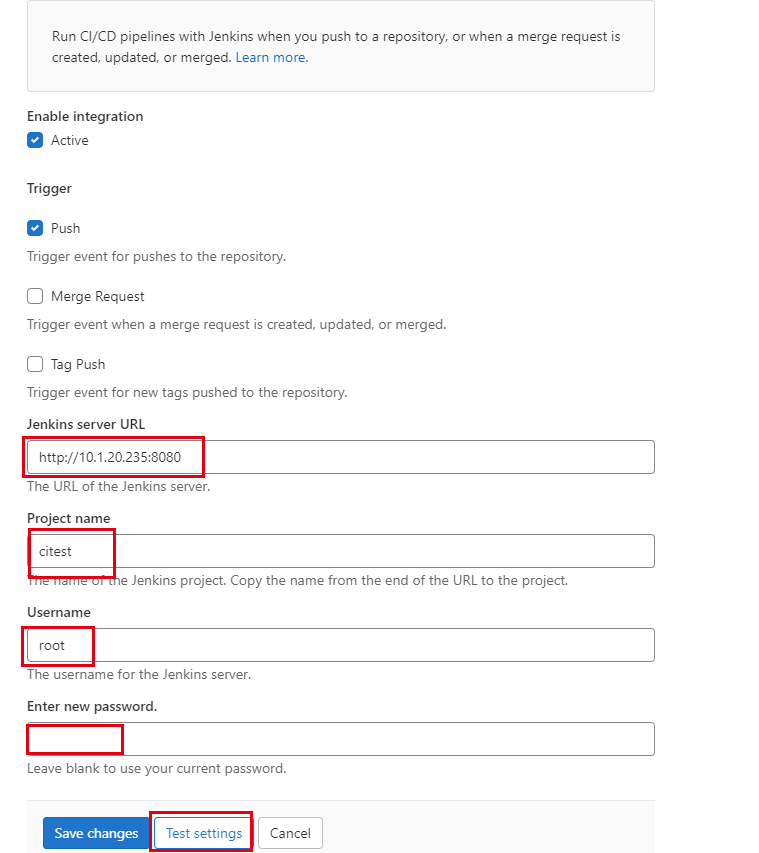

#### 1.6.3 自动构建

修改代码，push到gitlab上，自动构建


### 1.7 maven打包

#### 1.7.1 jenkins安装打包插件

> 采用外部下载解压的方式，放到jenkins的工作目录下，而非jenkins中直接下载插件

- 下载maven和jdk，资源在resourse目录下已下载

  ### maven

  ```sh
  #========================================jdk========================================
  #下载jdk资源并解压
  mv jdk /usr/local/docker/data/jdk
  
  #========================================maven=========================================
  #官网下载（下载tar.gz文件） https://maven.apache.org/
  tar -zxvf [.tar.gz]
  vim settings.xml #修改内容见下文
  mv maven /usr/local/docker/data/maven
  ```

  setting.xml

  ```xml
  <!--新增阿里云镜像-->
  <mirror>
      <id>aliyunmaven</id>
      <mirrorOf>*</mirrorOf>
      <name>阿里云公共仓库</name>
      <url>https://maven.aliyun.com/repository/public</url>
  </mirror>
  
  <!--修改jdk编译版本，默认是1.4，改为1.8-->
  <profile>
      <id>jdk18</id>
      <activation>
          <activeByDefault>true</activeByDefault>
          <jdk>1.8</jdk>
      </activation>
      <properties>
          <maven.compiler.source>1.8</maven.compiler.source>
          <maven.compiler.target>1.8</maven.compiler.target>
          <maven.compiler.compilerVersion>1.8</maven.compiler.compilerVersion>
      </properties>
  </profile>
  ```

- jenkins全局工具配置

  - maven

  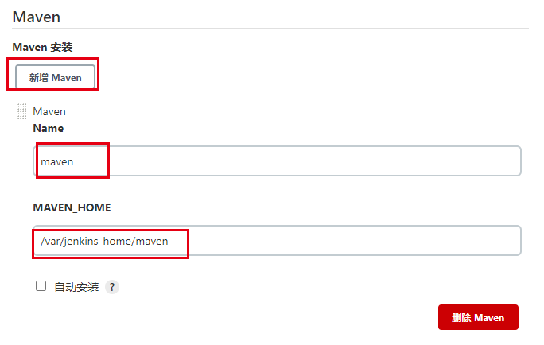

  - jdk

    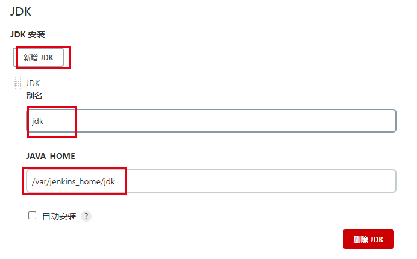

#### 1.7.2 构建：打包

- 打包： pom.xml

  ```xml
      <build>
          <finalName>citest</finalName>
          <plugins>
              <plugin>
                  <groupId>org.springframework.boot</groupId>
                  <artifactId>spring-boot-maven-plugin</artifactId>
              </plugin>
          </plugins>
      </build>
  ```

- Jenkinsfile文件新增

  ```groovy
  stage('通过maven打包') {
      steps {
          sh '/var/jenkins_home/maven/bin/mvn clean package'
      }
  }
  ```

- push代码，自动构建

  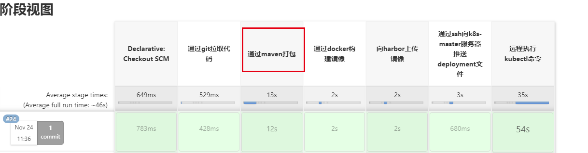


### 1.8 docker构建镜像

> 采用在jenkins容器中调用宿主机docker命令的方式，构建镜像。

#### 1.8.1 docker授权

```sh
chown root:root /var/run/docker.sock 
chmod o+rw /var/run/docker.sock
```

#### 1.8.2 jenkins映射docker文件

```sh
cd /usr/local/docker/jenkins
vim docker-compose.yaml #见下文
docker-compose restart  #重启jenkins

#如果重启后映射文件未生效： 关闭后再启动
docker-compose down 
docker-compose up -d
```

```yml
version: "3.1"
services:
  jenkins:
    image: jenkins/jenkins
    container_name: jenkins
    ports:
      - 8080:8080
      - 50000:50000
    volumes:
      - ./data/:/var/jenkins_home/
      - /usr/bin/docker:/usr/bin/docker
      - /var/run/docker.sock:/var/run/docker.sock
      - /etc/docker/daemon.json:/etc/docker/daemon.json
```

#### 1.8.3 测试

> jenkins需要使用宿主机的docker。所以在jenkins容器中执行docker命令，成功即可。
>
> 如果未成功，检查以上两步：docker.sock权限是否放开，volumes中的文件在jenkins容器中是否映射上。

```sh
docker exec -it jenkins docker version
```

#### 1.8.4 部署

- 在./citest/devlop下新建文件：Dockerfile

  ```dockerfile
  FROM daocloud.io/library/java:8u40-jdk
  COPY citest.jar /usr/local/
  WORKDIR /usr/local/
  CMD java -jar citest.jar
  ```

- Jenkins添加步骤

  ```groovy
          stage('通过docker构建镜像') {
              steps {
                  sh '''mv target/*.jar .
                  mv devops/* .
                  docker build -t ${harbor_url}/${harbor_project_name}/${service_name}:latest .
                  docker image prune -f'''
              }
          }
  ```

- 构建

  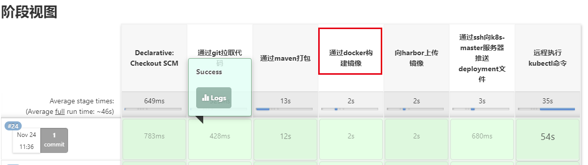


### 1.9 harbor安装

#### 1.9.1 安装

> 这里采用原生的方式安装Harbor。

```sh
#下载并安装
#下载Harbor安装包：https://github.com/goharbor/harbor/releases/download/v2.3.4/harbor-offline-installer-v2.3.4.tgz
tar -zxvf harbor-offline-installer-v2.3.4.tgz -C /usr/local/

#修改配置
cd harbor
cp harbor.yml.tmpl harbor.yml
vim harbor.yml #将下图

#启动
./install.sh

#登录
#地址：10.1.20.235:80
#账户：admin
#密码：Harbor123456

```

- harbor.yml

  

#### 1.9.2 使用

新建仓库


### 1.10 将镜像推送到harbor

#### 1.10.1 docker向harbor推送所需的权限

> docker通过用户名和密码登录，获取harbor的权限。daemon.json新增配置：insecure-registries

```sh
#修改daemon.json文件
vim /etc/docker/daemon.json #文件内容如下

#重启docker
systemctl restart docker #重启docker
#docker.sock重新授权
chown root:root /var/run/docker.sock 
chmod o+rw /var/run/docker.sock
#gitlab和jenkins随docker重启

#测试
docker login -u admin -p Harbor12345 10.1.20.235:80
docker pull 10.1.20.235:80/test/citest
```

daemon.json

```json
{
    "registry-mirrors": [
        "https://pee6w651.mirror.aliyuncs.com",
        "https://h45068lf.mirror.aliyuncs.com"
    ],
    "insecure-registries": [
        "10.1.20.235:80"
    ]
}
```

#### 1.10.2 构建

- Jenkins新增构建步骤

  ```groovy
          stage('向harbor上传镜像') {
              steps {
                  sh '''docker login -u ${harbor_user} -p ${harbor_passwd} $harbor_url
                  docker push ${harbor_url}/${harbor_project_name}/${service_name}:latest'''
              }
          }
  ```

- 构建

  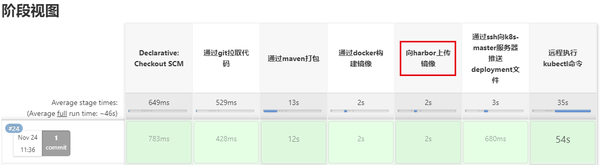


### 1.11 k8s安装

安装：https://kuboard.cn/install/history-k8s/install-k8s-1.19.x.html

```sh
hostname
lscpu
#docker kubelet kubeadm
#dokcer镜像下载地址太慢 镜像

#master #2G
#kubectl
#建立集群

#node 
#加入集群 master1 node 

#可视化页面
#dashboard
#Kuboard

#网络
ingree

#共享文件
nfs
```

官网 https://kubernetes.io/

dashboard: http://10.1.20.235:32000/

Kuboard: http://10.1.20.235:30080/


### 1.12 deployment文件编写

#### 1.12.1 编写部署文件

在./citest/devlop下编写文件：citest-deployment.yaml

```yaml
apiVersion: apps/v1
kind: Deployment
metadata:
  namespace: test
  name: citest
  labels:
    app: citest
spec:
  replicas: 2
  selector:
    matchLabels:
      app: citest
  template:
    metadata:
      labels:
        app: citest
    spec:
      #imagePullSecrets:
        #- name: harbor
      containers:
        - name: citest
          image: 10.1.20.235:80/test/citest:latest
          imagePullPolicy: Always
          ports:
            - containerPort: 8080
---
apiVersion: v1
kind: Service
metadata:
  namespace: test
  labels:
    app: citest
  name: citest
spec:
  selector:
    app: citest
  ports:
    - port: 8080
      targetPort: 8080
  type: NodePort
```

#### 1.12.2 测试

- 启动

  ```yaml
  kubectl apply -f citest-delpoyment.yaml
  ```

- 访问：http://10.1.20.235:30754/hello

  页面打印：hello world 1


### 1.13 ssh推送deployment文件

#### 1.13.1 jenkins安装插件publish over ssh

- jenkins安装插件publish over ssh

  下载完成后重启jenkins

  

- 全局配置

  配置完成后点击 test configuration，测试是否连接成功。

  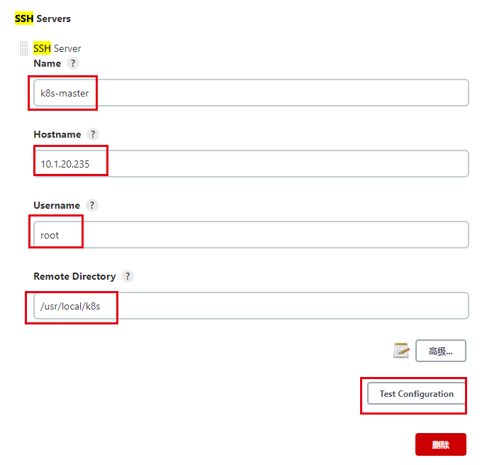

#### 1.13.2 使用

- Jenkinsfile新增步骤

  ```sh
          stage('通过ssh向k8s-master服务器推送deployment文件') {
              steps {
                  sshPublisher(publishers: [sshPublisherDesc(configName: 'k8s-master', transfers: [sshTransfer(cleanRemote: false, excludes: '', execCommand: '', execTimeout: 120000, flatten: false, makeEmptyDirs: false, noDefaultExcludes: false, patternSeparator: '[, ]+', remoteDirectory: "/$project_name/$service_name/", remoteDirectorySDF: false, removePrefix: '', sourceFiles: "$deployment_file")], usePromotionTimestamp: false, useWorkspaceInPromotion: false, verbose: false)])
              }
          }
  ```

- 构建结果

  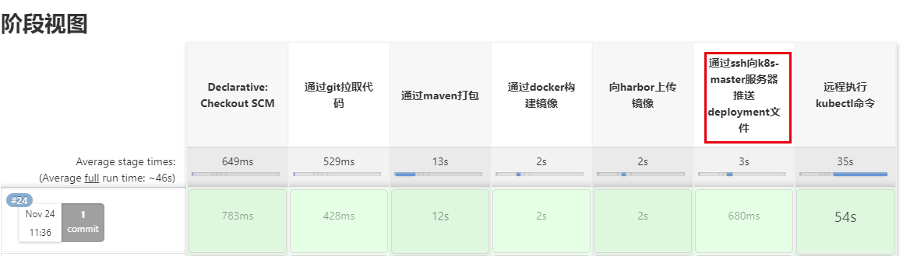


### 1.14 k8s从harbor拉取镜像

#### 1.14.1 docker从harbor拉取镜像

按照1.10.1的方式，把k8s-master和k8s-master两个节点都配置号权限。

#### 1.14.2 k8s从harbort拉取镜像

```sh
#获取凭证
docker login -u [username] -p [password] [ip:port]
cat ~/.docker/config.json |base64 -w 0
#ewoJImF1dGhzIjogewoJCSIxMC4xLjIwLjIzNTo4MCI6IHsKCQkJImF1dGgiOiAiWVdSdGFXNDZTR0Z5WW05eU1USXpORFU9IgoJCX0KCX0KfQ==

#创建harbor-sercet
vim harbor-sercet.yaml #见下文
kubectl create -f harbor-sercet.yaml

#部署文件中添加harbor-sercet
vim citest-deployment.yaml #见下文
```

- harbor-sercet.yaml

  ```yaml
  apiVersion: v1
  kind: Secret
  metadata:
    namespace: test
    name: harbor
  data:
    .dockerconfigjson: ewoJImF1dGhzIjogewoJCSIxMC4xLjIwLjIzNTo4MCI6IHsKCQkJImF1dGgiOiAiWVdSdGFXNDZTR0Z5WW05eU1USXpORFU9IgoJCX0KCX0KfQ==
  type: kubernetes.io/dockerconfigjson
  
  apiVersion: v1
  kind: Secret
  metadata:
    namespace: test
    name: harbor
  data:
    .dockerconfigjson: ewoJImF1dGhzIjogewoJCSIxOTIuMTY4LjEuMjM0OjgwIjogewoJCQkiYXV0aCI6ICJZV1J0YVc0NlNHRnlZbTl5TVRJek5EVT0iCgkJfQoJfSwKCSJIdHRwSGVhZGVycyI6IHsKCQkiVXNlci1BZ2VudCI6ICJEb2NrZXItQ2xpZW50LzE5LjAzLjExIChsaW51eCkiCgl9Cn0=
  type: kubernetes.io/dockerconfigjson
  ```

-  citest-deployment.yaml :  添加imagePullSecrets

  ```yaml
  apiVersion: apps/v1
  kind: Deployment
  metadata:
    namespace: test
    name: citest
    labels:
      app: citest
  spec:
    replicas: 2
    selector:
      matchLabels:
        app: citest
    template:
      metadata:
        labels:
          app: citest
      spec:
        imagePullSecrets:
          - name: harbor
        containers:
          - name: citest
            image: 192.168.1.234:80/test/citest:latest
            imagePullPolicy: Always
            ports:
              - containerPort: 8080
  ---
  apiVersion: v1
  kind: Service
  metadata:
    namespace: test
    labels:
      app: citest
    name: citest
  spec:
    selector:
      app: citest
    ports:
      - port: 8080
        targetPort: 8080
    type: NodePort
  ```

#### 1.14.3 测试

- 删除已有的镜像
- 启动时重新拉取镜像：kubectl apply -f citest-delpoyment.yaml
- 拉取镜像成功即可


### 1.15 k8s部署

#### 1.15.1 jenkins无密码访问k8s

```sh
docker exec -it jenkins bash  #进入jenkins中
ls ~/.ssh  #查看机器上是否有公私钥
ssh-keygen -t rsa  #生成公私钥，见下图
scp ~/.ssh/id_rsa.pub root@10.1.20.235:/root/.ssh/authorized_keys #将公钥复制到k8s-master机器上
ssh root@10.1.20.235 kubectl get node #测试无密码执行
```

生成公私钥

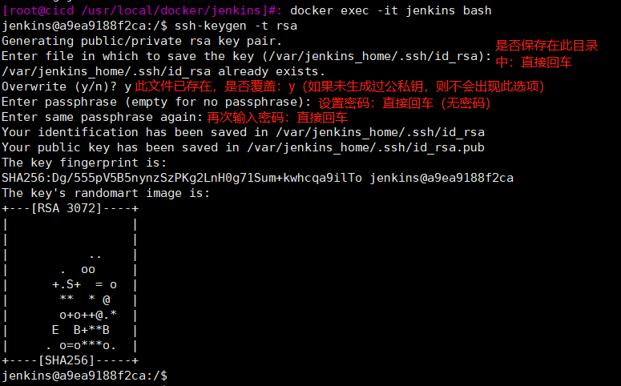

#### 1.15.2 部署

- citest-deployment.yaml :  添加imagePullSecrets，和上文一样。

- Jenkinsfile新增步骤

  ```sh
  pipeline {
      agent any
  
      environment{
          service_name = 'citest'
          project_name = 'test'
          git_url = 'http://10.1.20.235:8929/root/citest.git'
          harbor_url = '10.1.20.235:80'
          harbor_project_name = "${project_name}"
          harbor_user = 'admin'
          harbor_passwd = 'Harbor12345'
          deployment_file = "${service_name}-deployment.yaml"
          deployment_name = "${service_name}"
          k8s_namespace = "${project_name}"
      }
  
      stages {
          stage('通过git拉取代码') {
              steps {
                  git branch: "${branch}", url: "${git_url}"
              }
          }
          stage('通过maven打包') {
              steps {
                  sh '/var/jenkins_home/maven/bin/mvn clean package'
              }
          }
          stage('通过docker构建镜像') {
              steps {
                  sh '''mv target/*.jar .
                  mv devops/* .
                  docker build -t ${harbor_url}/${harbor_project_name}/${service_name}:latest .
                  docker image prune -f'''
              }
          }
          stage('向harbor上传镜像') {
              steps {
                  sh '''docker login -u ${harbor_user} -p ${harbor_passwd} $harbor_url
                  docker push ${harbor_url}/${harbor_project_name}/${service_name}:latest'''
              }
          }
          stage('通过ssh向k8s-master服务器推送deployment文件') {
              steps {
                  sshPublisher(publishers: [sshPublisherDesc(configName: 'k8s-master', transfers: [sshTransfer(cleanRemote: false, excludes: '', execCommand: '', execTimeout: 120000, flatten: false, makeEmptyDirs: false, noDefaultExcludes: false, patternSeparator: '[, ]+', remoteDirectory: "/$project_name/$service_name/", remoteDirectorySDF: false, removePrefix: '', sourceFiles: "$deployment_file")], usePromotionTimestamp: false, useWorkspaceInPromotion: false, verbose: false)])
              }
          }
          stage('远程执行kubectl命令') {
              steps {
                  sh '''ssh root@10.1.20.235 kubectl delete deployment ${deployment_name} -n ${k8s_namespace}
                  ssh root@10.1.20.235 kubectl apply -f /usr/local/k8s/${project_name}/${service_name}/${deployment_file}'''
              }
          }
      }
  }
  ```

- 构建结果

  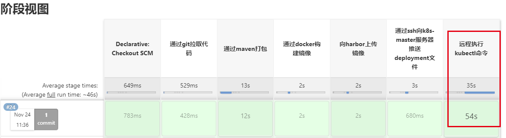

- 访问：http://10.1.20.235:30754/hello

  页面打印：hello world 1


### 1.16 小结

#### 1.16.1 路径

```groovy
pipeline {
    agent any

    environment{
        service_name = 'citest'
        project_name = 'test'
        git_url = 'http://10.1.20.235:8929/root/citest.git'
        harbor_url = '10.1.20.235:80'
        harbor_project_name = "${project_name}"
        harbor_user = 'admin'
        harbor_passwd = 'Harbor12345'
        deployment_file = "${service_name}-deployment.yaml"
        deployment_name = "${service_name}"
        k8s_namespace = "${project_name}"
    }

    stages {
        //起始在jenkins的家目录的workspace下：/var/jenkins_home/workspace
        stage('通过git拉取代码') {
            steps {
                git branch: "${branch}", url: "${git_url}"
            }
        }
        //拉取完代码后会进入服务中：/var/jenkins_home/workspace/citest
        
        //所以mvn命令需要给全路径
        stage('通过maven打包') {
            steps {
                sh '/var/jenkins_home/maven/bin/mvn clean package'
            }
        }
        //执行完成后路径无变化
        
        //jar包和部署文档不在同一个目录下，所以需要把它们都移动到上级目录citest下
        //然后docker build命令就可以在当前目录下执行："."
        //所以Dockerfile执行中，宿主机的目录也是：/var/jenkins_home/workspace/citest
        stage('通过docker构建镜像') {
            steps {
                sh '''mv target/*.jar .
                mv devops/* .
                docker build -t ${harbor_url}/${harbor_project_name}/${service_name}:latest .
                docker image prune -f'''
            }
        }
        //执行完成后路径无变化
        
        //和路径无关
        stage('向harbor上传镜像') {
            steps {
                sh '''docker login -u ${harbor_user} -p ${harbor_passwd} $harbor_url
                docker push ${harbor_url}/${harbor_project_name}/${service_name}:latest'''
            }
        }
        
        //jenkins的目录还是：/var/jenkins_home/workspace/citest
        //远程的目录有 默认+任务中的配置 构成：即/usr/local/k8s + /test/citest = /usr/local/k8s/test/citest
        stage('通过ssh向k8s-master服务器推送deployment文件') {
            steps {
                sshPublisher(publishers: [sshPublisherDesc(configName: 'k8s-master', transfers: [sshTransfer(cleanRemote: false, excludes: '', execCommand: '', execTimeout: 120000, flatten: false, makeEmptyDirs: false, noDefaultExcludes: false, patternSeparator: '[, ]+', remoteDirectory: "/$project_name/$service_name/", remoteDirectorySDF: false, removePrefix: '', sourceFiles: "$deployment_file")], usePromotionTimestamp: false, useWorkspaceInPromotion: false, verbose: false)])
            }
        }
        
        //已远程连接的方式执行k8s命令，远程连接默认的应该时家目录，即/root。
        //所以citest-deployment.yaml需要指定远程的全路径：/usr/local/k8s/test/citest/citest-deployment.yaml
        stage('远程执行kubectl命令') {
            steps {
                sh '''ssh root@10.1.20.235 kubectl delete deployment ${deployment_name} -n ${k8s_namespace}
                ssh root@10.1.20.235 kubectl apply -f /usr/local/k8s/${project_name}/${service_name}/${deployment_file}'''
            }
        }
    }
}

```

### 1.17 关机重启

```sh
#docker是否重启
systemctl status docker
#如果需要启动
systemctl start docker
#docker.sock文件授权
chown root:root /var/run/docker.sock 
chmod o+rw /var/run/docker.sock

#gitlab是否重启
http://192.168.1.234:8929  root:sp610527
#如果需要启动
cd /usr/local/docker/gitlab
docker-compose up -d

#jenkins是否重启
http://192.168.1.234:8080  root:root
#如果需要启动
cd /usr/local/docker/jenkins
docker-compose up -d

#harbor是否重启
http://192.168.1.234:80  admin:Harbor12345
#如果需要启动
cd /usr/local/docker/harbor
./install.sh

#k8s是否重启
systemctl status kubelet
#如果需要启动
systemctl start kubelet

#服务是否健康
http://192.168.1.235:30080
```


## 2、微服务

### 2.1 nexus3

#### 2.1.1 安装

```sh
#1.安装
docker pull sonatype/nexus3
docker-compose #见下文

#2.登录
http://10.1.20.235:8081/ #地址
admin #账户
docker exec -it nexus3 cat /nexus-data/admin.password #初始密码
admin:admin #修改后的账户密码

#3.仓库配置
#将maven-central代理的路径改为国内仓库地址，见2.2
https://repo1.maven.org/maven2/ --》 http://maven.aliyun.com/nexus/content/groups/public

#4.上传：见2.3
#setting.xml配置server
#goods服务pm.xml配置repository
mvn clean deploy

#5.下载：见2.4
#setting.xml配置mirror
#goods服务pm.xml配置repository
#pom.xml依赖
```

docker-compose.yaml

```yaml
version: "3.1"
services:
  nexus3:
    image: sonatype/nexus3
    container_name: nexus3
    restart: always
    ports:
      - 8081:8081
    volumes:
      - '/root/nexus-data:/var/nexus-data'      
```


#### 2.1.2 maven仓库

>**proxy**：这是代理方式，它是用来代理中央仓库的，例如我们依赖的包在本地仓库没有，就会到私服获取，私服没有的话，会到中央仓库先把包下载到这里，然后再下载到本地仓库；
>
>**hosted**：指的是我们公司或团队内部的包，并且 hosted 类型的仓库会分为 releases 和 snapshots 两个，前者是正式版，后者一般是开发测试版；
>
>**group**：它的目的就是把多个仓库组合起来，然后我们项目中只需要配置上这个类型的仓库地址，就可以把它里面组合的几个仓库都关联上。

- **maven-central** 

  系统创建的代理仓库：在我们的私服没有需要jar包时，回到代理仓库下载jar包，所以这里需要配置成国内代理。

  https://repo1.maven.org/maven2/ --》 http://maven.aliyun.com/nexus/content/groups/public

  

- **maven-public**

  系统提供的聚合仓库，用于下载jar包。

  - maven-releases 我们上传的正式版
  - maven-snapshots 我们上传的快照版
  - maven-central 往上的jar包

  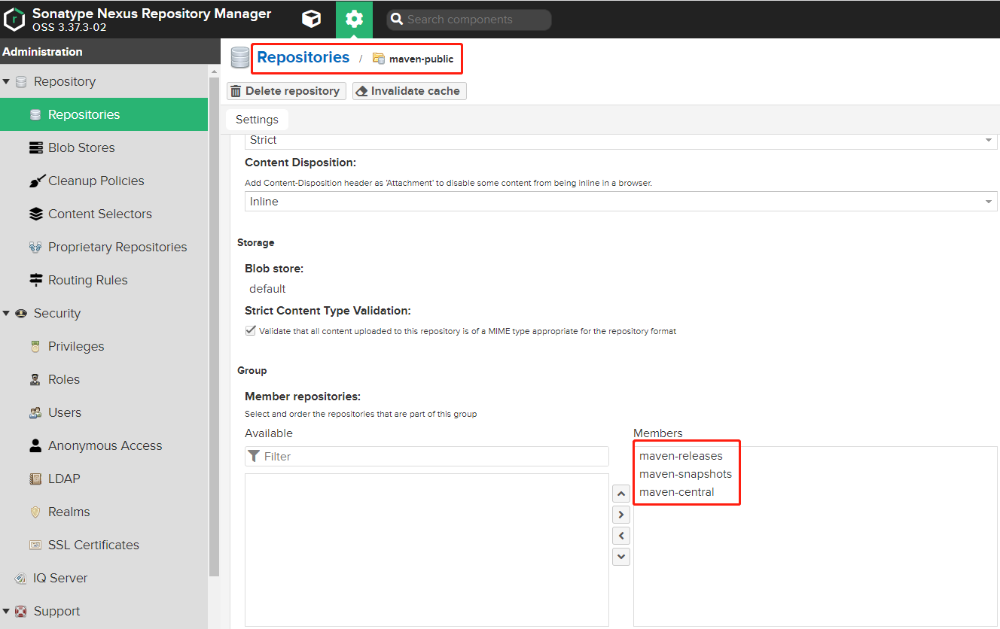


#### 2.1.3 上传

setting.xml

```xml
    <server>
        <id>nexus-releases</id>
        <username>admin</username>
        <password>admin</password>
    </server>

    <server>
        <id>nexus-snapshots</id>
        <username>admin</username>
        <password>admin</password>
    </server>	
```

goods服务pom.xml

```xml
<distributionManagement>
    <repository>
        <id>nexus-releases</id>
        <name>maven-releases</name>
        <url>http://10.1.20.235:8081/repository/maven-releases/</url>
    </repository>
    <snapshotRepository>
        <id>nexus-snapshots</id>
        <name>maven-snapshots</name>
        <url>http://10.1.20.235:8081/repository/maven-snapshots/</url>
    </snapshotRepository>
</distributionManagement>
```

上传：mvn clean deploy


#### 2.1.4 下载

setting.xml

```xml
	<mirror>
        <id>maven-public</id>
        <name>maven-public</name>
        <url>http://10.1.20.235:8081/repository/maven-public/</url>
        <snapshots>
            <enabled>true</enabled>
        </snapshots>
	</mirror> 
```

business服务pom.xml

```xml
<repositories>
    <repository>
        <id>maven-public</id>
        <name>maven-public</name>
        <url>http://10.1.20.235:8081/repository/maven-public/</url>
        <snapshots>
            <enabled>true</enabled>
        </snapshots>
    </repository>
</repositories>
```

business服务依赖goods服务

```xml
<dependency>
    <groupId>org.example</groupId>
    <artifactId>goods</artifactId>
    <version>1.0-20221226.075416-1</version>
</dependency>
```


### 2.2 nacos


### 2.3 gateway


### 2.4 swagger


### 2.5 mysql


### 2.6 redis


### 2.7 mq


### 2.8 xxl-job


## 3、监控系统


## 4、日志系统


# 六、sinosun

## 1、容器


- bin: jvm启动脚本

- conf: 配置文件
  - 环境变量：存储方式configMap
  - endpoint.yaml

- lib: jar包，服务打成的jar包

- log: 日志：存储方式hostPath


## 2、网络

访问方式

https://bplusdev.sinosun.com:31443/mallbbcg2dev/v3/system/v2/api-docs 通过域名解析，nginx1，gatewaw访问

https://bplusdev.sinosun.com:18180/mallbbcg2/v3/system/v2/api-docs 通过域名解析，nginx2，gatewaw访问

https://1.85.9.150:18180/mallbbcg2/v3/system/v2/api-docs 通过ip端口，nginx1，gateway访问

http://10.1.6.12:30532/v3/system/v2/api-docs 通过gateway访问


