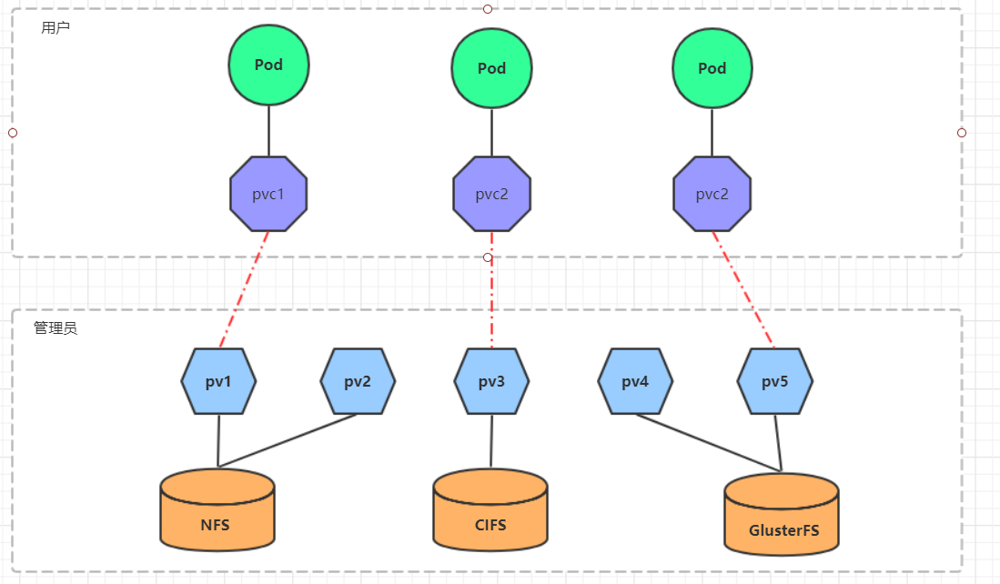

# 当前

```sh
#========================================版本=================================================
docker -version #19.03.12
docker-compose -version #1.29.2
kubectl version #1.17.17

#=========================================启动==============================================
#docker
systemctl status docker
systemctl start docker
#k8s
systemctl status kubelet
systemctl start kubelet
#nfs：共享数据
systemctl start nfs.service #master
systemctl start rpcbind.service #master
#rinetd：端口转发
netstat -tulpn | grep rinetd #查看映射，具体产看看三.2
```


# 一、Centos

- 新建虚拟机
  - 选择系统安装位置，系统类型，系统版本：red hat(64-bit)
  - 选择内存大小
  - 现在创建虚拟硬盘，文件类型选择VDI，动态分配，虚拟硬盘位置不要选在C盘

- 配置安装
  - 存储 -》没有盘片 -》分配光驱 -》选择本地的iso
  - 系统 -》启动顺序 -》把光驱排在第一个

- 安装
  - 确定安装，安装语言选择中文（这里设置的仅仅是安装语言）
  - 安装位置 -》 本地标准盘 -》 自动分配分区 -> 完成 -》 开始安装
  - root密码 -》 root:root -》完成 -》重启

```sh
#网络：桥接模式
#网卡:开机启动，将动态获取ip改为静态获取
ip addr #10.1.20.89
vi /etc/sysconfig/network-scripts/ifcfg-enp0s3
TYPE=Ethernet 						
	PROXY_METHOD=none
	BROWSER_ONLY=no
	BOOTPROTO=static
	IPADDR=10.1.20.89
	NETMASK=255.255.255.0
	GATEWAY=10.1.20.1
	DNS1=114.114.114.114
	DEFROUTE=yes
	IPV4_FAILURE_FATAL=no
	IPV6INIT=yes
	IPV6_AUTOCONF=yes
	IPV6_DEFROUTE=yes
	IPV6_FAILURE_FATAL=no
	IPV6_ADDR_GEN_MODE=stable-privacy
	NAME=enp0s3                           
	UUID=b351fca8-3596-4168-a35f-cc927c09e2c4
	DEVICE=enp0s3
	ONBOOT=yes                       
nmcli connection reload #centos7重载网卡
systemctl restart network #centos8重载网卡

#关闭防火墙
systmectl stop firewalld    # 关闭
systmectl disable firewalld # 关闭开机启用

#下载vim
yum -y install vim*

#版本
cat /etc/redhat-release #CentOS Linux release 7.9.2009 (Core)
uname -r  #3.10.0-1160.el7.x86_64
#内存：2g
#存储：50g
#网络：桥接模式

vim ~/.bashrc
	PS1='\[\e[35;40m\][\u@\h \w]\$: \[\e[m\]'
		\d ：#代表日期，格式为weekday month date，例如："Mon Aug 1"
		\H ：#完整的主机名称
		\h ：#仅取主机的第一个名字
		\t ：#显示时间为24小时格式，如：HH：MM：SS
		\T ：#显示时间为12小时格式
		\A ：#显示时间为24小时格式：HH：MM
		\u ：#当前用户的账号名称
		\v ：#BASH的版本信息
		\w ：#完整的工作目录名称
		\W ：#利用basename取得工作目录名称，所以只会列出最后一个目录
		\# ：#下达的第几个命令
		\$ ：#提示字符，如果是root时，提示符为：# ，普通用户则为：$
		\[\e[35;40m\]: 颜色，其中“F“为字体颜色，编号为30-37，“B”为背景颜色，编号为40-47
		\[\e[m\]：后面不设置
source /root/.bashrc
```

- 导出虚拟机

  - 选择模板（centos7）

  - 开放式虚拟化格式1.0，导出位置，仅包含NAT网卡的MAC地址，写入Manifest地址
  - 导出成ova格式

- 导入虚拟机

  - 选择系统和存储的安装路径
  - 重命名虚拟机

- 设置静态网络
  - 将动态ip改为静态或为静态ip重新选个ip

```sh
timedatectl set-timezone Asia/Shanghai
hostnamectl set-hostname [new-hostname] #vim /etc/hostname
vim /etc/hosts
	10.1.20.235  master
	10.1.20.236  node1
	10.1.20.237  node2
reboot #重启虚拟机
```


# 二、docker

https://docs.docker.com/

https://hub.docker.com/search

## 1、安装

```sh
# 安装
yum install -y yum-utils device-mapper-persistent-data lvm2 wget
wget -O /etc/yum.repos.d/docker-ce.repo https://download.docker.com/linux/centos/docker-ce.repo
sed -i 's+download.docker.com+mirrors.tuna.tsinghua.edu.cn/docker-ce+' /etc/yum.repos.d/docker-ce.repo
yum -y makecache fast
yum -y install docker-ce-18.09.9
docker -v

# 配置阿里镜像
vim /etc/docker/daemon.json
	{
  		"registry-mirrors": ["https://h45068lf.mirror.aliyuncs.com"]
	}
systemctl daemon-reload #重启
systemctl restart docker #重启

#启动
systemctl start docker #启动
systemctl stop docker  #停止
systemctl status docker #状态
systemctl enable docker #自启动
systemctl disable docker #取消自启动
systemctl is-enabled docker #是否自启动

#docker信息
/var/lib/docker/image #镜像位置
/var/lib/docker/containers #容器位置
docker -version #19.03.12
docker-compose -version #1.29.2
```


## 2、docker命令

```sh
#==========================================一、镜像===============================================
docker search [keyword] #搜索镜像 eg：docker search mysql
docker pull [image]:[tag]   #拉取镜像 eg：docker pull mysql:5.7
docker images  #查
docker rmi id  #删除
docker build -t [image-name] [image-source-path] #构建镜像，-t:重命名


#==========================================二、容器===============================================
#创建并运行容器
docker run -d --name m1 -p 3307:3306 -e MYSQL_ROOT_PASSWORD=root mysql:5.7
	-d: 后台运行容器，并返回容器ID；
	-p: 指定端口映射，格式为：主机(宿主)端口:容器端口
	--name=[name]: 为容器指定一个名称；
	-e [环境变量key]=[环境变量value]: 设置环境变量；
docker logs [docker-id|docker-name] #查看容器日志

#增删
docker create [image]:[tag] #创建容器，一般都被run替代
docker ps -a #查询容器，-a:所有镜像，包括没有运行的镜像
docker rm -f id #删除容器，-f:强制删除容器（删除正在运行的容器）

#启停
docker start [docker-id|docker-name] #开启容器
docker stop [docker-id|docker-name] #关闭容器
docker restart [docker-id|docker-name] #重启容器
docker ps #查询正在运行的容器
docker inspect [id|name] #查询容器详情，比如 port, ip

#进入容器
docker exec -it [docker-id|docker-name] /bin/bash #进入容器。-it:以交互的模式进入
#tomcat404原因可能版本问题，需要将webapps.dist下的内容全部复制到webapps中


#==========================================三、网络===============================================
#网络：docker会为每个容器分配虚拟地址，容器间网络本身就互通，但是由于容器创建销毁频繁简单，虚拟ip不断变化，所以希望通过容器名联通网络，所以就需要网桥
docker network ls
docker network  create --driver bridge [new-bridge-name]#创建网桥
docker run -d --name [new-docker-name] -p 8888:8080 --network [bridge-name] tomcat
#测试：进入容器 ping 其他容器的名字


#==========================================四、共享地址===============================================
#容器直接映射地址
docker run -p 8000:8080 --name v1 -v /usr/local/dockershare:/usr/local/tomcat/webapps tomcat 
#通过共享容器映射地址
docker create --name webpage -v /usr/local/dockershare:/usr/local/tomcat/webapps tomcat /bin/true 
docker run --name t3 -d --volumes-from webpage -p 8005:8080 tomcat
```


## 3、dockerfile

用户构建镜像：docker build -t [image-name] [image-source-path]，此命令执行时会执行Dockerfile文件

```Dockerfile
#==========================================一、命令===============================================
FROM tomcat:latest #制作基准镜像
WORKDIR /usr/local/tomcat/webapps #切换工作目录，没有就会创建
ADD docker-web ./docker-web #ADD&COPY 将宿主机文件复制到容器中，当前容器路径是（./）就是WORKDIR目录
ENV [] #设置环境变量
EXPOSE [port] #暴露端口，现有程序的默认端口
RUN [shell] #构建镜像时执行shell命令
ENTRYPOINT [shell] #容器启动时执行shell命令，只会执行最后一个，且不会被命令行替换
CMD [shell]  #容器启动时执行shell命令，只会执行最后一个，但会被命令行替换

#=========================================二、示例：redis=============================================
FROM centos
RUN ["yum" , "install" , "-y" ,"gcc","gcc-c++","net-tools","make"]
WORKDIR /usr/local
ADD redis-4.0.14.tar.gz .
WORKDIR /usr/local/redis-4.0.14/src
RUN make && make install
WORKDIR /usr/local/redis-4.0.14
ADD redis-7000.conf .
EXPOSE 7000
CMD ["redis-server","redis-7000.conf"]
```


## 4、docker-compose

微服务有多个镜像和容器，Dockerfile是启动配置，compose是自动化部署

- app-Dockerfile

```Dockerfile
FROM openjdk:8u222-jre
WORKDIR /usr/local/bsbdj
ADD bsbdj.jar .
ADD application.yml .
ADD application-dev.yml .
EXPOSE 80 #暴露端口
CMD ["java","-jar","bsbdj.jar"]
```

- db-Dockerfile

```Dockerfile
FROM mysql:5.7
WORKDIR /docker-entrypoint-initdb.d
ADD init-db.sql .
```

- docker-compose.yaml

```yaml
version: '3.3'
services:
  db:
    build: ./bsbdj-db/ #构建镜像
    restart: always    #容器挂了就重启
    environment:
      MYSQL_ROOT_PASSWORD: root #容器启动时的环境变量
  app:
    build: ./bsbdj-app/
    depends_on:       #依赖的容器，让app可以访问db
      - db
    ports:
      - "80:80"
    restart: always
```

```sh
cd /usr/local/demo/bsbdj
docker-compose up -d #运行
docker-compose logs [docker-id|docker-name] #查看日志
docker-compose down #下线
```


# 三、k8s

容器编排工具

- 自动化容器的部署和复制
- 随时扩展或收缩容器的规模
- 容器分组group，并且提供容器间的负载均衡
- 实时监控，即使故障发现，自动替换

名词

**Master**：集群控制节点，每个集群需要至少一个master节点负责集群的管控

**Node**：工作负载节点，由master分配容器到这些node工作节点上，然后node节点上的docker负责容器的运行

**Pod**：kubernetes的最小控制单元，容器都是运行在pod中的，一个pod中可以有1个或者多个容器

**Controller**：控制器，通过它来实现对pod的管理，比如启动pod、停止pod、伸缩pod的数量等等

**Service**：pod对外服务的统一入口，下面可以维护者同一类的多个pod

**Label**：标签，用于对pod进行分类，同一类pod会拥有相同的标签

**NameSpace**：命名空间，用来隔离pod的运行环境


## 1、安装

```sh
#=============================================1.准备===================================================
#1.1关闭交换区
swapoff -a #关闭交换分区
vi /etc/fstab 
   #swap 注释
#1.2 配置网桥
cat <<EOF >  /etc/sysctl.d/k8s.conf
net.bridge.bridge-nf-call-ip6tables = 1
net.bridge.bridge-nf-call-iptables = 1
EOF
sysctl --system #查看

#====================================2.安装 kubelet kubeadm kubectl======================================
vim /etc/yum.repos.d #k8s的yum源
#------------
[kubernetes]
name=Kubernetes
baseurl=https://mirrors.aliyun.com/kubernetes/yum/repos/kubernetes-el7-x86_64/
enabled=1
gpgcheck=0
#------------
yum install -y kubelet-1.17.17 kubeadm-1.17.17 kubectl-1.17.17  #kubeadm：容器集群部署工具，kubectl：命令
rpm -qa | grep kube #查看
systemctl start kubelet
systemctl enable kubelet


#====================================3.构建集群：master==================================================
#构建集群
kubeadm init --kubernetes-version=v1.17.17 --pod-network-cidr=10.244.0.0/16
##如果内存报错：--ignore-preflight-errors=NumCPU
##过程：1.自动下载k8s需要的镜像并启动（docker镜像源需要配置好）；2.创建集群
#执行kubeadm init打印出的命令
mkdir -p $HOME/.kube
sudo cp -i /etc/kubernetes/admin.conf $HOME/.kube/config
sudo chown $(id -u):$(id -g) $HOME/.kube/config

#安装flannel网络组件
kubectl create -f kube-flannel.yml #安装flannel网络组件
kubectl get pod --all-namespaces #查看

#开启dashboard
kubectl apply -f kubernetes-dashboard.yaml
kubectl apply -f admin-role.yaml
kubectl apply -f kubernetes-dashboard-admin.rbac.yaml
kubectl get svc -n kube-system #查看
#访问http://192.168.163.132:32000 

#===========================================4.加入集群：node=============================================
#执行master节点构建集权式的输出
kubeadm join 10.1.20.235:6443 --token f5jryy.c9uut9rxhokzlj9o \
    --discovery-token-ca-cert-hash sha256:ed4005bc79fd7be8d7d53eb06fd00e1833d79b127d8e06bfaa080ef1a148282e 
#如果忘记，在master上执行查看，再在node中加入
kubeadm token list #master执行：查看token
kubeadm token create #master执行：如果没有或失效了创建token
kubeadm join 192.168.163.132:6443 --token aoeout.9k0ybvrfy09q1jf6 --discovery-token-unsafe-skip-ca-verification #node执行：无token方式加入集群

```


## 2、kubectl

```sh
node
namesapce ns
deploy
pod
service
persistentVolume pv
persistentVolumeClaim pvc
configmap cm
secret

create (-f)
apply 
get (-o wide)
describe 
delete
top 


#=============================================top 资源============================================
kubectl top node 
kubectl top pod

#=============================================secret==============================================
kubectl get secret -n kube-system | grep token
kubectl describe secret [secret-name] -n kube-system

#=============================================namespace==============================================
kubectl get ns

#=============================================node==============================================
kubectl get nodes

#=============================================deploy==============================================
kubectl get deploy
kubectl create -f [deploy.yml]
kubectl apply -f [deploy.yml]
kubectl delete deploy [deploy-name]
kubectl describe deploy [deploy-name]

#=============================================pod==============================================
kubectl get pod --all-namespaces
kubectl get pod -n [namespace]
kubectl get pod -o wide
kubectl describe pod [pod-name]
kubectl logs [pod-name] #容器启动日志
kubectl exec -it [pod-name] #进入容器

#=============================================service==============================================
kubectl get service
kubectl create -f [service.yml]
kubectl delete service [service-name]
kubectl describe service [service-name]
curl [service-ip]:[service-port]/test/index.jsp #使用service的ip:port范文命令

#=============================================nfs 共享数据==============================================
#master安装
yum install -y nfs-utils rpcbind
mkdir data
cd data
mkdir www-data
vim /etc/exports
	/usr/local/data/www-data 10.1.20.235/24(rw,sync)
systemctl start nfs.service
systemctl start rpcbind.service
systemctl enable nfs.service
systemctl enable rpcbind.service
exportfs #验证
#node安装
yum install nfs-utils -y
#node验证：node可以像本地一样访问远程，实际访问中还是要用网络
showmount -e 10.1.20.235 #查询
mount 10.1.20.235:/usr/local/data/www-data /mnt #映射
#查看/mnt下是否有master映射的文件


#结合k8s
kubectl create -f [yml]
kubectl exec -it [pod-name] #查看挂在文件

#=============================================rinetd 端口转发==========================================
#安装
yum install -y gcc #环境，有gcc可以不执行
cd /usr/local
tar -zxvf 
cd rinetd
sed -i 's/65536/65535/g' rinetd.c
mkdir -p /usr/man
make && make install

#映射
vim /etc/rinetd.conf
	0.0.0.0 8000 10.104.210.162 8000
rinetd -c /etc/rinetd.conf #执行映射配置
netstat -tulpn | grep rinetd #查看映射
#当映射文件更新时，再此执行rinetd -c /etc/rinetd.conf只会新建映射，可能造成端口重复，所有需要删除原来的
ps ax | grep rinetd #查看映射的进程
kill -9 [pid] #删除

#测试
kubectl create -f [yml]
#http://[ip]:[serivice-port]/test/index.jsp 
```

## 3、deploy-部署

```yaml
#基本
apiVersion: extensions/v1beta1
kind: Deployment
metadata:
  name: tomcat-deploy
spec:
  replicas: 2
  template:
    metadata:
      labels:
        app: tomcat-cluster-pod
    spec:
      containers:
      - name: tomcat-cluster-container
        image: tomcat
        ports:
        - containerPort: 8080
```

## 4、service-网络

### 4.1 service

在kubernetes中，pod是应用程序的载体，我们可以通过pod的ip来访问应用程序，但是pod的ip地址不是固定的，这也就意味着不方便直接采用pod的ip对服务进行访问。

为了解决这个问题，kubernetes提供了Service资源，Service会对提供同一个服务的多个pod进行聚合，并且提供一个统一的入口地址。通过访问Service的入口地址就能访问到后面的pod服务。


Service在很多情况下只是一个概念，真正起作用的其实是kube-proxy服务进程，每个Node节点上都运行着一个kube-proxy服务进程。当创建Service的时候会通过api-server向etcd写入创建的service的信息，而kube-proxy会基于监听的机制发现这种Service的变动，然后**它会将最新的Service信息转换成对应的访问规则**。


```
# 10.97.97.97:80 是service提供的访问入口
# 当访问这个入口的时候，可以发现后面有三个pod的服务在等待调用，
# kube-proxy会基于rr（轮询）的策略，将请求分发到其中一个pod上去
# 这个规则会同时在集群内的所有节点上都生成，所以在任何一个节点上访问都可以。
[root@node1 ~]# ipvsadm -Ln
IP Virtual Server version 1.2.1 (size=4096)
Prot LocalAddress:Port Scheduler Flags
  -> RemoteAddress:Port           Forward Weight ActiveConn InActConn
TCP  10.97.97.97:80 rr
  -> 10.244.1.39:80               Masq    1      0          0
  -> 10.244.1.40:80               Masq    1      0          0
  -> 10.244.2.33:80               Masq    1      0          0
```

kube-proxy目前支持三种工作模式:

- userspace 
- iptables 
- ipvs 

### 4.2 service类型

- service的资源清单文件

```yaml
kind: Service  # 资源类型
apiVersion: v1  # 资源版本
metadata: # 元数据
  name: service # 资源名称
spec: # 描述
  selector: # 标签选择器，用于确定当前service代理哪些pod
    app: nginx
  clusterIP:  # 虚拟服务的ip地址，不指定就会随机分配
  type: ClusterIP #service的访问方式：ClusterIP（默认） NodePort LoadBalancer ExternalName
  ports: # 端口信息
    - protocol: TCP 
      port: 3017  # service端口
      targetPort: 5003 # pod端口
      nodePort: 31122 # 宿主机端口，不指定就会随机分配
```

- ClusterIP：默认值，它是Kubernetes系统自动分配的虚拟IP，只能在集群内部访问
- NodePort：将Service通过指定的Node上的端口暴露给外部，通过此方法，就可以在集群外部访问服务
- LoadBalancer：使用外接负载均衡器完成到服务的负载分发，注意此模式需要外部云环境支持
- ExternalName： 把集群外部的服务引入集群内部，直接使用

## 5、volume-数据存储

### 5.1 基本存储

#### 5.1.1 EmptyDir

EmptyDir是最基础的Volume类型，一个EmptyDir就是Host上的一个空目录。

EmptyDir是在Pod被分配到Node时创建的，它的初始内容为空，并且无须指定宿主机上对应的目录文件，因为kubernetes会自动分配一个目录，当Pod销毁时， EmptyDir中的数据也会被永久删除。 EmptyDir用途如下：

- 临时空间，例如用于某些应用程序运行时所需的临时目录，且无须永久保留
- 一个容器需要从另一个容器中获取数据的目录（多容器共享目录）

接下来，通过一个容器之间文件共享的案例来使用一下EmptyDir。

在一个Pod中准备两个容器nginx和busybox，然后声明一个Volume分别挂在到两个容器的目录中，然后nginx容器负责向Volume中写日志，busybox中通过命令将日志内容读到控制台。


创建一个volume-emptydir.yaml

```yaml
apiVersion: v1
kind: Pod
metadata:
  name: volume-emptydir
  namespace: dev
spec:
  containers:
  - name: nginx
    image: nginx:1.17.1
    ports:
    - containerPort: 80
    volumeMounts:  # 将logs-volume挂在到nginx容器中，对应的目录为 /var/log/nginx
    - name: logs-volume
      mountPath: /var/log/nginx
  - name: busybox
    image: busybox:1.30
    command: ["/bin/sh","-c","tail -f /logs/access.log"] # 初始命令，动态读取指定文件中内容
    volumeMounts:  # 将logs-volume 挂在到busybox容器中，对应的目录为 /logs
    - name: logs-volume
      mountPath: /logs
  volumes: # 声明volume， name为logs-volume，类型为emptyDir
  - name: logs-volume
    emptyDir: {}
```

#### 5.1.2 HostPath

上节课提到，EmptyDir中数据不会被持久化，它会随着Pod的结束而销毁，如果想简单的将数据持久化到主机中，可以选择HostPath。

HostPath就是将Node主机中一个实际目录挂在到Pod中，以供容器使用，这样的设计就可以保证Pod销毁了，但是数据依据可以存在于Node主机上。


```yaml
apiVersion: v1
kind: Pod
metadata:
  name: volume-hostpath
  namespace: dev
spec:
  containers:
  - name: nginx
    image: nginx:1.17.1
    ports:
    - containerPort: 80
    volumeMounts:
    - name: logs-volume
      mountPath: /var/log/nginx
  - name: busybox
    image: busybox:1.30
    command: ["/bin/sh","-c","tail -f /logs/access.log"]
    volumeMounts:
    - name: logs-volume
      mountPath: /logs
  volumes:
  - name: logs-volume
    hostPath: 
      path: /root/logs
      
```

#### 5.1.3 nfs

HostPath可以解决数据持久化的问题，但是一旦Node节点故障了，Pod如果转移到了别的节点，又会出现问题了，此时需要准备单独的网络存储系统，比较常用的用NFS、CIFS。

NFS是一个网络文件存储系统，可以搭建一台NFS服务器，然后将Pod中的存储直接连接到NFS系统上，这样的话，无论Pod在节点上怎么转移，只要Node跟NFS的对接没问题，数据就可以成功访问。


- 安装

```sh
#=============================================nfs 安装==============================================
#master安装
yum install -y nfs-utils rpcbind
mkdir data
cd data
mkdir www-data
vim /etc/exports
	/usr/local/data/www-data 10.1.20.235/24(rw,sync)
systemctl start nfs.service
systemctl start rpcbind.service
systemctl enable nfs.service
systemctl enable rpcbind.service
exportfs #验证
#node安装
yum install nfs-utils -y
#node验证：node可以像本地一样访问远程，实际访问中还是要用网络
showmount -e 10.1.20.235 #查询
mount 10.1.20.235:/usr/local/data/www-data /mnt #映射
#查看/mnt下是否有master映射的文件
```

- 部署

```yaml
apiVersion: v1
kind: Pod
metadata:
  name: volume-nfs
  namespace: dev
spec:
  containers:
  - name: nginx
    image: nginx:1.17.1
    ports:
    - containerPort: 80
    volumeMounts:
    - name: logs-volume
      mountPath: /var/log/nginx
  - name: busybox
    image: busybox:1.30
    command: ["/bin/sh","-c","tail -f /logs/access.log"] 
    volumeMounts:
    - name: logs-volume
      mountPath: /logs
  volumes:
  - name: logs-volume
    nfs:
      server: 10.1.20.253  #nfs服务器地址
      path: /data/sunpeng/themes #共享文件路径
```


### 5.2 k8s存储

- 前面已经学习了使用NFS提供存储，此时就要求用户会搭建NFS系统，并且会在yaml配置nfs。由于kubernetes支持的存储系统有很多，要求客户全都掌握，显然不现实。为了能够屏蔽底层存储实现的细节，方便用户使用， kubernetes引入PV和PVC两种资源对象。

  - PV（Persistent Volume）是持久化卷的意思，是对底层的共享存储的一种抽象。一般情况下PV由kubernetes管理员进行创建和配置，它与底层具体的共享存储技术有关，并通过插件完成与共享存储的对接。

  - PVC（Persistent Volume Claim）是持久卷声明的意思，是用户对于存储需求的一种声明。换句话说，PVC其实就是用户向kubernetes系统发出的一种资源需求申请。

  

  使用了PV和PVC之后，工作可以得到进一步的细分：

  - 存储：存储工程师维护
  - PV： kubernetes管理员维护
  - PVC：kubernetes用户维护

#### 5.2.1 pv

```yml
apiVersion: v1
kind: PersistentVolume
metadata:
  name:  themes
spec:
  capacity:
    storage: 3Gi
  accessModes:
  - ReadWriteMany
  persistentVolumeReclaimPolicy: Retain
  nfs:
    path: /data/sunpeng/themes
    server: 10.1.20.253
```

PV 的关键配置参数说明：

- **存储类型**

  底层实际存储的类型，kubernetes支持多种存储类型，每种存储类型的配置都有所差异

- **存储能力（capacity）**

目前只支持存储空间的设置( storage=1Gi )，不过未来可能会加入IOPS、吞吐量等指标的配置

- **访问模式（accessModes）**

  用于描述用户应用对存储资源的访问权限，访问权限包括下面几种方式：

  - ReadWriteOnce（RWO）：读写权限，但是只能被单个节点挂载
  - ReadOnlyMany（ROX）： 只读权限，可以被多个节点挂载
  - ReadWriteMany（RWX）：读写权限，可以被多个节点挂载

  `需要注意的是，底层不同的存储类型可能支持的访问模式不同`

- **回收策略（persistentVolumeReclaimPolicy）**

  当PV不再被使用了之后，对其的处理方式。目前支持三种策略：

  - Retain （保留） 保留数据，需要管理员手工清理数据
  - Recycle（回收） 清除 PV 中的数据，效果相当于执行 rm -rf /thevolume/*
  - Delete （删除） 与 PV 相连的后端存储完成 volume 的删除操作，当然这常见于云服务商的存储服务

  `需要注意的是，底层不同的存储类型可能支持的回收策略不同`

- **存储类别**

  PV可以通过storageClassName参数指定一个存储类别

  - 具有特定类别的PV只能与请求了该类别的PVC进行绑定
  - 未设定类别的PV则只能与不请求任何类别的PVC进行绑定

- **状态（status）**

  一个 PV 的生命周期中，可能会处于4中不同的阶段：

  - Available（可用）： 表示可用状态，还未被任何 PVC 绑定
  - Bound（已绑定）： 表示 PV 已经被 PVC 绑定
  - Released（已释放）： 表示 PVC 被删除，但是资源还未被集群重新声明
  - Failed（失败）： 表示该 PV 的自动回收失败

#### 5.2.1 pvc

```yaml
apiVersion: v1
kind: PersistentVolumeClaim
metadata:
  name: themes
spec:
  accessModes:
  - ReadWriteMany
  resources:
    requests:
      storage: 1Gi
```

PVC 的关键配置参数说明：

- **访问模式（accessModes）**

用于描述用户应用对存储资源的访问权限

- **选择条件（selector）**

  通过Label Selector的设置，可使PVC对于系统中己存在的PV进行筛选

- **存储类别（storageClassName）**

  PVC在定义时可以设定需要的后端存储的类别，只有设置了该class的pv才能被系统选出

- **资源请求（Resources ）**

  描述对存储资源的请求

#### 5.2.3 生命周期

PVC和PV是一一对应的，PV和PVC之间的相互作用遵循以下生命周期：

- **资源供应**：管理员手动创建底层存储和PV

- **资源绑定**：用户创建PVC，kubernetes负责根据PVC的声明去寻找PV，并绑定

  在用户定义好PVC之后，系统将根据PVC对存储资源的请求在已存在的PV中选择一个满足条件的

  - 一旦找到，就将该PV与用户定义的PVC进行绑定，用户的应用就可以使用这个PVC了
  - 如果找不到，PVC则会无限期处于Pending状态，直到等到系统管理员创建了一个符合其要求的PV

  PV一旦绑定到某个PVC上，就会被这个PVC独占，不能再与其他PVC进行绑定了

- **资源使用**：用户可在pod中像volume一样使用pvc

  Pod使用Volume的定义，将PVC挂载到容器内的某个路径进行使用。

- **资源释放**：用户删除pvc来释放pv

  当存储资源使用完毕后，用户可以删除PVC，与该PVC绑定的PV将会被标记为“已释放”，但还不能立刻与其他PVC进行绑定。通过之前PVC写入的数据可能还被留在存储设备上，只有在清除之后该PV才能再次使用。

- **资源回收**：kubernetes根据pv设置的回收策略进行资源的回收

  对于PV，管理员可以设定回收策略，用于设置与之绑定的PVC释放资源之后如何处理遗留数据的问题。只有PV的存储空间完成回收，才能供新的PVC绑定和使用


#### 

### 5.3 配置存储

- configmap：一般存储一些配置信息
- secret：一般存储加密的信息，比如账号密码

#### 5.3.1 configmap

```yaml
apiVersion: v1
kind: ConfigMap
metadata:
  name: configmap
  namespace: dev
data:
  info: |
    username:admin
    password:123456
```

#### 5.3.2 secret

```yaml
apiVersion: v1
kind: Secret
metadata:
  name: secret
  namespace: dev
type: Opaque
data:
  username: YWRtaW4=
  password: MTIzNDU2
```


# 四、jenkins


# 五、devops

redirect_urls

https://bplusdev.sinosun.com:18580/auth/realms/master/protocol/openid-connect/3p-cookies/step1.html?version=iqfmg

http://10.1.20.220:31121/realms/master/protocol/openid-connect/auth?client_id=security-admin-console&redirect_uri=http://10.1.20.220:31121/admin/master/console/&state=7b766a4d-c4e1-4664-9159-81eb520ae6b7&response_mode=fragment&response_type=code&scope=openid&nonce=0b30b0a1-44b4-43e7-a3b3-682abf0cdc0d&code_challenge=Dos_BbmUuyrrFZOYcp2BdRq_FnA00GeAIl-1Cm7j4Gg&code_challenge_method=S256


 

https://bplussit.sinosun.com:18680/auth/realms/bplussit/protocol/openid-connect/auth?client_id=security-admin-console&redirect_uri=https%3A%2F%2Fbplussit.sinosun.com%3A18680%2Fauth%2Fadmin%2Fbplussit%2Fconsole%2F%23%2Frealms%2Fbplussit&state=614a4d41-397b-4e76-8730-bdd1e098816f&response_mode=fragment&response_type=code&scope=openid&nonce=bdde0a7d-647d-4c37-b94c-8cfd1d38a014&code_challenge=Mfg0XGjbfXIba88saPuCyik8H7itoWkQSBeenmFNO8g&code_challenge_method=S256


jenkins

springboot源码

nigx web

springcloud-alibaba

jvm 多线程

算法


