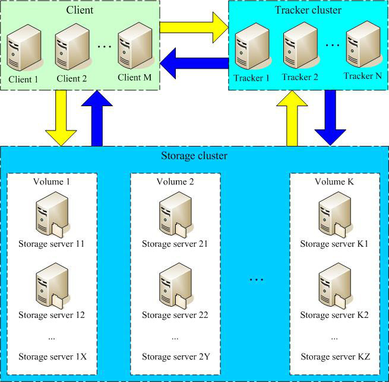
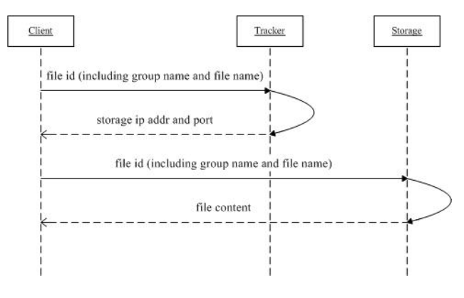
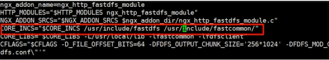

## 快速使用

### 1、启动

```sh
#====================================一、fastdfs=======================================
###1.启动fastDFS+nginx
service fdfs_trackerd start #启动trackerd，查询状态：service fdfs_trackerd status
service fdfs_storaged start #启动storaged，查询状态：service fdfs_storaged status
/usr/local/nginx/sbin/nginx #启动nginx

###2.启动程序
#启动程序: F:/java/code/microservice/fastDFS/PictureApplication

###3.测试
#上传：使用postman上传图片
#访问：使用浏览器访问图片地址


#====================================二、aliyun oss====================================
#1.登录
#阿里云：支付宝登录
#oss-browser: LTAI5tEyrogdgpib9dmhAgVY:f2TH0QwRV9et6jPYWQIJO1HDsDRYAH
```


### 2、坑

- 本机（虚拟机）ip变化

  配置文件中追踪的tracker_server ip变化，且更改完后需要重启storage，不然配置不生效


## 1、简介

### 1.1 图片服务器

分布式虽然说可以实现不同模块之间图片的访问，但是问题也很明显，包含如下问题：

- 图片存储过于分散。
- 图片多的服务器压力比较大，可能会影响其他功能。
- 存储到项目路径中，重启会丢失。存储到外部文件中，I/O操作性能低。

​        针对上面问题可以搭建单独的图片服务器，专门做图片存储及图片访问的。而想要搭建图片服务器就需要应用图片存储技术/工具。


### 1.2 分布式文件系统

通用分布式文件系统：

​	通用分布式文件系统和传统的本地文件系统（如ext3、NTFS等）相对应。典型代表：lustre、MooseFS

- 优点：标准文件系统操作方式，对开发者门槛较低
- 缺点：
  - 系统复杂性较高，需要支持若干标准的文件操作，如：目录结构、文件读写权限、文件锁等。复杂性更高。
  - 系统整体性能有所降低，因为要支持POSIX标准（表示[可移植操作系统接口](https://baike.baidu.com/item/可移植操作系统接口/12718298)（Portable Operating System Interface of UNIX），POSIX标准定义了操作系统应该为应用程序提供的接口标准）

专用分布式文件系统：

​	基于google File System的思想，文件上传后不能修改。需要使用专有API对文件进行访问，也可称作分布式文件存储服务。典型代表：MogileFS、FastDFS、TFS。

- 优点：

  - 系统复杂性较低，不需要支持若干标准的文件操作，如：目录结构、文件读写权限、文件锁等，系统比较简洁。

  - 系统整体性能较高，因为无需支持POSIX标准，可以省去支持POSIX引入的环节，系统更加高效。

- 缺点：采用专有API，对开发者门槛较高（直接封装成工具类）


### 1.3 FastDFS

  FastDFS是一个轻量级的开源分布式文件系统。2008年4月份开始启动。类似google FS的一个轻量级分布式文件系统，纯C实现，支持Linux、FreeBSD、AIX等UNIX系统。

​	主要解决了大容量的文件存储和高并发访问的问题，文件存取时实现了负载均衡。实现了软件方式的磁盘阵列（Redundant Arrays of Independent Drives，RAID），可以使用廉价的IDE（Integrated Drive Electronics）硬盘进行存储。并且支持存储服务器在线扩容。支持相同内容的文件只保存一份，节约磁盘空间。

​	FastDFS只能通过Client API访问，不支持POSIX访问方式。

​	FastDFS特别适合大中型网站使用，用来存储资源文件（如：图片、文档、音频、视频等等）


##  2、架构

### 2.1 架构图





### 2.2 角色

​	Client：客户端。使用java语言编写的项目属于客户端。

​	Tracker Server：跟踪服务器，主要做调度工作，在访问上起负载均衡的作用。在内存中记录集群中group和storage server的状态信息，是连接Client和Storage server的枢纽。

​	 Storage Server：存储服务器，文件和文件属性（meta data）都保存到存储服务器上

### 2.3 架构解读

​	只有两个角色，tracker server和storage server，不需要存储文件索引信息。

​	所有服务器都是对等的，不存在Master-Slave关系。

​	存储服务器采用分组方式，同组内存储服务器上的文件完全相同（RAID 1）。

​	不同组的storage server之间不会相互通信。

​	由storage server主动向tracker server报告状态信息，tracker server之间不会相互通信。

## 3、 安装

### 3.1 安装FastDFS依赖

```sh
yum install -y make cmake gcc gcc-c++ #FastDFS是C语言开发的应用。安装必须使用 make , cmake 和 gcc编译器。

#安装C函数库libfastcommon-master，它从FastDFS和FastDHT中提取出来的公共C函数库
#找到资源libfastcommon-master.zip 放到 /usr/local/tmp下
cd /usr/local/tmp
unzip libfastcommon-master.zip
cd libfastcommon-master
./make.sh
./make.sh install #有固定的默认安装位置。在/usr/lib64 和  /usr/include/fastcommon两个目录中
#创建软连接
ln -s /user/lib64/libfastcommon.so /usr/local/lib/libfastcommon.so
ln -s /usr/local/lib64/libfdfsclient.so /usr/local/lib/libfdfsclient.so
# 因为FastDFS 主程序设置的lib目录是 /usr/local/lib， 所以需要创建软连接
```


###  3.2 安装FastDFS

```sh
#上传 FastDFS_v5.08.tar.gz 到 /usr/local/tmp下后解压
cd /usr/local/tmp
tar zxf FastDFS_v5.08.tar.gz
cd FastDFS
./make.sh
./make.sh install
```

安装后 FastDFS主程序所在的位置是

/usr/bin  可执行文件所在的位置

/etc/fdfs  配置文件所在的位置

/usr/bin  主程序代码所在位置

/usr/include/fastdfs 包含一些插件组所在的位置


### 3.3 配置tracker

```sh
###配置tracker.conf
cd /etc/fdfs
cp tracker.conf.sample tracker.conf #tracker.conf.sample只是示例文件，需要创建配置文件
mkdir -p /usr/local/fastdfs/tracker #创建放置 tracker数据的目录
vim tracker.conf #修改 tracker.conf 设置 tracker 内容存储目录
	base_path=/usr/local/fastdfs/tracker

###启动运行
service fdfs_trackerd start #启动，首次启动成功后， 配置文件中 base_path 指向的目录出现 FastDFS服务相关数据目录(data目录， logs 目录)
service fdfs_trackerd status #状态：如果显示 is running 表示正常运行
```


###  3.4 配置storage

storage可以和tracker不在同一台服务器上。示例中把storage和tracker安装在同一台服务器上了。

```sh
###配置storage.conf
cd /etc/fdfs
cp storage.conf.sample storage.conf #storage.conf.sample只是示例文件，需要创建配置文件
mkdir -p /usr/local/fastdfs/storage/base #base用于存储基础数据和日志
mkdir -p /usr/local/fastdfs/storage/store #store用于存储上传数据。
vim /etc/fdfs/storage.conf
	base_path=/usr/local/fastdfs/storage/base #基础路径。用于保存 基础数据内容和日志内容的目录
	store_path0=/usr/local/fastdfs/storage/store #存储路径。真正保存图片的地方。
	tracker_server=tracker 服务IP：22122 #跟踪服务器位置。就是跟踪服务器的IP（本机ip）和端口

###启动
service fdfs_storaged start
service fdfs_storaged status
```

​	启动成功后，配置文件中base_path 指向的目录中出现FastDFS服务相关数据目录（data目录、logs目录）配置文件中的store_path0指向的目录中同样出现FastDFS存储相关数据录（data目录）。其中$store_path0/data/目录中默认创建若干子孙目录（两级目录层级总计256*256个目录），是用于存储具体文件数据。Storage 服务器启动比较慢，因为第一次启动的时候，需要创建256*256个目录。

### 3.5 配置client并上传文件

```sh
###配置storage.conf
cd /etc/fdfs
cp client.conf.sample client.conf #client.conf.sample只是示例文件，需要创建配置文件
mkdir -p /usr/local/fastdfs/client
vim /etc/fdfs/client.conf #3.4.1 配置文件
	base_path=/usr/local/fastdfs/client
	tracker_server=tracker服务IP：22122

###上传文件
/usr/bin/fdfs_upload_file /etc/fdfs/client.conf  /要上传的文件
###返回group1/M00/00/00/wKiWDV0xfqWAFe1OAAAib-i5DLU637.log，含义见4.0
```


## 4、代码

### 4.0 时序图



#### 4.0.1上传

1.  客户端访问Tracker
2.  Tracker 返回Storage的ip和端口
3.  客户端直接访问Storage，把文件内容和元数据发送过去。
4.  Storage返回文件存储id。包含了组名和文件名


#### 4.0.2 下载

1. client询问tracker下载文件的storage，参数为文件标识（组名和文件名）；

2. tracker返回一台可用的storage；

3. client直接和storage通讯完成文件下载。


### 4.1 添加依赖

```xml
<dependencies>
    <dependency>
        <groupId>cn.bestwu</groupId>
        <artifactId>fastdfs-client-java</artifactId>
        <version>1.27</version>
    </dependency>
    <dependency>
        <groupId>org.apache.commons</groupId>
        <artifactId>commons-lang3</artifactId>
        <version>3.4</version>
    </dependency>
</dependencies> `     
```

###  4.2 编写配置文件

​	文件名：fdfs_client.conf

​	修改成自己的tracker服务器ip

```tex
connect_timeout = 10
network_timeout = 30
charset = UTF-8
http.tracker_http_port = 8080
tracker_server = 10.1.20.89:22122
```

### 4.3 导入工具类

```java
package com.msb.utils;
import java.io.ByteArrayInputStream;
import java.io.File;
import java.io.FileInputStream;
import java.io.IOException;
import java.io.InputStream;

import org.apache.commons.lang3.StringUtils;
import org.csource.common.NameValuePair;
import org.csource.fastdfs.ClientGlobal;
import org.csource.fastdfs.StorageClient;
import org.csource.fastdfs.StorageClient1;
import org.csource.fastdfs.StorageServer;
import org.csource.fastdfs.TrackerClient;
import org.csource.fastdfs.TrackerServer;

/**
 * FastDFS分布式文件系统操作客户端.
 */
public class FastDFSClient {

   private static final String CONF_FILENAME = Thread.currentThread().getContextClassLoader().getResource("").getPath() + "fdfs_client.conf";

   private static StorageClient storageClient = null;

   /**
    * 只加载一次.
    */
   static {
      try {
         ClientGlobal.init(CONF_FILENAME);
         TrackerClient trackerClient = new TrackerClient(ClientGlobal.g_tracker_group);
         TrackerServer trackerServer = trackerClient.getConnection();
         StorageServer storageServer = trackerClient.getStoreStorage(trackerServer);
         storageClient = new StorageClient(trackerServer, storageServer);
      } catch (Exception e) {
         e.printStackTrace();
      }
   }
   
   /**
    * 
    * @param inputStream
    *    上传的文件输入流
    * @param fileName
    *    上传的文件原始名
    * @return
    */
   public static String[] uploadFile(InputStream inputStream, String fileName) {
      try {
         // 文件的元数据
         NameValuePair[] meta_list = new NameValuePair[2];
         // 第一组元数据，文件的原始名称
         meta_list[0] = new NameValuePair("file name", fileName);
         // 第二组元数据
         meta_list[1] = new NameValuePair("file length", inputStream.available()+"");
         // 准备字节数组
         byte[] file_buff = null;
         if (inputStream != null) {
            // 查看文件的长度
            int len = inputStream.available();
            // 创建对应长度的字节数组
            file_buff = new byte[len];
            // 将输入流中的字节内容，读到字节数组中。
            inputStream.read(file_buff);
         }
         // 上传文件。参数含义：要上传的文件的内容（使用字节数组传递），上传的文件的类型（扩展名），元数据
         String[] fileids = storageClient.upload_file(file_buff, getFileExt(fileName), meta_list);
         return fileids;
      } catch (Exception ex) {
         ex.printStackTrace();
         return null;
      }
   }

   /**
    * 
    * @param file
    *            文件
    * @param fileName
    *            文件名
    * @return 返回Null则为失败
    */
   public static String[] uploadFile(File file, String fileName) {
      FileInputStream fis = null;
      try {
         NameValuePair[] meta_list = null; // new NameValuePair[0];
         fis = new FileInputStream(file);
         byte[] file_buff = null;
         if (fis != null) {
            int len = fis.available();
            file_buff = new byte[len];
            fis.read(file_buff);
         }

         String[] fileids = storageClient.upload_file(file_buff, getFileExt(fileName), meta_list);
         return fileids;
      } catch (Exception ex) {
         return null;
      }finally{
         if (fis != null){
            try {
               fis.close();
            } catch (IOException e) {
               e.printStackTrace();
            }
         }
      }
   }

   /**
    * 根据组名和远程文件名来删除一个文件
    * 
    * @param groupName
    *            例如 "group1" 如果不指定该值，默认为group1
    * @param remoteFileName
    *            例如"M00/00/00/wKgxgk5HbLvfP86RAAAAChd9X1Y736.jpg"
    * @return 0为成功，非0为失败，具体为错误代码
    */
   public static int deleteFile(String groupName, String remoteFileName) {
      try {
         int result = storageClient.delete_file(groupName == null ? "group1" : groupName, remoteFileName);
         return result;
      } catch (Exception ex) {
         return 0;
      }
   }

   /**
    * 修改一个已经存在的文件
    * 
    * @param oldGroupName
    *            旧的组名
    * @param oldFileName
    *            旧的文件名
    * @param file
    *            新文件
    * @param fileName
    *            新文件名
    * @return 返回空则为失败
    */
   public static String[] modifyFile(String oldGroupName, String oldFileName, File file, String fileName) {
      String[] fileids = null;
      try {
         // 先上传
         fileids = uploadFile(file, fileName);
         if (fileids == null) {
            return null;
         }
         // 再删除
         int delResult = deleteFile(oldGroupName, oldFileName);
         if (delResult != 0) {
            return null;
         }
      } catch (Exception ex) {
         return null;
      }
      return fileids;
   }

   /**
    * 文件下载
    * 
    * @param groupName 卷名
    * @param remoteFileName 文件名
    * @return 返回一个流
    */
   public static InputStream downloadFile(String groupName, String remoteFileName) {
      try {
         byte[] bytes = storageClient.download_file(groupName, remoteFileName);
         InputStream inputStream = new ByteArrayInputStream(bytes);
         return inputStream;
      } catch (Exception ex) {
         return null;
      }
   }
   
   public static NameValuePair[] getMetaDate(String groupName, String remoteFileName){
      try{
         NameValuePair[] nvp = storageClient.get_metadata(groupName, remoteFileName);
         return nvp;
      }catch(Exception ex){
         ex.printStackTrace();
         return null;
      }
   }

   /**
    * 获取文件后缀名（不带点）.
    * 
    * @return 如："jpg" or "".
    */
   private static String getFileExt(String fileName) {
      if (StringUtils.isBlank(fileName) || !fileName.contains(".")) {
         return "";
      } else {
         return fileName.substring(fileName.lastIndexOf(".") + 1); // 不带最后的点
      }
   }
}   
```

###  4.4 上传

​	随意新建一个包含主方法的类。com.msb.MyMain

```
public class MyMain {
    public static void main(String[] args) {
        try {
            File file = new File("D:/b.png");
            InputStream is = new FileInputStream(file);
            String fileName = UUID.randomUUID().toString()+".png";
            String[] result = FastDFSClient.uploadFile(is, fileName);
            System.out.println(Arrays.toString(result));
        } catch (FileNotFoundException e) {
            e.printStackTrace();
        }
    }
}   
```

### 4.5 下载

​	直接使用工具方法完成下载。

```
try {
    InputStream is = FastDFSClient.downloadFile("group1", "M00/00/00/wKg0gF3zAKCARs6kAAASjQVYlWA098.png");
    OutputStream os = new FileOutputStream(new File("D:/jqk.png"));
    int index = 0 ;
    while((index = is.read())!=-1){
        os.write(index);
    }
    os.flush();
    os.close();
    is.close();
} catch (IOException e) {
    e.printStackTrace();
}
```


## 5、nginx+fastdfs

### 5.1 nginx简介

​	FastDFS是没有文件访问功能的，需要借助其他工具实现图片HTTP访问的。Nginx就具备代理虚拟机主机功能。

​	Nginx (engine x) 是一个高性能的[HTTP](https://baike.baidu.com/item/HTTP)和[反向代理](https://baike.baidu.com/item/反向代理/7793488)服务。Nginx是由伊戈尔·赛索耶夫为[俄罗斯](https://baike.baidu.com/item/俄罗斯/125568)访问量第二的Rambler.ru站点（俄文：Рамблер）开发的，第一个公开版本0.1.0发布于2004年10月4日。

​	Nginx 是一个很强大的高性能[Web](https://baike.baidu.com/item/Web/150564)和[反向代理](https://baike.baidu.com/item/反向代理)服务，它具有很多非常优越的特性：在连接高并发的情况下，Nginx是[Apache](https://baike.baidu.com/item/Apache/6265)服务不错的替代品：Nginx在美国是做虚拟主机生意的老板们经常选择的软件平台之一。

- HTTP协议代理

​	只要支持HTTP协议访问的内容，都可以由Nginx进行代理。Nginx只支持HTTP协议的代理，其他协议不支持。

- 搭建虚拟主机

​	Nginx可以监听所安装的主机的某个端口，对外支持这个端口的HTTP访问。当接收到外部HTTP请求后把本机中资源返回给客户端。今天的课程内容就是使用Nginx的搭建虚拟主机功能，外部请求图片时，把图片信息响应给请求发。

- 负载均衡

​	Nginx可以代理多个主机，内置负载均衡策略。


### 5.2 nginx+fastdfs安装

```sh
###上传安装fastdfs-nginx-module
#上传fastdfs-nginx-module_v1.16.tar.gz 到/usr/local/tmp中
cd /usr/local/tmp
tar zxf fastdfs-nginx-module_v1.16.tar.gz

###修改fastdfs-nginx-module的配置文件
cd fastdfs-nginx-module/src
vim config
	#修改配置文件中第四行，把路径中local去掉。注一

###安装nginx的依赖
yum install -y gcc gcc-c++ make automake autoconf libtool pcre pcre-devel zlib zlib-devel openssl openssl-devel

###上传Nginx并解压
#上传nginx-1.16.1.tar.gz 到/usr/local/tmp中
cd /usr/local/tmp
tar zxf nginx-1.16.1.tar.gz

###修改Nginx配置
chmod 777 /usr/local/tmp/nginx-1.16.1 -R #为文件夹设置权限
cd nginx-1.16.1
mkdir -p /var/temp/nginx #修改配置文件中好多位置都使用了/var/temp/nginx目录，但是默认不会自动创建这个目录，需要手动创建
#修改配置文件参数，直接在shell执行
./configure \
--prefix=/usr/local/nginx \
--pid-path=/var/run/nginx/nginx.pid \
--lock-path=/var/lock/nginx.lock \
--error-log-path=/var/log/nginx/error.log \
--http-log-path=/var/log/nginx/access.log \
--with-http_gzip_static_module \
--http-client-body-temp-path=/var/temp/nginx/client \
--http-proxy-temp-path=/var/temp/nginx/proxy \
--http-fastcgi-temp-path=/var/temp/nginx/fastcgi \
--http-uwsgi-temp-path=/var/temp/nginx/uwsgi \
--http-scgi-temp-path=/var/temp/nginx/scgi \
--add-module=/usr/local/tmp/fastdfs-nginx-module/src #注二，加载fastdfs-nginx-module模块需要

###编译并安装Nginx
make
make install

###配置fastdfs-nginx-module模块配置文件
cp /usr/local/tmp/fastdfs-nginx-module/src/mod_fastdfs.conf /etc/fdfs/
cd /etc/fdfs
vim mod_fastdfs.conf #注3
	connect_timeout=10
	tracker_server=192.168.93.10:22122
	url_have_group_name=true
	store_path0=/usr/local/fastdfs/storage/store
	
###提供FastDFS需要的HTTP配置文件
cp /usr/local/tmp/FastDFS/conf/http.conf /etc/fdfs/
cp /usr/local/tmp/FastDFS/conf/mime.types /etc/fdfs/

###创建网络访问存储服务的软连接
ln -s /usr/local/fastdfs/storage/store/data/ /usr/local/fastdfs/storage/store/data/M00
#在上传文件到FastDFS后，FastDFS会返回group1/M00/00/00/xxxxxxxxx.xxx其中group1是卷名，在mod_fastdfs.conf配置文件中已配置了url_have_group_name， 以保证URL解析正确。其中的M00是FastDFS保存数据时使用的虚拟目录， 需要将这个虚拟目录定位到真实数据目录上。

###修改nginx配置文件
cd /usr/local/nginx/conf
vim nginx.conf
	user root #第一处
	server{ #第二处
        listen 8888; #storage 配置中，有http.server_post=8888的配置信息，必须一致。
        server_name localhost;
        location ~/group([0-9])/M00{
          ngx_fastdfs_module;
        }
    }

###启动
cd /usr/local/nginx/sbin/ 
./nginx  #启动
./nginx -s quit #停止

###测试
#外网访问nginx，如：10.1.20.122:8888
#如果遇到pid报错，修改nginx.conf中的pid即可，具体情况具体百度

###使用
#外网直接访问资源。如：http://10.1.20.122:8888/group1/M00/00/00/CgEUemIEupiAW4SRAABDL9dNGRU688.png
```

- **注一**

修改配置文件中第四行，把路径中local去掉。参数是用于配置安装nginx中的FastDFS组件的时候，在什么位置查找FastDFS核心代码。

修改结果如下：



-  **注二**

--add-module 必须定义，此配置信息是用于指定安装Nginx时需要加载的模块，如果未指定，Nginx安装过程不会加载fastdfs-nginx-module模块，后续功能无法实现。

如果没有权限，为此文件夹设置权限，chomd 777 /usr/local/nginx -R

- **注三**

​	需要修改文件中四处内容， 这四处内容的含义：

​	connect_timeout=2 #连接超时时间，单位秒

​	tracker_server=tracker:22122 #tracker 服务结点

​	url_have_group_name=false #URL是否包含group名称

​	store_path0=/home/yuqing/fastdfs #storage服务结点的存储位置，与配置storage结点一致

 	修改结果如下：

```sh
connect_timeout=10
tracker_server=192.168.93.10:22122
url_have_group_name=true
store_path0=/usr/local/fastdfs/storage/store
```


