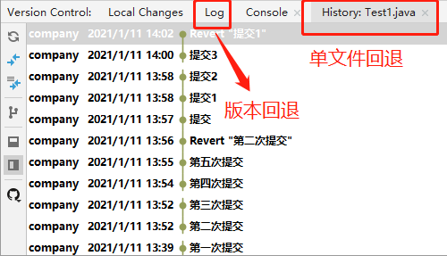
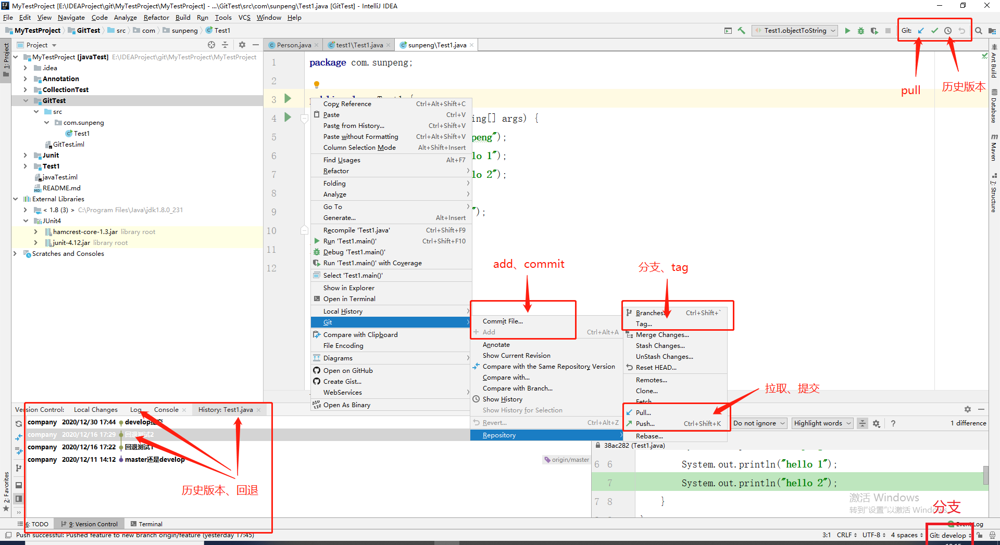
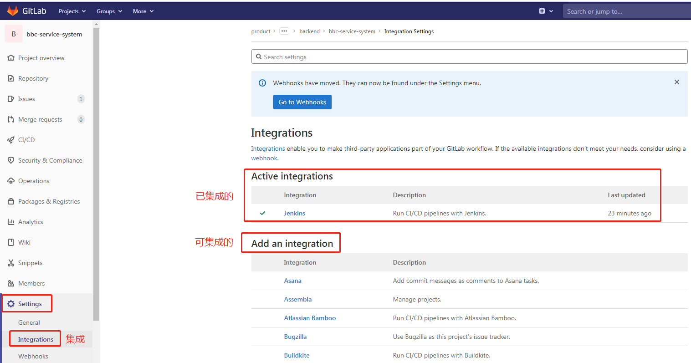
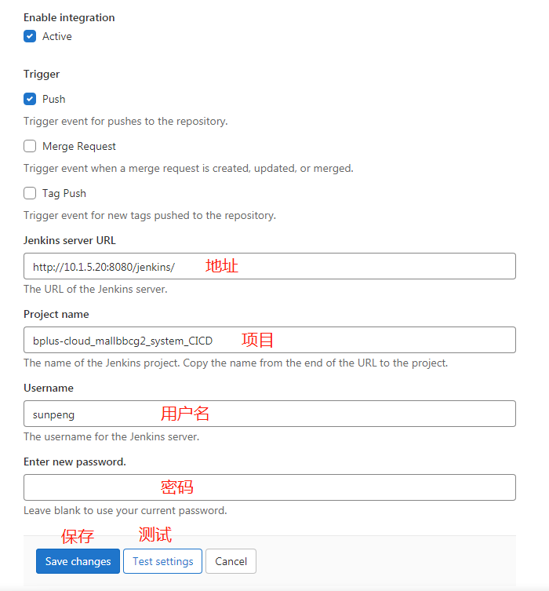
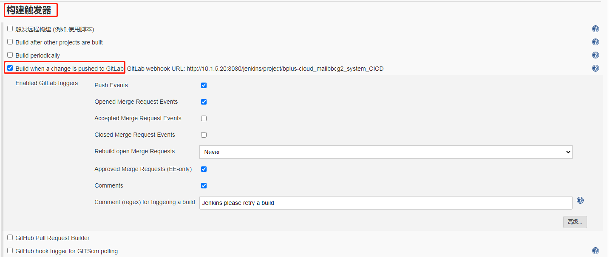

# 一、git

### 0、命令

```sh
#============================================基本===============================================
#配置user.name和user.email
git config --global user.name "sunpengHome"
git config --global user.email "476567162@qq.com"
#初始化
git init
#提交
git add
git commit
#查看状态
git status
#查看提交记录
git log
git log --oneline
git reflog
#回退
git reset --hard 版本的索引号/HEAD   #整体回退，reset（重置）
git reset --mixed 版本的索引号/HEAD  #回退本地仓库和暂存区
git reset --soft 版本的索引号/HEAD   #仅回退本地仓库
#查看差异
git  diff  无/版本索引/head  filename #比较暂存区的其它文件的目录，hard（重）
git  diff  无  filename 				#比较的本地与暂存区

#============================================分支===============================================
#查看分支
git branch
#-a  查看所有远程
#-v  查看本地分支
#-vv 查看本地分支追踪的远程分支
#增/删分支
git checkout [branchName] #切换分支
git branch (origin) [new-branchName] #新建分支，单独操作没用
git branch -u origin [branchName] #追踪远程分支，单独操作没用
git branch -d [branchName] #删除分支
git branch -D [branchName] #强制删除分支
#创建分支（创建、追踪、切换）
git checkout -b [newBranch] develop  #根据develop创建newdev分支，本地大改动时用
git checkout -b release origin/release #根据origin/release创建release分支，没什么用
git checkout -b origin/feature origin/develop #不由本地操作，而由远程操作。
git checkout -b [newBranch] tag #根据远程tag创建新分支
#所以，建议创建分支时要明确根据哪个分支创建
#合并分支
git merge [branchName]
#修改追踪的分支
git branch --set-upstream-to=origin/[remoteBranchName] [localBranchName]

#==========================================tag=================================================
git tag #查
git tag -a [new-tagname] -m ["commit"] #增
git tag -d [tagname] #删
git push origin [tagname] #推送到远程
git push origin --tag #将本地tag全部推送到远程

#=========================================remote================================================
git remote -v #查看连接
git remte set-url origin [URL] #修改url链接 
git remote rm origin #删除url链接 
git remote add origin [url] #添加url链接 

#=========================================compare 对比================================================
git compare [branchName] with [otherBranchName]
```


### 1、授权

```sh
#配置公私钥
ssh-keygen -t rsa -C "邮箱账号"  #1.生成公钥
#注意，此步系统让输入密码，建议直接回车，表示不设置密码
#2.复制公钥：复制id_rsa.pub文件中的内容
#3.配置：登录github -> setting -> SSH and GPG keys -> new SSH key ->粘贴公钥。
```


### 2、连接本地与远程

#### 2.1 创建项目

- 必须：本地仓库(init)、本地分支(master)、远程仓库(github)、远程分支(origin master)
- 不是必须的必须：远程url重命名为origin，master追踪origin master

```sh
#1.新建本地仓库
git init #
#2.创建本地分支
#创建.gitgnore文件
git add .
git commit -m "init" #提交到本地仓库，并自动创建分支本地分支master
git branch -M ${BranceName} #重命名当前分支(可选)：默认为master，分支管理时重命名develop
#3.新建远程仓库：github上创建
git remote add origin ${url} #重命名远程仓库(为远程git仓库地址起别名为origin)
git remote -v #查看
#4.创建远程分支并连接i
git push origin ${OriginBranceName} #本地推送到远程，如果远程没有此分支则自动创建，与本地同名，第一次一般为master
git branch -u origin/${OriginBranceName}#追踪远程（本地与远程建立联系）
git branch -vv #查看本地与远程分支关系
```

#### 2.2 clone

```sh
#克隆develop分支
git clone -b develop https://github.com/spsunpeng/studyNotes.git
#不指定则默认master分支，但这没有意义。

#使用ssh协议
git clone git@github.com:spsunpeng/studyNotes.git
```

- clone: 将指定的远程仓库代码拉取到本地，生成本仓库，生成一个创建（自动追踪远程分支的）本地分支

- 默认创建追踪origin/master的本地分支，-b可以指定其他分支。

- https协议克隆时不校验，push/pull时才让输入github的密码。

- ssh协议克隆时就会校验，必须先配置公私钥。

  另外，此步如果要输入密码，则是因为在配置公私钥时设置了密码，建议不要设置密码。

#### 2.3 本地远程连接

```sh
git remote -v #查看连接
git remte set-url origin [URL] #修改url链接 
git remote rm origin #删除url链接 
git remote add origin [url] #添加url链接 
```


### 3、提交

```sh
#提交
git add
git commit
#查看状态
git status
#查看提交记录
git log
git log --oneline
git reflog
#回退
git reset --hard 版本的索引号/HEAD   #整体回退，reset（重置）
git reset --mixed 版本的索引号/HEAD  #回退本地仓库和暂存区
git reset --soft 版本的索引号/HEAD   #仅回退本地仓库
#查看差异
git  diff  无/版本索引/head  filename #比较暂存区的其它文件的目录，hard（重）
git  diff  无  filename 				#比较的本地与暂存区
```


### 4、分支

#### 4.1 git

```shell
#查看分支
git branch
#-a  查看所有远程
#-v  查看本地分支
#-vv 查看本地分支追踪的远程分支

#增/删分支
git checkout develop #切换分支
git branch (origin) BranceName #新建分支，单独操作没用
git branch -u origin BranceName #追踪远程分支，单独操作没用
git branch -d develop #删除分支
git branch -D develop #强制删除分支

#创建分支（创建、追踪、切换）
git checkout -b {newdev} develop  #根据develop创建newdev分支，本地大改动时用
git checkout -b release origin/release #根据origin/release创建release分支，没什么用
git checkout -b origin/feature origin/develop #不由本地操作，而由远程操作。
#所以，建议创建分支时要明确根据哪个分支创建

#合并分支
git merge BranceName
#指定的分支并入到当前分支
```

#### 4.2 idea

- 新的分支用idea推时，会会调用创建远程分支的命令
- merge时指定的分支并入到当前分支，所以当前分支一般是develop分支。


### 5、tag

```sh
git tag #查
git tag -a [new-tagname] -m ["commit"] #增
git tag -d [tagname] #删
git push origin [tagname] #推送到远程
git push origin --tag #将本地tag全部推送到远程
```


### 6、回退

#### 6.1 git

```sh
git reset --hard {版本的索引号/HEAD}   #整体回退
git reset --mixed {版本的索引号/HEAD}  #回退本地仓库和暂存区
git reset --soft {版本的索引号/HEAD}   #仅回退本地仓库

git push -f                          #远程仓库回退,强制推送
```

HEAD指针：本地仓库每个分支上的代码的修改都会生成一个commit id信息，HEAD指针指向最近一次的commit提交，通过commit id可以进行版本回退。查看HEAD指针的改动日志为git reflog

#### 6.2 idea



- LOG/History
  - LOG：版本回退，和git的指令一样
  - History：单文件回退，对单个文件的回退，git可能也有相关指令
- 回退位置：回退到这个节点初始
- 回退注意事项：如果加入回退到多个额版本，此时大概率会产生冲突，所以：
  - 尽量选择单文件回退

  - 回退一个版本：不会产生冲突
  - 回退几十个版本：新建分支或tag，然后再回退，解决冲突时直接选择“right”


### 7、冲突

#### 7.1 git


#### 7.2 idea


### 8、idea集成git




#### 8.1 gitgnore

- 空行或是以#开头的行即注释行将被忽略；
- 以斜杠 “/” 结尾表示目录；
- 以星号 “*” 通配多个字符；
- 以问号 “?” 通配单个字符
- 以方括号 “[]” 包含单个字符的匹配列表；
- 以叹号 “!” 表示不忽略(跟踪)匹配到的文件或目录；
- 可以在前面添加斜杠 “/” 来避免递归,下面的例子中可以很明白的看出来与下一条的区别。

公司项目中的配置

```
##############自定义
/src/main/resources/application.properties
/src/main/resources/logback.xml
/src/test/
```


### 9、注意

- 先commit再切换分支：一般在什么分支上commit则算这个分支的版本 ，而非在哪个分支上修改，不过很容易出错。
- idea回退
  - 尽量选择单文件回退
  - 回退一个版本：不会产生冲突
  - 回退多个版本：由于中间版本的影响，产生的冲突需要merge
  - 回退几十个版本：新建分支或tag，然后再回退，解决冲突时直接选择“right”


# 二、gitlab

### 1、gitlab集成jenkins

- gitlab集成jenkins



- 新增集成



- jenkins配置：构建触发器




