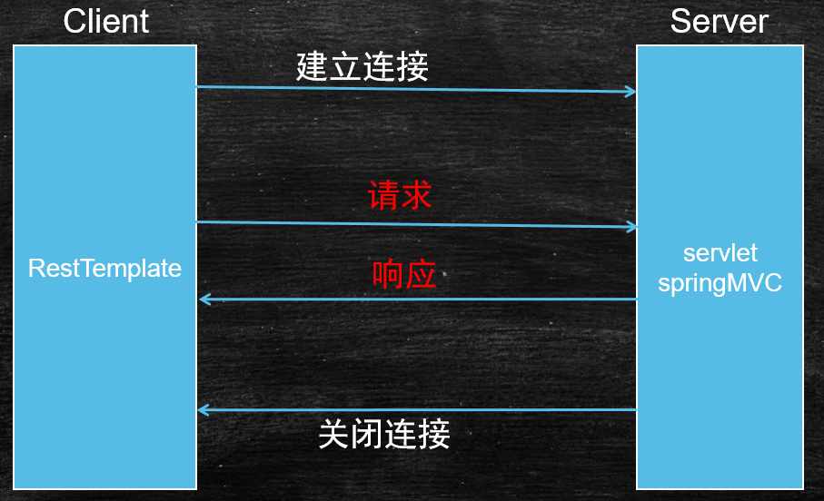
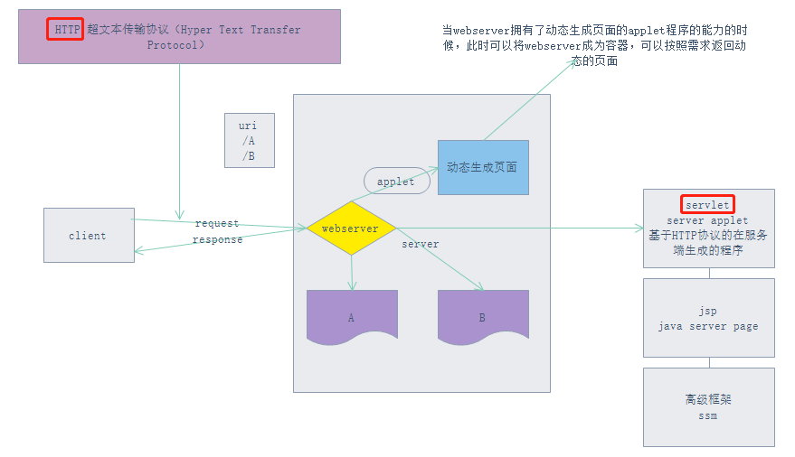
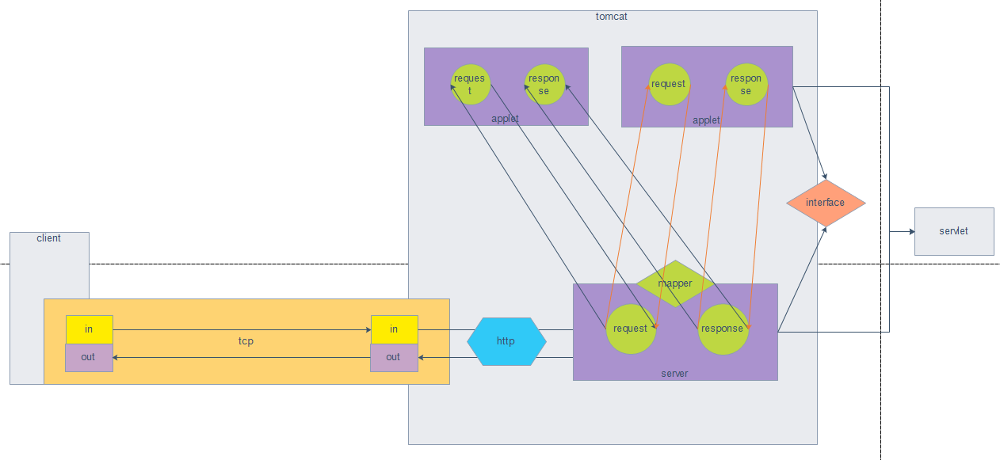
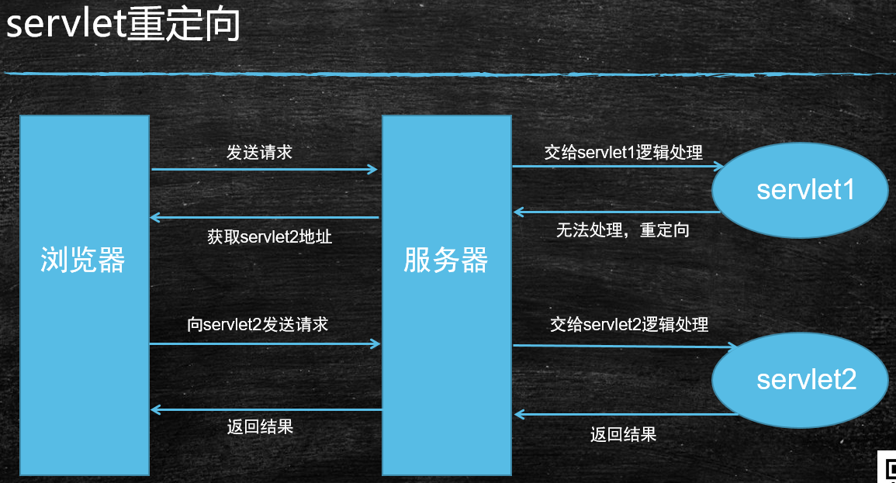

### 前言

代码：git@github.com:spsunpeng/javaWeb.git


### 一、以前

#### 1、概念

- 文本交互语言：由文本和标记符组成，文本是内容，标记符是就是标记。如HTML，标记可以告诉浏览器如何显示文本（如：文字如何处理，图片如何排版）。

- HTML：页面内容，是文本标记语，标记可以告诉浏览器如何显示文本。

- CSS：页面布局，是层叠样式表单。是用于(增强)控制网页样式并允许将样式信息与网页内容分离的一种标记性语言。 增强html的功能

- jsp：动态页面

- javaScript：交互性（信息动态交互）、安全性（不允许直接访问本地硬盘）、跨平台性（只要是可以解释JS的浏览器都行，和平台无关）

- Query：js最常用的类库

- xml: 可扩展标记语言，可扩展的意思是可以自定义标签 ，用来保存数据而且这些数据有自我描述性，也可以作为项目或模块的配置 文件

- javaWeb: 所有通过java语言编写，可以通过浏览器访问的程序的总称

- Servlet：server applet
  - Servlet是javaEE的规范之一。规范就是接口。
  - Servlet是javaWeb三大组件之一，三大组件：Servlet程序、Filter过滤器、Listener监听器。
  - Servlet是运行再服务器上的程序，可以接受和相应客户端的请求。

- Tomcat：常用的web服务器。Tomcat =  Servlet支持 + jsp支持 + javaWeb容器


#### 2、Static Web项目

##### 2.1 新建项目

- idea -> new -> project -> Static Web ->  Static Web

##### 2.2 HTML

右键项目名 -> 新建HTML

```HTML
<!DOCTYPE html> <!--约束声明-->
<html lang="zh_CH"> <!--标签：表示开始，lang="en"表示语言是中文-->
<head> <!--标签：表示网页的标题-->
    <meta charset="UTF-8">
    <title>标题</title>
</head>
<body> <!--标签：表示主体-->
    hello
    <button onclick="alert('提示内容')">按钮</button> <!--标签：按钮-->
    上面<br/>下面 <!--单标签：换行-->
</body>
</html>
```

- 单标签：<单标签/>

- 双标签：<双标签头></双标签尾>


#### 3、tomcat

- 下载安装：http://tomcat.apache.org ，然后直接解压

##### 3.1 访问静态资源

1. 将静态资源放到webapps目录下

2. 启动 tomcat ：【双击】bin /startup.bat

3. 访问：127.0.0.1:8080/路径/资源，资源是html、jsp等文件，缺省为index.jsp

##### 3.2 访问动态（运行war）

- 可能是把war包放到webapps，然后再启动运行。（已无用）


#### 4、servlet项目

##### 4.1 新建工程

- 方法一：new Project/Model -> Java Enterprise，选择Tomcat，选中Web Application（简单，因为Enterprise是企业版） 

- 方法二：平民版

  - 新建项目：new Project/Model -> Java，选中Web Application 

  - 启动类：file -> settins -> bulid -> Applicaton server -> '+' -> Tomcat Server -> 选择Tomcat 安装的路径

  

  - 导包：servlet.jar、jsp.jar

  

##### 4.2 继承HttpServlet

```java
public class HelloServlet extends HttpServlet {

    @Override
    protected void doGet(HttpServletRequest req, HttpServletResponse resp) throws ServletException, IOException {
        String username = req.getParameter("username");
        req.getSession().setAttribute("username", username);
        //转发
        req.getRequestDispatcher("index.jsp").forward(req, resp);
    }

    @Override
    protected void doPost(HttpServletRequest req, HttpServletResponse resp) throws ServletException, IOException {
        doGet(req, resp);
    }
}

```

##### 4.3 web.xml配置 

```xml
    <servlet>
        <servlet-name>helloServlet</servlet-name>
        <servlet-class>com.mahsibing.Controller.HelloServlet</servlet-class>
    </servlet>
    
    <servlet-mapping>
        <servlet-name>helloServlet</servlet-name>
        <url-pattern>/hello</url-pattern>
    </servlet-mapping>
```

##### 4.4 index.hsp视图 

```jsp
<html>
  <head>
    <title>$Title$</title>
  </head>
  <body>
  ${username}
  </body>
</html>
```


### 二、javaEE

#### 1、web和tomcat

- 场景：web，浏览器和服务器之间传输数据

- http：超文本传输协议。解决不同浏览器向服务器传输数据时的差异

- servlet：Server applet，web的小服务程序。解决动态(实时)数据相应的问题，固定的页面可以直接返回，但多数情况都不是预想配置好的页面，这时就需要将数据转化为页面，这个转化的功能就叫Server applet。

  java与网络



##### 1.1 http请求报文


##### 1.2 http响应报文


##### 1.3 客户端到服务端



##### 1.4 myTomcat




##### 1.5 jsp

- jsp：Java Server Pages，java服务器页面，是一种动态网页开发技术。它**使用JSP标签在HTML网页中插入Java代码**。（java代码与html页面的交互）

作用1：帮助浏览器转发，并且可以设置访问方式

页面访问：127.0.0.1/method.jsp

转发：127.0.0.1/method（post方法）

method.jsp

```jsp
<html>
<head>
    <title>Title</title>
</head>
<body>
    <form action="method" method="post">
        <input type="submit" value="转发">
    </form>
</body>
</html>
```

#### 2、servlet

404 资源错误

405 请求方法错误

500 服务内部错误

HttpServlet源码中也是通过service调用doGet/doPost

##### 2.1 request

```java
//请求行
request.getMethod();      // 请求方式：GET
request.getRequestURL();  // 完整地址：http://localhost:8090/servlet/request
request.getRequestURI(); // 资源路径：/servlet/request
request.getScheme();     // 请求协议：http

//请求头
request.getHeader("Accept");
Enumeration<String> headerNames = request.getHeaderNames();
while (headerNames.hasMoreElements()){
    String key = headerNames.nextElement();
    String value = request.getHeader(key);
    System.out.println(key+":"+value);
}

//请求体
request.getParameter("name");
Enumeration<String> parameterNames = request.getParameterNames();
while (parameterNames.hasMoreElements()){
    String key = parameterNames.nextElement();
    String[] parameterValues = request.getParameterValues(key); //允许key重复
    for(String value : parameterValues){
        System.out.print(key+": "+value+ " ");
    }
}

//获取远程地址、ip、端口号
request.getRemoteAddr();  //获取远程地址
request.getRemoteHost(); //ip
request.getRemotePort(); //端口号
request.getLocalAddr();  //获取本地地址

```

##### 2.2 response

```java
//相同key，后面的会覆盖
resp.setHeader("name", "sunpeng");
resp.setHeader("name", "sunyue");
//key可以重复
resp.addHeader("like", "nv");
resp.addHeader("like", "neinv");

//响应体和响应体的格式
resp.setHeader("Content-Type","text/plain");
//resp.sendError(404, "not found");
resp.getWriter().write("<b>java is easy</b>");
```

##### 2.3 乱码

```java
request.setCharacterEncoding("utf-8");
response.setCharacterEncoding("gbk");
```


#### 3、请求转发和重定向

##### 3.1 请求转发

```java
request.getRequestDispatcher("hello").forward(req, resp);
```


- 共享数据

  ```java
  request.setAttribute("key", value);
  request.getAttribute("key");
  ```

##### 3.2 重定向

```java
response.sendRedirect("hello");
```



##### 3.3 请求转发和重定向

|              | 请求转发                  | 重定向                                           |
| ------------ | ------------------------- | ------------------------------------------------ |
| 定义         | 服务区转到给另一个servlet | 服务区重定向一个地址返回给客户端，再由客户端访问 |
| 请求次数     | 1                         | 2                                                |
| 地址栏信息   | 不变                      | 变话                                             |
| 是否共享数据 | 是                        | 否                                               |
| 跳转限制     | 本站资源                  | 任意url                                          |
| 发生行为     | 服务端                    | 客户端                                           |

#### 4、servlet的数据交互技术

##### 4.1 cookie

- 作用：解决客户端发送多次请求且需要相同的请求参数的时候

- Cookie是一种在服务端生成，在客户端保持HTTP状态信息的技术，通过请求头和响应头以key-value形式传输
- 一个web站点可以给浏览器发送多个cookie，一个浏览器也可以存储多个站点的cookie

```java
//创建cookie
Cookie cookie = new Cookie("002", "xian"); //创建cookie
cookie.setPath("/cookie/getCookie");       //设置路径，不然不同网站之间的cookie就混乱了
cookie.setMaxAge(7*24*3600);   //设置过期时间，不设置会保存在内存中，一关闭浏览器就会消失
response.addCookie(cookie);            

//获取cookie
Cookie[] cookies = request.getCookies();
if(cookies != null){
    for(Cookie cookie : cookies){
        String name = cookie.getName();
        String value = cookie.getValue();
        System.out.println(name+":"+value);
    }
}
```

##### 4.2 session

- 作用：解决相同用户发送不同请求时的数据共享问题
- 特点
  - 服务器端存储共享数据的技术
  - session需要依赖cookie技术
  - 每个用户对应一个独立的session对象
  - 每个session对象的有效时长是30分钟
  - 每次关闭浏览器的时候，重新请求都会开启一个新的session对象，因为返回的JSESSIONID保存在浏览器的内存中，是临时cookie，所以关闭之后自然消失
- 使用
  - session的id是自动生成的，不用自己管理
  - 初次生成：Set-Cookie: JSESSIONID=00134762B4551AFC08FC4ECFFF56CD17; Path=/session; HttpOnly

```java
HttpSession session = request.getSession();
session.setAttribute("name", "sunpeng");  
String str = (String)session.getAttribute("name");
```

##### 4.3 servletContext

- 作用特点：解决不同用户需要在服务端共享数据

  - 由服务器创建，每一个web项目对应的是一个ServletContext

   *          所有用户共享同一个ServletContext对象

- 使用

```java
//创建ServletContext
ServletContext servletContext = this.getServletContext();

//创建key-value
servletContext.setAttribute("101", "beijing");
//获取key-value
String str = (String)servletContext.getAttribute("101");

//获取web,xml中配置的公共属性，设置见下xml文件
String str1 = servletContext.getInitParameter("shanxi");
//获取web,xml中配置的全部公共属性，设置见下xml文件
Enumeration<String> initParameterNames = servletContext.getInitParameterNames();
while (initParameterNames.hasMoreElements()){
    String key = initParameterNames.nextElement();
    String value = servletContext.getInitParameter(key);
    System.out.println(key+":"+value);
}

//获取某个文件的绝对路径
String path = servletContext.getRealPath("web.xml");
//获取web项目的上下文路径（资源路径）
String path2 = servletContext.getContextPath(); // 结果：/servletContext 
```

xml中配置的公共属性

```xml
<context-param>
    <param-name>shanxi</param-name>
    <param-value>xian</param-value>
</context-param>
```

##### 4.4 servletConfig

- 作用特点：解决同一个用户需要在服务端共享数据

- 使用

```java
//创建ServletConfig
ServletConfig servletConfig = this.getServletConfig();

//获取自己单独的属性配置，创建见下面的xml配置
String str = servletConfig.getInitParameter("shanxi");
//获取自己单独的所有属性配置，创建见下面的xml配置
Enumeration<String> initParameterNames = servletConfig.getInitParameterNames();
while (initParameterNames.hasMoreElements()){
    String key = initParameterNames.nextElement();
    String value = servletConfig.getInitParameter(key);
    System.out.println(key+":"+value);
}
```

xml配置

```xml
<servlet>
    <servlet-name>servletConfig</servlet-name>
    <servlet-class>com.mashibing.ServletConfigServlet</servlet-class>
    <init-param>
        <param-name>shanxi</param-name>
        <param-value>xian</param-value>
    </init-param>
    <init-param>
        <param-name>hebei</param-name>
        <param-value>shijiazhuang</param-value>
    </init-param>
</servlet>
<servlet-mapping>
    <servlet-name>servletConfig</servlet-name>
    <url-pattern>/servletConfig</url-pattern>
</servlet-mapping>
```

##### 4.5 总结

| 技术         | cookie                            | session              | servletContext | servletConfig |
| ------------ | --------------------------------- | -------------------- | -------------- | ------------- |
| 数据存储位置 | 客户端（服务端设置）              | 客户端（依赖cookie） | 服务端         | 服务端        |
| 用户         | 共享(无用，不同用户的key恰好一样) | 不共享               | 共享           | 不共享        |
|              |                                   |                      |                |               |

#### 5、过滤器和监听器

##### 5.1 过滤器

###### 5.1.1 代码

- 实现Filter接口：初始化、执行、销毁

- filterChain.doFilter(servletRequest, servletResponse); 表示执行下一个过滤器(根据配置文件中过滤器的顺序)或者servlet

- servletRequest/servletResponse 和 request/response相似，对于没有的方法可以强转，比如

  ((HttpServletResponse)servletResponse).sendRedirect("login.jsp");

```java
public class EncodeFilter implements Filter {
    @Override
    public void init(FilterConfig filterConfig) throws ServletException {
        System.out.println("这是编码过滤器的init");
    }

    @Override
    public void doFilter(ServletRequest servletRequest, ServletResponse servletResponse, FilterChain filterChain) throws IOException, ServletException {
        System.out.println("这是编码过滤器的执行");
        servletRequest.setCharacterEncoding("utf-8");
        servletResponse.setContentType("text/html;charset=utf-8");
        //执行下一个过滤器(根据配置文件中过滤器的顺序)或者servlet
        filterChain.doFilter(servletRequest, servletResponse);
        System.out.println("这是编码过滤器的执行完成");
    }

    @Override
    public void destroy() {
        System.out.println("这是编码过滤器的销毁");
    }
}
```

###### 5.1.2 过滤器的配置文件

- 执行顺序：过滤器的执行顺序是根据配置文件中过滤器的顺序，猜测有标签可以设置

- 指定过滤请求
  - /*: 匹配所有请求*
  - *.do:  匹配所有后缀为do的请求
  - /filter.do :匹配请求为filter.do的请求

```xml
<!--过滤器的执行顺序是根据配置文件中过滤器的顺序，猜测有标签可以设置-->
    <filter>
        <filter-name>EncodeFilter</filter-name>
        <filter-class>com.mashibing.filter.EncodeFilter</filter-class>
    </filter>
    <filter-mapping>
        <filter-name>EncodeFilter</filter-name>
        <url-pattern>/*</url-pattern>
    </filter-mapping>

    <filter>
        <filter-name>LoginFilter</filter-name>
        <filter-class>com.mashibing.filter.LoginFilter</filter-class>
    </filter>
    <filter-mapping>
        <filter-name>LoginFilter</filter-name>
        <url-pattern>*.do</url-pattern>
    </filter-mapping>
```

##### 5.2 监听器

###### 5.2.1 ServletRequest

- 接口

  - ServletRequestListener：监听request对象的创建和销毁

    - requestDestroyed  request对象销毁时添加的逻辑代码

    - requestInitialized request对象创建时添加的逻辑代码

  - ServletRequestAttributeListener：监听request作用域属性的添加，删除和更改

    - attributeAdded   属性添加时要做的事情

    - attributeRemoved  属性删除时要做的事情

    - attributeReplaced    属性更改时要做的事情

- 代码

```java
package com.mashibing.listener;

import javax.servlet.ServletRequestAttributeEvent;
import javax.servlet.ServletRequestAttributeListener;
import javax.servlet.ServletRequestEvent;
import javax.servlet.ServletRequestListener;


public class ListenerRequest implements ServletRequestListener, ServletRequestAttributeListener {

    @Override
    public void requestDestroyed(ServletRequestEvent sre) {
        System.out.println("request对象被销毁");
    }

    @Override
    public void requestInitialized(ServletRequestEvent sre) {
        System.out.println("request对象被创建");
    }

    @Override
    public void attributeAdded(ServletRequestAttributeEvent srae) {
        String key = srae.getName();
        Object value = srae.getValue();
        Object source = srae.getSource();
        System.out.println("request作用域中添加数据："+"key="+key+", "+"value="+value+", "+"source="+source);
    }

    @Override
    public void attributeRemoved(ServletRequestAttributeEvent srae) {
        String key = srae.getName();
        Object value = srae.getValue();
        Object source = srae.getSource();
        System.out.println("request作用域中删除数据："+"key="+key+", "+"value="+value+", "+"source="+source);
    }

    @Override
    public void attributeReplaced(ServletRequestAttributeEvent srae) {
        String key = srae.getName();
        Object value = srae.getValue(); //修改前原有的值
        Object source = srae.getSource();
        System.out.println("request作用域中修改数据："+"key="+key+", "+"value="+value+", "+"source="+source);
    }

}
```

- 配置xml

  ```xml
  <listener>
      <listener-class>com.mashibing.listener.ListenerRequest</listener-class>
  </listener>
  ```

###### 5.2.2 ServletContext

- 接口：ServletContextListener、ServletContextAttributeListener

###### 5.2.3 HttpSession

- 接口：HttpSessionListener、HttpSessionAttributeListener、

  ​			HttpSessionActivationListener、HttpSessionBindingListener


## 三、补充

#### 1、状态码

| 状态码 | 定义                                         |
| ------ | -------------------------------------------- |
| 400    | 参数错误（可能是参数类型，也可能是必传字段） |
| 401    | 未授权（一般是header的token错误）            |
| 403    | 权限不足（一般是header的token错误）          |
| 404    | 未找到资源（url错误）                        |
| 405    | 方法错误（method错误）                       |
| 500    | 服务内部错误                                 |
|        |                                              |


