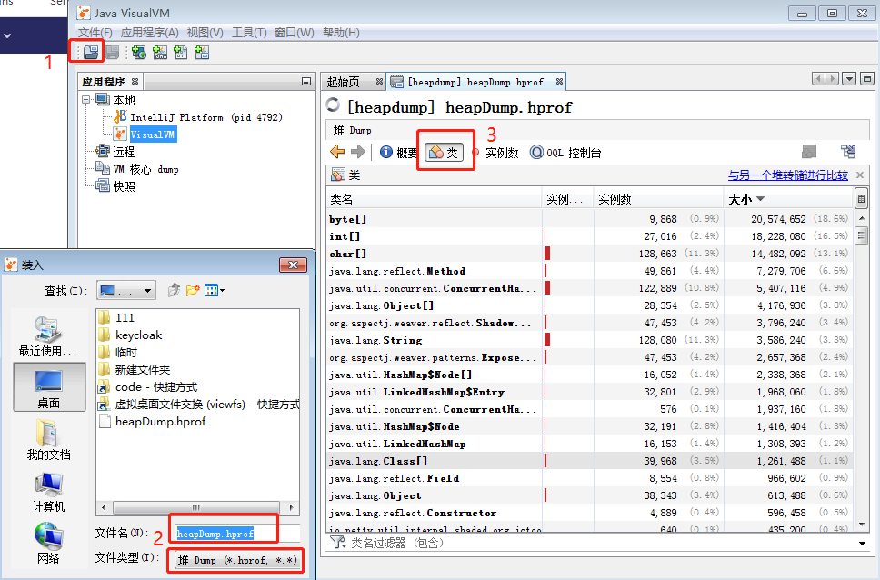
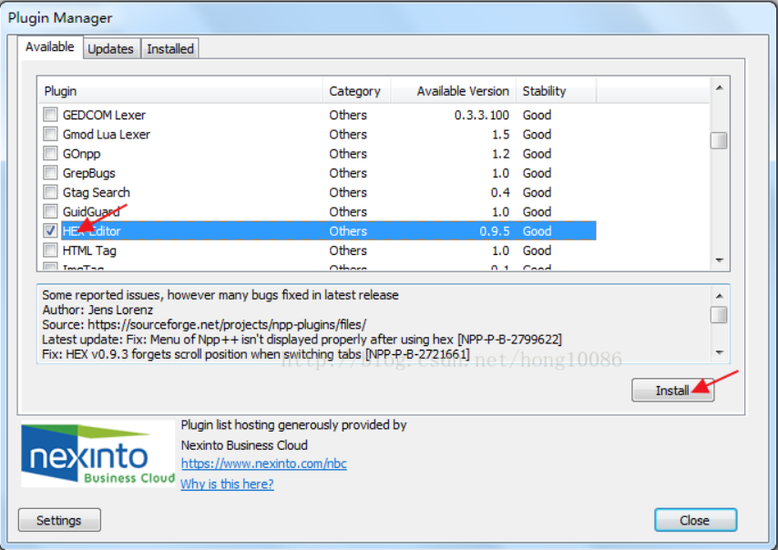
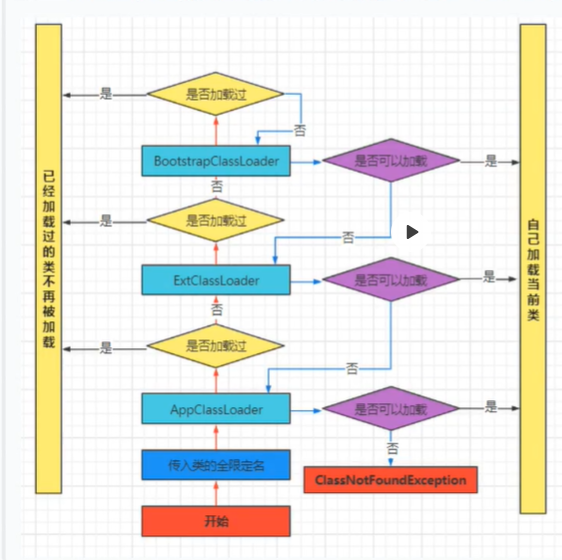
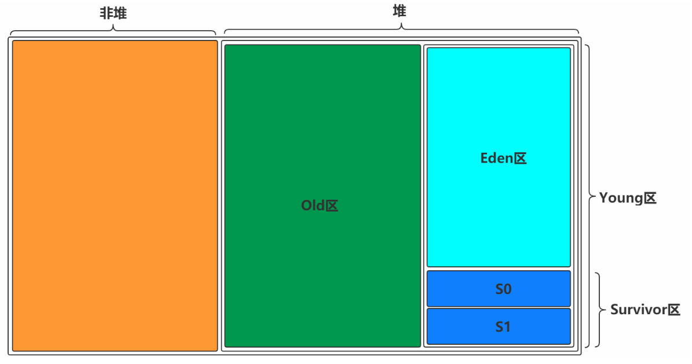
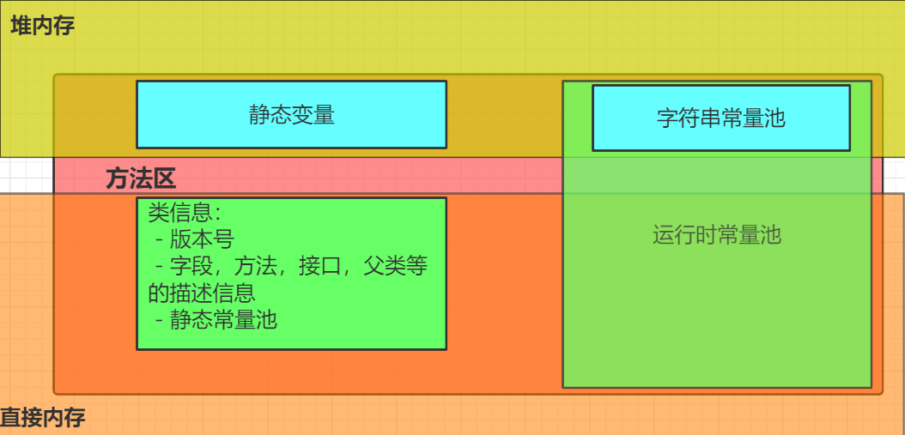
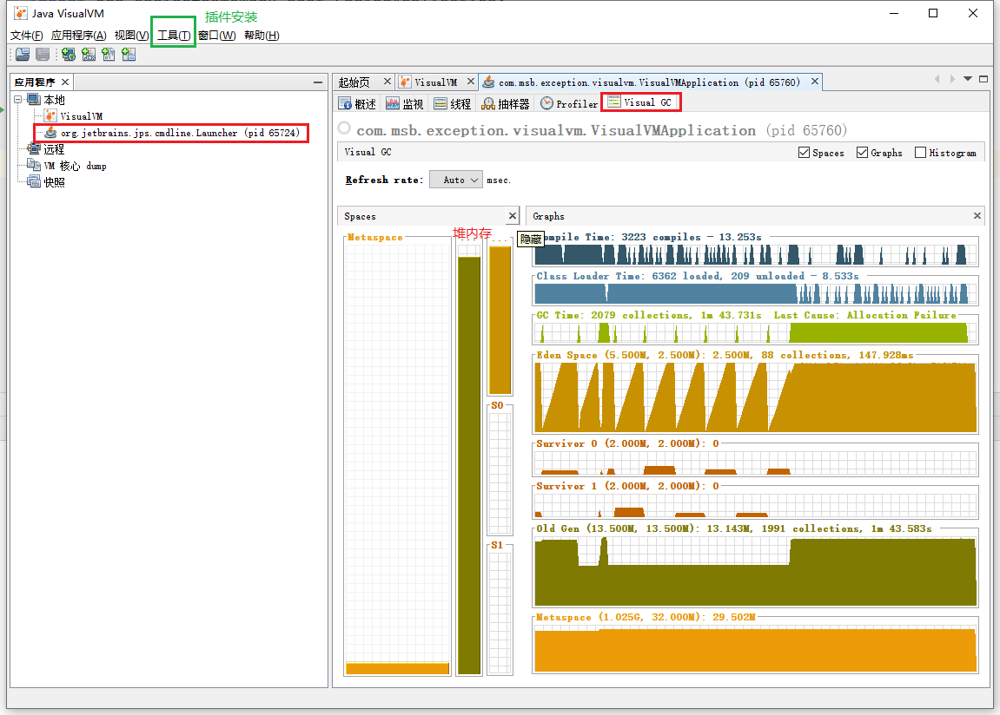
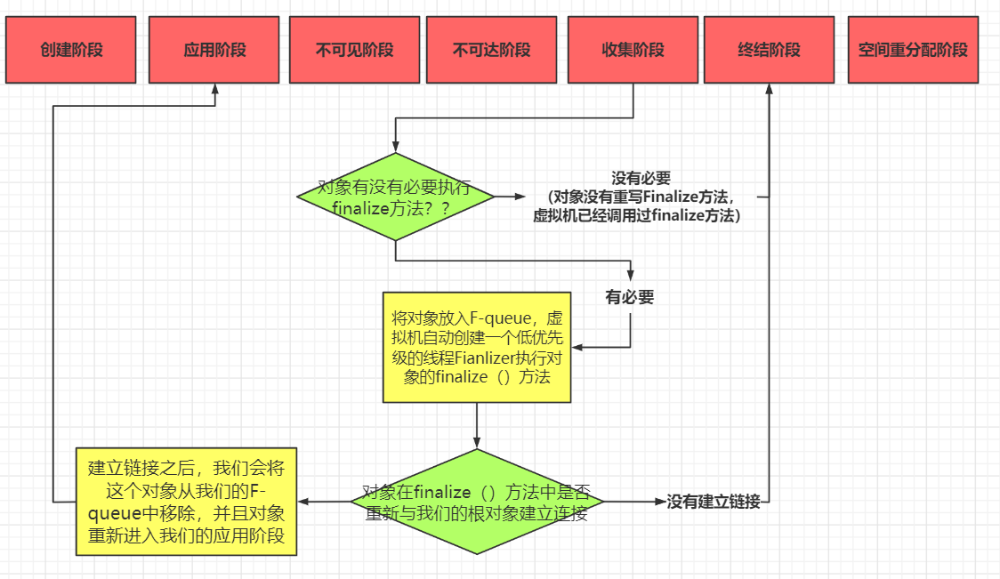
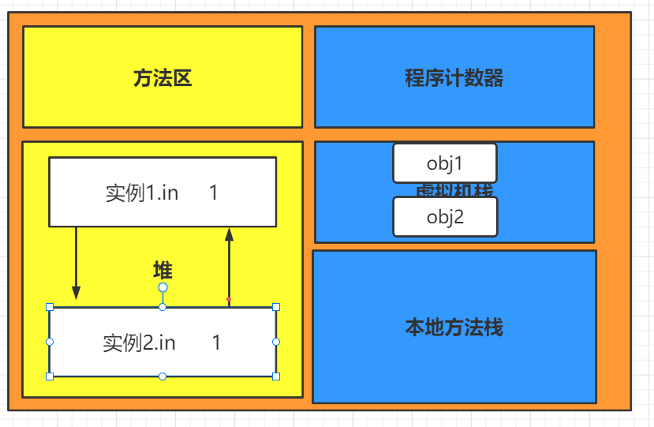

# 0、命令

```sh
#==================================================java=================================================
 java -XX:+PrintCommandLineFlags -version
 java -XX:+PrintFlagsFinal -version | grep :

javac Person.java #编译，得到二级制文件
java Person #执行，注意执行的不是Person.class文件，而是Person的全限定名
javap -v -p Person.class >Person.txt #转化为类汇编语言

java com.msb.HelloWord #需要放到包com/msb下，程序才能执行

#=================================================jinfo=================================================
 jinfo -flags [pid]


#=================================================jstat=================================================
 jstat -gcutil [pid]
 jstat -gc [pid]
 

#=================================================jstack=================================================


#=================================================jmap=================================================
jmap -dump:format=b,file=/dump.hprof [pid] #生成所有对象的堆文件
jmap -dump:live,format=b,file=/dump.hprof [pid] #生成存活对象的堆文件，一定会导致gc(既然都标记出来了，不就顺手清理了)
jmap -heap [pid] #打印堆信息

```


# 1、知识点

#### 容器中取出dump.hprof文件

```sh
#容器
jps #查看当前运行的java进程
jmap -dump:live,format=b,file=/dump.hprof [pid] #生成堆文件
jmap -heap [pid] #打印堆信息

#容器宿主机（服务器）
docker ps | grep "address"
docker cp [commit-id]:/dump.hprof ./ #将容器内的文件复制到宿主机上

#本机
#使用xftp等工具将文件复制到本机上
/jdk1.8.0_231/bin/jvisualvm.exe #使用管理员的身法打开jvisualvm
#打开dump.hprof文件
#选择类
```




#### JVM

- java  ->  java 8.0

- jdk -> 1.8
- jre

- jvm ：java虚拟机，跨语言跨平台
  - 相当于操作系统，执行class文件，只要是能编译成class文件的都可以在jvm上运行
  - 是一种规范 HotSpot是主流用的，由oracle提供，8.0后估计要收费


#### class文件

- 打开：

  - 2进制文件

  - 普通文本文件打开时乱码的，需要专门的2进制文件查看器才能查看，比如 ：

    idea的插件：BinED

    notepag的插件：HEX-Editor

  - 反编译：idea生成的out目录下的文件就是2进制文件，但双击打开并不是直接打开，二十反编译再打开

    常用的反编译软件还有，idea...


其实并不是因为有javac将Java源码编译成class文件，才说Java属于编译+解释语言，因为在这个编译器编译之后，生成的类文件不能直接在对应的平台上运行。 那为何又说Java是编译+解释语言呢？因为class文件最终是通过JVM来翻译才能在对应的平台上运行，而这个翻译大多数时候是解释的过程，但是也会有编译，称之为运行时编译，即JIT(Just In Time)。 综上所述，Java是一门编译型+解释型的高级语言。


#### notepad++ 查看二级制文件

安装插件

notepad++ --> 插件 --> Plugin Manager --> show plugin manager




使用插件

notepad++打开二级制文件 --> 插件 --> HEX-Editor --> View in HEX

切换2进制/8进制/16进制

notepad++ --> View in --> 切换格式


#### 编译命令

```sh
javac Person.java #编译，得到二级制文件
java Person #执行，注意执行的不是Person.class文件，而是Person的全限定名
javap -v -p Person.class >Person.txt #转化为类汇编语言
```


java二级制文件（.class）文件查看方式

- 用相关软件或插件打开，得到二进制或16机制文件
- 转化为类汇编语言打开，用javap -v命令，它保留了机器语言的加载方式和顺序，同时让程序员可以大致阅读所以汇编语言是对机器友好的语言。
- 用反编译软件打开。相比源代码进行了优化，专业的反编译软件会保留行号，而idea加载的jar包不会，排查bug需要注意。


#### 编译

类加载-准备阶段

static final: ConstantValue 

static 只开辟空间，为0

变量：在对象初始化时才分配空间


类加载：装载，链接，初始化

虚拟机把Class文件加载到内存 并对数据进行校验，转换解析和初始化 形成可以虚拟机直接使用的Java类型，即java.lang.Class


处理：类，对象（入口），字段，方法（程序），静态量（类名，字段，方法名）


- 装载
  - 通过类的全限定名获取二级制字节流，在jvm外部实现，这个模块叫类加载器
  - 将字节流所代表的静态存储结构转化为方法区运行时的数据结构。（加载到内存对应的位置上）
  - 在java堆中生成一个代表这个类的java.lang.class对象，作为方法区中这些数据的访问入口
- 链接
- 初始化
- 使用
- 卸载


获取类的二进制字节流的阶段是我们JAVA程序员最关注的阶段，也是操控性最强的一个阶段。因为这个阶段我 们可以对于我们的类加载器进行操作，比如我们想自定义类加载器进行操作用以完成加载，又或者我们想通过 JAVA Agent来完成我们的字节码增强操作。


1）Bootstrap ClassLoader 负责加载$JAVA_HOME中 jre/lib/rt.jar 里所有的class或Xbootclassoath选项指定的jar包。由C++实现，不是ClassLoader子类。

 2）Extension ClassLoader 负责加载java平台中扩展功能的一些jar包，包括$JAVA_HOME中jre/lib/*.jar 或 -Djava.ext.dirs指定目录下的jar包。 

3）App ClassLoader 负责加载classpath中指定的jar包及 Djava.class.path 所指定目录下的类和jar包。

4）Custom ClassLoader 通过java.lang.ClassLoader的子类自定义加载class，属于应用程序根据自身需要自定义的ClassLoa


#### 声明周期

- 编译（.java -> .class）

  - 词法解析，语法解析，语义解析
  - 代码生成器，得到得到二级制文件.class：版本信息，常量池，字段表集合，方法表集合

- 装载

  - 过一个类的全限定名获取定义此类的二进制字节流

  - 将这个字节流所代表的静态存储结构转化为方法区的运行时数据结构，方法区：类信息，静态变量，常量

  - 在Java堆中生成一个代表这个类的java.lang.Class对象。 堆：代表被加载类的java.lang.Class对象

- 链接

  - 校验（校验程序合法性）
  - 准备（为所有数据初始化为0，对比C++，rodata在编译阶段，data在此阶段，但是java并不初始化，和bos一样）
  - 解析（为符号分配内存地址）

- 初始化

  - 使用时初始化

- 运行

  - 使用：使用时初始化
  - 卸载 
    - 该类所有的实例都已经被回收，也就是java堆中不存在该类的任何实例。 
    - 加载该类的ClassLoader已经被回收。 
    - 该类对应的java.lang.Class对象没有任何地方被引用，无法在任何地方通过反射访问该类的方 法。


#### 类加载器





多个类加载器：解决同名类加载的问题


SPI全称Service Provider Interface，是Java提供的一套用来被第三方实现或者扩展的API，它可以用来启用框架扩展和替换组件。


全盘委托

双亲委派

缓存

从下往上：找缓存

从上往下：找类


“双亲委派”机制只是Java推荐的机制，并不是强制的机制。 我们可以继承java.lang.ClassLoader类，实现自己的类加载器。

如果想保持双亲委派模型，就应该重写findClass(name)方法；

如果想破坏双亲委派模型，可以重写loadClass(name)方法。


#### 运行

运行时数据区：

方法区

堆

虚拟机栈

本地方法栈

程序计数器


多线程就有对应的多个虚拟机栈，controller每个请求来时就会开辟一个栈

一个栈有多个栈帧，从入口（main）方法中进入，每调用一个方法开辟一个栈帧，每执行完一个方法就回退一个栈帧

栈帧的执行按理说应该和C++一样？？？


Object o1= new Object;

Object static o2 = new Object;

对象o1这个名字存在栈中，对象内容存在堆中

对象o2这个名字存到方法区，对象内容存在堆中


#### 二进制

bit： [bɪt] ，位，比特位

byte：[baɪt]，b，字节，1byte = 8bit

kb：1kb = 1000b

字符：根据编码格式不同所占存储大小不同

ASCII码：一个字符占一个字节的空间。换算为十进制 ，最小值-128，最大值127。如一个ASCII码就是一个字节。

Unicode编码：一个英文字符（大小写英文字母和标点）等于两个字节，一个中文（简体，繁体，标点）等于两个字节。

UTF-8编码：一个英文字符（大小写英文字母和标点）等于一个字节，一个中文（简体，繁体，标点）等于三个字节。

类型

short：2个字节，范围 2^16

int：4个字节，4×8=32位，表示范围 2^32 --->  -32768～32767 

long：8个字节，范围 2^64


正负数

- 正数：首位是0
- 负数：首位是1


补码

- 正数的补码是本身，负数的补码是反码加一。

- 但是“反码加一”只是补码所具有的一个性质，不能被定义成补码。负数的补码，是能够和其相反数相加通过溢出从而使计算机内计算结果变为0的二进制码。
- 所以补码是为了解决：二级制 正数+负数=0
- 补码的补码是源码


异或^

- 相同取0，不同取1

- 与0000异或不变：0101 ^ 0000 = 0101
- 与1111异或等于取反：0101 ^ 1111 = 1010
- 异或的异或等于原数：0101 ^ 1100 = 1001,  1001 ^ 1100 = 0101


| 16进制                   | 0X01          | 0X02      | 0X03      | 0X04      |
| ------------------------ | ------------- | --------- | --------- | --------- |
| 小端 16进制 short s = 1  | **01**        | 00        | 00        | 00        |
| 大端 16进制 short s = 1  | 00            | 00        | 00        | 01        |
|                          |               |           |           |           |
| 小端 16进制 short s = -1 | 01            | 00        | 00        | 80        |
| 大端 16进制 short s = -1 | 80            | 00        | 00        | 01        |
| 大端 2进制 short s = -1  | **1000 0000** | 0000 0000 | 0000 0000 | 0000 0001 |


java中使用的是大端存储，操作系统一般用的是小端存储，C/C++的存储与编译平台所在的CPU相关。


**小端存储** :便于数据之间的类型转换，例如:long类型转换为int类型时，高地址部分的数据可以直接截掉。起码正数是这样的，负数总不能把符号位截取了吧？

**大端存储** :便于数据类型的符号判断，因为最低地址位数据即为符号位，可以直接判断数据的正负号。


32位电脑表示内存寻址是32位，寄存器是32位，cpu是32位，操作系统是32位。32位 = 4字节，地址范围是 0 ~ 2^32  = 4G，所以32位操作系统的内存最大为4G。

64位操作系统同理，64位，地址范围 0 ~ 2^64 = 64G，所以64位操作系统最大内存位 64G？


#### cpu

cpu：运算器，控制器，寄存器

运算器：集成加减乘除等逻辑运算单元

寄存器

- **eax**: 通常用来执行加法，函数调用的返回值一般也放在这里面
- **ebx**: 数据存取
- **ecx**: 通常用来作为计数器，比如for循环
- **edx**: 读写I/O端口时，edx用来存放端口号
- **esp**: 栈顶指针，指向栈的顶部
- **ebp**: 栈底指针，指向栈的底部，通常用`ebp+偏移量`的形式来定位函数存放在栈中的局部变量
- **esi**: 字符串操作时，用于存放数据源的地址
- **edi**: 字符串操作时，用于存放目的地址的，和esi两个经常搭配一起使用，执行字符串的复制等操作


#### 内存

java对象内存布局

- 对象头

  - Mark Word  8个字节(64位系统)

    - 哈希码：对象的唯一编码

    - 分代年龄：gc时用的

    - 锁的状态

  - Class Pointer：指向对象对应的类型数据的内存地址（方法区类方法的地址）， 8个字节(64位系统)
  - Length：数组长度

- 实例数据：成员变量

- 对齐填充：保证对象大小时8字节的整数倍


User uer = new User()

对象放在堆中，引用放在栈中，静态变量和方法（类的代码）放在方法区中。


#### 引用对象

引用对象的方式分为 直接指针访问对象 和 句柄访问对象。

 直接指针访问对象：就是指针直接访问堆中对象。

句柄访问对象：

- 在直接指针访问对象加一层，先访问句柄，句柄再访问对象。
- 原因：对象存储位置并非一成不变，而是为了保证空间的连续性，要再s0和s1中来回转移。
- 优点：引用（由多个）始终指向句柄，对象移动时只需要改变句柄中对象引用
- 缺点：增加了一次指针定位时间开销

JVM用的时直接指针访问对象


#### 指针压缩

64位用的就是8字节地址吗？

不是的，一般还是4字节，为了节约空间和兼容32位系统。

- 内存<4g用32系统，地址是4字节；

- 4g<内存<32g使用指针压缩技术，地址还是4字节。

  指针压缩技术：对象都是8字节对齐，将没有用到的地址利用上，表示范围就可以扩大8倍。（对象中区分地址可能用的是偏移量吧？）

- 内存>32g，指针压缩技术失效，地址只能用8字节。


#### 对齐填充

对齐填充保证对象大小是8字节的整数倍，这么做的原因是cpu每次读取8个字节的数据。

所以需要保证对象是8个字节的整数倍，对象中避免将8个字节的字段打断成两截。


#### jvm内存




将堆分为old和young的原因是对象的声明周期大部分很短暂，young区的主要是为了临时存储，在gc后销毁，作用是销毁对象释放空间。old区主要是为了存储声明周期长的对象，避免浪费gc的扫描资源。young的对象最多经过16后还没有被销毁，就会进入old区。

将young非为 eden区和 survivor区 的是为了保证空间的连续性。销毁后得到的空间不连续，存放不了大的对象，所以第一次gc后就把eden区剩余的对象放到survivor区。

将survivor区分为S0和S1的原因还是为了保证空间的连续性。gc完后survivor区空间变的不连续，存放不了大对象，所以将它分为S0和S1，两个区来回倒腾，保证空间的连续性。

那么为什么不直接把young分成等量的S0和S1？可能是为了保证Eden区的空间大小吧，毕竟首次进入内存的对象很多，而大部分活不过第一次gc。young区各各分区默认比例为：8:1:1 

- 基于大部分对象活不过第一次gc设计
- 保证空间的连续性


eden区对象进入survivor区，s0和s1区对象来回进入，它们是为了内存的连续性，方式有且只用一种，单一直接。

young区进入old区，保证不用对象的快速gc，并且避免浪费gc的扫描资源。策略方式有多种。

- young的对象最多经过16次gc后还没有被销毁，就会进入old区。

- 相同年龄的所有对象总和大于s区其中一个区域的一般，大于或等于这个年龄的对象直接进入老年代
- 大于阈值pretenureSizeThreshold的对象直接进入老年代。


#### gc

youngGC    minorGC  parttialGC

oldGC    

metaSpaceGC

majorGC = oldGC + metaSpaceGC

fullGC = youngGC + oldGC + MetaSpaceGC

eden区满了的时候parttialGC（部分GC），old区将要满的时候fullGC（全部GC）。其他gc只是一种概念，并非官方实际定义。


old区将要满的时候触发fullGC，有四种情况：

1.之前每次晋升的对象的平均大小   &#x3e;  老年代的剩余空间          基于历史平均水平

2.young  GC之后      存活对象超过了老年代的剩余空间           基于下一次可能的剩余空间

3.Meta Space区域空间不足

4.System.gc();


堆内存中都是线程共享的区域吗？

JVM默认为每个线程在Eden上开辟一个buffer区域，用来加速对象的分配，称之为TLAB，全称:Thread Local Allocation Buffer。
对象优先会在TLAB上分配，但是TLAB空间通常会比较小，如果对象比较大，那么还是在共享区域分配。





#### 方法区1.7与1.8

- PermGen Space，永久代，存活于jdk1.7之前，主要用来存储类信息、常量、静态数据、编译后代码等
- Meta space，在jdk1.8以后

有两个比较重要的改变
 1.将常量等信息从永久代中分离，转移到了Heap中
 2.不再属于JVM内存，而是占用机器的本地内存，这样就可以动态扩容


#### 代码中打印内存布局

```
<dependency>
    <groupId>org.openjdk.jol</groupId>
    <artifactId>jol-core</artifactId>
    <version>RELEASE</version>
</dependency>
```

```
System.out.println(ClassLayout.parseInstance(new String("ConstXiong")).toPrintable());
```


#### 内存溢出

栈溢出：栈帧溢出，线程溢出

- java.lang.StackOverflowError 栈溢出 -Xss128K
- 1M 单个线程默认内存

堆溢出：gc频繁（eden区溢出），old区溢出

非堆溢出


#### jvisualvm

jvisualvm.exe 以管理员的身份运行

自动监控在此期间运行的程序

安装插件visualvm gc

案例：堆内存溢出




#### 对象的声明周期



- 正常情况对象的声明周期是个线性的，但是finalize方法可以让对象起死回生，通过重写finalize()方法，把对象引用赋给对象中参数的方法，从而有了可用的引用，实现起死回生，无用的设计！！！

  public class Finalize {

  ```java
  public class Finalize {
  
      public static Finalize save_hook = null;//类变量
  
      public void isAlive() {
          System.out.println("我还活着");
      }
  
      @Override
      public void finalize() {
          System.out.println("finalize方法被执行");
          Finalize.save_hook = this;
      }
      
      //死亡后通过finalize()方法把对象赋给save_hook,就可以访问Finalize.save_hook,达到起死回生
  }
  ```

- stop the world ：gc的时候停止所有的业务线程，天坑的设计！！！原因就是一因为finalize，可以起死回生，造成不该回收的对象被回收。软引用是不是也可能造成？？？

  


#### 引用

强引用

软引用：对象没有强依赖，且发生一次gc，且内存不够，才回收

- 用途：图片等大文件对象

弱引用：对象没有强依赖，且发生一次gc，回收，没啥用

虚引用：没啥用


#### 确定引用计数



引用计数法

没有，没有办法解决循环引用

可达性分析

从gc root可达

> GC Root:类加载器、Thread、虚拟机栈的本地变量表、static成员、常量引用、本地方法栈的变量等。GC Roots本质上一组活跃的引用**
>
> 虚拟机栈（栈帧中的本地变量表）中引用的对象。
> 方法区中类静态属性引用的对象。
> 方法区中常量引用的对象。
> 本地方法栈中JNI（即一般说的Native方法）引用的对象。


#### 垃圾回收算法

垃圾回收算法

滑动整理算法

 

吞吐量 和 停顿时间 取舍

停顿时间：一次gc的时间

吞吐量：单位时间内gc时间的占比：比如业务100s内，gc占1s，吞吐量就是(100-1)/100 = 99%，意思时cpu有百分之99%的时间处理业务，吞吐量越高越好。

频繁垃圾回收：每一次的垃圾回收时间减少，总体时间增大，所以：降低了停顿时间，但降低了吞吐量

反之亦然。


#### java命令

 java 进程 线程 内存空间 对象占用情况  类加载信息 gc信息

jps

jinfo  jvm参数配置信息

jstack

jmap


#### 优化

编译时优化

运行时优化

内存优化


#### 工具

java 官网

jsonsole

jvisualVM


