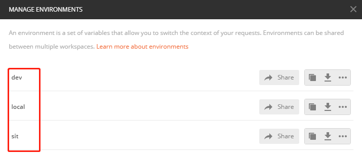
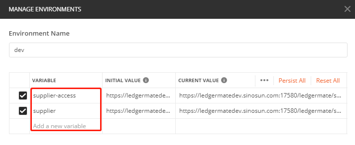
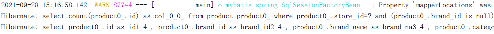
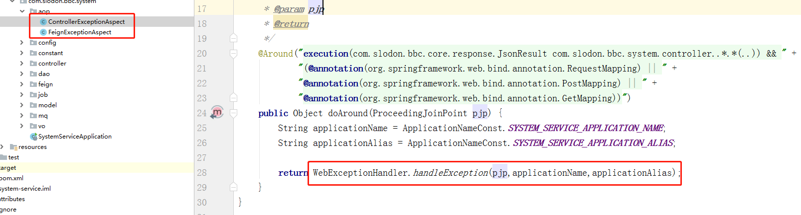
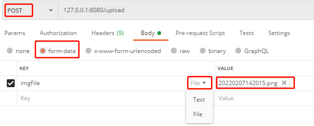
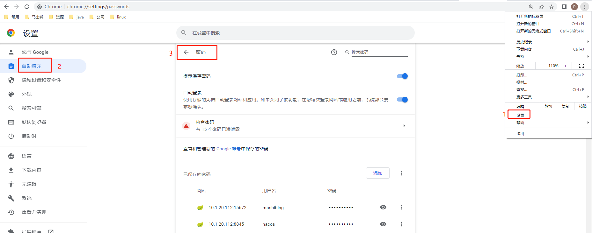

#  2020-09

#### 1、StringUtils判空

import org.apache.commons.lang.StringUtils

包必须手动导入，因为jdk自带的util包没有 isBlank() 方法。

1）boolean StringUtils.isEmpty(String str)  -》 str为 null 或 “” 为空

2）boolean StringUtils.isBlank(String str)  -》 str为 null 或 “”  或 “ ” 或 “   ” 或  “\n” 或 ” 或 "\t“ 都为空

具体：https://www.cnblogs.com/guiblog/p/7787569.html


#### 2、@Valided

@Valided 判空注解

问题引入：@ApiModelProperty(require = true)注解表明这个参数必填，即 param != null，否则服务无法调用

局限：对于基本类型它可以保证，但是对于String和对象它并不能完全确保有值。

解决：引入@Valided注解，以及连带的注解：

##### 2.1 控制层

类前：@Valided     

函数参数前：@Valid

```java
@RestController
@Valided    
public class StudentHandle {

    @PostMapping("/save")
    public Student save(@RequestBody @Valid SaveRequest param){
    }
}
```

##### 2.2 Model层

@NotNull(massage="")		不能为 null

@NotEmpty(massage="")    字符串不能为 null/""

@NotBlank(massage="")     字符串不能为 null/""/空格/转移字符  

@Size(min=1, massage="")  数组最小为1  

@Valid             					   对象不能为空    


#### 3、Tyora图片

绝对路径：直接粘贴，粘贴的就是绝对路径，但是这样的话，图片一经迁移就无法访问

相对路径：将图片和Tyora存放在同一个目录下，使用相对路径，图片和文件可以一起迁移

另外：Tyora也可以认为是文本标记语言，加标记可以使字体加粗、倾斜等。图片同样，加标记可以改变尺寸、背景等。


#### 4、环境

| 缩写     | 全程                        | 中文                 |
| -------- | --------------------------- | -------------------- |
| DEV      | development                 | 开发                 |
| SIT      | System Integrate Test       | 系统整合测试（内测） |
| UAT      | User Acceptance Test        | 用户验收测试         |
| PET      | Performance Evaluation Test | 性能评估测试（压测） |
| SIM      | simulation                  | 仿真                 |
| PRD/PROD | production                  | 产品/正式/生产       |

四个主要环境：pro、pre、test、dev环境，中文名字：生产环境、灰度环境、测试环境、开发环境：

pro环境：生产环境，面向外部用户的环境，连接上互联网即可访问的正式环境。

pre环境：灰度环境，外部用户可以访问，但是服务器配置相对低，其它和生产一样。

test环境：测试环境，外部用户无法访问，专门给测试人员使用的，版本相对稳定。

dev环境：开发环境，外部用户无法访问，开发人员使用，版本变动很大。


#### 5、win进程

- 通过端口号查看PID：netstat -aon|findstr "port"
- 通过PID查看信息：tasklist|findstr "PID"
- 通过PID杀死进程：taskkill /T /F /PID PID号

任务管理器方法：任务管理器：win10【详细信息】、win7【进程，如果没有PID字段，则查看->选择列->勾选PID】


#### 6、工作经验之数据库字段默认值

- 场景
  - aliyunCode字段 数据库中 不能为空
  - aliyunCode字段 接口中 不是必传， 
  - template 和mapper两个表关联

- 结果
  - 每次必须判断aliyunCode为不为空，为空要么不增，要么给默认值
  - 两张表结合导致 复杂度 指数上升
  - 导致3个bug：都是因为数据库为空

- 补充：如果就是这种场景应用，记得，不但需要入参的aliyunCode为不为空，还需要判断数据库中查询大的结果是否为空


# 2021-03

#### 1、公司框架

- 启动类：idea和gradle都可以启动jvm，用哪个自己选择，公司本地启动使用idea
- runWith：启动前执行一个gradle小程序，把gradle文件生成为application.properties
- 打tar包：公司代码也可以打包，执行，生成的文件中含有application.properties，其他环境会直接覆盖这个文件。
- base组件：（1）可以在服务启动时做点什么，只需要继承一个接口.（2）日志级别设置；（3）敏感字段加密：一个类的to/from方法。


#### 2、 打印堆栈

- Logger.error("http error", e) 中的e打印的就是堆栈，且先打印堆栈，再打印自己的描述信息

- Logger.error("http error", e) 中的e没用，打印堆栈就是帮助定位信息，描述信息已经很清晰地定位到信息了

- 那么会不会不清楚try{}中哪一行的错误？不会。因为IOException只会捕捉IOException，不过异常类型不明确的话另说。

- java或框架的自动异常处理（打印堆栈）

  - 打印堆栈是为了帮助定位错误，用于不发预见的执行时异常

  - 检查异常需要自己处理，打印时我觉得就没必要打印堆栈了，直接打印描述信息不香吗

  - 至于检查异常在自己没有打印堆栈时，仍打印堆栈，这都是因为后面的代码要用到，但是前面的已经异常了，没有生产出数据，还使用的话就空指针了

  - springboot统一异常处理会捕捉异常（实现一个接口就行），这样代码就不会再往下执行，也就不会再打印堆栈了。

  - serviceComb框架内会先于springboot统一异常处理，处理异常，所以，一有异常serviceComb就会打印异常堆栈，往往把正常的业务情况打印出来，建议关掉。

    


#### 3、时区

- 情景1：时区不同，本地和dev的时区不一样，导致token的过期时间。解决方法：数据库配置，设定时区

- 情景2：数据库不同，dev和sit环境数据库不同，导致token错误


#### 4、jsoup

.data(map) 中map的值不能为空

解决：

注解：@JsonInclude(JsonInclude.Include.NON_NULL)

可以在 new ObjectMapper().convertValue(object, Map.class)时，不将object中的空转换

#### 5、string和list<>之间的转换

String strList = objectMapper.writeValueAsString(arrayList);

List<Student> students = objectMapper.readValue(listJsonStr, new TypeReference<List<Student>>()


# 2021-04

#### 1、springboot配置

```java
public class myConfig{
    private String name;
    
	@Value("${supplier-access.nmyvirtual}")
	private String hobby;
}

@ConfigurationProperties(prefix = "supplier-access.nmyvirtual") //正确
@ConfigurationProperties(prefix = "supplier-access.nmyVirtual") //错误  
```

```properties
supplier-access.nmyvirtual.name=sunpeng   //可以不配置
supplier-access.nmyvirtual.hobby=women    //必须配置 
```

- @ConfigurationProperties中不能出现大小字母

- @Value必须配置，不然就会启动失败

  

#### 2、异常：类找不到

- ClassNotfoundException 编译时找不到类（常见）
  - 注入时的，找不到配置，找不到配置等等。

- NoClassDefFoundError 运行时找不到类（不常见）
  - 一种情况就是因为静态变量加载不到原因
  - 工程里没有将jar添加到classpath，maven项目的，需要根据项目情况排查


#### 3、postman

1.1 切换环境实现不同环境下的测试

- 切换环境达到不同环境
- 在请求中通过变量{{supplier-access}}达到不同服务

图1：不同环境



图2：不同服务



图3：不同接口


#### 4、postman账号密码

账户：476567162@qq.com

密码：sp602157


# 2021-07

#### 1、md文件表格换行和插入行

- ctrl + enter ：插入行

- shift + erter ：换行

#### 2、删除module

先移除再删除

synchronized

# 2021-08

#### 1、EA：流程图的组合片段

**组合片段用来解决交互执行的条件及方式**。它允许在序列图中直接表示逻辑组件，用于通过指定条件或子进程的应用区域，为任何生命线的任何部分定义特殊条件和子进程。

- alt：抉择（if...else）
- opt：选项（if...return）
- loop：循环
- par：并行


# 2021-09

### 1、springboot自启动

-  自启动程序不影响主程序

- 自启动程序默认执行顺序为无序，可以通过@Order(value=number)配置，数字越小优先级越高，不配置则优先级最低


### 2、日志

#### 2.1 jpa日志

jpa底层是Hibernate，在sql日志方面整合的不好。

##### 2.1.1 开启日志

```yaml
spring:
  jpa:
  	#配置在日志中打印出执行的 SQL 语句信息。
    show-sql: true
    #漂亮地打印
    properties:
      hibernate:
        format_sql: true
    
```

结果：



可以看出hibernate打印出的日志并不遵照logback格式，日志级别配置也无用。

##### 2.1.2 整合logback

在logback.xml中配置

```xml
    <!-- 1. 输出SQL 到控制台和文件-->
    <logger name="org.hibernate.SQL" additivity="false" >
        <level value="DEBUG" />
        <appender-ref ref="file" />
        <appender-ref ref="console" />
    </logger>
<!--    &lt;!&ndash; 2. 输出SQL 的参数到控制台和文件&ndash;&gt;-->
    <logger name="org.hibernate.type.descriptor.sql.BasicBinder" additivity="false" level="TRACE" >
        <level value="TRACE" />
        <appender-ref ref="file" />
        <appender-ref ref="console" />
    </logger>
```

这样hibernate打印出的日志就整合进logback中，若要配置日志级别，可以：

```yaml
logging:
  level:
    org:
      hibernate:
        SQL: debug
        type:
          descriptor:
            sql:
              BasicBinder: trace
```

#### 2.2 mybatis日志

mybatis日志只用将配置dao层的日志级别调整成debug就行

```yaml
logging:
  level:
  	com.demo.dao: debug
```


token

是否支持多个token

缓存


# 2021-11

### 1、依赖

就近原则

按顺序依赖

### 2、String

stringbuffer是线程安全的

stringbuilder 速度快


### 3、 继承类型转换

```java
Parent parent = new Parent();
Son son = new Son();

// 子类继承父类，子类包含的信息比父类多。
// 父类可以指向子类，子类不能指向父类，这样使用基类方法一定不会出错
// 强制转换只有在地址本身就是此类型，不关心指针的类型

parent = son; //正确：子类可以指向父类
son = parent; //编译错误：语法错误
son = (Son)parent; // 运行错误：ClassCastException

Parent falseParent = new Son(); 
son = (Son)falseParent; //正确的：多态的用法，falseParent本质是Son，所以可以强制转换。
son = (Son)(new Son()) //等价于

//示例
public GetTownResponse getTown(String districtCode) {
    return (GetTownResponse)this.getChildRegion(districtCode, new GetTownResponse());
}
private RegionListVo getChildRegion(String parentCode, RegionListVo regionListVo){
    List<Region> regionList = regionRepository.findByParentCode(parentCode);
    List<RegionVo> regionVoList = BeanCopyUtil.copyListProperties(regionList, RegionVo::new);
    regionListVo.setRegionVoList(regionVoList);
    return regionListVo;
}
```


### 4、springmvc_header

```java
//入参 三种方式
@RequestHeader HttpHeaders headers
@RequestHeader MultiValueMap<String, String> headers
@RequestHeader String authorization

//取
String[] tokens = headers.get("token")
String token = header.getFirst("token")
```

### 5、json反序列化

string -> object 是， string的字段许少不许多

### 6、字符串切割

当字符串以"."作为分隔符时，split方法会认为"."是正则表达式，需要转义再转义，eg:

```java
str.split("\\.")
```


### 7、bbc框架



各服务定义切点，实际处理类在core.aop包下，切面功能：

- 打印日志：一般时controller、fegin层 request、resopnse
- 处理异常：服务方状态是否良好


### 8、bbc框架的日志

```java
feign.slf4j.Slf4jLogger //fegin日志
org.apache.ibatis.logging.jdbc.BaseJdbcLogger //sql日志
com.slodon.bbc.core.aop.WebExceptionHandler //controller日志    
```


### 9、.gitgnore

- 空行或是以#开头的行即注释行将被忽略；
- 以斜杠 “/” 结尾表示目录；
- 以星号 “*” 通配多个字符；
- 以问号 “?” 通配单个字符
- 以方括号 “[]” 包含单个字符的匹配列表；
- 以叹号 “!” 表示不忽略(跟踪)匹配到的文件或目录；
- 可以在前面添加斜杠 “/” 来避免递归,下面的例子中可以很明白的看出来与下一条的区别。

公司项目中的配置

```
##############自定义
/src/main/resources/application.properties
/src/main/resources/logback.xml
/src/test/
```


# 2022-02

### 1、postman

#### 1.1 pre

```js
const req = {
  url: 'https://bplusdev.sinosun.com:18180/mallvop/auth/v1/fastGetAccessToken?channelId=1001',
  method: 'GET'
};

pm.sendRequest(req, function (err, res) {
  console.log(err ? err : res.json());
  var token = res.json().result.accessToken;
  token = "Bearer "+token;
  pm.globals.set("token", token);
});
```

#### 1.2 test

```sh
pm.test("Status code is 200", function () {
    pm.response.to.have.status(200);
});
var jsonData = JSON.parse(responseBody)
pm.environment.set("vop_open_token", "Bearer "+jsonData.result.accessToken);
```

#### 1.3 图片




### 2、static是沟通容器与非容器的桥梁


# 2022-06

### 1、notepad++

换行符是 /r/n


### 2、杀死win8080端口的进程

```sh
netstat -ano | findstr 8080 
taskkill /F /PID [pid]
```


# 2022-07

### 1、查看谷歌保存的密码




搜索框搜索的是网站和用户名


### 2、web刷新

刷新：F5

强制刷新：ctrl+F5

F5可能得到的是浏览器缓存的数据，如果是浏览器缓存则会返回304，ctrl+F5强制刷新才可以保证一定是一次重新的请求


