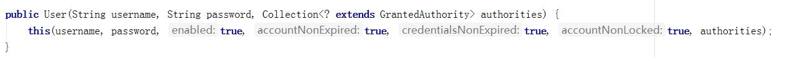

# 快速使用

## 1、快速使用

```xml
<dependency>
    <groupId>org.springframework.boot</groupId>
    <artifactId>spring-boot-starter-security</artifactId>
</dependency>
```

- springboot集成springsecurity
- 启动
- 任意访问，自动跳到登录页面
- 用户名：user
- 密码：启动日志会打印

## 2、知识点整理

伪代码

```java
//=============================================默认===============================================
//配置用户
spring.security.user.name=admin
spring.security.user.password=admin
    
//获取上下文
    
//默认登录页面
http://localhost:8080/login.html
    
//默认退出页面
http://localhost:8080/logout    
    
//=============================================自定义===================================================
//自定义配置
@Configuration
@EnableWebSecurity
public class SecurityConfig extends WebSecurityConfigurerAdapter {}

//白名单
@Override
public void configure(WebSecurity web) throws Exception {
    web.ignoring().antMatchers("/register");
}   

//关闭crsf
http.csrf().disable();
    
//开启认证
http.authorizeRequests().anyRequest().authenticated();

//使用默认登录主题
http.formLogin();   

//使用自定义登录主题
http.formLogin().loginPage("/login.html").loginProcessingUrl("/login");   
    
//权限放行
http.authorizeRequests().antMatchers("/login.html").permitAll();
    
//登录失败请求转发
http.formLogin().failureForwardUrl("/fail.html");

//登录失败重定向
http.formLogin().failureUrl("http://localhost:8080/fail.html");
    
//登录失败处理器
http.formLogin().failureHandler(new AuthenticationFailureHandler() {
    //request.getRequestDispatcher("/fail").forward(request, response); //请求转发
    response.sendRedirect("http://127.0.0.1:8080/fail"); //重定向
};   

//记住我

//加密
@Bean
public PasswordEncoder passwordEncoder(){
//  return NoOpPasswordEncoder.getInstance(); 不加密
    return new BCryptPasswordEncoder();
}

//自定义用户管理
@Service
public class UserService implements UserDetailsService {
    @Override
    public UserDetails loadUserByUsername(String username) throws UsernameNotFoundException {}
}
```

## 3、坑整理

- 如果重写了配置需要手动关闭crsf防护：http.csrf().disable();

- 如果重写了配置还想用自定义页面，需要配置：http.formLogin()

- 如果重写了配置需要开启认证，需要配置：http.authorizeRequests().anyRequest().authenticated();

- 一般获取静态资源都需要放行：如果登录页面（不放行的话会一直重定向），失败页面

- thymeleaf：如果使用thymeleaf模板，需要把资源放到templates下面，并且需要配套的接口；没使用则放在static下。

- 跨域：127.0.0.1和localhost之间跨域，重定向时需要注意

- http协议错误：重定向不能用https请求，不然证书又问题。如果要用https请求，需要为电脑配置证书。

  

## 4、名词定义

- RBAC：Role-BasedAccess Control的英文缩写，意思是基于角色的访问控制。

- SSO:  Single Sign-On，中文意即单点登录
- jwt：token格式
- oauth2：为客户端授权
- OpenId：去中心化的网上身份认证系统


# 一、Spring Security简介

## 1、概括

​	Spring Security是一个高度自定义的**安全框架**。利用Spring IoC/DI和AOP功能，为系统提供了声明式安全访问控制功能，减少了为系统安全而编写大量重复代码的工作。

​	使用Spring Secruity的原因有很多，但大部分都是发现了javaEE的Servlet规范或EJB规范中的安全功能缺乏典型企业应用场景。同时认识到他们在WAR或EAR级别无法移植。因此如果你更换服务器环境，还有大量工作去重新配置你的应用程序。使用Spring Security 解决了这些问题，也为你提供许多其他有用的、可定制的安全功能。

​	正如你可能知道的两个应用程序的两个主要区域是“**认证**”和“**授权**”（或者访问控制）。这两点也是Spring Security重要核心功能。“认证”，是建立一个他声明的主体的过程（一个“主体”一般是指用户，设备或一些可以在你的应用程序中执行动作的其他系统），通俗点说就是系统认为用户是否能登录。“授权”指确定一个主体是否允许在你的应用程序执行一个动作的过程。通俗点讲就是系统判断用户是否有权限去做某些事情。

## 2、历史

​	Spring Security 以“The Acegi Secutity System for Spring” 的名字始于2003年年底。其前身为acegi项目。起因是Spring开发者邮件列表中一个问题，有人提问是否考虑提供一个基于Spring的安全实现。限制于时间问题，开发出了一个简单的安全实现，但是并没有深入研究。几周后，Spring社区中其他成员同样询问了安全问题，代码提供给了这些人。2004年1月份已经有20人左右使用这个项目。随着更多人的加入，在2004年3月左右在sourceforge中建立了一个项目。在最开始并没有认证模块，所有的认证功能都是依赖容器完成的，而acegi则注重授权。但是随着更多人的使用，基于容器的认证就显现出了不足。acegi中也加入了认证功能。大约1年后acegi成为Spring子项目。

​	在2006年5月发布了acegi 1.0.0版本。2007年底acegi更名为Spring Security。

## 3、shiro

​    Shiro 是 Java 的一个安全框架。目前，使用 Apache Shiro 的人越来越多，因为它相当简单，对比 SpringSecurity，可能没有 Spring Security 做的功能强大，但是在实际工作时可能并不需要那么复杂的东西，所以使用小而简单的 Shiro 就足够了。


# 二、快速上手

## 1、案例

依赖

```
<dependency>
    <groupId>org.springframework.boot</groupId>
    <artifactId>spring-boot-starter-security</artifactId>
</dependency>
```

controller

```java
@RestController
@RequestMapping("/user")
public class UserController {

    @GetMapping("/query")
    public String query(){
        return "user query...";
    }

}
```

## 2、测试

​	导入spring-boot-starter-security启动器后，Spring Security已经生效，默认拦截全部请求，如果用户没有登录，跳转到内置登录页面。如：

- 访问：http://localhost:8080/user/query

- 拦截跳转：http://localhost:8080/login 返回一个表单页面


- 账户密码登录：默认的username为user，password打印在控制台中。如：

- 登录成功：跳回http://localhost:8080/user/query页面

  

- 登录失败：再次跳回登录页面
- 退出：http://localhost:8080/logout


## 3、自定义用户名密码配置

```properties
spring.security.user.name=admin
spring.security.user.password=admin
```


# 三、用户管理

​	当什么也没有配置的时候，账号和密码是由Spring Security定义生成的。用户信息保存在内存中。而在实际项目中账号和密码都是从数据库中查询出来的。 所以我们要通过自定义逻辑控制认证逻辑。

## 1、springSecurity默认用户管理

### 1.1 UserDetailsService

loadUserByUsername：通过用户名加载用户，默认从内存中查找用户，而自定义要从数据库中查找用户。


### 1.2 UserDetails

- UserDetails：loadUserByUsername接口的返回类型，定义了认证时需要使用的接口。主要实现类User。

- User：UserDetails的主要实现类，loadUserByUsername返回的类型。认证时拿User的信息和用户输入的账号密码比较。鉴权时查看用户的权限。

#### 1.2.1 UserDetails方法


#### 1.2.2 UserDetails实现类


#### 1.2.3 User方法


#### 1.2.4 User构造方法	

其中构造方法有两个，调用其中任何一个都可以实例化UserDetails实现类User类的实例。而三个参数的构造方法实际上也是调用7个参数的构造方法。



​	此处的用户名应该是客户端传递过来的用户名。而密码应该是从数据库中查询出来的密码。Spring Security会根据User中的password和客户端传递过来的password进行比较。如果相同则表示认证通过，如果不相同表示认证失败。

​	authorities里面的权限对于后面学习授权是很有必要的，包含的所有内容为此用户具有的权限，如有里面没有包含某个权限，而在做某个事情时必须包含某个权限则会出现403。通常都是通过

```java
//创建authorities集合对象的。参数时一个字符串，多个权限使用逗号分隔。
AuthorityUtils.commaSeparatedStringToAuthorityList("")
```


## 2、自定义用户管理

**自定义用户管理时，获取用户的方法，只需要重写UserDetailsService的loadUserByUsername接口即可。至于返回类型，我们的实体类UserEntity并重新实现UserDetail，而是将查询到的UserEntity封装给User并返回。**

### 2.1 实例

service

```java
@Service
public class UserService implements UserDetailsService {

    @Autowired
    private UserDao userDao;

    @Override
    public UserDetails loadUserByUsername(String username) throws UsernameNotFoundException {
        final UserEntity userEntity = userDao.findByName(username);
        if(userEntity == null){
            throw new UsernameNotFoundException("用户不存在");
        }
        return new User(username, userEntity.getPassword(), AuthorityUtils.commaSeparatedStringToAuthorityList("USER,ADMIN"));
    }

    @Autowired
    private PasswordEncoder passwordEncoder;
    
    public void save(UserEntity userEntity){
        userEntity.setPassword(passwordEncoder.encode(userEntity.getPassword()));
        userDao.save(userEntity);
    }

}
```

entity

```java
@Entity
@Data
public class UserEntity {
    @Id
    @GeneratedValue(strategy = GenerationType.IDENTITY)
    private Long id;
    private String name;
    private String password;
}
```

dao

```java
public interface UserDao extends JpaRepository<UserEntity, Long> {
    UserEntity findByName(String username);
}
```

controller

```java
@RestController
public class LoginController {
    
    @Autowired
    private UserService userService;
    
    @PostMapping("/register")
    public String register(@RequestBody UserEntity userEntity){
        userService.save(userEntity);
        return "user save ...";
    }
}
```

config

```java
@Configuration
public class SecurityConfig extends WebSecurityConfigurerAdapter {

    @Bean
    public PasswordEncoder passwordEncoder(){
        return NoOpPasswordEncoder.getInstance();
    }

    @Override
    public void configure(WebSecurity web) throws Exception {
        web.ignoring().antMatchers("/register");
    }
}
```

### 2.2 注册

调用注册接口，注册成功，数据库插入一条用户


由于注册不要认证授权，所以配置了白名单

```java
    @Override
    public void configure(WebSecurity web) throws Exception {
        web.ignoring().antMatchers("/register");
    }
```

### 2.3 登录

使用新注册的用户登录


认证过程：重写loadUserByUsername方法，通过数据可以获取用户密码，封装到User中返回。认证时会校验User中和密码和用户输入的密码是否一致。

```java
@Override
public UserDetails loadUserByUsername(String username) throws UsernameNotFoundException {
    final UserEntity userEntity = userDao.findByName(username);
    if(userEntity == null){
        throw new UsernameNotFoundException("用户不存在");
    }
    return new User(username, userEntity.getPassword(), AuthorityUtils.commaSeparatedStringToAuthorityList("USER,ADMIN"));
}	
```
UsernameNotFoundException：用户名没有发现异常。在loadUserByUsername中是需要通过自己的逻辑从数据库中取值的。如果通过用户名没有查询到对应的数据，应该抛出UsernameNotFoundException，系统就知道用户名没有查询到。


# 四、加密

没有绝对安全的网络，还需要物理约束与法律约束

## 1、加密

- 明文
- 编码：base64
- 可以加密
  - 对称加密：两端持有相同密钥。加密方式：DES、3DES、AES
  - 非对称加密：公钥加密，私钥解密。解决对称加密问题，客户端密钥泄露导致整个产品瘫痪问题。加密算法：RSA
  - 加密：防止数据泄露，用于数据传输：http
- 不可逆加密
  - hash：hash(明文) ：md5
  - 盐：hash(明文 + 盐)：sha256
  - 随即盐：hash(明文+随机盐)+随机盐，随机盐放存放在hash后的密码中
  - 多重加密+随即盐：hash(hash(明文 + 随机盐)+随机盐) ：BCryptPasswordEncoder
  - 签名：防止数据篡改，用于：签名jwt、密码保存BCryptPasswordEncoder


## 2、 安全

没有绝对安全的网络，即使拿不到密码，也可以通过重放攻击，解决方法

- 二次安全校验
- 接口调用安全校验
- 异地登录等
- 大额转账

名词

- https：数据防篡改，防钓鱼网站（ca 证书，钓鱼网站没有）

- CAS 集中式身份验 Central Authentication Service

- XSS 重放攻击
- CSRF 跨域攻击


## 3、PasswordEncoder

### 3.1 PasswordEncoder方法

​	Spring Security要求容器中必须有PasswordEncoder实例。所以当自定义登录逻辑时要求必须给容器注入PaswordEncoder的bean对象

```java
    @Bean
    public PasswordEncoder passwordEncoder(){
//        return NoOpPasswordEncoder.getInstance(); 不加密
        return new BCryptPasswordEncoder();
    }
```


​	encode():把参数按照特定的解析规则进行解析。

matches()验证从存储中获取的编码密码与编码后提交的原始密码是否匹配。如果密码匹配，则返回true；如果不匹配，则返回false。第一个参数表示需要被解析的密码。第二个参数表示存储的密码。

​	upgradeEncoding()：如果解析的密码能够再次进行解析且达到更安全的结果则返回true，否则返回false。默认返回false。

### 3.2 PasswordEncoder实现类

​	在Spring Security中内置了很多解析器。


- NoOpPasswordEncoder.getInstance(); 不加密

- new BCryptPasswordEncoder(); 官方推荐的密码解析器

### 3.3 BCryptPasswordEncoder

​	BCryptPasswordEncoder是Spring Security官方推荐的密码解析器，平时多使用这个解析器。

​	BCryptPasswordEncoder是对bcrypt强散列方法的具体实现。是基于Hash算法实现的单向加密。


### 3.4 测试

```
@SpringBootTest
@RunWith(SpringRunner.class)
public class MyTest {
    @Test
    public void test(){
        //创建解析器
        PasswordEncoder encoder = new BCryptPasswordEncoder();
        
        //对密码进行加密
        String password = encoder.encode("123");
        System.out.println("------------"+password);

        //判断原字符加密后和内容是否匹配
        boolean result = encoder.matches("123",password);
        System.out.println("============="+result);
    }
}
```

### 3.5 springSecurity集成PasswordEncoder

```java
    //定义
	@Bean
    public PasswordEncoder passwordEncoder(){
        return new BCryptPasswordEncoder();
    }

	//保存用户
	userEntity.setPassword(passwordEncoder.encode(userEntity.getPassword()));

	//认证
	passwordEncoder.match("用户登录时传入的密码", "数据库中加密过密码")
```


# 五、自定义主题

每个项目都有自己独特的登录页面，所以要将我们自己的登录页面替换默认登录页面。

如果重写了configure方法还想用默认登录页面，必须配置：http.formLogin();

## 1、登录页面

### 1.1 代码

#### 1.1.1 SecurityConfig

```java
@Configuration
public class SecurityConfig extends WebSecurityConfigurerAdapter {

    @Bean
    public PasswordEncoder passwordEncoder(){
        return NoOpPasswordEncoder.getInstance();
    }

    @Override
    public void configure(WebSecurity web) throws Exception {
        web.ignoring().antMatchers("/register");
    }

    @Override
    protected void configure(HttpSecurity http) throws Exception {

        //关闭csrf防护，后端debug才有报错日志（总是翻车）
        http.csrf().disable();

        // 权限
        http.authorizeRequests()
                .antMatchers("/login.html").permitAll() //放行(不用认证鉴权)
                .anyRequest().authenticated(); //开启认证

        //登录页面
        http.formLogin().loginPage("/login.html").loginProcessingUrl("/login");
//                .failureForwardUrl("/fail.html") //登录失败请求转发
//                .successForwardUrl("/success.html") //登录成功后请求转发
//                .failureUrl("http://localhost:8080/fail.html") //登录失败重定向
    }

}
```

#### 1.1.2 /static/login.html

```html
<!DOCTYPE html>
<html lang="en">
<head>
    <meta charset="UTF-8">
    <title>Title</title>
</head>
<body>
<form action="/login" method="post">
    用户名：<input type="text" name="username" /><br/>
    密码：<input type="password" name="password" /><br/>
    <input type="submit" value="登录" />
</form>
</body>
</html>
```


### 1.2 测试


### 1.3 总结

- anyRequest().authenticated()：开启认证，过滤器会拦截没有登录用户并跳转到登录页面。

- http.csrf().disable()：关闭csrf防护，后端debug才有报错日志，很容易翻车。如要开启，需要配置。
- antMatchers("/login.html").permitAll() ：认证页面资源放行，不然会产生重定向过多的错误（一直登录一直重定向）
- http协议错误：重定向不能用https请求，不然证书又问题。如果要用https请求，需要为电脑配置证书。
- loginProcessingUrl("/login")：声明登录接口，这样框架才能拦截此接口并认证授权。声明的是form表单请求的接口。
- thymeleaf：如果使用thymeleaf模板，需要把资源放到templates下面，并且需要配套的接口
- 跨域：127.0.0.1和localhost之间跨域，重定向时需要注意
- 成功：成功可以返回用户请求页面，主页，自定义成功页面等。
- 失败：失败可以返回登录页面，自定义失败页面等。
- failureForwardUrl是请求转发，failureUrl是重定向，重定向的页面需要方向，不然又会跳转到登录页面。成功同理。

- 记住我


# 六、处理器

## 1、登录失败处理器failureHandler

```java
@Configuration
public class SecurityConfig extends WebSecurityConfigurerAdapter {

    @Bean
    public PasswordEncoder passwordEncoder(){
        return NoOpPasswordEncoder.getInstance();
    }

    @Override
    public void configure(WebSecurity web) throws Exception {
        web.ignoring().antMatchers("/register");
    }

    @Override
    protected void configure(HttpSecurity http) throws Exception {

        //关闭csrf防护，后端debug才有报错日志（总是翻车）
        http.csrf().disable();

        // 权限
        http.authorizeRequests()
                .antMatchers("/login.html").permitAll() //放行(不用认证鉴权)
                .anyRequest().authenticated(); //开启认证

        //登录页面
        http.formLogin().loginPage("/login.html").loginProcessingUrl("/login");
                .failureHandler(new AuthenticationFailureHandler() {
                    @Override
                    public void onAuthenticationFailure(HttpServletRequest request, HttpServletResponse response, AuthenticationException e) throws IOException, ServletException {
                        if(e instanceof UsernameNotFoundException){
                            System.out.println("没有找到用户。。。");
                            response.sendRedirect("http://127.0.0.1:8080/fail");
                        }else{
                            System.out.println("其他异常。。。");
//                            request.getRequestDispatcher("/fail").forward(request, response); //请求转发
                            response.sendRedirect("http://127.0.0.1:8080/fail"); //重定向
                        }
                    }
                })
    }

}
```

- 参数 HttpServletRequest request
- 参数 HttpServletResponse response
- 参数 AuthenticationException e ：根据不同异常不同处理
- 打印日志，便于分析
- 请求转发：request.getRequestDispatcher("/fail").forward(request, response);
- 重定向：response.sendRedirect("http://127.0.0.1:8080/fail.html"); 


# 七、权限

RBAC是Role-BasedAccess Control的英文缩写，意思是基于角色的访问控制。

## 1、springSecurity

```java
@Configuration
public class SecurityConfig extends WebSecurityConfigurerAdapter {

    @Bean
    public PasswordEncoder passwordEncoder(){
        return NoOpPasswordEncoder.getInstance();
    }

    @Override
    protected void configure(HttpSecurity http) throws Exception {
        http.csrf().disable();
        // 权限-角色
        http.authorizeRequests()
                .antMatchers("/login.html", "/fail.html").permitAll()
                .antMatchers("/user/**").hasAnyRole("USER", "ADMIN") //USER和ADMIN都可以访问/user/**
                .antMatchers("/admin/**").hasRole("ADMIN") //ADMIN可以访问/admin/**
                .anyRequest().authenticated();

    }
    
    @Override
    protected void configure(AuthenticationManagerBuilder auth) throws Exception {
        //用户-角色
        auth.inMemoryAuthentication()
               .withUser("admin").password(passwordEncoder().encode("admin")).roles("ADMIN") //新建用户admin，角色是ADMIN
               .and().withUser("sunpeng").password(passwordEncoder().encode("123")).roles("USER");//新建用户sunpeng，角色是USER
    }
}


```

- 用户存储在内存中

  - InMemoryAuthentication：用户存储在内存中
  - JdbcMemoryAuthentication：用户存储在数据库中（需要为框架连接数据库并建表，基本不用）
  - UserService: 自定义实现（使用自己的数据库）

  

  

- 角色的坑：通过springSecurity上下文得到系统的角色是ROLE_ADMIN，而非配置的ADMIN，框架为角色加了前缀，牢记此坑。


## 2、自定义

### 2.1 UserController

ADMIN可以删除，USER可以修改，新增用户不需要权限

```java
@RestController
public class UserController {

    @Autowired
    private UserService userService;

    @PreAuthorize(value = "hasAnyRole('ROLE_ADMIN')")
    @GetMapping("/admin/delete")
    public String delete(){
        System.out.println("---------->delete");
        return "delete .... ";
    }

    @PreAuthorize(value = "hasAnyRole('ROLE_USER')")
    @GetMapping("/user/update")
    public String update(){
        System.out.println("---------->update");
        return "update .... ";
    }

    @GetMapping("/save")
    public String save(String username, String password, String roles){
        return userService.register(username, password, roles);
    }
}
```

### 2.2 UserPojo

作用一：实体类，保存用户名，密码，权限。作用二：实现UserDetails，实现获取用户名，密码，权限的方法。

```java
@Data
@Entity
public class UserPojo implements UserDetails {

    @Id
    @GeneratedValue(strategy = GenerationType.IDENTITY)
    private Long id;

    private String username;

    private String password;

    private String roles;

    @Override
    public Collection<? extends GrantedAuthority> getAuthorities() {
        return AuthorityUtils.commaSeparatedStringToAuthorityList(this.getRoles());
    }

    @Override
    public String getPassword() {
        return this.password;
    }

    @Override
    public String getUsername() {
        return this.username;
    }

    @Override
    public boolean isAccountNonExpired() {
        return true;
    }

    @Override
    public boolean isAccountNonLocked() {
        return true;
    }

    @Override
    public boolean isCredentialsNonExpired() {
        return true;
    }

    @Override
    public boolean isEnabled() {
        return true;
    }
}
```

### 2.3 UserService

重写加载用户的方式

```java
@Service
public class UserService implements UserDetailsService {

    @Autowired
    private UserDao userDao;

    @Autowired
    private PasswordEncoder passwordEncoder;

    @Override
    public UserDetails loadUserByUsername(String username) throws UsernameNotFoundException {
        return userDao.findByUsername(username);
    }

    public String register(String username, String password, String roles){
        if (Objects.nonNull(userDao.findByUsername(username))) {
            return "username re-exist";
        }
        UserPojo user = new UserPojo();
        user.setUsername(username);
        user.setPassword(passwordEncoder.encode(password));
        user.setRoles(roles);
        userDao.save(user);
        return "save success";
    }
}
```

### 2.4 SecurityConfig

srpingSecurity配置，启用全局校验权限配置。

```java
@Configuration
@EnableWebSecurity
@EnableGlobalMethodSecurity(prePostEnabled = true)
public class SecurityConfig extends WebSecurityConfigurerAdapter {

    @Bean
    public BCryptPasswordEncoder passwordEncoder(){
        return new BCryptPasswordEncoder();
    }

    @Override
    protected void configure(HttpSecurity http) throws Exception {
        http.formLogin();
        http.authorizeRequests()
                .antMatchers("save").permitAll()
                .anyRequest().authenticated();
        http.csrf().disable();
    }
}
```

### 2.5 测试

http://127.0.0.1:8001/save?username=jia&password=123&roles=ROLE_USER 新建用户，不需要登录

http://127.0.0.1:8080/user/update 成功

http://127.0.0.1:8080/admin/delete 403

## 3、小结

```java
//配置: 权限-角色
http.authorizeRequests().antMatchers("/user/**").hasAnyRole("USER", "ADMIN");
//配置: 用户-角色
auth.inMemoryAuthentication().withUser("admin").password(passwordEncoder().encode("admin")).roles("ADMIN");

//自定义: 权限-角色
@PreAuthorize(value = "hasAnyRole('ROLE_ADMIN')")
//自定义: 用户-角色
List<SimpleGrantedAuthority> auth = new SimpleGrantedAuthority("ROLE_ADMIN");
userDetails.getAuthorities();
```

配置中的角色叫ADMIN，自定义中的角色叫ROLE_ADMIN，但是保存到上下文中的用户角色都是ROLE_ADMIN，原因是框架会为配置中的ADMIN自动增加前缀。所以，尽量不要将两种方式混用，如果会用的话，注意前缀ROLE_问题。


# 八、验证码

代码：/code/security/spring-security-demo/captch-demo

验证码：captcha

- captcha用kaptcha

- session存储验证码code
- 通过过滤器校验验证码
- 验证码过滤器置于登录之前
- 验证码接口需要配置白名单


# 九、源码-登录认证授权-core

见msb老师的笔记


Strategy 策略

Holder 持有

Security 安全

Context 上下文

Authentication 认证（名词）

attemptAuthentication 尝试身份验证

principal 主体，用户信息


spring-security-core: SpringSecurity的核心jar包，认证和授权的核心代码都在这里面

spring-security-config: 配置

spring-security-web：用于Spring Security web身份验证服务和基于url的访问控制  


Authentication：认证对应的实体类

- UsernamePasswordAuthenticationToken 自定义UserService中使用的
- OAuth2Authentication

SecurityContext：存储

SecurityContextHolder：存储策略

SecurityContextHolderStrategy 策略接口

- GlobalSecurityContextHolderStrategy：把SecurityContext存储为static变量 
- InheritableThreadLocalSecurityContextStrategy ：把SecurityContext存储在InheritableThreadLocal中，让父子线程都可以使用
- ThreadLocalSecurityContextStrategy：把SecurityContext存储在ThreadLocal中，只有当前线程可以使用


```java
Authentication authentication = SecurityContextHolder.getContext().getAuthentication();
Object principal = authentication.getPrincipal();  //java.security.Principal包下
UserDetails userDetails = (UserDetails) principal;
```


- User
- UserDetails

- UserDetailsService


authenticate 鉴定


# 十、源码-校验身份鉴权-filter

见msb老师的笔记


# 十一、源码-配置加载-bean

见msb老师的笔记


# 十二、sso

## 1、单点登录

- SSO（ Single Sign-On ），中文意即单点登录

- 定义：单点登录是一种控制多个相关但彼此独立的系统的访问权限, 拥有这一权限的用户可以使用单一的ID和密码访问某个或多个系统从而避免使用不同的用户名或密码，或者通过某种配置无缝地登录每个系统
- 解决的问题：分布式集群环境下用户登录，在一个服务器A上登录，请求打在服务器B上，不需要重复登录。

- session解决方案：
  - springsession+redis
  - session共享 + 父子域名（网关统一处理也需要redis，因为网关也有多个）
- token解决方案：token自解释
  - jwt优点：效率高：不用维持会话，服务器不用存session，防篡改


## 2、sso-session

代码见：/code/security/sso-demo

单个服务：
登录成功给一个session,下次验证session就行
使用的是session，不能用cookie。如果用cookie不能区分不同用户

分布式：
授权服务器登录时添加一个cookie，发现已经有cookie就不用再登录了。
使用的时cookie，不能用session
因为是分布式,认证服务器没有暴漏给前端，没有通道伪造cookie
从client那里来，不用区分用户


## 3、sso-token

token自解释的方法解决单点登录问题

### 3.1 jwt

官方网站：jwt.io

代码：/code/security/spring-security-demo/spring-security-jwt

```xml
<dependency>
    <groupId>com.auth0</groupId>
    <artifactId>java-jwt</artifactId>
    <version>3.4.0</version>
</dependency>
```

```java
import com.auth0.jwt.JWT;
import com.auth0.jwt.JWTCreator;
import com.auth0.jwt.algorithms.Algorithm;
import com.auth0.jwt.interfaces.DecodedJWT;

import java.util.Date;
import java.util.HashMap;
import java.util.Map;

public class JwtUtil {
    // 秘钥
    private static final String SING = "123qwaszx";

    public static String create(Map<String,String> map){
        JWTCreator.Builder builder = JWT.create();
        // 设置payload
        map.forEach(builder::withClaim);
        // 默认过期时间 7天
        Date expireTime = new Date(System.currentTimeMillis() + 7 * 24 * 3600 * 1000);
        // 生成Token并返回
        return builder.withExpiresAt(expireTime).sign(Algorithm.HMAC256(SING));
    }

    public static DecodedJWT verify(String token){
        return JWT.require(Algorithm.HMAC256(SING)).build().verify(token);
    }

    public static void main(String[] args) {
        Map<String,String> map = new HashMap<>();
        map.put("name", "sunpeng");
        final String token = create(map);
        System.out.println(token);
    }
}
```


### 3.2 springsecrity-jwt

代码：/code/security/spring-security-demo/spring-security-jwt

#### 3.2.1 登录过滤器

```java
package com.msb.filter;

import com.alibaba.fastjson.JSON;
import com.fasterxml.jackson.databind.ObjectMapper;
import com.msb.service.UserPojo;
import com.msb.util.JwtUtil;
import org.springframework.beans.factory.annotation.Autowired;
import org.springframework.security.authentication.AuthenticationManager;
import org.springframework.security.authentication.UsernamePasswordAuthenticationToken;
import org.springframework.security.core.Authentication;
import org.springframework.security.core.AuthenticationException;
import org.springframework.security.core.GrantedAuthority;
import org.springframework.security.core.context.SecurityContext;
import org.springframework.security.core.context.SecurityContextHolder;
import org.springframework.security.core.context.SecurityContextHolderStrategy;
import org.springframework.security.web.authentication.UsernamePasswordAuthenticationFilter;
import org.springframework.stereotype.Component;
import org.springframework.util.StringUtils;

import javax.servlet.FilterChain;
import javax.servlet.ServletException;
import javax.servlet.http.HttpServletRequest;
import javax.servlet.http.HttpServletResponse;
import java.io.BufferedReader;
import java.io.IOException;
import java.io.InputStreamReader;
import java.io.PrintWriter;
import java.util.ArrayList;
import java.util.HashMap;
import java.util.List;
import java.util.Map;

public class TokenLoginFilter extends UsernamePasswordAuthenticationFilter {

    private AuthenticationManager authenticationManager;

    public TokenLoginFilter(AuthenticationManager authenticationManager) {
        this.authenticationManager = authenticationManager;
    }

    @Override
    public Authentication attemptAuthentication(HttpServletRequest request, HttpServletResponse response) throws AuthenticationException {
        System.out.println("认证开始");
        Map<String, String> params = this.getFormData(request);
        System.out.println("入参："+JSON.toJSONString(params));
        UsernamePasswordAuthenticationToken authRequest = new UsernamePasswordAuthenticationToken(params.get("username"), params.get("password"));
        this.setDetails(request, authRequest);
        return authenticationManager.authenticate(authRequest);
    }

    @Override
    protected void successfulAuthentication(HttpServletRequest request, HttpServletResponse response, FilterChain chain, Authentication authResult) throws IOException, ServletException {
        System.out.println("认证成功");
        //生成token，并封装到相应头中
        Map<String, String> payload = new HashMap<>();
        payload.put("username", authResult.getName());
        List<String> roleList = new ArrayList<>();
        for (GrantedAuthority authority : authResult.getAuthorities()) {
            roleList.add(authority.getAuthority());
        }
        payload.put("roles", JSON.toJSONString(roleList));
        final String token = JwtUtil.create(payload);
        response.addHeader("Authorization", "Bearer "+token);
        try {
            //响应
            response.setContentType("application/json;charset=utf-8");
            response.setStatus(HttpServletResponse.SC_OK);
            PrintWriter out = response.getWriter();
            Map<String,Object> responseBody = new HashMap();
            responseBody.put("code", HttpServletResponse.SC_OK);
            responseBody.put("msg", "认证通过！");
            out.write(JSON.toJSONString(responseBody));
            out.flush();
            out.close();
        }catch (Exception e){
            System.out.println("认证成功异常");
        }
    }

    @Override
    protected void unsuccessfulAuthentication(HttpServletRequest request, HttpServletResponse response, AuthenticationException failed) throws IOException, ServletException {
        System.out.println("认证失败");
        try {
            response.setContentType("application/json;charset=utf-8");
            response.setStatus(HttpServletResponse.SC_UNAUTHORIZED);
            PrintWriter out = response.getWriter();
            Map<String, Object> responseBody = new HashMap();
            responseBody.put("code", HttpServletResponse.SC_UNAUTHORIZED);
            responseBody.put("msg", "用户名或密码错误！");
            out.write(JSON.toJSONString(responseBody));
            out.flush();
            out.close();
        }catch (Exception e){
            System.out.println("认证失败异常");
        }
    }

    /**
     * 获取请求参数：form表单
     * @param request 请求
     * @return 参数map
     */
    public Map<String, String> getFormData(HttpServletRequest request){
        try {
            BufferedReader streamReader = new BufferedReader( new InputStreamReader(request.getInputStream()));
            StringBuilder sb = new StringBuilder();
            String inputStr;
            while ((inputStr = streamReader.readLine()) != null) {
                sb.append(inputStr);
            }
            Map<String, String> map = new HashMap<>();
            for (String s : sb.toString().split("&")) {
                final String[] split = s.split("=");
                map.put(split[0], split[1]);
            }
            return map;
        } catch (IOException e) {
            throw new RuntimeException("json格式化异常");
        }
    }
}
```

#### 3.2.2 认证过滤器

```java
package com.msb.filter;

import com.alibaba.fastjson.JSON;
import com.auth0.jwt.interfaces.DecodedJWT;
import com.msb.util.JwtUtil;
import org.springframework.security.authentication.AuthenticationManager;
import org.springframework.security.authentication.UsernamePasswordAuthenticationToken;
import org.springframework.security.core.authority.SimpleGrantedAuthority;
import org.springframework.security.core.context.SecurityContextHolder;
import org.springframework.security.web.authentication.www.BasicAuthenticationFilter;

import javax.servlet.FilterChain;
import javax.servlet.ServletException;
import javax.servlet.http.HttpServletRequest;
import javax.servlet.http.HttpServletResponse;
import java.io.IOException;
import java.io.PrintWriter;
import java.util.*;

public class TokenVerifyFilter extends BasicAuthenticationFilter {

    public TokenVerifyFilter(AuthenticationManager authenticationManager) {
        super(authenticationManager);
    }

    @Override
    protected void doFilterInternal(HttpServletRequest request, HttpServletResponse response, FilterChain chain) throws IOException, ServletException {
        System.out.println("认证");
        DecodedJWT verify = null;
        try {
            String authorization = request.getHeader("Authorization");
            if (authorization == null || !authorization.startsWith("Bearer ")){
                throw new RuntimeException("token解析异常");
            }
            String token = authorization.replace("Bearer ", "");
            verify = JwtUtil.verify(token);
        } catch (RuntimeException e) {
            System.out.println("认证失败，token错误");
            //如果携带错误的token，则给用户提示请登录！
            response.setContentType("application/json;charset=utf-8");
            response.setStatus(HttpServletResponse.SC_FORBIDDEN);
            PrintWriter out = response.getWriter();
            Map<String, Object> responseBody = new HashMap();
            responseBody.put("code", HttpServletResponse.SC_FORBIDDEN);
            responseBody.put("msg", "请登录！");
            out.write(JSON.toJSONString(responseBody));
            out.flush();
            out.close();
            return;
        }
        System.out.println("认证成功");
        String userName = verify.getClaim("username").asString();
        String roleJSON = verify.getClaim("roles").asString();
        List<SimpleGrantedAuthority> list = new ArrayList<>();
        for (String role : JSON.parseArray(roleJSON,String.class)) {
            list.add(new SimpleGrantedAuthority(role));
        }
        UsernamePasswordAuthenticationToken authResult =
                new UsernamePasswordAuthenticationToken(userName, null, list);
        //将权限封装到UsernamePasswordAuthenticationToken，后面的过滤器鉴权
        System.out.println("鉴权");
        SecurityContextHolder.getContext().setAuthentication(authResult);
        chain.doFilter(request, response);
    }


}
```


# 十三、oauth

## 1、oauth

### 1.1 介绍

官网：https://oauth.net/2/


### 1.2 模式

#### 1.2.1 code模式


#### 1.2.2 token模式


#### 1.2.3 password模式


#### 1.2.4 client模式


## 2、springsecurity-oauth

### 2.1 代码

代码：/code/security/spring-security-demo/oauth-demo

user: roles 

client: scope

授权服务器

```java
ResourceServerConfiguration extends ResourceServerConfigurerAdapter
AuthorizationServerConfiguration extends AuthorizationServerConfigurerAdapter
```


### 2.2 测试

外部的client是用postman模拟的


## 3、OpenID

OpenID是一个去中心化的网上身份认证系统。对于支持OpenID的网站，用户不需要记住像用户名和密码这样的传统验证标记。取而代之的是，他们只需要预先在一个作为OpenID身份提供者（identity provider, IdP）的网站上注册。OpenID是去中心化的，任何网站都可以使用OpenID来作为用户登录的一种方式，任何网站也都可以作为OpenID身份提供者。OpenID既解决了问题而又不需要依赖于中心性的网站来确认数字身份。

https://openid.net

OpenID与OAuth2.0区别

- 社交网站联合登录
- 短信平台

OpenID：认证

OAuth2.0：授权


