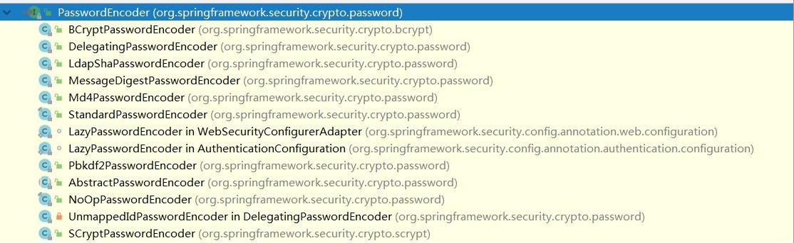

### 一、Spring Security简介

#### 1.概括

​	Spring Security是一个高度自定义的**安全框架**。利用Spring IoC/DI和AOP功能，为系统提供了声明式安全访问控制功能，减少了为系统安全而编写大量重复代码的工作。

​	使用Spring Secruity的原因有很多，但大部分都是发现了javaEE的Servlet规范或EJB规范中的安全功能缺乏典型企业应用场景。同时认识到他们在WAR或EAR级别无法移植。因此如果你更换服务器环境，还有大量工作去重新配置你的应用程序。使用Spring Security 解决了这些问题，也为你提供许多其他有用的、可定制的安全功能。

​	正如你可能知道的两个应用程序的两个主要区域是“**认证**”和“**授权**”（或者访问控制）。这两点也是Spring Security重要核心功能。“认证”，是建立一个他声明的主体的过程（一个“主体”一般是指用户，设备或一些可以在你的应用程序中执行动作的其他系统），通俗点说就是系统认为用户是否能登录。“授权”指确定一个主体是否允许在你的应用程序执行一个动作的过程。通俗点讲就是系统判断用户是否有权限去做某些事情。

#### 2.历史

​	Spring Security 以“The Acegi Secutity System for Spring” 的名字始于2003年年底。其前身为acegi项目。起因是Spring开发者邮件列表中一个问题，有人提问是否考虑提供一个基于Spring的安全实现。限制于时间问题，开发出了一个简单的安全实现，但是并没有深入研究。几周后，Spring社区中其他成员同样询问了安全问题，代码提供给了这些人。2004年1月份已经有20人左右使用这个项目。随着更多人的加入，在2004年3月左右在sourceforge中建立了一个项目。在最开始并没有认证模块，所有的认证功能都是依赖容器完成的，而acegi则注重授权。但是随着更多人的使用，基于容器的认证就显现出了不足。acegi中也加入了认证功能。大约1年后acegi成为Spring子项目。

​	在2006年5月发布了acegi 1.0.0版本。2007年底acegi更名为Spring Security。

### 二、第一个Spring Security项目

#### 1.导入依赖

​	Spring Security已经被Spring boot进行集成，使用时直接引入启动器即可。

```
<dependency>
    <groupId>org.springframework.boot</groupId>
    <artifactId>spring-boot-starter-security</artifactId>
</dependency>
```

#### 2.访问页面

​	导入spring-boot-starter-security启动器后，Spring Security已经生效，默认拦截全部请求，如果用户没有登录，跳转到内置登录页面。

​	在项目中新建login.html页面后

​	在浏览器输入：http://localhost:8080/login.html后会显示下面页面


​	默认的username为user，password打印在控制台中。当然了，同学们显示的肯定和我的不一样。

​		在浏览器中输入账号和密码后会显示login.html页面内容。

### 三、UserDetailsService详解

​	当什么也没有配置的时候，账号和密码是由Spring Security定义生成的。而在实际项目中账号和密码都是从数据库中查询出来的。 所以我们要通过自定义逻辑控制认证逻辑。

​	如果需要自定义逻辑时，只需要实现UserDetailsService接口即可。接口定义如下：


#### 1.返回值

​	返回值UserDetails是一个接口，定义如下


​	要想返回UserDetails的实例就只能返回接口的实现类。Spring Security中提供了如下的实例。对于我们只需要使用里面的User类即可。注意User的全限定路径是：

​	org.springframework.security.core.userdetails.User

​	此处经常和系统中自己开发的User类弄混。


​	在User类中提供了很多方法和属性。


​	其中构造方法有两个，调用其中任何一个都可以实例化UserDetails实现类User类的实例。而三个参数的构造方法实际上也是调用7个参数的构造方法。

​	username:用户名

​	password:密码

​	authorities：用户具有的权限。此处不允许为null


​	此处的用户名应该是客户端传递过来的用户名。而密码应该是从数据库中查询出来的密码。Spring Security会根据User中的password和客户端传递过来的password进行比较。如果相同则表示认证通过，如果不相同表示认证失败。

​	authorities里面的权限对于后面学习授权是很有必要的，包含的所有内容为此用户具有的权限，如有里面没有包含某个权限，而在做某个事情时必须包含某个权限则会出现403。通常都是通过AuthorityUtils.commaSeparatedStringToAuthorityList(“”)来创建authorities集合对象的。参数时一个字符串，多个权限使用逗号分隔。

#### 2.方法参数

​	方法参数表示用户名。此值是客户端表单传递过来的数据。默认情况下必须叫username，否则无法接收。

#### 3.异常

​	UsernameNotFoundException 用户名没有发现异常。在loadUserByUsername中是需要通过自己的逻辑从数据库中取值的。如果通过用户名没有查询到对应的数据，应该抛出UsernameNotFoundException，系统就知道用户名没有查询到。

### 四、PasswordEncoder密码解析器详解

​	Spring Security要求容器中必须有PasswordEncoder实例。所以当自定义登录逻辑时要求必须给容器注入PaswordEncoder的bean对象

#### 1.接口介绍

​	encode():把参数按照特定的解析规则进行解析。

matches()验证从存储中获取的编码密码与编码后提交的原始密码是否匹配。如果密码匹配，则返回true；如果不匹配，则返回false。第一个参数表示需要被解析的密码。第二个参数表示存储的密码。

​	upgradeEncoding()：如果解析的密码能够再次进行解析且达到更安全的结果则返回true，否则返回false。默认返回false。

#### 2.内置解析器介绍

​	在Spring Security中内置了很多解析器。



#### 3.BCryptPasswordEncoder简介

​	BCryptPasswordEncoder是Spring Security官方推荐的密码解析器，平时多使用这个解析器。

​	BCryptPasswordEncoder是对bcrypt强散列方法的具体实现。是基于Hash算法实现的单向加密。可以通过strength控制加密强度，默认10.

#### 4.代码演示

​	在项目src/test/java下新建com.msb.MyTest测试BCryptPasswordEncoder用法。

```
@SpringBootTest
@RunWith(SpringRunner.class)
public class MyTest {
    @Test
    public void test(){
        //创建解析器
        PasswordEncoder encoder = new BCryptPasswordEncoder();
        
        //对密码进行加密
        String password = encoder.encode("123");
        System.out.println("------------"+password);

        //判断原字符加密后和内容是否匹配
        boolean result = encoder.matches("123",password);
        System.out.println("============="+result);
    }
}
```

### 五、自定义登录逻辑

​	当进行自定义登录逻辑时需要用到之前讲解的UserDetailsService和PasswordEncoder。但是Spring Security要求：当进行自定义登录逻辑时容器内必须有PasswordEncoder实例。所以不能直接new对象。        

#### 1.编写配置类

​	新建类com.msb.config.SecurityConfig 编写下面内容

```
@Configuration
public class SecurityConfig {
    @Bean
    public PasswordEncoder getPwdEncoder(){
        return new BCryptPasswordEncoder();
    }
}
```

#### 2.自定义逻辑

​	在Spring Security中实现UserDetailService就表示为用户详情服务。在这个类中编写用户认证逻辑。

```
@Service
public class UserDetailsServiceImpl implements UserDetailsService {
    @Autowired
    private PasswordEncoder encoder;

    @Override
    public UserDetails loadUserByUsername(String username) throws UsernameNotFoundException {
        //1. 查询数据库判断用户名是否存在，如果不存在抛出UsernameNotFoundException

        if(!username.equals("admin")){
            throw new UsernameNotFoundException("用户名不存在");
        }
        //把查询出来的密码进行解析,或直接把password放到构造方法中。
        //理解:password就是数据库中查询出来的密码，查询出来的内容不是123
        String password = encoder.encode("123");

        return new User(username,password, AuthorityUtils.commaSeparatedStringToAuthorityList("admin"));
    }
}
```

#### 3.查看效果

​	重启项目后，在浏览器中输入账号：admin，密码：123。后可以正确进入到login.html页面。