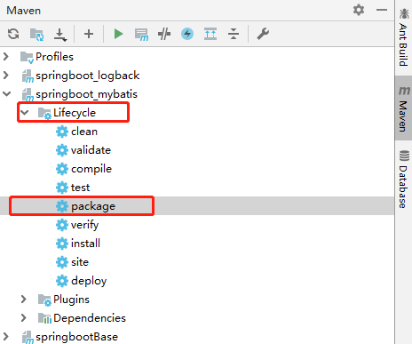
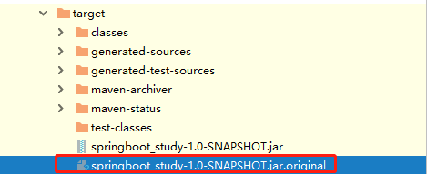
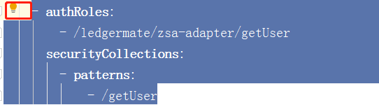
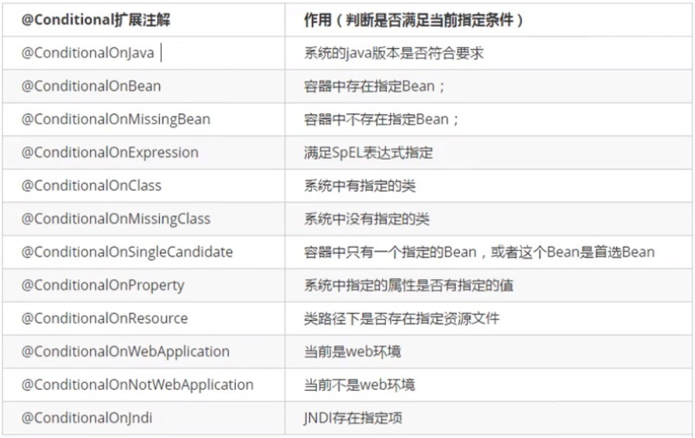
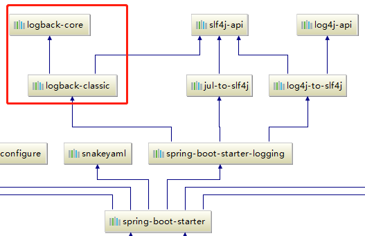
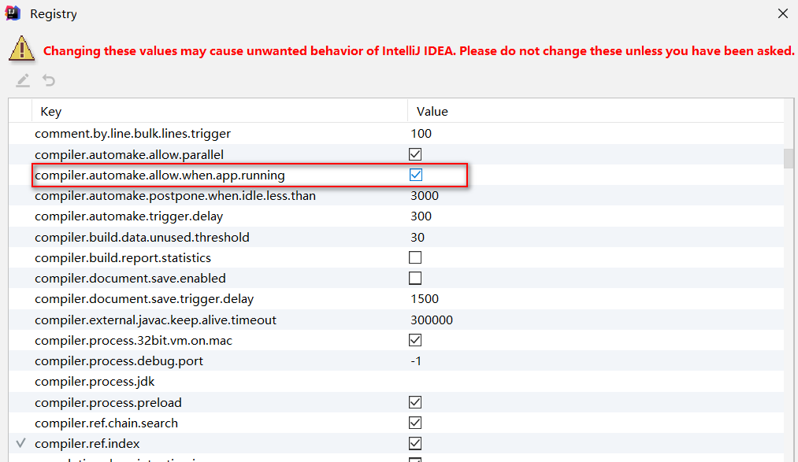
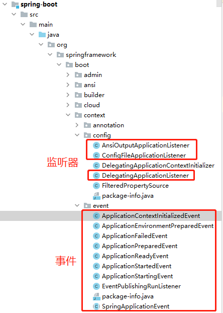

# 参考资料

马东阳：第12阶段-springboot的使用，第38节-拓展_@ImportResource

连鹏举：互联网高级工程师就业班


# 一、环境配置


## 1、idea创建项目

可以使用maven或者gradle，不过idea为我们提供了更简单的创建方式Spring Initializr

- 新建 -》 project -》Spring Initializr
- New Project 下选择：
  - type：Maven Project
  - packaging：jar（自动打包的打包方式）
  - java Version：8
  - package：包

- 选择需要的依赖


## 2、依赖

### 2.1 springboot-parent

父项目一般用于依赖的版本管理

```xml
<parent>
    <groupId>org.springframework.boot</groupId>
    <artifactId>spring-boot-starter-parent</artifactId>
    <version>2.5.2</version>
    <relativePath/> <!-- lookup parent from repository -->
</parent>
```

spring-boot-starter-parent 中包括 spring-boot-dependencies 和 一些其他配置

#### 2.1.1 spring-boot-dependencies 

```xml
他的父项目是
<parent>
    <groupId>org.springframework.boot</groupId>
    <artifactId>spring-boot-dependencies</artifactId>
    <version>2.5.2</version>
</parent>
他来真正管理Spring Boot应用里面的所有依赖版本；
```

spring-boot-dependencies管理依赖的版本，所以它又叫版本仲裁

#### 2.1.2 其他

spring-boot-starter-parent 的配置中，会默认读取配置文件 application.yaml/yml/properties

```xml
<build>
  <resources>
    <resource>
      <directory>${basedir}/src/main/resources</directory>
      <filtering>true</filtering>
      <includes>
        <include>**/application*.yml</include>
        <include>**/application*.yaml</include>
        <include>**/application*.properties</include>
      </includes>
    </resource>
    <resource>
      <directory>${basedir}/src/main/resources</directory>
      <excludes>
        <exclude>**/application*.yml</exclude>
        <exclude>**/application*.yaml</exclude>
        <exclude>**/application*.properties</exclude>
      </excludes>
    </resource>
  </resources>
</build>
```


### 2.2 启动类 start

启动器就是把相关的依赖组合在一起，由springboot官方或者第三方提供

```xml
<!--名字在后，spring提供的启动器，spring整合第三方-->
<dependency>
    <groupId>org.springframework.boot</groupId>
    <artifactId>spring-boot-starter-web</artifactId>
</dependency>
<!--名字在前，第三方提供的启动器，第三方支持spring-->
<dependency>
    <groupId>org.mybatis.spring.boot</groupId>
    <artifactId>mybatis-spring-boot-starter</artifactId>
    <version>2.1.3</version>
</dependency>
```


### 2.3 插件

#### 2.3.1 打包工具

依赖中可以定义打包工具

```xml
<!--默认打jar包-->
<packaging>jar</packaging>
<!--打包插件-->
<build>
    <plugins>
        <plugin>
            <groupId>org.springframework.boot</groupId>
            <artifactId>spring-boot-maven-plugin</artifactId>
            <configuration>
                <fork>true</fork>
            </configuration>
        </plugin>
    </plugins>
</build>
```

springboot打包可以分为jar、war、pom，其中pom用在父依赖中

#### 3.3.2 打包



#### 3.3.3 打包结果



如果没有spring-boot-maven-plugin组件依赖，那么打包时就没有下面红框中的文件，在cmd中执行时（java -jar），会报错：没有主文件。

#### 3.3.4 执行

受3.3.3的打包结果影响，可能不成功

```sh
#cmd
java -jar name.jar
#idea-Terminal
E:\IDEAProject\spring-boot-02\target>java -jar spring-boot-02-0.0.1-SNAPSHOT.jar --spring.config.location=C:\Users\sunpeng.SINO\Desktop\application.properties
```

#### 3.3.5 war

由于springboot集成了tomcat，所以运行web程序时用jar包即可。如果非要打war包，按照如下步骤：

- 依赖

  需要排除web启动中自动依赖的tomcat插，再加入单独的tomcat依赖（仅在编译时生效）。

  ```xml
  <!--war包-->
  <packaging>war</packaging>
  
  <!--配置SpringBoot的web启动器-->
  <dependency>
      <groupId>org.springframework.boot</groupId>
      <artifactId>spring-boot-starter-web</artifactId>
      <!--排除web启动中自动依赖的tomcat插件-->
      <exclusions>
          <exclusion>
              <groupId>org.springframework.boot</groupId>
              <artifactId>spring-boot-starter-tomcat</artifactId>
          </exclusion>
      </exclusions>
  </dependency>
  <!--
      手动依赖tomcat插件，但是表明项目打包时该依赖不会被打进去，目的主要是保证开发阶段本地SpringBoot
      项目可以正常运行
  -->
  <dependency>
      <groupId>org.springframework.boot</groupId>
      <artifactId>spring-boot-starter-tomcat</artifactId>
      <!--打包的时候可以不用包进去，别的设施会提供。事实上该依赖理论上可以参与编译，测试，运行等周期。
          相当于compile，但是打包阶段做了exclude操作-->
      <scope>provided</scope>
  </dependency>
  
  <!--打包插件一样-->
  <build>
      <plugins>
          <plugin>
              <groupId>org.springframework.boot</groupId>
              <artifactId>spring-boot-maven-plugin</artifactId>
              <configuration>
                  <fork>true</fork>
              </configuration>
          </plugin>
      </plugins>
  </build>
  ```

- 启动类

  正常springboot启动要初始化web的配置，现在没有了tomcat依赖，正常springboot无法启动成功。

  ```java
  @SpringBootApplication
  public class MyApplication extends SpringBootServletInitializer {
      //重写配置方法
      @Override
      protected SpringApplicationBuilder configure(SpringApplicationBuilder application) {
          return application.sources(MyApplication.class);
      }
      public static void main(String[] args) {
          //启动SpringBoot
          SpringApplication.run(MyApplication.class,args);
      }
  }
  ```


## 3、启动类

```java
/*@SpringBootConfiguration
@EnableAutoConfiguration
@ComponentScan("com.msb")*/
@SpringBootApplication
public class SpringbootBaseApplication {
    public static void main(String[] args) {
        ConfigurableApplicationContext context = SpringApplication.run(SpringbootBaseApplication.class, args);
/*        String[] beanDefinitionNames = context.getBeanDefinitionNames();
        for (int i = 0; i < beanDefinitionNames.length; i++) {
            System.out.println(beanDefinitionNames[i]);
        }*/
        Person bean = context.getBean(Person.class);
        System.out.println(bean);
    }
}
```

### 3.1 @SpringBootApplication

@SpringBootApplication = @SpringBootConfiguration + @EnableAutoConfiguration + @ComponentScan("com.msb")

### 3.2 获取容器

```java
//springboot
ConfigurableApplicationContext context = SpringApplication.run(SpringbootBaseApplication.class, args);
//spring
ApplicationContext context = new ClassPathXmlApplicationContext("ioc.xml");
```

springboot和spring一样，在初始化时加载容器，扫描包构建bean。spring根据开发者的xml文件构建bean，而springboot会加载其他组件的配置类，大大简化了程序的开发。


## 4、配置

|          | spring                              | springboot                               |
| -------- | ----------------------------------- | ---------------------------------------- |
| 格式     | xml、properties                     | xml、properties、yaml                    |
| 外部文件 | context:property-placeholder(备注1) | @PropertySource（备注2）                 |
| 默认     | 无，获取容器时需要指定配置文件      | application.yaml、application.properties |
| 注意     | 无                                  | **springboot中的spring注解都不支持yaml** |

- 备注1：spring配置文件中引入其他配置文件

```xml
<context:property-placeholder location="classpath:userConfig.properties"></context:property-placeholder>
```

- 备注2：  springboot中引入非默认配置文件

```java
@PropertySource(value = "classpath:bookConfig.properties")
```


### 4.1 application配置文件

#### 4.1.1 优先级

- 本地：/config/*  大于  /* 大于  /classfile/config/*  大于  /classfile/*

- 运维：命令行(参数)  >  命令行(外部配置文件)  > 本地
  - 参数：  --server.port=8087
  - 外部配置文件：--spring.config.location=C:\Users\sunpeng.SINO\Desktop\application.properties

- properties  >   yaml  优先而非覆盖

#### 4.1.2 环境配置

公司中往往有多个环境，比如dev、sit、uat，且各个环境的配置不一样。这时在application-dev.yml、application-sit.yml存入个性化配置，在application.yml中配置使用那个配置文件。

```yaml
spring:
  profiles:
    active: sit
```


### 4.2 yaml

#### 4.2.1 格式

- 根据缩进判断等级
- 连字符 - 代表数组

#### 4.2.2 注意

每行前缩进的空格是yaml文件的格式/语法，一定注意。

##### 4.2.2.1 复制粘贴不规范

在复制粘贴keycloak文件时，由于复制粘贴没有考虑空格，导致只有第一行空格正确，其余几行都错误。



正确做法为从顶头位置复制，从顶头位置复制/粘贴。


##### 4.2.2.2 修改文件类型

由于servicecomb契约文件的原因，需要先将契约文件改为txt文件，程序启动成功后，再改为yaml文件格式，并将打印出来的文件粘贴到契约文件。注意，一定要先改文件类型，再改内容。反之，空格会乱。

### 

# 二、bean

springboot可以认为是spring的简化配置版，springboot所使用的注解还是沿用spring的。不同点是springboot在启动时自动装配了一些配置。

## 1、启动

@SpringBootApplication注解在启动时会自动扫描包。而spring需要xml配置自动扫描包，并在启动容器启动时传入配置文件。实际@SpringBootApplication的扫包是由@ComponentScan完成，spring也可以使用此注解

```java
//包扫描
@ComponentScan(basePackages = "com.msb")
//通过注解获取容器
@Test
public void testTransaction3(){
    ApplicationContext context =new AnnotationConfigApplicationContext(SpringConfig.class);
}
```


## 2、IOC 构建bean

### 2.1 构建bean

```java
@Configuration(proxyBeanMethods=false)
//@Component
//@Import(value = Person.class) //id="com.msb.config.Person" , type=Person.class 可以放到任意位置
//@EnableConfigurationProperties(value = Person.class) //person-com.msb.config.Person
//@ImportResource("classpath:beans.xml")
public class MyConfig {
    @Bean
    public Person getPerson(){
        return new Person();
    }
}
```

- @Component(value="bean_id")

  默认bean_id=类的首字母小写，参数value可以修改

- @Configuration(proxyBeanMethods=false)

  @Configuration = @Component + proxyBeanMethods

  false 称之为Lite模式  特点启动快；true 称之为Full模式  特点依赖spring容器控制bean单例

  ```java
  @Target({ElementType.TYPE})
  @Retention(RetentionPolicy.RUNTIME)
  @Documented
  @Component
  public @interface Configuration {
      @AliasFor(
          annotation = Component.class
      )
      String value() default "";
  
      boolean proxyBeanMethods() default true;
  }
  ```

- @Bean(value="bean_id") + @Configuration/@Component

  - 这种bean的创建方法就如同工厂模式

  - 默认bean_id=方法名，参数value可以修改

- @Import(value = Person.class)

  bean_id = 全路径名，比如："com.msb.config.Person"

- @ImportResource("classpath:beans.xml") + beans.xml

  ```xml
  <?xml version="1.0" encoding="UTF-8"?>
  <beans xmlns="http://www.springframework.org/schema/beans"
         xmlns:xsi="http://www.w3.org/2001/XMLSchema-instance"
         xsi:schemaLocation="http://www.springframework.org/schema/beans http://www.springframework.org/schema/beans/spring-beans.xsd">
      <bean id="person" class="com.msb.config.Person">
          <property name="name" value="jia"></property>
      </bean>
  </beans>
  ```

  bean_id = xml文件中bean标签的id

- @EnableConfigurationProperties(value = Person.class) + @ConfigurationProperties(prefix = "person") + application.yaml

  ```java
  @ConfigurationProperties(prefix = "person")
  public class Person {
      private String name;
      public String getName() {
          return name;
      }
      public void setName(String name) {
          this.name = name;
      }
  }
  ```

  ```yaml
  person:
    name: sunpeng
  ```

  它的主要用途是这只参数，而非构建bean

  bean_id = 类名首字母小写 + 全路径名，比如：person-com.msb.config.Person

### 2.2 参数

```java
@Component
@PropertySource(value = "classpath:bookConfig.properties")
@ConfigurationProperties(prefix = "springboot-base.book")
public class Book {
    //@Value("${springboot-base.book.name}")
    private String name;
    public String getName() {
        return name;
    }
    public void setName(String name) {
        this.name = name;
    }
}
```

```yaml
springboot-base.book.name=shuixu
```

- springboot在spring的基础上，还提供了注解：@ConfigurationProperties
- springboot在spring的基础上，还支持yaml文件。
- spring没有默认指定文件，必须指定，springboot默认了指定文件application
- @PropertySource是sping提供，不支持yaml格式文件，特例是application.yaml，可能是springboot做了转换
- 对于springboot而言，配置文件有默认application.yaml的和指定的bookConfig.properties。如果两者做了，相同的配置。@Value会使用application.yaml，@ConfigurationProperties会使用bookConfig.properties。
- @ConfigurationProperties不支持大写字母，支持连字符 - 
- @Component可以替换为@EnableConfigurationProperties(value = Person.class) ，这样这个注解可以放到任意类上。


### 2.3 ConfigurationProperties 和 Value

|            | @ConfigurationProperties         | @Value                                       |
| ---------- | -------------------------------- | -------------------------------------------- |
| 格式       | prefix中不能有大写字母           | 不限制                                       |
| yaml格式   | 不限制，且驼峰和连字符都可以映射 | 最好匹配，因为yaml的驼峰映射不上配置的连字符 |
| yaml为配置 | 不影响                           | 运行时报错                                   |

```java
//ConfigurationProperties入参prefix中不能出现大写字母，否则会编译错误: Prefix must be in canonical form
@ConfigurationProperties(prefix = "jdgoods")  //正确
@ConfigurationProperties(prefix = "jd-goods") //正确
@ConfigurationProperties(prefix = "jdGoods") //错误

//value中yaml的驼峰映射不上配置的连字符，否则@Value没有默认只，运行时会报错
@Value("${goods.goods-number}") //正确
goods.goodsNumber=10
```


## 3、DI 依赖注入

```java
@Configuration(proxyBeanMethods = false)
public class DIConfig {
    @Bean
    public Address getAddress(){
        return new Address();
    }
    @Bean(value = "student")
    public Student getStudent(Address address){ //通过bean_type获取，加注解也可以通过id获取
        return new Student(address);
    }
}
```

```java
public class DIService {
    
    @Autowired
    @Qualifier(value = "getAddress") //通过bean_id获取
    private Address address;
    
    @Autowired //通过bean_type获取
    private Student student;
}
```


## 4、@Conditional 条件装配

满足Conditional指定的条件,则进行组件注入

```java
@Configuration(proxyBeanMethods=false)
@ConditionalOnClass(value = Person.class)
public class MyConfig {
    @Bean
    @ConditionalOnProperty(name = "person.name", havingValue = "sunpeng")
    public Person getPerson(){
        return new Person();
    }
}
```

查看Conditional的子类（查看子类快捷键 ctrl + h）




## 5、bean相关注解总结

| 注解                                                 | 解释                             | 提供商     |
| ---------------------------------------------------- | -------------------------------- | ---------- |
| Bean对象                                             |                                  |            |
| @Component                                           | id=类名首字母小写                | spring     |
| @Configuration(proxyBeanMethods=false)               | id=类名首字母小写，标识配置类    | spring     |
| @Bean                                                | id=方法名                        | spring     |
| @Import(value = Person.class)                        | id=全限定名                      | spring     |
| @ImportResource("classpath:beans.xml")               | id=xml中配置                     | spring     |
|                                                      |                                  |            |
| Bean参数，需要@Component/@Configuration配合          |                                  | spring     |
| @Value(value="")                                     | 配置参数                         | spring     |
| @ConfigurationProperties(prefix = "person")          | 配置参数：key是前缀+字段         | spring     |
| @PropertySource("classpath:preson.properties")       | 修改默认位置文件                 | springboot |
| @EnableConfigurationProperties(value = Person.class) | 替代@Component，可在配置类上配置 | spring     |
|                                                      |                                  |            |
| DI                                                   |                                  |            |
| @Autowird                                            | 根据类型注入                     | spring     |
| @Qualifier(value = "bean_id")                        | 根据id注入                       | spring     |
| @Resource                                            | 两种都支持，但不用               | java       |
|                                                      |                                  |            |
| 其他                                                 |                                  |            |
| @Conditional                                         | 条件                             | spring     |
| @ConditionalOnClass(value = Person.class)            | 是否有Person.class               | springboot |
|                                                      |                                  |            |

## 6、bean_接口

见本文四-1

## 7、bean_泛型

见spring-三-4

## 8、static

- static 与 bean 不兼容，建议不要在bean中使用static 
- static是沟通容器与非容器的桥梁


# 三、web

## 1、整合servlet

应该也可以认为是整合springmvc吧

### 1.1 http

```java
@WebServlet(name = "myServlet",urlPatterns = "/servlet")
public class HelloServlet extends HttpServlet {

    @Override
    protected void doGet(HttpServletRequest req, HttpServletResponse resp) throws ServletException, IOException {
        System.out.println("123");
        super.doGet(req, resp);
    }
}
```

```java
@ServletComponentScan
```

### 1.2 过滤器

```java
@WebFilter(filterName = "MyFilter", urlPatterns = "/*")
public class MyFilter implements Filter {
    @Override
    public void init(FilterConfig filterConfig) throws ServletException {
        System.out.println("init");
    }
    @Override
    public void doFilter(ServletRequest servletRequest, ServletResponse servletResponse, FilterChain filterChain) throws IOException, ServletException {
        System.out.println("doFilter");
        filterChain.doFilter(servletRequest, servletResponse);
    }
    @Override
    public void destroy() {
        System.out.println("destroy");
    }
}
```

```java
    @Bean
    public ServletRegistrationBean<HelloServlet> getServletRegistrationBean(){
        ServletRegistrationBean<HelloServlet> bean = new ServletRegistrationBean<>(new HelloServlet());
        ArrayList<String> url = new ArrayList<>();
        url.add("/helloServlet");
        bean.setUrlMappings(url);
        bean.setLoadOnStartup(1);
        return bean;
    }
```

### 1.3 监听器

```java
public class MyListen implements HttpSessionListener {
    public static int online=0;
    @Override
    public void sessionCreated(HttpSessionEvent se) {
        online++;
        System.out.println("创建+1");
    }
    @Override
    public void sessionDestroyed(HttpSessionEvent se) {
        System.out.println("销毁-1");
    }
}
```

```java
@Bean
public ServletListenerRegistrationBean listenerRegist(){
    ServletListenerRegistrationBean srb = new ServletListenerRegistrationBean();
    srb.setListener(new MyListen());
    System.out.println("listener");
    return srb;
}
```

## 2、整合springmvc

### 2.1 拦截器

和spring一样

```java
@Component
public class WebInterceptor implements HandlerInterceptor {
    @Override
    public boolean preHandle(HttpServletRequest request, HttpServletResponse response, Object handler) throws Exception {
        System.out.println("拦截器");
        return true;
    }
}
```

将spring的xml配置改为springboot的配置类

```java
@Configuration
public class InterceptorConfig implements WebMvcConfigurer {
    @Autowired
    private WebInterceptor webInterceptor;
    @Override
    public void addInterceptors(InterceptorRegistry registry) {       registry.addInterceptor(webInterceptor).addPathPatterns("/**").excludePathPatterns("/hi");
    }
}
```

## 3、整合前端

### 3.1 jsp

优点：
1、功能强大，可以写java代码
2、支持jsp标签（jsp tag）
3、支持表达式语言（el）
4、官方标准，用户群广，丰富的第三方jsp标签库
缺点：
性能问题。不支持前后端分离

### 3.2 freemarker

FreeMarker是一个用Java语言编写的模板引擎，它基于模板来生成文本输出。FreeMarker与Web容器无关，即在Web运行时，它并不知道Servlet或HTTP。它不仅可以用作表现层的实现技术，而且还可以用于生成XML，JSP或Java 等。
目前企业中:主要用Freemarker做静态页面或是页面展示

优点：
1、不能编写java代码，可以实现严格的mvc分离
2、性能非常不错
3、对jsp标签支持良好
4、内置大量常用功能，使用非常方便
5、宏定义（类似jsp标签）非常方便
6、使用表达式语言
缺点：
1、不是官方标准
2、用户群体和第三方标签库没有jsp多

### 3.3 Thymeleaf

Thymeleaf是个XML/XHTML/HTML5模板引擎，可以用于Web与非Web应用。
Thymeleaf的主要目标在于提供一种可被浏览器正确显示的、格式良好的模板创建方式，因此也可以用作静态建模。你可以使用它创建经过验证的XML与HTML模板。相对于编写逻辑或代码，开发者只需将标签属性添加到模板中即可。接下来，这些标签属性就会在DOM（文档对象模型）上执行预先制定好的逻辑。Thymeleaf的可扩展性也非常棒。你可以使用它定义自己的模板属性集合，这样就可以计算自定义表达式并使用自定义逻辑。这意味着Thymeleaf还可以作为模板引擎框架。
优点：静态html嵌入标签属性，浏览器可以直接打开模板文件，便于前后端联调。springboot官方推荐方案。
缺点：模板必须符合xml规范

### 3.4 VUE

VUE: 前后端分离,最多,未来趋势

### 

# 四、db

## 1、接口的注入

### 1.1 dao层的接口需要注入

一般的接口是我们自己实现，接口都有自己的实现类，注入时会注入实现类。但是dao层的类我我们定义接口，mybatis/jpa自动实现，那么在编译如何让它通过。

dao层接口：

```java
public interface AccountMapper {
    List<Account> queryAccount();
}
```

#### 1.1.1 mybatis

```java
//在启动类上添加注释，使编译时通过
@MapperScan("com.msb.springboot_mybatis.mapper")     //mybatis实现
@ComponentScan("com.msb.springboot_mybatis.mapper")  //spring实现
//或者在接口类上添加注释，使编译时通过
@Mapper  //mybatis实现
```

#### 1.1.2 jpa

```java
//继承JpaRepository
public interface AccountMapper extends JpaRepository<Account, Long>{
    List<Account> queryAccount();
}
```

### 1.2 接口多种实现时的注入

当接口有多个实现时

```java
public interface Person {
}
@Compoment
public class Man implements Person {
}
@Compoment
public class Woman implements Person {
}
```

#### 1.2.1 单独注入一个

```java
public class PersonService{
    @Autowired
	private List<Person> personList;
}
```

#### 1.2.2 注入多个

```java
//注入一个
public class PersonService{
    @Autowired
	private Person person
}
//只让一个成为组件
public interface Person {
}
@Compoment
@ConditionalOnExpression("true")
public class Man implements Person {
}
@Compoment
@ConditionalOnExpression("false")
public class Woman implements Person {
}
```

## 2、配置

### 2.1 application.yaml

```yaml
spring:
  datasource:
    driver-class-name: com.mysql.jdbc.Driver
    password: 610527
    username: root
    url: jdbc:mysql://127.0.0.1:3306/mydatabase?useUnicode=true&characterEncoding=utf-8
mybatis:
  mapper-locations: classpath:mybatis/*.xml
  type-aliases-package: com.msb.entity
```

### 2.2 Mapper.xml

```xml
<?xml version="1.0" encoding="UTF-8"?>
<!DOCTYPE mapper PUBLIC "-//mybatis.org//DTD Mapper 3.0//EN" "http://mybatis.org/dtd/mybatis-3-mapper.dtd">
<mapper namespace="com.msb.springboot_mybatis.mapper.AccountMapper">
    <select id="queryAccount" resultType="com.msb.springboot_mybatis.entity.Account">select * from account</select>
</mapper>
```

## 3、分页（整合PageHelper）

### 3.1 依赖

```xml
<dependency>
    <groupId>com.github.pagehelper</groupId>
    <artifactId>pagehelper-spring-boot-starter</artifactId>
    <version>1.2.12</version>
</dependency>
```

### 3.2 使用

```java
//提前调用分页方法
Page<Account> pages = PageHelper.startPage(pageNum, pageSize);
//然后再查询
List<Account> accounts = accountMapper.queryAccount();
//将结果存入PageInfo中，因为Page中数据不稳定
PageInfo<Account> pi =new PageInfo<>(accounts);
//结果
System.out.println("当前页"+pi.getPageNum());
System.out.println("总页数"+pi.getPages());
System.out.println("页大小"+pi.getSize());
System.out.println("总记录数"+pi.getTotal());
System.out.println("当前页数据"+pi.getList());
```

## 4、连接池（整合druid）

### 4.1 依赖

```xml
<!--数据库连接池-->
<dependency>
    <groupId>com.alibaba</groupId>
    <artifactId>druid-spring-boot-starter</artifactId>
    <version>1.1.10</version>
</dependency>
```

### 4.2 配置

```yaml
spring:
  datasource:
    driver-class-name: com.mysql.jdbc.Driver
    password: 610527
    username: root
    url: jdbc:mysql://127.0.0.1:3306/mydatabase?useSSL=false&useUnicode=true&characterEncoding=utf-8&serverTimezone=Asia/Shanghai
    type: com.alibaba.druid.pool.DruidDataSource
  druid:
    # 连接池的配置信息
    # 初始化大小，最小，最大
    initial-size: 5
    min-idle: 5
    maxActive: 20
    # 配置获取连接等待超时的时间
    maxWait: 60000
    # 配置间隔多久才进行一次检测，检测需要关闭的空闲连接，单位是毫秒
    timeBetweenEvictionRunsMillis: 60000
    # 配置一个连接在池中最小生存的时间，单位是毫秒
    minEvictableIdleTimeMillis: 300000
    validationQuery: SELECT 1
    testWhileIdle: true
    testOnBorrow: false
    testOnReturn: false
    # 打开PSCache，并且指定每个连接上PSCache的大小
    poolPreparedStatements: true
    maxPoolPreparedStatementPerConnectionSize: 20
    # 配置监控统计拦截的filters，去掉后监控界面sql无法统计，'wall'用于防火墙
    filters: stat,wall,slf4j
    # 通过connectProperties属性来打开mergeSql功能；慢SQL记录
    connectionProperties: druid.stat.mergeSql\=true;druid.stat.slowSqlMillis\=5000
    # 配置DruidStatFilter
    web-stat-filter:
    enabled: true
    url-pattern: "/*"
    exclusions: "*.js,*.gif,*.jpg,*.bmp,*.png,*.css,*.ico,/druid/*"
    # 配置DruidStatViewServlet
    stat-view-servlet:
    url-pattern: "/druid/*"
    # IP白名单(没有配置或者为空，则允许所有访问)
    allow: 127.0.0.1,192.168.8.109
    # IP黑名单 (存在共同时，deny优先于allow)
    deny: 192.168.1.188
    #  禁用HTML页面上的“Reset All”功能
    reset-enable: false
    # 登录名
    login-username: admin
    # 登录密码
    login-password: 123456
```


# 五、其他

## 1、junit

依赖使用spring-boot-starter-test启动器，启动时只需要使用springboot提供的注解@SpringBootTest。

依赖

```xml
<dependency>
    <groupId>org.springframework.boot</groupId>
    <artifactId>spring-boot-starter-test</artifactId>
    <scope>test</scope>
</dependency>
```

使用

```java
package com.msb;
import com.msb.pojo.Emp;
import com.msb.service.EmpService;
import org.junit.jupiter.api.Test;
import org.springframework.beans.factory.annotation.Autowired;
import org.springframework.boot.test.context.SpringBootTest;
import java.util.List;

@SpringBootTest(classes = Springboot03Application.class)
class Springboot03AppliactionTests {
    @Autowired
    private EmpService empService;
    @Test
    public void testFindAll() {
        List<Emp> list = empService.findAll();
        list.forEach(System.out::println);
    }
}
```


## 2、logback

### 2.1 模板

```xml
<?xml version="1.0" encoding="UTF-8" ?>
<configuration>
    <!-- 控制台输出 -->
    <appender name="Stdout" class="ch.qos.logback.core.ConsoleAppender">
        <!-- 日志输出格式 -->
        <layout class="ch.qos.logback.classic.PatternLayout">
            <!--格式化输出：%d表示日期，%thread表示线程名，%-5level：级别从左显示5个字符宽度%msg：日志消息，%n是换行符-->
            <pattern>%d{yyyy-MM-dd HH:mm:ss.SSS} [%thread] %-5level %logger{50} - %msg%n
            </pattern>
        </layout>
    </appender>

    <!-- 按照每天生成日志文件 -->
    <property name="LOG_HOME" value="${catalina.base}/logs/" /> <!--定义日志文件的存储地址 勿在 LogBack 的配置中使用相对路径-->
    <appender name="RollingFile"  class="ch.qos.logback.core.rolling.RollingFileAppender">
        <rollingPolicy class="ch.qos.logback.core.rolling.TimeBasedRollingPolicy">
            <!--日志文件输出的文件名-->
            <FileNamePattern>${LOG_HOME}/server.%d{yyyy-MM-dd}.log</FileNamePattern>
            <MaxHistory>30</MaxHistory>
        </rollingPolicy>
        <layout class="ch.qos.logback.classic.PatternLayout">
            <!--格式化输出：%d表示日期，%thread表示线程名，%-5level：级别从左显示5个字符宽度%msg：日志消息，%n是换行符-->
            <pattern>%d{yyyy-MM-dd HH:mm:ss.SSS} [%thread] %-5level %logger{50} - %msg%n
            </pattern>
        </layout>
        <!--日志文件最大的大小-->
        <triggeringPolicy class="ch.qos.logback.core.rolling.SizeBasedTriggeringPolicy">
            <MaxFileSize>10MB</MaxFileSize>
        </triggeringPolicy>
    </appender>

    <!--日志异步到数据库 -->
    <appender name="DB" class="ch.qos.logback.classic.db.DBAppender">
        <!--日志异步到数据库-->
<!--        <connectionSource class="ch.qos.logback.core.db.DriverManagerConnectionSource">
           &lt;!&ndash;连接池&ndash;&gt;
           <dataSource class="com.mchange.v2.c3p0.ComboPooledDataSource">
              <driverClass>com.mysql.jdbc.Driver</driverClass>
              <url>jdbc:mysql://127.0.0.1:3306/mydatabase</url>
              <user>root</user>
              <password>610527</password>
            </dataSource>
        </connectionSource>
      </appender>-->

    <!-- 日志输出级别 -->
    <root level="info">
        <appender-ref ref="Stdout" />
        <appender-ref ref="RollingFile" />
    </root>
    <!--com.msb.mapper包下日记级别调整为DEBUG，可以打印sql语句-->
    <logger name="com.msb.mapper" level="DEBUG"></logger>
</configuration>
```

### 2.2 整合



springboot默认使用logback

```java
import org.slf4j.Logger;
import org.slf4j.LoggerFactory;
private static final Logger LOGGER = LoggerFactory.getLogger(Class clazz);
//接口（协议）都是slf4j，springboot默认实现是logback
```

### 2.3 日志级别

xml格式

```xml
<?xml version="1.0" encoding="UTF-8" ?>
<configuration>
	<!-- 日志输出级别 -->
    <root level="info">
        <appender-ref ref="Stdout" />
        <appender-ref ref="RollingFile" />
    </root>
    <!--com.msb.mapper包下日记级别调整为DEBUG，可以打印sql语句-->
    <logger name="com.msb.mapper" level="DEBUG"></logger>
<configuration>
```

properties格式

```properties
logging.level.root=info
logging.level.com.msb.mapper=DEBUG
```

### 2.4 输出格式

#### 2.4.1 打印方式

日志输出不仅有控制台打印，还可以写入文件，存入数据库

```xml
<root level="info">
    <appender-ref ref="Stdout" />       <!--控制台打印-->
    <appender-ref ref="RollingFile" />  <!--写入文件-->
    <appender-ref ref="DB" />           <!--存库-->
</root>
```

#### 2.4.1 日志格式

```properties
log4j.rootLogger=error,logfile
log4j.appender.stdout=org.apache.log4j.ConsoleAppender
log4j.appender.stdout.Target=System.err
log4j.appender.stdout.layout=org.apache.log4j.SimpleLayout
log4j.appender.logfile=org.apache.log4j.FileAppender
log4j.appender.logfile.File=d:/msb.log
log4j.appender.logfile.layout=org.apache.log4j.PatternLayout
log4j.appender.logfile.layout.ConversionPattern=%d{yyyy-MM-dd HH:mm:ss} %l %F %p %m%n
```

%p：输出日志信息的优先级，即DEBUG，INFO，WARN，ERROR，FATAL。

%d：输出日志时间点的日期或时间，默认格式为ISO8601，也可以在其后指定格式，如：%d{yyyy/MM/dd HH:mm:ss,SSS}。

%r：输出自应用程序启动到输出该log信息耗费的毫秒数。

%t：输出产生该日志事件的线程名。

%l：输出日志事件的发生位置，相当于%c.%M(%F:%L)的组合，包括类全名、方法、文件名以及在代码中的行数。例如

test.TestLog4j.main(TestLog4j.java:10)。
		%c：输出日志信息所属的类目，通常就是所在类的全名。
       %M：输出产生日志信息的方法名。
       %F：输出日志消息产生时所在的文件名称。
       %L:：输出代码中的行号。
       %m:：输出代码中指定的具体日志信息。
       %n：输出一个回车换行符，Windows平台为"rn"，Unix平台为"n"。
       %x：输出和当前线程相关联的NDC(嵌套诊断环境)，尤其用到像java servlets这样的多客户多线程的应用中。
       %%：输出一个"%"字符。


## 3、热部署

### 3.1 配置

需要三步配置：导入依赖、修改idea自动编译、修改Reigstry

导入依赖


```xml
    <dependency>
        <groupId>org.springframework.boot</groupId>
        <artifactId>spring-boot-devtools</artifactId>
        <version>2.4.5</version>
        <optional>true</optional>
    </dependency>
```

修改idea自动编译


修改Reigstry：Ctrl+Shift+Alt+/，然后点击弹出框中Registry



### 3.2 使用

- 前端页面修改很方便，修改的部分直接编译到字节文件上。
- 后端代码修改不是很快捷，服务还是要重启，只不过系统帮我们重启而已。


# 六、source

### 1、spring版本

3.2

@Configuration

@CompentScan 扫包，默认扫描当前包和子包的类

代替applicationContent.xml文件


@import 代替 <import> 导出第三方配置类，将类加入ioc（静态注入，动态注入）

@Enable... 本质就是import 


@Condition 条件


@Indexed 编译时扫包，获取bean

当我们在项目中使用了 `@Indexed`之后，编译打包的时候会在项目中自动生成 `META-INT/spring.components`文件。当Spring应用上下文执行 `ComponentScan`扫描时，`META-INT/spring.components`将会被 `CandidateComponentsIndexLoader` 读取并加载，转换为 `CandidateComponentsIndex`对象，这样的话 `@ComponentScan`不在扫描指定的package，而是读取 `CandidateComponentsIndex`对象，从而达到提升性能的目的。


SPI 自动装载

MF.service

文件名（接口）：内容（实现）


2.5.8


继承 

子 转 父 ： 直接转，因为子类知道父类，但是子类独有的数据会丢失

父 转 子： 需要强转，因为父类不知道有哪些子类（直接赋值会有编译错误），但这却是没有问题的，因为父类有的子类都有。

由返回值可可以看出（父子继承），run 方法 是spring容器启动方法的扩展


### 2、总动装配原理


```java
//导入
@Import({AutoConfigurationImportSelector.class})

//动态导入 AutoConfigurationImportSelector 实现 ImportSelector方法
public class AutoConfigurationImportSelector implements ...{
	@Override
	public String[] selectImports(AnnotationMetadata annotationMetadata) {
    }
}

// 获取导入的类
protected AutoConfigurationImportSelector.AutoConfigurationEntry getAutoConfigurationEntry(AnnotationMetadata annotationMetadata) {
    if (!this.isEnabled(annotationMetadata)) {
        return EMPTY_ENTRY;
    } else {
        AnnotationAttributes attributes = this.getAttributes(annotationMetadata);
        //加载META-INT/spring.factories文件中声明的配置类
        List<String> configurations = this.getCandidateConfigurations(annotationMetadata, attributes);
        //删除重复的：多个jar包提供的spring.factories可能会有重复地方
        configurations = this.removeDuplicates(configurations);
        //删除自定义排除的：@SpringBootApplication(exclude = RedisAutoConfiguration.class)
        Set<String> exclusions = this.getExclusions(annotationMetadata, attributes);
        this.checkExcludedClasses(configurations, exclusions);
        configurations.removeAll(exclusions);
        //过滤掉不满足条件的（META-INT/spring-autoconfigure-metadata.properties）
        configurations = this.getConfigurationClassFilter().filter(configurations);
        this.fireAutoConfigurationImportEvents(configurations, exclusions);
        return new AutoConfigurationImportSelector.AutoConfigurationEntry(configurations, exclusions);
    }
}
```


META-INT/spring.components

当我们在项目中使用了 `@Indexed`之后，编译打包的时候会在项目中自动生成 `META-INT/spring.components`文件。当Spring应用上下文执行 `ComponentScan`扫描时，`META-INT/spring.components`将会被 `CandidateComponentsIndexLoader` 读取并加载，转换为 `CandidateComponentsIndex`对象，这样的话 `@ComponentScan`不在扫描指定的package，而是读取 `CandidateComponentsIndex`对象，从而达到提升性能的目的。


META-INF/services

**SPI** ，全称为 Service Provider Interface，是一种服务发现机制。它通过在ClassPath路径下的META-INF/services文件夹查找文件，自动加载文件里所定义的类。


META-INT/spring.factories

```factories
org.springframework.boot.autoconfigure.EnableAutoConfiguration=\
com.msb.JavaConfig
```

META-INT/spring-autoconfigure-metadata.properties

```properties
com.msb.JavaConfig.ConditionalOnClass=com.example.service.ProductService
```


META-INT/additional-spring-configuration-metadata.json 引导文件

```json
{
  "properties": [
    {
      "name": "my.db.url",
      "type": "java.lang.String",
      "description": "url",
      "defaultValue": "127.0.0.1"
    },{
      "name": "my.db.port",
      "type": "java.lang.String",
      "description": "port",
      "defaultValue": "3306"
    }
  ]
}
```

加入依赖

```xml
<dependency>
    <groupId>org.springframework.boot</groupId>
    <artifactId>spring-boot-configuration-processor</artifactId>
    <version>2.1.6.RELEASE</version>
    <optional>true</optional>
</dependency>
```


### 3、初始化核心源码分析

deferred 延时

process 处理

springboot 2.2.5

2.3.0 之后使用gradle编译


new SupplierApplication()

Collection set list

缓存

反射


multi 多个

case 案例

event 事件

meta-info 元数据


SpringApplicationRunListener：EventPublishingRunListener 包含所有的ApplicationListener，他应该是主题

```factories
监听器
org.springframework.boot.ClearCachesApplicationListener,\
org.springframework.boot.builder.ParentContextCloserApplicationListener,\
org.springframework.boot.cloud.CloudFoundryVcapEnvironmentPostProcessor,\
org.springframework.boot.context.FileEncodingApplicationListener,\
org.springframework.boot.context.config.AnsiOutputApplicationListener,\
org.springframework.boot.context.config.ConfigFileApplicationListener,\ #重点讲解
org.springframework.boot.context.config.DelegatingApplicationListener,\
org.springframework.boot.context.logging.ClasspathLoggingApplicationListener,\
org.springframework.boot.context.logging.LoggingApplicationListener,\
org.springframework.boot.liquibase.LiquibaseServiceLocatorApplicationListener
org.springframework.boot.autoconfigure.BackgroundPreinitializer

时间
org.springframework.boot.context.event.ApplicationStartingEvent 开始
org.springframework.boot.context.event.ApplicationEnvironmentPreparedEvent 环境
org.springframework.boot.context.event.ApplicationContextInitializedEvent 上下文
org.springframework.boot.context.event.ApplicationPreparedEvent 刷新前 
org.springframework.boot.context.event.ApplicationStartedEvent 已经开始
org.springframework.boot.context.event.ApplicationReadyEvent 运行时间
```



监听者/事件

观察者/主题

```java
public void start(){
    for (Listener listener : listenerList) {
        listener.onApplication(new StartEvent());
        //让观察者去执行 对的
        // 新增观察者：新增一个Listener实现类，再add。易扩展
        // 新增事件：新增一个实现EndEvent的事件，再让每个观察者做对应的处理，默认不处理。不易扩展
        // 新增一对观察者和事件：如果这个事件只有新增的观察者订阅，不影响原来的观察者吗，那么也是易扩展的
    }
}
```


主要方法

```java
SpringApplication //启动类
SpringApplicationRunListeners //存储List<SpringApplicationRunListener>
	SpringApplicationRunListener //接口
    	EventPublishingRunListener //SpringApplicationRunListener的唯一实现接口
ApplicationEvent //事件的抽象类
ApplicationListener //监听者的接口
    public void onApplicationEvent(ApplicationEvent event) {}

ConfigFileApplicationListener //配置文件监听者，监听者的实现
    
EnvironmentPostProcessor //接口：环境后置处理器，也是ConfigFileApplicationListener的接口
```


loader装载机

load 装载

profile 框架
Locations 位置

bootstrap springcloud加载配置中心的地方 先加载


四个路径：//"classpath:/,classpath:/config/,file:./,file:./config/";

四种文件：properties  xml  yaml  yml

两个加载器：properties yml

properties 处理 properties  xml 

yml 处理 yaml  yml


### 4、springboot整合tomcat

#### 4.1 tomcat原理

- java定义servlet，tomcat是它的实现
- tomcat源码用到也是观察者监听者模式
- tomcat源码貌似还用了一个关于状态的模式（start，stop，init等等，只有在该有的状态下，方法才会执行，执行完改变状态）

#### 4.2 springboot整合tomcat

```xml
<dependency>
   <groupId>org.springframework.boot</groupId>
   <artifactId>spring-boot-starter-tomcat</artifactId>
   <version>2.2.5.snapshot</version>
</dependency>
```

web项目是将代码打成war包，放在tomcat的webapps下面。

springboot项目是直接封装tomcat源码，然后初始化tomcat启动是必要的类。

究其原因是web项目的启动类(main方法)在tomcat中，而springboot项目的启动类(main方法)在application中


### 5、springboot admin

官方文档 https://docs.spring.io/spring-boot/docs/2.3.12.RELEASE/reference/htmlsingle/#production-ready

jconsole jvm监控


# 七、监控

## 1. Actuator介绍

  通过前面的介绍我们明白了SpringBoot为什么能够很方便快捷的构建Web应用，那么应用部署上线后的健康问题怎么发现呢？在SpringBoot中给我们提供了Actuator来解决这个问题。

官网地址：[https://docs.spring.io/spring-boot/docs/current/reference/html/actuator.html](https://docs.spring.io/spring-boot/docs/current/reference/html/actuator.html)

> ```
> Spring Boot includes a number of additional features to help you monitor and manage your application when you push it to production. You can choose to manage and monitor your application by using HTTP endpoints or with JMX. Auditing, health, and metrics gathering can also be automatically applied to your application.
> 
> Spring Boot包括许多附加特性，可以帮助您在将应用程序投入生产时监视和管理应用程序。您可以选择使用HTTP端点或使用JMX来管理和监视应用程序。审计、运行状况和度量收集也可以自动应用于您的应用程序。
> ```

  使用Actuator我们需要添加依赖

```
<dependency>
    <groupId>org.springframework.boot</groupId>
    <artifactId>spring-boot-starter-actuator</artifactId>
</dependency>
```


## 2.端点(Endpoints)

  执行器端点（endpoints）可用于监控应用及与应用进行交互，Spring Boot包含很多内置的端点，你也可以添加自己的。例如，health端点提供了应用的基本健康信息。
   每个端点都可以启用或禁用。这控制着端点是否被创建，并且它的bean是否存在于应用程序上下文中。要远程访问端点，还必须通过JMX或HTTP进行暴露,大部分应用选择HTTP，端点的ID映射到一个带 `/actuator`前缀的URL。例如，health端点默认映射到 `/actuator/health`。

**注意**：
  Spring Boot 2.0的端点基础路径由“/”调整到”/actuator”下,如：`/info`调整为 `/actuator/info` 可以通过以下配置改为和旧版本一致:

```
management.endpoints.web.base-path=/
```

  默认在只放开了 `health`和 `info`两个 Endpoint。


  如果要放开更多的Endpoint，我们需要配置如下信息

```
management.endpoints.web.exposure.include=*
```

  以下是SpringBoot中提供的Endpoint。

| ID             | 描述                                                         | 默认启用 |
| -------------- | ------------------------------------------------------------ | -------- |
| auditevents    | 显示当前应用程序的审计事件信息                               | Yes      |
| beans          | 显示一个应用中 `所有Spring Beans`的完整列表                  | Yes      |
| conditions     | 显示 `配置类和自动配置类`(configuration and auto-configuration classes)的状态及它们被应用或未被应用的原因 | Yes      |
| configprops    | 显示一个所有 `@ConfigurationProperties`的集合列表            | Yes      |
| env            | 显示来自Spring的 `ConfigurableEnvironment`的属性             | Yes      |
| flyway         | 显示数据库迁移路径，如果有的话                               | Yes      |
| health         | 显示应用的 `健康信息`（当使用一个未认证连接访问时显示一个简单的’status’，使用认证连接访问则显示全部信息详情） | Yes      |
| info           | 显示任意的 `应用信息`                                        | Yes      |
| liquibase      | 展示任何Liquibase数据库迁移路径，如果有的话                  | Yes      |
| metrics        | 展示当前应用的 `metrics`信息                                 | Yes      |
| mappings       | 显示一个所有 `@RequestMapping`路径的集合列表                 | Yes      |
| scheduledtasks | 显示应用程序中的 `计划任务`                                  | Yes      |
| sessions       | 允许从Spring会话支持的会话存储中检索和删除(retrieval and deletion)用户会话。使用Spring Session对反应性Web应用程序的支持时不可用。 | Yes      |
| shutdown       | 允许应用以优雅的方式关闭（默认情况下不启用）                 | No       |
| threaddump     | 执行一个线程dump                                             | Yes      |

  shutdown端点默认是关闭的，我们可以打开它

```
# 放开 shutdown 端点
management.endpoint.shutdown.enabled=true
```

  `shutdown`只支持post方式提交，我们可以使用 `POSTMAN`来提交或者使用IDEA中提供的工具来提交。


  如果使用web应用(Spring MVC, Spring WebFlux, 或者 Jersey)，你还可以使用以下端点：

| ID         | 描述                                                         | 默认启用 |
| ---------- | ------------------------------------------------------------ | -------- |
| heapdump   | 返回一个GZip压缩的 `hprof`堆dump文件                         | Yes      |
| jolokia    | 通过HTTP暴露 `JMX beans`（当Jolokia在类路径上时，WebFlux不可用） | Yes      |
| logfile    | 返回 `日志文件内容`（如果设置了logging.file或logging.path属性的话），支持使用HTTP **Range**头接收日志文件内容的部分信息 | Yes      |
| prometheus | 以可以被Prometheus服务器抓取的格式显示 `metrics`信息         | Yes      |

  现在我们看的 `health`信息比较少，如果我们需要看更详细的信息，可以配置如下

```
# health 显示详情
management.endpoint.health.show-details=always
```

  再访问测试


  这样一来 `health`不仅仅可以监控SpringBoot本身的状态，还可以监控其他组件的信息，比如我们开启Redis服务。

```
<dependency>
    <groupId>org.springframework.boot</groupId>
    <artifactId>spring-boot-starter-data-redis</artifactId>
</dependency>
```

  添加Redis的配置信息

```
# Redis的 host 信息
spring.redis.host=192.168.100.120
```

  重启服务，查看 `http://localhost:8080/actuator/health`


## 3.监控类型

  介绍几个监控中比较重要的类型

### 3.1 health

  显示的系统的健康信息，这个在上面的案例中讲解的比较多，不再赘述。

### 3.2 metrics

  metrics 端点用来返回当前应用的各类重要度量指标，比如内存信息，线程信息，垃圾回收信息等。如下：


各个指标信息的详细描述：

| 序号       | 参数                                 | 参数说明                                            | 是否监控 | 监控手段                                                     | 重要度 |
| ---------- | ------------------------------------ | --------------------------------------------------- | -------- | ------------------------------------------------------------ | ------ |
| **JVM**    |                                      |                                                     |          |                                                              |        |
| 1          | **jvm.memory.max**                   | **JVM** 最大内存                                    |          |                                                              |        |
| 2          | **jvm.memory.committed**             | **JVM** 可用内存                                    | 是       | 展示并监控堆内存和**Metaspace**                              | 重要   |
| 3          | **jvm.memory.used**                  | **JVM** 已用内存                                    | 是       | 展示并监控堆内存和**Metaspace**                              | 重要   |
| 4          | **jvm.buffer.memory.used**           | **JVM** 缓冲区已用内存                              |          |                                                              |        |
| 5          | **jvm.buffer.count**                 | 当前缓冲区数                                        |          |                                                              |        |
| 6          | **jvm.threads.daemon**               | **JVM** 守护线程数                                  | 是       | 显示在监控页面                                               |        |
| 7          | **jvm.threads.live**                 | **JVM** 当前活跃线程数                              | 是       | 显示在监控页面；监控达到阈值时报警                           | 重要   |
| 8          | **jvm.threads.peak**                 | **JVM** 峰值线程数                                  | 是       | 显示在监控页面                                               |        |
| 9          | **jvm.classes.loaded**               | 加载**classes** 数                                  |          |                                                              |        |
| 10         | **jvm.classes.unloaded**             | 未加载的**classes** 数                              |          |                                                              |        |
| 11         | **jvm.gc.memory.allocated**          | **GC** 时，年轻代分配的内存空间                     |          |                                                              |        |
| 12         | **jvm.gc.memory.promoted**           | **GC** 时，老年代分配的内存空间                     |          |                                                              |        |
| 13         | **jvm.gc.max.data.size**             | **GC** 时，老年代的最大内存空间                     |          |                                                              |        |
| 14         | **jvm.gc.live.data.size**            | **FullGC** 时，老年代的内存空间                     |          |                                                              |        |
| 15         | **jvm.gc.pause**                     | **GC** 耗时                                         | 是       | 显示在监控页面                                               |        |
| **TOMCAT** |                                      |                                                     |          |                                                              |        |
| 16         | **tomcat.sessions.created**          | **tomcat** 已创建 **session** 数                    |          |                                                              |        |
| 17         | **tomcat.sessions.expired**          | **tomcat** 已过期 **session** 数                    |          |                                                              |        |
| 18         | **tomcat.sessions.active.current**   | **tomcat** 活跃 **session** 数                      |          |                                                              |        |
| 19         | **tomcat.sessions.active.max**       | **tomcat** 最多活跃 **session** 数                  | 是       | 显示在监控页面，超过阈值可报警或者进行动态扩容               | 重要   |
| 20         | **tomcat.sessions.alive.max.second** | **tomcat** 最多活跃 **session** 数持续时间          |          |                                                              |        |
| 21         | **tomcat.sessions.rejected**         | 超过**session** 最大配置后，拒绝的 **session** 个数 | 是       | 显示在监控页面，方便分析问题                                 |        |
| 22         | **tomcat.global.error**              | 错误总数                                            | 是       | 显示在监控页面，方便分析问题                                 |        |
| 23         | **tomcat.global.sent**               | 发送的字节数                                        |          |                                                              |        |
| 24         | **tomcat.global.request.max**        | **request** 最长时间                                |          |                                                              |        |
| 25         | **tomcat.global.request**            | 全局**request** 次数和时间                          |          |                                                              |        |
| 26         | **tomcat.global.received**           | 全局**received** 次数和时间                         |          |                                                              |        |
| 27         | **tomcat.servlet.request**           | **servlet** 的请求次数和时间                        |          |                                                              |        |
| 28         | **tomcat.servlet.error**             | **servlet** 发生错误总数                            |          |                                                              |        |
| 29         | **tomcat.servlet.request.max**       | **servlet** 请求最长时间                            |          |                                                              |        |
| 30         | **tomcat.threads.busy**              | **tomcat** 繁忙线程                                 | 是       | 显示在监控页面，据此检查是否有线程夯住                       |        |
| 31         | **tomcat.threads.current**           | **tomcat** 当前线程数（包括守护线程）               | 是       | 显示在监控页面                                               | 重要   |
| 32         | **tomcat.threads.config.max**        | **tomcat** 配置的线程最大数                         | 是       | 显示在监控页面                                               | 重要   |
| 33         | **tomcat.cache.access**              | **tomcat** 读取缓存次数                             |          |                                                              |        |
| 34         | **tomcat.cache.hit**                 | **tomcat** 缓存命中次数                             |          |                                                              |        |
| **CPU**    |                                      |                                                     |          |                                                              |        |
| 35         | **system.cpu.count**                 | **CPU** 数量                                        |          |                                                              |        |
| 36         | **system.load.average.1m**           | **load average**                                    | 是       | 超过阈值报警                                                 | 重要   |
| 37         | **system.cpu.usage**                 | 系统**CPU** 使用率                                  |          |                                                              |        |
| 38         | **process.cpu.usage**                | 当前进程**CPU** 使用率                              | 是       | 超过阈值报警                                                 |        |
| 39         | **http.server.requests**             | **http** 请求调用情况                               | 是       | 显示**10** 个请求量最大，耗时最长的 **URL**；统计非 **200** 的请求量 | 重要   |
| 40         | **process.uptime**                   | 应用已运行时间                                      | 是       | 显示在监控页面                                               |        |
| 41         | **process.files.max**                | 允许最大句柄数                                      | 是       | 配合当前打开句柄数使用                                       |        |
| 42         | **process.start.time**               | 应用启动时间点                                      | 是       | 显示在监控页面                                               |        |
| 43         | **process.files.open**               | 当前打开句柄数                                      | 是       | 监控文件句柄使用率，超过阈值后报警                           | 重要   |

如果要查看具体的度量信息的话，直接在访问地址后面加上度量信息即可：

```
http://localhost:8080/actuator/metrics/jvm.buffer.memory.used
```


**添加自定义的统计指标**

  

```
@RestController
public class UserController {

    static final Counter userCounter = Metrics.counter("user.counter.total","services","bobo");
    private Timer timer = Metrics.timer("user.test.timer","timer","timersample");
    private DistributionSummary summary = Metrics.summary("user.test.summary","summary","summarysample");

    @GetMapping("/hello")
    public String hello(){
        // Gauge
        Metrics.gauge("user.test.gauge",8);
        // Counter
        userCounter.increment(1);
        // timer
        timer.record(()->{
            try {
                Thread.sleep(3000);
            } catch (InterruptedException e) {
                e.printStackTrace();
            }
        });

        summary.record(2);
        summary.record(3);
        summary.record(4);
        return "Hello";
    }
}
```

访问 [http://localhost:8080/hello](http://localhost:8080/hello) 这个请求后在看 metrics 信息


多出了我们自定义的度量信息。

### 3.3 loggers

  loggers是用来查看当前项目每个包的日志级别的。


默认的是info级别。

修改日志级别：

发送POST请求到 [http://localhost:8080/actuator/loggers/](http://localhost:8080/actuator/loggers/)[包路径]

请求参数为

```
{
    "configuredLevel":"DEBUG"
}
```

通过POSTMAN来发送消息


然后再查看日志级别发现已经变动了


控制台也可以看到


### 3.4 info

  显示任意的应用信息。我们可以在 properties 中来定义


访问：[http://localhost:8080/actuator/info](http://localhost:8080/actuator/info)


## 4.定制端点

### 4.1 定制Health端点

一般主流的框架组件都会提供对应的健康状态的端点，比如MySQL，Redis，Nacos等，但有时候我们自己业务系统或者自己封装的组件需要被健康检查怎么办，这时我们也可以自己来定义。先来看看 diskSpace磁盘状态的


对应的端点是 DiskSpaceHealthIndicator


有了上面的案例我们就可以自定义一个监控的健康状态的端点了。

```java
/**
 * 自定义的health端点
 */
@Component
public class DpbHealthIndicator extends AbstractHealthIndicator {
    @Override
    protected void doHealthCheck(Health.Builder builder) throws Exception {
        boolean check = doCheck();
        if(check){
            builder.up();
        }else {
            builder.down();
        }
        builder.withDetail("total",666).withDetail("msg","自定义的HealthIndicator");

    }

    private boolean doCheck() {
        return true;
    }
}

```


启动服务


在admin中也可以监控到


### 4.2 定制info端点

info节点默认情况下就是空的


这时我们可以通过info自定义来添加我们需要展示的信息，实现方式有两种

#### 1.编写配置文件

在属性文件中配置

```properties
info.author=bobo
info.serverName=ActuatorDemo1
info.versin=6.6.6
info.mavneProjectName=@project.artifactId@
```

重启服务


admin中也一样


#### 2.编写InfoContributor

上面的方式是直接写在配置文件中的，不够灵活，这时我们可以在自定义的Java类中类实现

```java
/**
 * 自定义info 信息
 */
@Component
public class DpbInfo implements InfoContributor {
    @Override
    public void contribute(Info.Builder builder) {
        builder.withDetail("msg","hello")
                .withDetail("时间",new Date())
                .withDetail("地址","湖南长沙");
    }
}
```

然后启动测试


### 4.3 定制Metrics端点

除了使用metrics端点默认的这些统计指标外，我们还可以实现自定义统计指标，metrics提供了4中基本的度量类型：

* gauge 计量器，最简单的度量类型，只有一个简单的返回值，他用来记录一些对象或者事物的瞬时值。
* Counter 计数器 简单理解就是一种只增不减的计数器，它通常用于记录服务的请求数量，完成的任务数量，错误的发生数量
* Timer 计时器 可以同时测量一个特定的代码逻辑块的调用（执行）速度和它的时间分布。简单来说，就是在调用结束的时间点记录整个调用块执行的总时间，适用于测量短时间执行的事件的耗时分布，例如消息队列消息的消费速率。
* Summary 摘要 用于跟踪事件的分布。它类似于一个计时器，但更一般的情况是，它的大小并不一定是一段时间的测量值。在**micrometer** 中，对应的类是**DistributionSummary**，它的用法有点像**Timer**，但是记录的值是需要直接指定，而不是通过测量一个任务的执行时间。

测试：

```java
    @GetMapping("/hello")
    public String hello(String username){
        // 记录单个值，比如统计 MQ的消费者的数量
        Metrics.gauge("dpb.gauge",100);
        // 统计次数
        Metrics.counter("dpb.counter","username",username).increment();
        // Timer 统计代码执行的时间
         Metrics.timer("dpb.Timer").record(()->{
             // 统计业务代码执行的时间
             try {
                 Thread.sleep(new Random().nextInt(999));
             } catch (InterruptedException e) {
                 e.printStackTrace();
             }
         });

         Metrics.summary("dpb.summary").record(2.5);
       
        return "hello";
    }
```


查看具体的指标信息


查看对应的tag信息


### 4.4自定义Endpoint

  如果我们需要扩展Endpoint，这时我们可以自定义实现，我们可以在类的头部定义如下的注解

> @Endpoint
> @WebEndpoint
> @ControllerEndpoint
> @RestControllerEndpoint
> @ServletEndpoint

  再给方法添加@ReadOperation，@ WritOperation或@DeleteOperation注释后，该方法将通过JMX自动公开，并且在Web应用程序中也通过HTTP公开。

于方法的注解有以下三种，分别对应get post delete 请求

| Operation        | HTTP method |
| ---------------- | ----------- |
| @ReadOperation   | GET         |
| @WriteOperation  | POST        |
| @DeleteOperation | DELETE      |

案例：

```java
@Component
@Endpoint(id = "dpb.sessions")
public class DpbEndpoint {
    Map<String,Object> map = new HashMap<>();
    /**
     * 读取操作
     * @return
     */
    @ReadOperation
    public Map<String,Object> query(){

        map.put("username","dpb");
        map.put("age",18);
        return map;
    }

    @WriteOperation
    public void save( String address){
        map.put("address",address);
    }
}
```


写入操作：


## 5.Actuator的两种监控形态

* http
* jmx  [Java Management Extensions] Java管理扩展

放开jmx

```
# 放开 jmx 的 endpoint
management.endpoints.jmx.exposure.include=*
spring.jmx.enabled=true
```

通过jdk中提供的jconsole来查看


## 6.监控系统

  SpringBoot可以收集监控数据，但是查看不是很方便，这时我们可以选择开源的监控系统来解决，比如Prometheus

* 数据采集
* 数据存储
* 可视化

  Prometheus在可视化方面效果不是很好，可以使用grafana来实现

### 6.1 Prometheus

  先来安装Prometheus：官网：[https://prometheus.io/download/](https://prometheus.io/download/) 然后通过wget命令来直接下载

```
wget https://github.com/prometheus/prometheus/releases/download/v2.28.1/prometheus-2.28.1.linux-amd64.tar.gz
```


然后配置Prometheus。


```
  - job_name: 'Prometheus'
    static_configs:
    metrics_path: '/actuator/prometheus'
    scrape_interval: 5s
    - targets: ['192.168.127.1:8080']
      labels:
        instance: Prometheus

```

* job_name：任务名称
* metrics_path： 指标路径
* targets：实例地址/项目地址，可配置多个
* scrape_interval： 多久采集一次
* scrape_timeout： 采集超时时间

执行脚本启动应用 boge_java

```
./prometheus --config.file=prometheus.yml
```


访问应用： [http://ip:9090](http://ip:9090)


然后在我们的SpringBoot服务中添加 Prometheus的端点,先添加必要的依赖

```
        <dependency>
            <groupId>io.micrometer</groupId>
            <artifactId>micrometer-registry-prometheus</artifactId>
        </dependency>
```

然后就会有该端点信息


Prometheus服务器可以周期性的爬取这个endpoint来获取metrics数据,然后可以看到


### 6.2 Grafana

  可视化工具：[https://grafana.com/grafana/download](https://grafana.com/grafana/download)

通过wget命令下载

```
wget https://dl.grafana.com/oss/release/grafana-8.0.6-1.x86_64.rpm
sudo yum install grafana-8.0.6-1.x86_64.rpm
```

启动命令

```
sudo service grafana-server start
sudo service grafana-server status
```

访问的地址是 [http://ip:3000](http://ip:3000)  默认的帐号密码 admin/admin


登录进来后的页面


添加数据源：


添加Dashboards  [https://grafana.com/grafana/dashboards](https://grafana.com/grafana/dashboards)  搜索SpringBoot的 Dashboards


找到Dashboards的ID


然后导入即可


点击Load出现如下界面


然后就可以看到对应的监控数据了


## 6.3 SpringBoot Admin

基于SpringBootAdmin的开源产品很多，我们选择这个:https://github.com/codecentric/spring-boot-admin

### 6.3.1 搭建Admin服务器

创建建对应的SpringBoot项目，添加相关依赖

```xml
        <dependency>
            <groupId>de.codecentric</groupId>
            <artifactId>spring-boot-admin-starter-server</artifactId>
            <version>2.5.1</version>
        </dependency>
```

然后放开Admin服务即可


然后启动服务，即可访问


这个时候没有服务注册，所以是空的，这时我们可以创建对应的客户端来监控

### 6.3.2 客户端配置

创建一个SpringBoot项目整合Actuator后添加Admin的客户端依赖

```xml
        <dependency>
            <groupId>de.codecentric</groupId>
            <artifactId>spring-boot-admin-starter-client</artifactId>
            <version>2.5.1</version>
        </dependency>
```

然后在属性文件中添加服务端的配置和Actuator的基本配置

```properties
server.port=8081
# 配置 SpringBoot Admin 服务端的地址
spring.boot.admin.client.url=http://localhost:8080
# Actuator的基本配置
management.endpoints.web.exposure.include=*
```

然后我们再刷新Admin的服务端页面


那么我们就可以在这个可视化的界面来处理操作了


### 6.3.3 服务状态

我们可以监控下MySQL的状态，先添加对应的依赖

```xml
        <dependency>
            <groupId>mysql</groupId>
            <artifactId>mysql-connector-java</artifactId>
        </dependency>

        <dependency>
            <groupId>org.springframework.boot</groupId>
            <artifactId>spring-boot-starter-jdbc</artifactId>
        </dependency>
```

然后添加对应的jdbc配置

```properties
spring.datasource.driverClassName=com.mysql.cj.jdbc.Driver
spring.datasource.url=jdbc:mysql://localhost:3306/mysql-base?serverTimezone=UTC&useUnicode=true&characterEncoding=utf-8&useSSL=true
spring.datasource.username=root
spring.datasource.password=123456
```

然后我们在Admin中的health中就可以看到对应的数据库连接信息


注意当我把MySQL数据库关闭后，我们来看看


我们可以看到Admin中的应用墙变灰了


启动服务后，发现又正常了，然后我们修改下数据库连接的超时时间

```properties
# 数据库连接超时时间
spring.datasource.hikari.connection-timeout=2000
```

关闭数据库后，我们发下应用变红了


设置数据库连接超时后即可在有效的时间内发下应用的状态。

* 绿色：正常状态
* 灰色：连接客户端健康信息超时
* 红色：可以看到具体的异常信息

### 6.3.4 安全防护

其实我们可以发现在SpringBootAdmin的管理页面中我们是可以做很多的操作的，这时如果别人知道了对应的访问地址，想想是不是就觉得恐怖，所以必要的安全防护还是很有必要的，我们来看看具体应该怎么来处理呢？

由于在分布式 web 应用程序中有几种解决身份验证和授权的方法，Spring Boot Admin 没有提供默认的方法。默认情况下，spring-boot-admin-server-ui 提供了一个登录页面和一个注销按钮。

导入依赖：

```xml
        <dependency>
            <groupId>org.springframework.boot</groupId>
            <artifactId>spring-boot-starter-security</artifactId>
        </dependency>
```

然后添加对应的配置类

```java
package com.bobo.admin.config;

import de.codecentric.boot.admin.server.config.AdminServerProperties;
import org.springframework.boot.autoconfigure.security.SecurityProperties;
import org.springframework.context.annotation.Configuration;
import org.springframework.http.HttpMethod;
import org.springframework.security.config.Customizer;
import org.springframework.security.config.annotation.authentication.builders.AuthenticationManagerBuilder;
import org.springframework.security.config.annotation.web.builders.HttpSecurity;
import org.springframework.security.config.annotation.web.configuration.WebSecurityConfigurerAdapter;
import org.springframework.security.web.authentication.SavedRequestAwareAuthenticationSuccessHandler;
import org.springframework.security.web.csrf.CookieCsrfTokenRepository;
import org.springframework.security.web.util.matcher.AntPathRequestMatcher;

import java.util.UUID;

@Configuration(proxyBeanMethods = false)
public class SecuritySecureConfig extends WebSecurityConfigurerAdapter {
    private final AdminServerProperties adminServer;

    private final SecurityProperties security;

    public SecuritySecureConfig(AdminServerProperties adminServer, SecurityProperties security) {
        this.adminServer = adminServer;
        this.security = security;
    }

    @Override
    protected void configure(HttpSecurity http) throws Exception {
        SavedRequestAwareAuthenticationSuccessHandler successHandler = new SavedRequestAwareAuthenticationSuccessHandler();
        successHandler.setTargetUrlParameter("redirectTo");
        successHandler.setDefaultTargetUrl(this.adminServer.path("/"));

        http.authorizeRequests(
                (authorizeRequests) -> authorizeRequests.antMatchers(this.adminServer.path("/assets/**")).permitAll()
                        .antMatchers(this.adminServer.path("/actuator/info")).permitAll()
                        .antMatchers(this.adminServer.path("/actuator/health")).permitAll()
                        .antMatchers(this.adminServer.path("/login")).permitAll().anyRequest().authenticated()
        ).formLogin(
                (formLogin) -> formLogin.loginPage(this.adminServer.path("/login")).successHandler(successHandler).and()
        ).logout((logout) -> logout.logoutUrl(this.adminServer.path("/logout"))).httpBasic(Customizer.withDefaults())
                .csrf((csrf) -> csrf.csrfTokenRepository(CookieCsrfTokenRepository.withHttpOnlyFalse())
                        .ignoringRequestMatchers(
                                new AntPathRequestMatcher(this.adminServer.path("/instances"),
                                        HttpMethod.POST.toString()),
                                new AntPathRequestMatcher(this.adminServer.path("/instances/*"),
                                        HttpMethod.DELETE.toString()),
                                new AntPathRequestMatcher(this.adminServer.path("/actuator/**"))
                        ))
                .rememberMe((rememberMe) -> rememberMe.key(UUID.randomUUID().toString()).tokenValiditySeconds(1209600));
    }

    // Required to provide UserDetailsService for "remember functionality"
    @Override
    protected void configure(AuthenticationManagerBuilder auth) throws Exception {
        auth.inMemoryAuthentication().withUser(security.getUser().getName())
                .password("{noop}" + security.getUser().getPassword()).roles("USER");
    }
}

```

然后对应的设置登录的账号密码

```properties
spring.security.user.name=user
spring.security.user.password=123456
```

然后访问Admin管理页面


输入账号密码后可以进入，但是没有监控的应用了


原因是被监控的服务要连接到Admin服务端也是需要认证的


我们在客户端配置连接的账号密码即可


重启后访问Admin服务管理页面


搞定

### 6.3.5 注册中心

实际开发的时候我们可以需要涉及到的应用非常多，我们也都会把服务注册到注册中心中，比如nacos，Eureka等，接下来我们看看如何通过注册中心来集成客户端。就不需要每个客户端来集成了。


变为下面的场景


那么我们需要先启动一个注册中心服务，我们以Nacos为例


然后访问下Nacos服务


暂时还没有服务注册，这时我们可以注册几个服务，用我之前写过的案例来演示。


每个服务处理需要添加Nacos的注册中心配置外，我们还需要添加Actuator的配置


然后启动相关的服务，可以看到相关的服务


然后我们需要配置下Admin中的nacos

```xml
<?xml version="1.0" encoding="UTF-8"?>
<project xmlns="http://maven.apache.org/POM/4.0.0" xmlns:xsi="http://www.w3.org/2001/XMLSchema-instance"
         xsi:schemaLocation="http://maven.apache.org/POM/4.0.0 https://maven.apache.org/xsd/maven-4.0.0.xsd">
    <modelVersion>4.0.0</modelVersion>
    <parent>
        <groupId>com.bobo</groupId>
        <artifactId>ActuatorDemo</artifactId>
        <version>1.0-SNAPSHOT</version>
        <relativePath/> <!-- lookup parent from repository -->
    </parent>
    <groupId>com.bobo</groupId>
    <artifactId>AdminServer</artifactId>
    <version>0.0.1-SNAPSHOT</version>
    <name>AdminServer</name>
    <description>Demo project for Spring Boot</description>
    <properties>
        <java.version>1.8</java.version>
        <spring-cloud.version>2020.0.1</spring-cloud.version>
    </properties>
    <dependencies>
        <dependency>
            <groupId>org.springframework.boot</groupId>
            <artifactId>spring-boot-starter-web</artifactId>
        </dependency>

        <dependency>
            <groupId>de.codecentric</groupId>
            <artifactId>spring-boot-admin-starter-server</artifactId>
            <version>2.5.1</version>
        </dependency>

        <dependency>
            <groupId>org.springframework.boot</groupId>
            <artifactId>spring-boot-starter-test</artifactId>
            <scope>test</scope>
        </dependency>
        <dependency>
            <groupId>org.springframework.boot</groupId>
            <artifactId>spring-boot-starter-security</artifactId>
        </dependency>
        <dependency>
            <groupId>com.alibaba.cloud</groupId>
            <artifactId>spring-cloud-starter-alibaba-nacos-discovery</artifactId>
        </dependency>
    </dependencies>

    <build>
        <plugins>
            <plugin>
                <groupId>org.springframework.boot</groupId>
                <artifactId>spring-boot-maven-plugin</artifactId>
            </plugin>
        </plugins>
    </build>

    <dependencyManagement>
        <dependencies>
            <dependency>
                <groupId>org.springframework.cloud</groupId>
                <artifactId>spring-cloud-dependencies</artifactId>
                <version>${spring-cloud.version}</version>
                <type>pom</type>
                <scope>import</scope>
            </dependency>
                <dependency>
                    <groupId>com.alibaba.cloud</groupId>
                    <artifactId>spring-cloud-alibaba-dependencies</artifactId>
                    <version>2021.1</version>
                    <type>pom</type>
                    <scope>import</scope>
                </dependency>
        </dependencies>
    </dependencyManagement>

</project>

```

```properties
spring.application.name=spring-boot-admin-server
spring.cloud.nacos.discovery.server-addr=192.168.56.100:8848
spring.cloud.nacos.discovery.username=nacos
spring.cloud.nacos.discovery.password=nacos
```

启动服务，我们就可以看到对应的服务了


要查看服务的详细监控信息，我们需要配置对应的Actuator属性


好了注册中心处理这块就介绍到这里

### 6.3.6 邮件通知

如果监控的服务出现了问题，下线了，我们希望通过邮箱通知的方式来告诉维护人员，

```xml
        <dependency>
            <groupId>org.springframework.boot</groupId>
            <artifactId>spring-boot-starter-mail</artifactId>
        </dependency>
```

然后配置对应的邮箱信息

```properties
# 使用的邮箱服务  qq 163等
spring.mail.host=smtp.qq.com
# 发送者
spring.mail.username=279583842@qq.com
# 授权码
spring.mail.password=rhcqzhfslkwjcach
#收件人
spring.boot.admin.notify.mail.to=1226203418@qq.com
#发件人
spring.boot.admin.notify.mail.from=279583842@qq.com

```


发送短信开启


然后启动服务


然后我们关闭服务然后查看服务和邮箱信息


好了对应的邮箱通知就介绍到这里，其他的通知方式可以参考官方网站


