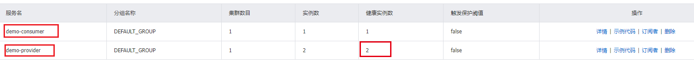

## 2、nacos安装

```sh
#下载安装
#地址：https://github.com/alibaba/nacos/releases

#启动
#linux
sh startup.sh -m standalone
#window
startup.sh -m standalone

#测试
#地址：http://localhost:8848/nacos
#账户密码：nacos:nacos
```


## 3、注册

```xml
        <dependency>
            <groupId>com.alibaba.cloud</groupId>
            <artifactId>spring-cloud-starter-alibaba-nacos-discovery</artifactId>
        </dependency>
```


## 4、服务见调用



生产者：提供两个实例，两个实例额端口号不一样

```java
@Value("${server.port}")
private String port;

@GetMapping("/test1")
public String test1(){
    return "hello: "+port;
}
```

消费者：负载均衡ribbon，resttemplate

```java
@Bean
@LoadBalanced
public RestTemplate restTemplate(){
    return new RestTemplate();
}

@GetMapping("/test1")
public String test1(){
    return restTemplate.getForObject("http://demo-provider/test1", String.class);
}
```


## 5、Nacos服务注册中心对比提升


## 各种服务注册中心对比

| 服务注册与发现框架 | CAP模型 | 控制台管理 | 社区活跃度      |
| ------------------ | ------- | ---------- | --------------- |
| Eureka             | AP      | 支持       | 低(2.x版本闭源) |
| Zookeeper          | CP      | 不支持     | 中              |
| Consul             | CP      | 支持       | 高              |
| Nacos              | AP/CP   | 支持       | 高              |

### CAP模型

​	计算机专家 埃里克·布鲁尔（Eric Brewer）于 2000 年在 ACM 分布式计算机原理专题讨论会（简称：PODC）中提出的分布式系统设计要考虑的三个核心要素：

​		一致性（Consistency）：同一时刻的同一请求的实例返回的结果相同，所有的数据要求具有强一致性(Strong Consistency)

​		可用性（Availability）：所有实例的读写请求在一定时间内可以得到正确的响应

​		分区容错性（Partition tolerance）：在网络异常（光缆断裂、设备故障、宕机）的情况下，系统仍能提供正常的服务

​	以上三个特点就是CAP原则（又称CAP定理），但是三个特性不可能同时满足，所以分布式系统设计要考虑的是在满足P（分区容错性）的前提下选择C（一致性）还是A（可用性），即：CP或AP


### CP原则：一致性 + 分区容错性原则

​	CP 原则属于强一致性原则，要求所有节点可以查询的数据随时都要保持一直（同步中的数据不可查询），即：若干个节点形成一个逻辑的共享区域，某一个节点更新的数据都会立即同步到其他数据节点之中，当数据同步完成后才能返回成功的结果，但是在实际的运行过程中网络故障在所难免，如果此时若干个服务节点之间无法通讯时就会出现错误，从而牺牲了以可用性原则（A），例如关系型数据库中的事务。


### AP原则：可用性原则 + 分区容错性原则

​	AP原则属于弱一致性原则，在集群中只要有存活的节点那么所发送来的所有请求都可以得到正确的响应，在进行数据同步处理操作中即便某些节点没有成功的实现数据同步也返回成功，这样就牺牲一致性原则（C 原则）。

​	使用场景：对于数据的同步一定会发出指令，但是最终的节点是否真的实现了同步，并不保证，可是却可以及时的得到数据更新成功的响应，可以应用在网络环境不是很好的场景中。

​	

## Nacos支持CP和AP

​	Nacos无缝支持一些主流的开源生态，同时再阿里进行Nacos设计的时候重复的考虑到了市场化的运作（市面上大多都是以单一的实现形式为主，例如：Zookeeper使用的是 CP、而 Eureka采用的是AP），在Nacos中提供了两种模式的动态切换。

​	


## Nacos 何时选择切换模式

	1. 一般来说，如果不需要储存服务界别的信息且服务实例通过nacos-client注册，并能够保持心跳上报，那么就可以选择AP模式。如Spring Cloud 和 Dubbo，都适用于AP模式，AP模式为了服务的可用性减弱了一致性，因此AP模式下只支持注册临时实例。

   	2. 如果需要在服务级别编辑或者储存配置信息，那么CP是必须的，K8S服务和DNS服务则是用于CP模式。CP模式下则支持注册持久化实例，此时则是以Raft协议为集群运行模式，该模式下注册实例之前必须先注册服务，如果服务不存在，则会返回错误。

 	3. 切换命令（默认是AP）：

```java
curl -X PUT '$NACOS_SERVER:8848/nacos/v1/ns/operator/switches?entry=serverMode&value=CP'
```


注意：临时和持久化的区别主要在健康检查失败后的表现，持久化实例健康检查失败后会被标记成不健康，而临时实例会直接从列表中被删除。


## 6、配置

```xml
        <dependency>
            <groupId> com.alibaba.cloud </groupId>
            <artifactId> spring-cloud-starter-alibaba-nacos-config </artifactId>
        </dependency>
```

bootstrap.yaml

```yaml
server:
  port: 9011
spring:
  application:
    name: demo-consumer
  cloud:
    discovery:
      server-addr: 127.0.0.1:8848
    config:
      server-addr: 127.0.0.1:8848
```

application.yaml

```yaml
spring:
  profiles:
    active: dev
```

配置中心

地址：127.0.0.1:8848

${prefix}-${spring.profiles.active}.${file-extension}

properties > yaml

比如：demo-consumer-dev.properties > demo-consumer-dev.yaml

自动配置更新：log可以，已经加载到程序里的还需要其他配置。


## 7、用户隔离

### 三者关系

​	这三者的关系类似于Java里面的package名和类名，最外层的Namespace是可以用于区分部署环境的，Group和DataID逻辑上区分两个目标对象。


**默认情况**

Namespace=public，Group=DEFAULT_GROUP，默认Cluster是DEFAULT

**具体情况**

​	Nacos默认的命名空间是public，我们就可以利用Namespace来实现隔离，比如我们现在有三个环境：开发、测试、生产环境，我们就可以创建三个Namespace，不同的N amespace之间是隔离的。

​	Group本身就是分组的意思，它可以把不同的微服务划分到同一个分组里面去。

​	剩下的就是具体微服务，一个Service可以包含多个Cluster，Nacos默认Cluster是DEFAULT，Cluster是对指定微服务的一个虚拟划分。比如说，将一个Service部署在北京和和杭州的机房中，北京机房的Service就可以起名为（BJ），杭州机房中的Service就可以起名为（HZ），这样就可以尽量让同一个机房的微服务互相调用，提升性能。


### 配置

```yaml
spring:
  application:
    name: demo-consumer
  cloud:
    nacos:
      discovery:
        server-addr: 127.0.0.1:8848
        namespace: dev
      config:
        server-addr: 127.0.0.1:8848
        file-extension: yaml
        namespace: dev
```

nacos的命令空间和spring的环境不要当成一个


## 集权安装

```sh
yum install -y unzip zip
unzip [file]
```


