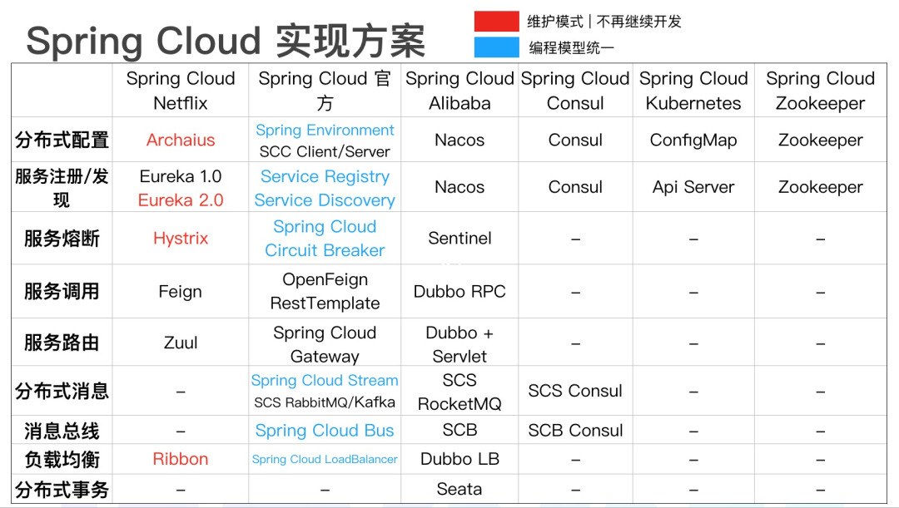
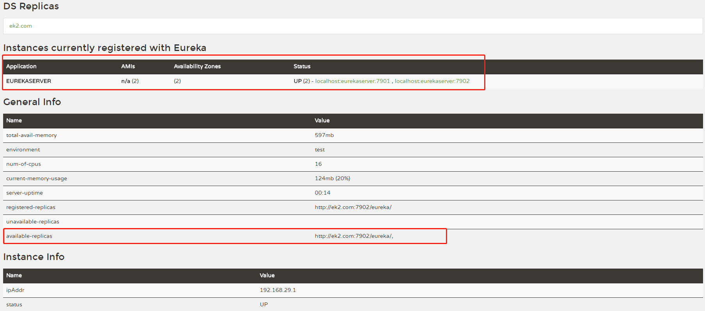
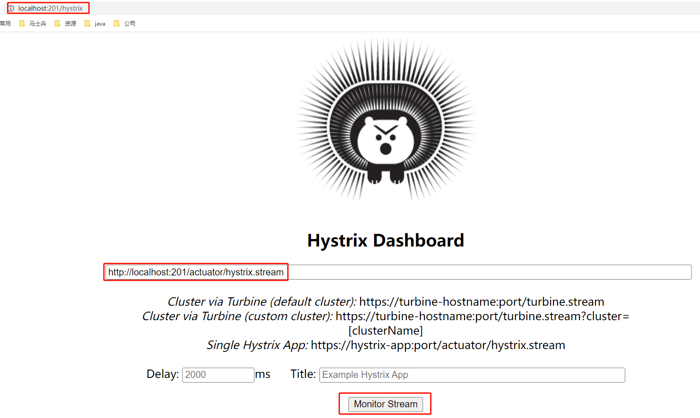
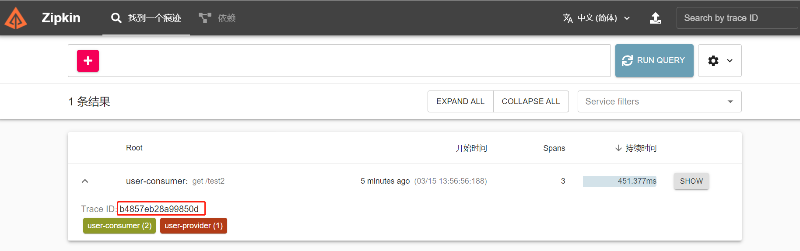
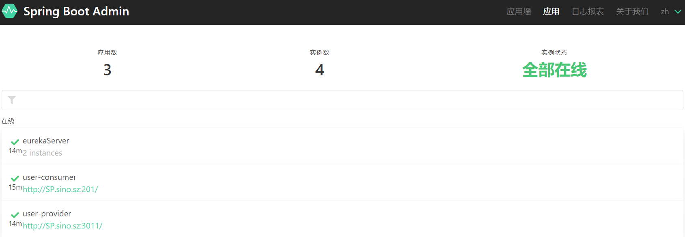
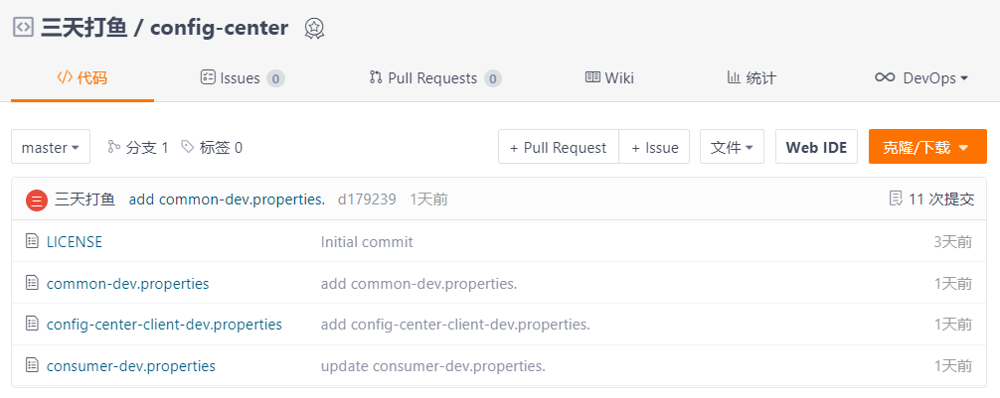

# 一、SpringCloud 框架一

## 1、SpringCloud生态




## 2、SpringCloud -> Alibaba

**[Sentinel](https://github.com/alibaba/Sentinel)**：把流量作为切入点，从流量控制、熔断降级、系统负载保护等多个维度保护服务的稳定性。

**[Nacos](https://github.com/alibaba/Nacos)**：一个更易于构建云原生应用的动态服务发现、配置管理和服务管理平台。

**[RocketMQ](https://rocketmq.apache.org/)**：一款开源的分布式消息系统，基于高可用分布式集群技术，提供低延时的、高可靠的消息发布与订阅服务。

**[Dubbo](https://github.com/apache/dubbo)**：Apache Dubbo™ 是一款高性能 Java RPC 框架。

**[Seata](https://github.com/seata/seata)**：阿里巴巴开源产品，一个易于使用的高性能微服务分布式事务解决方案。

**[Alibaba Cloud ACM](https://www.aliyun.com/product/acm)**：一款在分布式架构环境中对应用配置进行集中管理和推送的应用配置中心产品。

**[Alibaba Cloud OSS](https://www.aliyun.com/product/oss)**: 阿里云对象存储服务（Object Storage Service，简称 OSS），是阿里云提供的海量、安全、低成本、高可靠的云存储服务。您可以在任何应用、任何时间、任何地点存储和访问任意类型的数据。

**[Alibaba Cloud SchedulerX](https://help.aliyun.com/document_detail/43136.html)**: 阿里中间件团队开发的一款分布式任务调度产品，提供秒级、精准、高可靠、高可用的定时（基于 Cron 表达式）任务调度服务。

**[Alibaba Cloud SMS](https://www.aliyun.com/product/sms)**: 覆盖全球的短信服务，友好、高效、智能的互联化通讯能力，帮助企业迅速搭建客户触达通道。


# 二、SpringCloud -> Netfix

## 1、SpringCloud版本

Spring Cloud 自 2016 年 1 月发布第一个 Angel.SR5 版本，到目前 2020 年 3 月发布 Hoxton.SR3 版本。本次就是基于spring-boot 2.2.6.RELEASE 和 spring-cloud Hoxton.SR3

```xml
    <parent>
        <groupId>org.springframework.boot</groupId>
        <artifactId>spring-boot-starter-parent</artifactId>
        <version>2.2.6.RELEASE</version>
        <relativePath/>
    </parent>

    <properties>
        <java.version>1.8</java.version>
        <spring-cloud.version>Hoxton.SR3</spring-cloud.version>
    </properties>
```


## 2、eureka

- eureka：eureka来源于古希腊词汇，意为“发现了”

- eureka分为两部分，Server端和Client端

- Register：想要参与服务注册发现的实例首先需要向Eureka服务器注册信息

- Renew：**续租，心跳**，Eureka客户需要每30秒发送一次心跳来续租，更新通知Eureka服务器实例仍然是活动的。如果服务器在90秒内没有看到更新，它将从其注册表中删除实例

- Fetch Registry
  - Eureka客户端从服务器获取注册表信息并将其缓存在本地。
  - 之后，客户端使用这些信息来查找其他服务。
  - 通过获取上一个获取周期和当前获取周期之间的增量更新，可以定期(每30秒)更新此信息。
  - 节点信息在服务器中保存的时间更长(大约3分钟)，因此获取节点信息时可能会再次返回相同的实例。Eureka客户端自动处理重复的信息。
  - 在获得增量之后，Eureka客户机通过比较服务器返回的实例计数来与服务器协调信息，如果由于某种原因信息不匹配，则再次获取整个注册表信息。

- Cancel：Eureka客户端在关闭时向Eureka服务器发送取消请求。这将从服务器的实例注册表中删除实例，从而有效地将实例从通信量中取出。

- Time Lag：同步时间延迟，来自Eureka客户端的所有操作可能需要一段时间才能反映到Eureka服务器上，然后反映到其他Eureka客户端上。这是因为eureka服务器上的有效负载缓存，它会定期刷新以反映新信息。Eureka客户端还定期地获取增量。因此，更改传播到所有Eureka客户机可能需要2分钟。

- Communication mechanism：通讯机制，Http协议下的Rest请求，默认情况下Eureka使用Jersey和Jackson以及JSON完成节点间的通讯


### 2.1 eureka-server

```xml
<dependency>
    <groupId>org.springframework.cloud</groupId>
    <artifactId>spring-cloud-starter-netflix-eureka-server</artifactId>
</dependency>
```

配置-单机版

```properties
spring.application.name=eurekaServer
#是否注册到eureka上，单机版不需要,默认为true
eureka.client.register-with-eureka=false
#是否拉去eureka注册服务上，单机版不需要,默认为true
eureka.client.fetch-registry=false
#地址映射，配合hosts文件。直接使用地址可能会有问题
eureka.instance.hostname=ek1.com
```

配置-集群版

```properties
#application-ek1.properties
spring.application.name=eurekaServer
eureka.client.register-with-eureka=true 
eureka.client.fetch-registry=true
server.port=7901
#地址映射，配合hosts文件。直接使用地址可能会有问题，并且可以用于区分多个节点
eureka.instance.hostname=ek1.com
#注册地址
eureka.client.serviceUrl.defaultZone=http://ek2.com:7902/eureka/

#application-ek2.properties
spring.application.name=eurekaServer
eureka.client.register-with-eureka=true 
eureka.client.fetch-registry=true
server.port=7902
eureka.instance.hostname=ek2.com
eureka.client.serviceUrl.defaultZone=http://ek1.com:7901/eureka/
```

```java
@EnableEurekaServer
```

可视化界面：localhost:7901



### 2.2 eureka-client

```xml
<dependency>
    <groupId>org.springframework.cloud</groupId>
    <artifactId>spring-cloud-starter-netflix-eureka-client</artifactId>
</dependency>
```

```properties
#必要的配置
server.port=81
spring.application.name=provider
eureka.client.service-url.defaultZone=http://ek1.com:7901/eureka/

#元数据
eureka.instance.metadata-map.dalao=malaoshihahaha

#续约发送间隔默认30秒，心跳间隔
eureka.instance.lease-renewal-interval-in-seconds=5
#表示eureka client间隔多久去拉取服务注册信息，默认为30秒，对于api-gateway，如果要迅速获取服务注册状态，可以缩小该值，比如5秒
eureka.client.registry-fetch-interval-seconds=5
# 续约到期时间（默认90秒）
eureka.instance.lease-expiration-duration-in-seconds=60
#开启自我保护模式，默认为true，防止网络波动导致服务大规模的下线，超过85%服务没有发心跳包就不下线服务
eureka.server.enable-self-preservation=true
#失效服务间隔，一般是连续三次没有收到心跳包
eureka.server.eviction-interval-timer-in-ms=3000
```

### 2.3 apps

eureka提供服务接口：

- 获取注册服务列表：localhost:7901/eureka/apps

- 获取注册服务详情：localhost:7901/eureka/apps/{applications.application.name}

自定义元数据返回返回，并通过注册服务详情接口可以得到

```properties
#元数据
eureka.instance.metadata-map.dalao=malaoshihahaha
```

```html
<!--获取注册服务详情返回的自定义元数据-->      
<metadata>
    <dalao>malaoshihahaha</dalao>
    <management.port>81</management.port>
</metadata>
```


## 3、resttemplate

### 3.1 服务调用优化过程

```java
//通过EurekaClient获取服务列表，并选出自己需要的几点
@Autowired
private EurekaClient eurekaClient; 

@GetMapping("/client1")
public void client2(){
    final List<InstanceInfo> providers = eurekaClient.getInstancesByVipAddress("provider", false);
    for (InstanceInfo provider : providers) {
        String url =  "http://"+provider.getHostName()+":"+provider.getPort()+"/hello";
        RestTemplate restTemplate = new RestTemplate();
        final String resp = restTemplate.getForObject(url, String.class);
        System.out.println("resp="+resp);
    }
}

//通过负载均衡客户端选出LoadBalancerClient
@Autowired
private LoadBalancerClient lb;

@GetMapping("/client2")
public Object client2(){
    final ServiceInstance provider = lb.choose("provider");
    String url =  "http://"+provider.getHost()+":"+provider.getPort()+"/hello";
    RestTemplate restTemplate = new RestTemplate();
    final String resp = restTemplate.getForObject(url, String.class);
    System.out.println("resp="+resp);
    return resp;
}

//配置RestTemplate，简化操作
@Autowired
private RestTemplate restTemplate; //restTemplate没有默认支持ribbon，RestTemplate需要配置

@GetMapping("/client3")
public String client3(){
    return restTemplate.getForObject("http://provider/hello";, String.class);
}
@Bean
@LoadBalanced //restTemplate没有默认支持ribbon
public RestTemplate restTemplate(){
    RestTemplate restTemplate = new RestTemplate();
    return restTemplate;
}
```

### 3.2 过滤器

```java
public class LoggingClientHttpRequestInterceptor implements ClientHttpRequestInterceptor {
    @Override
    public ClientHttpResponse intercept(HttpRequest request, byte[] body, ClientHttpRequestExecution execution) throws IOException {
        System.out.println("拦截开始: " + ToStringBuilder.reflectionToString(request));
        final ClientHttpResponse response = execution.execute(request, body);
        System.out.println("拦截完成: " + ToStringBuilder.reflectionToString(response));
        return response;
    }
}
```

```java
@Bean
@LoadBalanced //restTemplate没有默认支持ribbon
public RestTemplate restTemplate(){
    RestTemplate restTemplate = new RestTemplate();
    restTemplate.setInterceptors(Collections.singletonList(new LoggingClientHttpRequestInterceptor()));
    return restTemplate;
}
```


## 4、openfeign

### 4.1 基本使用

```xml
<dependency>
    <groupId>org.springframework.cloud</groupId>
    <artifactId>spring-cloud-starter-openfeign</artifactId>
</dependency>
```

```java
@EnableFeignClients
```

```java
@FeignClient(name = "user-provider" /*, url="www.baidu.com"*/)
public interface UserFeign{
    @GetMapping("/getByName")
    String getByName(@RequestParam String name);
}
```

- 域名：通过注册中心的服务给出，或者通过参数直接给出


### 4.2 面向接口编程

生产者和消费者面向同一个接口

```java
//为服务方和调用发定义共有api
@RequestMapping("/User")
public interface RegisterApi {
	@GetMapping("/isAlive")
	public String isAlive();
}

//provider实现接口
@RestController
public class UserController implements RegisterApi {
	@Override
	public String isAlive() {
		return "ok";
	}
}

//consumer继承接口
@FeignClient(name = "user-provider")
public interface UserConsumerService extends RegisterApi {
}
```


### 4.3 请求参数

```java
@GetMapping("/findById")
public Object findById(@RequestParam("id") Integer id);

@PostMapping("/register")
public Object register(@RequestBody User user);
```


### 4.4 拦截器

（未实践）

```java
@Configuration
public class FeignAuthConfiguration {
	
	@Bean
	public BasicAuthRequestInterceptor basicAuthRequestInterceptor() {
		return new BasicAuthRequestInterceptor("root", "root");
	}
}

//在feign上加配置
@FeignClient(name = "service-valuation",configuration = FeignAuthConfiguration.class)
```


### 4.5 可选配置

```yaml
   feign:
     client: 
       config:  
         service-valuation: 
           connect-timeout: 5000
           read-timeout: 5000
           logger-level: full
```


## 5、ribbon

### 5.1 负载均衡

当系统面临大量的用户访问，负载过高的时候，通常会增加服务器数量来进行横向扩展（集群），多个服务器的负载需要均衡，以免出现服务器负载不均衡，部分服务器负载较大，部分服务器负载较小的情况。通过负载均衡，使得集群中服务器的负载保持在稳定高效的状态，从而提高整个系统的处理能力。

服务端负载均衡：在客户端和服务端中间使用代理，nginx。

客户端负载均衡：根据自己的情况做负载。Ribbon就是。

### 5.2 负载均衡算法

Ribbon是Netflix开发的客户端负载均衡器，为Ribbon配置**服务提供者地址列表**后，Ribbon就可以基于某种**负载均衡策略算法**，自动地帮助服务消费者去请求 提供者。Ribbon默认为我们提供了很多负载均衡算法，例如轮询、随机等。我们也可以实现自定义负载均衡算法。

默认实现：

ZoneAvoidanceRule（区域权衡策略）：复合判断Server所在区域的性能和Server的可用性，轮询选择服务器。

其他规则：

BestAvailableRule（最低并发策略）：会先过滤掉由于多次访问故障而处于断路器跳闸状态的服务，然后选择一个并发量最小的服务。逐个找服务，如果断路器打开，则忽略。

RoundRobinRule（轮询策略）：以简单轮询选择一个服务器。按顺序循环选择一个server。

RandomRule（随机策略）：随机选择一个服务器。

AvailabilityFilteringRule（可用过滤策略）：会先过滤掉多次访问故障而处于断路器跳闸状态的服务和过滤并发的连接数量超过阀值得服务，然后对剩余的服务列表安装轮询策略进行访问。

WeightedResponseTimeRule（响应时间加权策略）：据平均响应时间计算所有的服务的权重，响应时间越快服务权重越大，容易被选中的概率就越高。刚启动时，如果统计信息不中，则使用RoundRobinRule(轮询)策略，等统计的信息足够了会自动的切换到WeightedResponseTimeRule。响应时间长，权重低，被选择的概率低。反之，同样道理。此策略综合了各种因素（网络，磁盘，IO等），这些因素直接影响响应时间。

RetryRule（重试策略）：先按照RoundRobinRule(轮询)的策略获取服务，如果获取的服务失败则在指定的时间会进行重试，进行获取可用的服务。如多次获取某个服务失败，就不会再次获取该服务。主要是在一个时间段内，如果选择一个服务不成功，就继续找可用的服务，直到超时。


### 5.3 配置

```properties
#-----------------------------ribbon负载均衡配置，可选配置---------------------
#指定provider
provider.ribbon.NFLoadBalancerRuleClassName=com.netflix.loadbalancer.RandomRule
#不指定provider，对所有服务提供方都有效，实测没有生效，不知道为什么
ribbon.NFLoadBalancerRuleClassName=com.netflix.loadbalancer.RandomRule


#-----------------------------Ribbon脱离Eureka，可选配置---------------------
ribbon.eureka.enabled=false
ribbon.listOfServers=localhost:80,localhost:81


#-----------------------------ribbon重试重试配置，可选配置---------------------
#Feign默认支持Ribbon；Ribbon的重试机制和Feign的重试机制有冲突，所以源码中默认关闭Feign的重试机制,使用Ribbon的重试机制
#连接超时时间(ms)
ribbon.ConnectTimeout=1000
#业务逻辑超时时间(ms)
ribbon.ReadTimeout=2000
#同一台实例最大重试次数,不包括首次调用
ribbon.MaxAutoRetries=1
#重试负载均衡其他的实例最大重试次数,不包括首次调用
ribbon.MaxAutoRetriesNextServer=3
#是否所有操作都重试，get操作没有问题，post/put/delete操作会对资源进行修改，一般不重试
ribbon.OkToRetryOnAllOperations=false
```

- 不指定生产者配置都没有生效，不知道为什么。


## 6、hystrix

hystrix解决的是调用失败了怎么办

重试，重试几次，重试换提供方的节点吗 （ribbon负责，feign应该也行，但是与ribbon冲突，所以feign源码中自己关闭了超时），fallback，FallbackFactory

重试还是失败了怎么办 （回调，hystrix负责，失败了没办法只能返回一个友好的回应）

某个节点连续几次都失败怎么办，降级后多长时间再去试试 （降级，服务降级，ribbon负责）

某个接口所有节点的所有提供发都失败超时了怎么办（限流，隔离，提供方出现了问题，没办法解决，需要解决的是不让这个接口占用太多资源，从而影响其他接口），（熔断，直接返回，防止资源占用，但是这个一般在网关中负责）

### 6.1 hystrix作用

spring cloud 用的是 hystrix，是一个容错组件。

Hystrix实现了 超时机制和断路器模式。

Hystrix是Netflix开源的一个类库，用于隔离远程系统、服务或者第三方库，防止级联失败，从而提升系统的可用性与容错性。主要有以下几点功能：

1. 为系统提供保护机制。在依赖的服务出现高延迟或失败时，为系统提供保护和控制。
2. 防止雪崩。
3. 包裹请求：使用HystrixCommand（或HystrixObservableCommand）包裹对依赖的调用逻辑，每个命令在独立线程中运行。
4. 跳闸机制：当某服务失败率达到一定的阈值时，Hystrix可以自动跳闸，停止请求该服务一段时间。
5. 资源隔离：Hystrix为每个请求都的依赖都维护了一个小型线程池，如果该线程池已满，发往该依赖的请求就被立即拒绝，而不是排队等候，从而加速失败判定。防止级联失败。
6. 快速失败：Fail Fast。同时能快速恢复。侧重点是：（不去真正的请求服务，发生异常再返回），而是直接失败。
7. 监控：Hystrix可以实时监控运行指标和配置的变化，提供近实时的监控、报警、运维控制。
8. 回退机制：fallback，当请求失败、超时、被拒绝，或当断路器被打开时，执行回退逻辑。回退逻辑我们自定义，提供优雅的服务降级。
9. 自我修复：断路器打开一段时间后，会自动进入“半开”状态，可以进行打开，关闭，半开状态的转换。前面有介绍。

### 6.2 feign集成hystrix

```java
//启动类
@EnableCircuitBreaker

//feign
@FeignClient(name = "user-provider", fallbackFactory = WebError.class/*, fallback = AliveBack.class*/)

//回调 fallback
@Component
public class AliveBack implements UserFeign {
    @Override
    public String get() {
        return "get back.....";
    }
    @Override
    public String getByName(String name) {
        return "getByName back.....";
    }
}

//回调 fallbackFactory，回调时多了参数throwable，这样就可以对异常进习性一定的处理
@Component
public class WebError  implements FallbackFactory<UserFeign> {
    @Override
    public UserFeign create(Throwable throwable) {
        return new UserFeign() {
            @Override
            public String get() {
                if(throwable instanceof HystrixTimeoutException) {
                    System.out.println("超时");
                }else {
                    System.out.println("其他异常");
                }
                throwable.printStackTrace();
                return "get back.....";
            }

            @Override
            public String getByName(String name) {
                return "getByName back.....";
            }
        };
    }
}
```


### 6.3 可视化界面dashboard

```xml
		<dependency>
			<groupId>org.springframework.cloud</groupId>
			<artifactId>
				spring-cloud-starter-netflix-hystrix-dashboard
			</artifactId>
		</dependency>
```

```java
@EnableHystrixDashboard
```

- 健康上报http://localhost:201/actuator/hystrix.stream

- 图形化 http://localhost:201/hystrix




## 7、zuul

### 7.1 网关

网关是介于客户端（外部调用方比如app，h5）和微服务的中间层。她是后端的入口

微服务没有网关，会有下面的问题：

1. 客户端请求多个微服务，增加了客户端复杂性，每个微服务都要做用户认证，限流等，避免和多个微服务打交道的复杂性。

2. 有跨域问题，不在同一个域。

3. 认证复杂，每个服务都要独立认证，服务要求的权限不一致。

4. 难以重构。因为微服务被客户端调用着，重构难以实施。


Zuul是Netflix开源的微服务网关，核心是一系列过滤器。这些过滤器可以完成以下功能。

1. 是所有微服务入口，进行分发。
2. 身份认证与安全。识别合法的请求，拦截不合法的请求。
3. 监控。在入口处监控，更全面。
4. 动态路由。动态将请求分发到不同的后端集群。
5. 压力测试。可以逐渐增加对后端服务的流量，进行测试。
6. 负载均衡。也是用ribbon。
7. 限流（望京超市）。比如我每秒只要1000次，10001次就不让访问了。
8. 服务熔断

### 7.2 zuul-server

```xml
<dependency>
    <groupId>org.springframework.cloud</groupId>
    <artifactId>spring-cloud-starter-netflix-eureka-client</artifactId>
</dependency>
<dependency>
    <groupId>org.springframework.cloud</groupId>
    <artifactId>spring-cloud-starter-netflix-zuul</artifactId>
</dependency>
<dependency>
    <groupId>org.springframework.boot</groupId>
    <artifactId>spring-boot-starter-web</artifactId>
</dependency>
```

```properties
eureka.client.service-url.defaultZone=http://ek1.com:7901/eureka/
spring.application.name=zuulserver
server.port=80

management.endpoints.web.exposure.include=*
management.endpoint.health.show-details=always
management.endpoint.health.enabled=true
#允许查看微服务接口，貌似不需要了
management.endpoint.routes.enabled=true

#通过服务名配置（虚拟主机名）
zuul.routes.user-provider=/user-provider/**
#测试：127.0.0.1:80/user-provider/getByName ==》 127.0.0.1:3011/getByName

#自定义请求映射url，用于映射注册中心外部
zuul.routes.msb.path=/msb/**
zuul.routes.msb.url=http://mashibing.com
#测试：127.0.0.1:80/msb => http://mashibing.com

#前缀
#zuul.prefix=/api/v1
```

```java
@EnableZuulProxy
```

- zuul默认集成了：ribbon和hystrix。


## 8、sleuth & zipkin

### 8.1 链路追踪 

微服务之熵：故障定位难、容量预估难，资源浪费多，链路梳理难

链路追踪要考虑的几个问题

1. 探针的性能消耗。尽量不影响 服务本尊。
2. 易用。开发可以很快接入，别浪费太多精力。
3. 数据分析。要实时分析。维度足够。

Sleuth是Spring cloud的分布式跟踪解决方案。

1. span(跨度)，基本工作单元。一次链路调用，创建一个span，

   span用一个64位id唯一标识。包括：id，描述，时间戳事件，spanId,span父id。

   span被启动和停止时，记录了时间信息，初始化span叫：root span，它的span id和trace id相等。

2. trace(跟踪)，一组共享“root span”的span组成的树状结构 称为 trace，trace也有一个64位ID，trace中所有span共享一个trace id。类似于一颗 span 树。

3. annotation（标签），annotation用来记录事件的存在，其中，核心annotation用来定义请求的开始和结束。

   - CS(Client Send客户端发起请求)。客户端发起请求描述了span开始。
   - SR(Server Received服务端接到请求)。服务端获得请求并准备处理它。SR-CS=网络延迟。
   - SS（Server Send服务器端处理完成，并将结果发送给客户端）。表示服务器完成请求处理，响应客户端时。SS-SR=服务器处理请求的时间。
   - CR（Client Received 客户端接受服务端信息）。span结束的标识。客户端接收到服务器的响应。CR-CS=客户端发出请求到服务器响应的总时间。


### 8.2 zipkin-server

```sh
#下载资源，官网: https://zipkin.io/
cd F:\java\资料
java -jar zipkin.jar
```


### 8.3 sleuth-client | zipkin-server

sleuth收集跟踪信息通过http请求发送给zipkin server，zipkin将跟踪信息存储，以及提供RESTful API接口，zipkin ui通过调用api进行数据展示。

```xml
<!--Sleuth是Spring cloud的分布式跟踪解决方案。-->
<dependency>
    <groupId>org.springframework.cloud</groupId>
    <artifactId>spring-cloud-starter-sleuth</artifactId>
</dependency>
<!--zipkin是twitter开源的分布式跟踪系统，图形化界面-->
<dependency>
    <groupId>org.springframework.cloud</groupId>
    <artifactId>spring-cloud-starter-zipkin</artifactId>
</dependency>
```

```properties
spring.zipkin.base-url=http://localhost:9411/
spring.sleuth.sampler.rate=1
```

### 8.4 可视化界面

- 日志

```
INFO [user-provider,b4857eb28a99850d,e733975312ee3c76,true]
INFO [user-consumer,b4857eb28a99850d,b4857eb28a99850d,true]
traceId = b4857eb28a99850d
```

- 可视化界面：http://localhost:9411/zipkin




## 9、actuator & admin

### 9.1 actuator

```xml
<dependency>
    <groupId>org.springframework.boot</groupId>
    <artifactId>spring-boot-starter-actuator</artifactId>
</dependency>
```

```properties
management.endpoints.web.exposure.include=*
```

- 接口列表：http://localhost:81/actuator

- 日志级别：http://localhost:81/actuator/loggers

#### 9.1 actuator & eureka

```properties
#健康详情
management.endpoint.health.show-details=always
#是否允许eureka.client上报自己的状态，两个功能一样
eureka.client.healthcheck.enabled=true
management.endpoint.health.enabled=true
```

```java
@Service
@Data
public class HealthStatusService implements HealthIndicator {
    private boolean status = true;
    @Override
    public Health health() {
        //根据实际条件判断
        if(status){
            return new Health.Builder().up().build();
        }else {
            return new Health.Builder().down().build();
        }
    }
}
```

- 健康状态：http://localhost:81/actuator/health

#### 9.2 actuator & config-center

加入config-center-client依赖后会，会新增actuator接口

```xml
	<!--配置中心client-->
    <dependency>
        <groupId>org.springframework.cloud</groupId>
        <artifactId>spring-cloud-config-client</artifactId>
    </dependency>
	<!--消息总线-->
    <dependency>
        <groupId>org.springframework.cloud</groupId>
        <artifactId>spring-cloud-starter-bus-amqp</artifactId>
    </dependency>
```

http://localhost:71/actuator/refresh 只会更新单一节点（没用）

http://localhost:71/actuator/bus-refresh 会更新所有节点

http://localhost:70/actuator/bus-refresh 会更新所有节点，一般用于更新common文件，所有服务都会追踪common文件


### 9.2 admin

#### 9.2.1 admin-server

```xml
<dependency>
    <groupId>de.codecentric</groupId>
    <artifactId>spring-boot-admin-server</artifactId>
    <version>2.2.4</version>
</dependency>
<dependency>
    <groupId>de.codecentric</groupId>
    <artifactId>spring-boot-admin-server-ui</artifactId>
    <version>2.2.4</version>
</dependency>
```

```java
@EnableAdminServer
```

#### 9.2.2 admin-client

```xml
<dependency>
    <groupId>de.codecentric</groupId>
    <artifactId>spring-boot-admin-starter-client</artifactId>
    <version>2.2.4</version>
</dependency>
```

```properties
spring.boot.admin.client.url=http://localhost:8080
```

#### 9.2.3 可视化界面

http://localhost:8080/applications




## 10、配置中心 

### 10.1 config-center



### 10.2 config-server

```xml
<dependencies>
    <!--eureka服务器-->
    <dependency>
        <groupId>org.springframework.cloud</groupId>
        <artifactId>spring-cloud-starter-netflix-eureka-server</artifactId>
    </dependency>
    <dependency>
        <groupId>org.springframework.boot</groupId>
        <artifactId>spring-boot-starter-actuator</artifactId>
    </dependency>
    <!--配置中心-->
    <dependency>
        <groupId>org.springframework.cloud</groupId>
        <artifactId>spring-cloud-config-server</artifactId>
    </dependency>
	<!--总线-->
    <dependency>
        <groupId>org.springframework.cloud</groupId>
        <artifactId>spring-cloud-starter-bus-amqp</artifactId>
    </dependency>
</dependencies>
```

```properties
spring.application.name=config-center-server
server.port=70

eureka.client.service-url.defaultZone=http://ek1.com:7901/eureka/

management.endpoints.web.exposure.include=*

#配置中心git地址和默认分支
spring.cloud.config.server.git.uri=https://gitee.com/threeDayFishing/config-center.git
spring.cloud.config.label=master

#消息配置
spring.rabbitmq.host=10.1.20.112
spring.rabbitmq.port=5672
spring.rabbitmq.username=mashibing
spring.rabbitmq.password=mashibing
```

```java
@EnableConfigServer
//@EnableEurekaServer //并不启动服务器功能
```

### 10.3 config-client

```xml
<dependencies>
    <dependency>
        <groupId>org.springframework.boot</groupId>
        <artifactId>spring-boot-starter-web</artifactId>
    </dependency>
    <dependency>
        <groupId>org.springframework.boot</groupId>
        <artifactId>spring-boot-starter-actuator</artifactId>
    </dependency>
    <!--配置中心client-->
    <dependency>
        <groupId>org.springframework.cloud</groupId>
        <artifactId>spring-cloud-config-client</artifactId>
    </dependency>
	<!--消息总线-->
    <dependency>
        <groupId>org.springframework.cloud</groupId>
        <artifactId>spring-cloud-starter-bus-amqp</artifactId>
    </dependency>
</dependencies>
```

配置文件 bootstrap.properties

```properties
spring.application.name=config-center-client
management.endpoints.web.exposure.include=*

#直接URL方式查找配置中心
spring.cloud.config.uri=http://localhost:70/
#环境，分支，配置文件名
spring.cloud.config.profile=dev
spring.cloud.config.label=master
spring.cloud.config.name=${spring.application.name},common

#消息
spring.rabbitmq.host=10.1.20.112
spring.rabbitmq.port=5672
spring.rabbitmq.username=mashibing
spring.rabbitmq.password=mashibing
```

- config-client 赵 config-server，config-client找config-center，config-center相当于一个仓库

- 远程配置文件由 name-profile.properties 组成

- 服务配置文件名为bootstrap.properties
- spring.cloud.config.name=${spring.application.name},common  远程配置文件可以追踪多个

更新配置

http://localhost:71/actuator/refresh 只会更新单一节点（没用）

http://localhost:71/actuator/bus-refresh 会更新所有节点

http://localhost:70/actuator/bus-refresh 会更新所有节点，一般用于更新common文件，所有服务都会追踪common文件

### 10.4 rabbitmq-server

```sh
cd /etc/local/rabbitmq/sbin
./rabbitmq-plugins enable rabbitmq_management #启动web
./rabbitmq-server -detached #后台启动，没有启动成功返回，只有一行警告日志
#访问：10.1.20.122:15672
```


