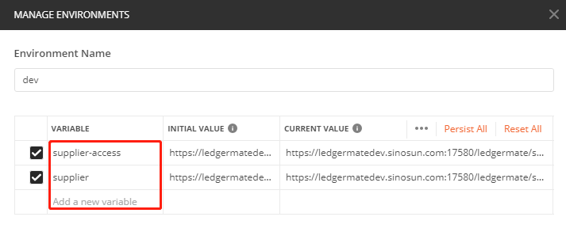

# 一、postman

## 1、安装

- window下傻瓜式安装即可
- 账户密码：476567162@qq.com:sp602157


## 2、environments

### 2.1 环境


### 2.2 变量



### 2.3 测试


## 3、pre & test

### 3.1 pre

```js
const req = {
  url: 'https://bplusdev.sinosun.com:18180/mallvop/auth/v1/fastGetAccessToken?channelId=1001',
  method: 'GET'
};

pm.sendRequest(req, function (err, res) {
  console.log(err ? err : res.json());
  var token = res.json().result.accessToken;
  token = "Bearer "+token;
  pm.globals.set("token", token);
});
```

### 3.2 test

```sh
pm.test("Status code is 200", function () {
    pm.response.to.have.status(200);
});
var jsonData = JSON.parse(responseBody)
pm.environment.set("vop_open_token", "Bearer "+jsonData.result.accessToken);
```


## 4、文件

### 4.1 form-date


### 


# 二、jmeter


# 三、Fiddler


# 四、wireshark

官网：www.wireshark.org

## 1、过滤条件

数据链路层：
筛选mac地址为04:f9:38:ad:13:26的数据包----eth.src == 04:f9:38:ad:13:26
筛选源mac地址为04:f9:38:ad:13:26的数据包----eth.src == 04:f9:38:ad:13:26
网络层：
筛选ip地址为192.168.1.1的数据包----ip.addr == 192.168.1.1
筛选192.168.1.0网段的数据---- ip contains "192.168.1"
筛选192.168.1.1和192.168.1.2之间的数据包----ip.addr == 192.168.1.1 && ip.addr == 192.168.1.2
筛选从192.168.1.1到192.168.1.2的数据包----ip.src == 192.168.1.1 && ip.dst == 192.168.1.2
传输层：
筛选tcp协议的数据包----tcp
筛选除tcp协议以外的数据包----!tcp
筛选端口为80的数据包----tcp.port == 80
筛选12345端口和80端口之间的数据包----tcp.port == 12345 && tcp.port == 80
筛选从12345端口到80端口的数据包----tcp.srcport == 12345 && tcp.dstport == 80
应用层：
特别说明----http中http.request表示请求头中的第一行（如GET index.jsp HTTP/1.1），http.response表示响应头中的第一行（如HTTP/1.1 200 OK），其他头部都用http.header_name形式。
筛选url中包含.php的http数据包----http.request.uri contains ".php"
筛选内容包含username的http数据包----http contains "username"