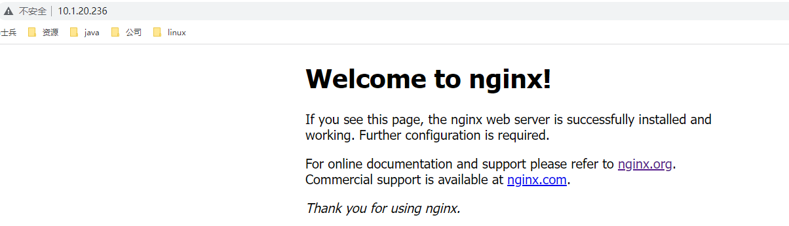

# 前言

## 1、资源

代码：git@github.com:spsunpeng/javaWeb.git

## 2、概念

- 文本交互语言：由文本和标记符组成，文本是内容，标记符是就是标记。如HTML，标记可以告诉浏览器如何显示文本（如：文字如何处理，图片如何排版）。

- HTML：页面内容，是文本标记语，标记可以告诉浏览器如何显示文本。

- CSS：页面布局，是层叠样式表单。是用于(增强)控制网页样式并允许将样式信息与网页内容分离的一种标记性语言。 增强html的功能

- jsp：动态页面

- javaScript：交互性（信息动态交互）、安全性（不允许直接访问本地硬盘）、跨平台性（只要是可以解释JS的浏览器都行，和平台无关）

- Query：js最常用的类库

- xml: 可扩展标记语言，可扩展的意思是可以自定义标签 ，用来保存数据而且这些数据有自我描述性，也可以作为项目或模块的配置 文件

- javaWeb: 所有通过java语言编写，可以通过浏览器访问的程序的总称

- Servlet：server applet
  - Servlet是javaEE的规范之一。规范就是接口。
  - Servlet是javaWeb三大组件之一，三大组件：Servlet程序、Filter过滤器、Listener监听器。
  - Servlet是运行再服务器上的程序，可以接受和相应客户端的请求。

- Tomcat：常用的web服务器。Tomcat =  Servlet支持 + jsp支持 + javaWeb容器


# 一、http

## 1、http协议

### 1.1 定义

- http：超文本传输协议。超文本：文本，图片，html文件(超文本标记语言)


- http请求报文


- http响应报文


### 1.2 特点

- 支持客户-服务器模式

  HTTP协议支持客户端服务端模式，需要使用浏览器作为客户端来访问服务端。

- 简单快速

  客户向服务器请求服务时，只需传送请求方法和路径。**请求方法常用的有GET、POST等**。每种方法规定了客户与服务器联系的类型不同。由于HTTP协议简单，使得HTTP服务器的程序规模小，因而通信速度很快。

- **灵活**

  HTTP允许传输任意类型的数据对象。正在传输的类型由**Content-Type**（Content-Type是HTTP包中用来表示内容类型的标识）加以标记。

- **无连接**

  每次请求一次，释放一次连接。所以无连接表示每次连接只能处理一个请求。优点就是节省传输时间，实现简单。我们有时称这种无连接为短连接。对应的就有了长链接，长连接专门解决效率问题。当建立好了一个连接之后，可以多次请求。但是缺点就是容易造成占用资源不释放的问题。当HTTP协议头部中字段**Connection：keep-alive**表示支持长链接。

- 单向性

  服务端永远是被动的等待客户端的请求。

- **无状态**

  HTTP协议是无状态协议。无状态是指协议对于事务处理没有记忆能力。缺少状态意味着如果后续处理需要前面的信息，则它必须重传，这样可能导致每次连接传送的数据量增大。另一方面，在服务器不需要先前信息时它的应答就较快。为了解决HTTP协议无状态，于是，两种用于保持HTTP连接状态的技术就应运而生了，一个是Cookie，而另一个则是Session。


### 1.3 历史

- http0.9

- http1.0

  最早在1996年在网页中使用，内容简单，所以浏览器的每次请求都需要与服务器建立一个TCP连接，服务器处理完成后立即断开TCP连接（**无连接**），服务器不跟踪每个客户端也不记录过去的请求（无状态）,请求只能由客户端发起（单向性）。

- http1.1

  到1999年广泛在各大浏览器网络请求中使用，HTTP/1.0中默认使用Connection: close。在HTTP/1.1中已经默认使用**Connection: keep-alive（长连接）**，避免了连接建立和释放的开销，但服务器必须按照客户端请求的先后顺序依次回送相应的结果，以保证客户端能够区分出每次请求的响应内容。通过Content-Length字段来判断当前请求的数据是否已经全部接收。不允许同时存在两个并行的响应。

  HTTP 1.1支持持久连接（HTTP/1.1的默认模式使用带流水线的持久连接），在一个TCP连接上可以传送多个HTTP请求和响应，减少了建立和关闭连接的消耗和延迟。一个包含有许多图像的网页文件的多个请求和应答可以在一个连接中传输，但每个单独的网页文件的请求和应答仍然需要使用各自的连接。HTTP 1.1还允许客户端不用等待上一次请求结果返回，就可以发出下一次请求，但服务器端必须按照接收到客户端请求的先后顺序依次回送响应结果，以保证客户端能够区分出每次请求的响应内容，这样也显著地减少了整个下载过程所需要的时间。

- **http2.0**

  - 长连接：在HTTP/2中，客户端向某个域名的服务器请求页面的过程中，只会创建一条TCP连接。
  - 多路复用 (Multiplexing)：在HTTP1.x中，我们是通过文本的方式传输数据。在HTTP2.0中引入了新的编码机制，所有传输的数据都会被分割，并采用二进制格式编码。不同的request可以使用同一个连接传输（最后根据每个request上的id号组合成正常的请求）。
  - 首部压缩（Header Compression）：由于1.1中header带有大量的信息，并且得重复传输，2.0使用encoder来减少需要传输的hearder大小。

  - 服务端推送（Server Push）：在HTTP2.0中，服务端可以在客户端某个请求后，主动推送其他资源。

  - 更安全：HTTP2.0使用了tls的拓展ALPN做为协议升级，除此之外，HTTP2.0对tls的安全性做了近一步加强，通过黑名单机制禁用了几百种不再安全的加密算法。

- http3.0 

  - HTTP3基于UDP协议重新定义了连接，在QUIC层实现了无序、并发字节流的传输，解决了队头阻塞问题（包括基于QPACK解决了动态表的队头阻塞）；

  - HTTP3重新定义了TLS协议加密QUIC头部的方式，既提高了网络攻击成本，又降低了建立连接的速度（仅需1个RTT就可以同时完成建链与密钥协商）；

  - HTTP3 将Packet、QUIC Frame、HTTP3 Frame分离，实现了连接迁移功能，降低了5G环境下高速移动设备的连接维护成本。

- **https1.2**

  - HTTP + SSL/TLS1.2 = HTTPS1.3

  - 由于HTTP的消息传输的安全隐患，于是网景公司在1994年设计了SSL（Secure Sockets Layer，安全套接字层）

- **https1.3**

  - HTTP + TLS1.3 = HTTPS1.3

  - 新一代的 HTTP/2 协议的支持需以 HTTPS 为基础。


### 1.4 持久连接


1. 长短连接都是针对TCP连接而言，强调的是应用层对于TCP连接的使用姿势。
2. HTTP1.1 Keep-alive是对TCP连接的折中使用，既不是短连接，也不能称为典型的长连接。官方称持久连接


如果时长连接什么时候断开连接？

1. 客户端**IE默认的KeepAliveTimeout是1分钟[1]**；
2. 服务器**IIS默认ConnectionTimeout时长是2min[2]**
3. 服务器**ASP.NetCore Kestrel默认的KeepAliveTimeout=130s[3]**
4. 服务器**nginx默认的keepalive_timeout=60s[4]**


## 2、http-前端

### 2.1 idea-html

- idea -> new -> project -> Static Web ->  Static Web

- 右键项目名 -> 新建HTML

```HTML
<!DOCTYPE html> <!--约束声明-->
<html lang="zh_CH"> <!--标签：表示开始，lang="en"表示语言是中文-->
<head> <!--标签：表示网页的标题-->
    <meta charset="UTF-8">
    <title>标题</title>
</head>
<body> <!--标签：表示主体-->
    hello
    <button onclick="alert('提示内容')">按钮</button> <!--标签：按钮-->
    上面<br/>下面 <!--单标签：换行-->
</body>
</html>
```

- 单标签：<单标签/>

- 双标签：<双标签头></双标签尾>

  

### 2.2 jsp

- jsp：Java Server Pages，java服务器页面，是一种动态网页开发技术。它**使用JSP标签在HTML网页中插入Java代码**。（java代码与html页面的交互）

作用1：帮助浏览器转发，并且可以设置访问方式

页面访问：127.0.0.1/method.jsp

转发：127.0.0.1/method（post方法）

method.jsp

```jsp
<html>
<head>
    <title>Title</title>
</head>
<body>
    <form action="method" method="post">
        <input type="submit" value="转发">
    </form>
</body>
</html>
```


## 3、http-后端

### 3.1 web和tomcat

- 场景：web，浏览器和服务器之间传输数据

- http：超文本传输协议。解决不同浏览器向服务器传输数据时的差异

- servlet：Server applet，web的小服务程序。解决动态(实时)数据相应的问题，固定的页面可以直接返回，但多数情况都不是预想配置好的页面，这时就需要将数据转化为页面，这个转化的功能就叫Server applet。

  java与网络


### 3.2 客户端到服务端


### 3.3 myTomcat


## 4、http & java

### 4.1 request & response

| 类型                      | url              | header                                                       | body                                        |
| ------------------------- | ---------------- | ------------------------------------------------------------ | ------------------------------------------- |
| GET<br />?name=sp         | /h1?name=sp      | 无                                                           | Query String Paramters<br />name:sp         |
| GET<br />/{name}          | /h1/sunpeng      | 无                                                           | 无                                          |
| POST<br />前端form表单    | /h1              | application/x-www-form-urlencoded                            | Form Data<br />name:sp                      |
| POST<br />前端json        | /h1              | application/json                                             | request payload<br />{"name":"sp"}          |
| POST<br />body-form-data  | /h1              | multipart/form-data                                          | request body<br />name: "sp"                |
| POST<br />body-x-www-from | /h1              | application/x-www-form-urlencoded                            | request body<br />name: "sp"                |
| POST<br />body-row-json   | /h1              | application/json                                             | request body<br />{"name":"sp"}             |
| POST<br />body-row-text   | /h1              | text/plain                                                   | request body<br />name->sp                  |
| GET<br />body-x-www-form  | /h1              | application/x-www-form-urlencoded                            | request body<br />name: "sp"                |
| body-binary-.txt          | /h1              | text/plain                                                   | request body<br />/D:/sunpeng/桌面/abc.txt  |
| body-binary-.xlsx         | /h1              | application<br />/vnd.openxmlformats<br />-officedocument<br />.spreadsheetml.sheet | request body<br />/D:/sunpeng/桌面/abc.xlsx |
| body-binary-.png          | /h1              | image/png                                                    | request body<br />/D:/sunpeng/桌面/abc.png  |
|                           |                  |                                                              |                                             |
|                           |                  |                                                              |                                             |
|                           |                  |                                                              |                                             |
| **类型**                  | **@RequestBody** | **springmvc参数接收**                                        | **流接收**                                  |
| GET<br />?name=sp         | 400              | name:sp                                                      | 无                                          |
| GET<br />/{name}          | 400              | 需要@PathVariable("name")                                    | 无                                          |
| POST<br />前端form表单    | 415              | name:sp(猜测)                                                | name=sp&age=18                              |
| POST<br />前端json        | name:sp          | name:null(猜测)                                              | 未验证，应该有                              |
| POST<br />body-form-data  | 415              | name:sp                                                      | 无（可能被认为是文本）                      |
| POST<br />body-x-www-form | 415              | name:sp                                                      | name=sp&age=18                              |
| POST<br />body-row-json   | name:sp          | name:null                                                    | {"name":"sp"}                               |
| POST<br />body-row-text   | 415              | name:null                                                    | name->sp                                    |
| GET<br />body-x-www-form  | 415              | name:null                                                    | name=sp&age=18                              |
| body-binary-.txt          |                  |                                                              | 文件内容                                    |
| body-binary-.xlsx         |                  |                                                              | 乱码                                        |
| body-binary-.png          |                  |                                                              | 乱码                                        |

代码：

- get & post
  - 不同点：请求行中的请求方法不一样
  - get可以放请求体吗？理论上可以，无论什么方法都遵循http报文格式，即使从页面或者postman中不展示出来，但是请求体依然存在，可以从流中取出数据。但实际中禁止使用。

- 参数 & form表单 & json & form-data

  - 参数在请求行中；form表单在请求体中，且请求头中content-type:application/x-www-form-urlencoded；json也在请求体中，且请求头content-type:application/json。 form-data下面单独讨论。
- 流接收：流接收真实地反映了http报文的格式。参数格式的请求在流中获取不到，
  
  - springmvc接收：springmvc对http报文的内容做了处理，参数可以接收多种格式：param，form表单，form-data。造成了它们是同一种类型的错觉。json格式的数据需要为入参增加注解@ResquestBody，请求放的content-type必须是application/json。
- springmvc参数：单独字段(String name) 和 封装到Object中的字段(Object(String name))之间没有区别，都是按照名字接收值，都可以用@ResquestBody注解，虽然有些用法不符合习惯。注意@ResquestBody只能有一个。

- form-data & binary

  - form-data有两种格式：File 和 Test，File可以上传文件，Test和x-www-form-urlencoded很像。它俩的类型都是multipart/form-data（协议来自rfc2388）。File不局限文件类型，无论何种文件类型，类型都是multipart/form-data。

    并且流接收为空。

    - File用MultipartFile类型接收，MultipartFile的全限定名为org.springframeword.web.multipart，springmvc接收处理。
    - Test正常接收即可。

  - binary是postman提供一个传输文件的集合体，具体什么类型根据文件名后缀决定。如text/plain，image/png，application/vnd.openxmlformats-officedocument.spreadsheetml.sheet。
  - binary和form-data-File功能很相似，都是上传文件。但是form-data的类型始终是multipart/form-data，而binary的类型根据具体文件类型变化。springmvc自动用MultipartFile类接收，流中已取出，开发者获取时为空。而binary需要自己从流中取。

- HttpServletRequest & param & @RequestBody

  - HttpSevletRequest 是 servlet提供的接收请求的类，HttpRequest是spring提供的。具体区别还不清楚。servlet会将请求报文信息封装进去，通过它获取到的信息算是最真实的报文信息。（servlet对报文进行了封装，处理请求行，springmvc对请求体进行了封装，）

  - springmvc接收参数的方式可以是对象Object,String,基本类型。但是这些基本没有区别。举个例子，请求方name=sunpeng，可以用String name接收，也可以用请求体中的字段接收比如User(String name)。如果用 int 接收，会返回400参数类型错误，那么name=123，int就可以接收成功了。所以，http是不区分语言的，网络传输时就是一串字节流，双方用同一个编解码格式就行，比如UTF-8，类中还可以定义序列化格式就是为了这个吧，然后将字节流转换为字符流，请求行是按照空格分隔固定的，请求头是key:value字符对，而请求体由请求头中的content-type说了算。@RequestParam可能规定是参数。
  - @RequestBody是spring提供的注解，声明请求体是json类型，级content-type如果不是application/json，就会返回415不支持的类型。@RequestBody一般用在Object上，比如@RequestBody User user, 但它也可以用在@RequestBody String name上，也可以用在@RequestBody int name上。
  - http是数据流，取出来一次里面就没有了。所以，流与参数是互相影响的。spring框架中，参数优先级高于httpservletrequest，MultipartFile即使开发者不接收，框架也会自动接收，httpservletrequest中的params和流，谁在前谁优先级高。

- int类型不穿参数报错：500


### 4.2 状态码

| 状态码 | 定义                                                         |
| ------ | ------------------------------------------------------------ |
| 302    | 重定向                                                       |
| 304    | 缓存，并未真正请求服务器。F5得到可能是缓存，ctrl+F5强制刷新。 |
| 400    | 参数错误（可能是参数类型，也可能是必传字段，请求参数/cookic/token过长） |
| 401    | 未授权（一般是header的token错误）                            |
| 403    | 权限不足（一般是header的token错误）                          |
| 404    | 未找到资源（url错误）                                        |
| 405    | 方法错误（method错误）                                       |
| 415    | 不支持的类型， header content-type错误                       |
| 500    | 服务内部错误                                                 |
|        |                                                              |

F5可能得到的是浏览器缓存的数据，如果是浏览器缓存则会返回304，ctrl+F5强制刷新才可以保证一定是一次重新的请求

### 4.3 http & java

#### 4.3.1 java.net & servlet

java.net是 java 提供请求的类库，servlet 是 java 提供的相应的类库。

-  java.net

```java
import org.apache.poi.xssf.streaming.SXSSFWorkbook;

import java.io.DataOutputStream;
import java.net.HttpURLConnection;
import java.net.URL;

public class HttpNet {

    public void httpSend(String promoteUrl, SXSSFWorkbook workbook) throws Exception {
        // 创建连接
        URL url = new URL(promoteUrl);
        // 连接
        HttpURLConnection connection = (HttpURLConnection) url.openConnection();
        // 设置http连接属性，http正文内，因此需要设为true, 默认情况下是false;
        connection.setDoOutput(true);
        // 设置是否从httpUrlConnection读入，默认情况下是true;
        connection.setDoInput(true);
        // 可以根据需要 提交 GET、POST、DELETE、PUT等http提供的功能
        connection.setRequestMethod("PUT");
        // 设置字符类型
        connection.setRequestProperty("Charsert", "UTF-8");
        // 设置请求体格式
        connection.setRequestProperty("Content-Type", "application/vnd.openxmlformats-officedocument.spreadsheetml.sheet");
        connection.connect();
        // POST请求
        DataOutputStream out = new DataOutputStream(connection.getOutputStream());
        workbook.write(out);
        //关闭连接
        out.flush();
        out.close();
        //响应
        System.out.println("responseCode = "+ connection.getResponseCode());
        connection.disconnect();
    }
}
```

- servlet

```xml
<?xml version="1.0" encoding="UTF-8"?>
<web-app xmlns="http://xmlns.jcp.org/xml/ns/javaee"
         xmlns:xsi="http://www.w3.org/2001/XMLSchema-instance"
         xsi:schemaLocation="http://xmlns.jcp.org/xml/ns/javaee http://xmlns.jcp.org/xml/ns/javaee/web-app_4_0.xsd"
         version="4.0">

    <servlet>
        <servlet-name>helloServlet</servlet-name>
        <servlet-class>com.mahsibing.Controller.HelloServlet</servlet-class>
    </servlet>

    <servlet-mapping>
        <servlet-name>helloServlet</servlet-name>
        <url-pattern>/hello</url-pattern>
    </servlet-mapping>

</web-app>
```

```java
import javax.servlet.ServletException;
import javax.servlet.http.HttpServlet;
import javax.servlet.http.HttpServletRequest;
import javax.servlet.http.HttpServletResponse;
import java.io.IOException;

public class HelloServlet extends HttpServlet {

    @Override
    protected void doGet(HttpServletRequest req, HttpServletResponse resp) throws ServletException, IOException {
        String username = req.getParameter("username");
        req.getSession().setAttribute("username", username);
        //转发
        req.getRequestDispatcher("index.jsp").forward(req, resp);
    }

    @Override
    protected void doPost(HttpServletRequest req, HttpServletResponse resp) throws ServletException, IOException {
        doGet(req, resp);
    }
}
```


#### 4.3.2 httpClient - client

HttpClient 是 Apache软件基金会 提供的 请求的类库。

​    Apache软件基金会（也就是Apache Software Foundation，简称为ASF）是专门为运作一个开源软件项目的Apache 的团体提供支持的非盈利性组织，这个开源软件的项目就是 Apache 项目。

```java
import com.fasterxml.jackson.databind.ObjectMapper;
import com.msb.client.bean.Person;
import org.apache.http.HttpEntity;
import org.apache.http.NameValuePair;
import org.apache.http.client.entity.UrlEncodedFormEntity;
import org.apache.http.client.methods.CloseableHttpResponse;
import org.apache.http.client.methods.HttpGet;
import org.apache.http.client.methods.HttpPost;
import org.apache.http.client.utils.URIBuilder;
import org.apache.http.entity.ContentType;
import org.apache.http.entity.StringEntity;
import org.apache.http.impl.client.CloseableHttpClient;
import org.apache.http.impl.client.HttpClients;
import org.apache.http.message.BasicNameValuePair;
import org.apache.http.util.EntityUtils;
import org.junit.Test;

import java.io.IOException;
import java.util.ArrayList;
import java.util.List;

/**
 * @author sunpeng
 * @Date 2021-07-19 10:16
 */
public class Demo {
    @Test
    public void get() throws Exception{
        //浏览器
        CloseableHttpClient httpClient = HttpClients.createDefault();
        //url
        URIBuilder uriBuilder = new URIBuilder("http://127.0.0.1:8080/demoGet");
        //参数
        uriBuilder.addParameter("string", "abc");
        //执行方法
        HttpGet get = new HttpGet(uriBuilder.build());
        //执行
        CloseableHttpResponse response = httpClient.execute(get);
        //响应体
        String result = EntityUtils.toString(response.getEntity(), "utf-8");
        System.out.println(result);
    }

    @Test
    public void post() throws Exception{
        CloseableHttpClient httpClient = HttpClients.createDefault();
        //url
        URIBuilder uriBuilder = new URIBuilder("http://127.0.0.1:8080/demoPost");
        //发法
        HttpPost httpPost = new HttpPost(uriBuilder.build());
        //参数：请求体
        List<NameValuePair> params = new ArrayList<>();
        params.add(new BasicNameValuePair("name", "sunpeng"));
        params.add(new BasicNameValuePair("id", "1"));
        HttpEntity httpEntity = new UrlEncodedFormEntity(params, "utf-8");
        httpPost.setEntity(httpEntity);
        //执行
        CloseableHttpResponse response = httpClient.execute(httpPost);
        //响应体
        String result = EntityUtils.toString(response.getEntity(), "utf-8");
        System.out.println(result);
        //json
        ObjectMapper mapper = new ObjectMapper();
        Person person = mapper.readValue(result, Person.class);
        System.out.println(person);
    }

    @Test
    public void jsonBody() throws  Exception{

        //浏览器
        CloseableHttpClient httpClient = HttpClients.createDefault();
        //url、方法
        HttpPost post = new HttpPost("http://localhost:8080/json");
        //请求体
        Person person = new Person(12L, "jia");
        ObjectMapper mapper = new ObjectMapper();
        String json = mapper.writeValueAsString(person);
        StringEntity entity = new StringEntity(json, ContentType.APPLICATION_JSON);
        post.setEntity(entity);
        //执行
        CloseableHttpResponse response = httpClient.execute(post);
        //响应
        String result = EntityUtils.toString(response.getEntity());
        System.out.println(result);
        //关闭连接
        response.close();
        httpClient.close();

    }
}

```


#### 4.3.3 restTemplate & springmvc

RestTemplate 是spring提供的请求的类库，springmvc是spring提供的响应框架。

pivotal公司是由EMC和VMware联合成立的一家公司，spring是他下面的一个team在维护：The Spring team。

```java
import com.sinosun.bplus.activitystudio.backend.user.error.UserErrorCode;
import com.sinosun.bplus.bizcloud.common.exception.BusinessException;
import com.sinosun.bplus.bizcloud.common.util.JsonUtil;
import org.slf4j.Logger;
import org.slf4j.LoggerFactory;
import org.springframework.beans.factory.annotation.Value;
import org.springframework.http.HttpEntity;
import org.springframework.http.HttpHeaders;
import org.springframework.stereotype.Service;
import org.springframework.util.LinkedMultiValueMap;
import org.springframework.util.MultiValueMap;
import org.springframework.web.client.RestTemplate;

import java.util.HashMap;
import java.util.Map;
import java.util.Objects;

/**
 * @author sunpeng
 * @date 2022-07-28 10:42
 */
@Service
public class CustomedAuthService {

    private static final Logger LOGGER = LoggerFactory.getLogger(UserService.class);

    private static final RestTemplate restTemplate = new RestTemplate();

    private static final String VALIDATE_PASSWORD_PATH = "/bplus_user_defined/validatePassword";

    @Value("${keycloak.auth-server-url}")
    private String authServerUrl;

    @Value("${keycloak.realm}")
    private String realm;


    /**
     * 校验密码
     * @param userId 用户id
     * @param password 用户密码
     */
    public void checkPassword(String userId, String password){
        //地址
        String url = authServerUrl + "/realms/" + realm + VALIDATE_PASSWORD_PATH;
        //请求头
        HttpHeaders headers = new HttpHeaders();
        headers.set("Content-Type", "application/x-www-form-urlencoded");
        //请求体
        Map<String, String> request = new HashMap<>();
        MultiValueMap<String, String> params = new LinkedMultiValueMap<>();
        params.add("userId", userId);
        params.add("password", password);
        //httpEntity
        HttpEntity httpEntity = new HttpEntity<>(params, headers);
        //请求
        LOGGER.info("invoke customedAuth validatePassword: url={}, request={}", url, JsonUtil.obj2String(request));
        Map response = restTemplate.postForObject(url, httpEntity, Map.class);
        LOGGER.info("invoke customedAuth validatePassword: url={}, response={}", url, JsonUtil.obj2String(response));
        //响应
        if(Objects.isNull(response) || !"0".equals(response.get("resultCode"))){
            throw new BusinessException(UserErrorCode.USER_OR_PASSWORD_ERROR);
        }
    }
}
```


#### 4.3.4 feign/openFeign - client

feign底层是okhttp或resttemplate，openFeign是在feign的基础上支持spring注解。让客户端和服务器看起来统一。

```java
import com.msb.userapi.controller.UserController;
import com.msb.userconsumer.hystrix.AliveBack;
import com.msb.userconsumer.hystrix.WebError;
import org.springframework.cloud.openfeign.FeignClient;
import org.springframework.context.annotation.Configuration;
import org.springframework.web.bind.annotation.GetMapping;
import org.springframework.web.bind.annotation.RequestParam;

@FeignClient(name = "user-provider", fallbackFactory = WebError.class/*, fallback = AliveBack.class*/)
public interface UserFeign{

    @GetMapping("/get")
    String get();

    @GetMapping("/getByName")
    String getByName(@RequestParam String name);
}
```


#### 4.3.5 okhttp - client

```java
OkHttpClient client = new OkHttpClient().newBuilder()
  .build();
MediaType mediaType = MediaType.parse("application/json");
RequestBody body = RequestBody.create(mediaType, "{\r\n    \"name\": \"sunpeng\"\r\n}");
Request request = new Request.Builder()
  .url("localhost:8080/hello")
  .method("POST", body)
  .addHeader("Content-Type", "application/json")
  .build();
Response response = client.newCall(request).execute();
```


#### 4.3.6 jsoup - client

用过，挺少见的，用法和okhttp听相似的。


#### 4.3.7 jboss - provider

jboss 对标的是springmvc。

```java
@POST
@Path("validatePassword")
@NoCache
@Produces(MediaType.APPLICATION_JSON) //响应类型
public Response validatePassword(@Context HttpRequest request, MultivaluedMap<String, String> formData){
    String userId = formData.getFirst("userId");
    String password = formData.getFirst(BplusAuthContstants.ATTR_PASSWORD);
}

public class UserDefinedProvider implements RealmResourceProvider {

    private final KeycloakSession session;

    public UserDefinedProvider(KeycloakSession session) {
        this.session = session;
    }
    
    @Override
    public Object getResource() {
        return new UserDefinedResource(session);
    }
    
    @Override
    public void close() {
    }
}

public class UserDefinedProviderFactory implements RealmResourceProviderFactory {
    public static final String ID = "bplus_user_defined";
    
    @Override
    public String getId() {
        return ID;
    }
    
    @Override
    public RealmResourceProvider create(KeycloakSession session) {
        return new UserDefinedProvider(session);
    }
    
    @Override
    public void init(Config.Scope config) {
    }
    
    @Override
    public void postInit(KeycloakSessionFactory factory) {
    }
    
    @Override
    public void close() {
    }
}
```


#### 4.3.8 netty - provider

netty对标的是servlet，他是http响应的另一种解决方案，异步响应。


#### 4.3.9 webFlux - provider

webFlux是对netty的封装，用起来和springmvc很相似，核心区别在异步返回上。

```java
@RestController
@Slf4j
public class HelloController {

    @GetMapping("/h1")
    public Mono<String> h1() {
        log.info("h1 start");
        Mono<String> result = Mono.fromSupplier(() -> fun1()); //??神奇
        log.info("h1 end");
        return result;
    }
}
```


## 5、https

- 老师：pengpeng
- 理解60%


### 5.1 https协议

#### 5.1.1 网络协议


#### 5.1.2 工作流程

##### 5.1.2.1 http1.2


##### 5.1.2.3 http1.3


##### 5.1.2.3 http1.2&http1.3

|                  | http1.2    | http1.3    |
| ---------------- | ---------- | ---------- |
| 流程             | 4次握手    | 3次握手    |
| 证书             | 服务器证书 | 客户端证书 |
| 最后一次携带数据 | 好像不支持 | 支持       |


#### 5.1.3 特征

##### 5.1.3.1 保密性


##### 5.1.3.2 完整性


##### 5.1.3.3 身份认证/不可否认


### 5.2 证书

在客户端（Windows）生成证书，然后安装到服务端（Linux）。

#### 5.2.1 安装OpenSSL工具

OpenSSL中包含生成证书的工具和各类加密算法。

Windows安装：下载，双击运行，安装到指定目录即可。

Linux安装（从1.0.x升级）：

centos7和centos8都自带openssl，centos7的版本时1.0，centos8的版本时1.1，如果操作系统时centos7需要升级openssl的版本。

```bash
#注：如果升级失败，请在网上自行查找升级教程。
#查看版本
openssl version 
openssl version -a
#下载
https://www.openssl.org/source/
wget https://www.openssl.org/source/openssl-1.1.1o.tar.gz
#解压
tar -zxvf openssl-1.1.1o.tar.gz
#编译
./config shared zlib
make && make install #如果编译失败，说明没有安装gcc: yum instll gcc
#备份原来的软链接
mv /usr/bin/openssl /usr/bin/openssl.bak
mv /usr/include/openssl /usr/include/openssl.bak
#重新建立软链接
ln -s /usr/local/bin/openssl /usr/bin/openssl
ln -s /usr/local/include/openssl /usr/include/openssl
echo "/usr/local/lib64/" >> /etc/ld.so.conf
ldconfigls
#验证
openssl version -a
```


#### 5.2.2 win下生成证书

我们用的操作系统（windows, linux, unix ,android, ios等）都预置了很多信任的根证书，比如我的windows中就包含VeriSign的根证书，那么浏览器访问服务器比如支付宝www.alipay.com时，SSL协议握手时服务器就会把它的服务器证书发给用户浏览器，而这本服务器证书又是比如VeriSign颁发的，自然就验证通过了。

由于费用的原因，我们需要自建CA机构，来给我们自己的证书进行签名。所谓“CA机构”的本质，其实也是一套证书，只不过这套证书具有“公信力”，可以用来给别人签名。

找到OpenSSL安装目录下的/bin目录中的OpenSSL.exe，执行命令。

```bash
#========================================证书=================================
#1.生成私钥
openssl genrsa -des3 -out c:/dev/server.key
#需要提供一个至少4位，最多1023位的密码

#2.由私钥创建待签名证书
openssl.exe req -new -key c:/dev/server.key -out c:/dev/pub.csr
#需要依次输入国家，地区，城市，组织，组织单位，Common Name和Email。其中Common Name，可以写自己的名字或者域名，如果要支持https，Common Name应该与域名保持一致，否则会引起浏览器警告。


#========================================自建CA/根证书=================================
#1.CA生成私钥
openssl.exe genrsa -out c:/dev/myca.key 2048
#2.CA生成由私钥创建待签名证书
openssl.exe req -new -key c:/dev/myca.key -out c:/dev/myca.csr
#3.生成CA根证书，自己对自己的证书签名
openssl.exe x509 -req -in c:/dev/myca.csr -extensions v3_ca -signkey c:/dev/myca.key -out c:/dev/myca.crt


#========================================CA对证书签名=================================
#CA机构 的 私钥 和 根证书 对 证书 签名
openssl x509 -days 365 -req -in c:/dev/pub.csr -extensions v3_req -CAkey c:/dev/myca.key -CA c:/dev/myca.crt -CAcreateserial -out c:/dev/server.crt
```

**证书中的信息**

> - Country Name (2 letter code) [XX]:CN           #请求签署人的信息
> - State or Province Name (full name) []: #请求签署人的省份名字
> - Locality Name (eg, city) [Default City]:# 请求签署人的城市名字
> - Organization Name (eg, company) [Default Company Ltd]:#请求签署人的公司名字
> - Organizational Unit Name (eg, section) []:#请求签署人的部门名字
> - Common Name (eg, your name or your server's hostname) []:#这里一般填写请求人的服务器域名 

**生成内容清单**

> server.key：服务器私钥
>
> pub.csr：服务器待签名证书
>
> myca.key：ca机构私钥
>
> myca.csr：ca机构待签名证书
>
> myca.crt：ca机构证书，即根证书
>
> server.crt：服务器证书，被ca机构签名过的证书


#### 5.2.3 https测试

1. 在linux上部署nginx，nginx访问地址为 10.1.20.236。默认http协议，80端口。

   

2. 改为https协议，默认端口443。访问失败。（不要在意ip）


3. 通过5.2.2生成证书，并将证书放在指定的位置下，配置nginx.confg。

   ```
    server {
            listen       443 ssl;
            server_name  localhost;
            ssl_certificate      /data/cert/server.crt;
            ssl_certificate_key  /data/cert/server.key;
    }
   ```
   再次访问，返回安全提醒，不安全的CA机构，但仍然可以继续访问，访问成功。


 点击不安全，查看证书，可以看出客户端不认这个证书。


4. 将根证书放到受信任的证书中。

   双击根证书 -》安装证书 -》当前用户 -》自定义存储路径 -》 受信任的根证书颁发机构 -》 确定


​	再次在浏览器中查看证书，发现此证书有了父证书，证书没有问题。但是浏览器还是会弹出安全提示，这是因为浏览器由自己承认的CA机构。


## 6、http2.0

- 哈夫曼编码：原理：0结尾代表字符结束

  

- 多路复用，把分段的数据一起发送过去

- 服务器推送。服务器主动给客户端附送消息。


# 二、servlet

## 1、构建环境

### 1.0 tomcat

- 下载安装：http://tomcat.apache.org ，然后直接解压

- 访问静态资源

  - 将静态资源放到webapps目录下

  - 启动 tomcat ：【双击】bin /startup.bat

  - 访问：127.0.0.1:8080/路径/资源，资源是html、jsp等文件，缺省为index.jsp

- 访问动态（运行war）

  把war包放到webapps，然后再启动运行。（已无用）


### 1.1 新建工程

- 方法一：new Project/Model -> Java Enterprise，选择Tomcat，选中Web Application（简单，因为Enterprise是企业版） 

- 方法二：平民版

  - 新建项目：new Project/Model -> Java，选中Web Application 

  - 启动类：file -> settins -> bulid -> Applicaton server -> '+' -> Tomcat Server -> 选择Tomcat 安装的路径

  

  - 导包：servlet.jar、jsp.jar

  

### 1.2 继承HttpServlet

```java
public class HelloServlet extends HttpServlet {

    @Override
    protected void doGet(HttpServletRequest req, HttpServletResponse resp) throws ServletException, IOException {
        String username = req.getParameter("username");
        req.getSession().setAttribute("username", username);
        //转发
        req.getRequestDispatcher("index.jsp").forward(req, resp);
    }

    @Override
    protected void doPost(HttpServletRequest req, HttpServletResponse resp) throws ServletException, IOException {
        doGet(req, resp);
    }
}

```

### 1.3 web.xml配置 

```xml
    <servlet>
        <servlet-name>helloServlet</servlet-name>
        <servlet-class>com.mahsibing.Controller.HelloServlet</servlet-class>
    </servlet>
    
    <servlet-mapping>
        <servlet-name>helloServlet</servlet-name>
        <url-pattern>/hello</url-pattern>
    </servlet-mapping>
```

### 1.4 index.hsp视图 

```jsp
<html>
  <head>
    <title>$Title$</title>
  </head>
  <body>
  ${username}
  </body>
</html>
```


## 2、servlet

404 资源错误

405 请求方法错误

500 服务内部错误

HttpServlet源码中也是通过service调用doGet/doPost

url参数：无

```java
@PostMapping("n2")
public String n2(HttpServletRequest request, String name){
    this.parseRequest(request);
    System.out.println("age:" + age);
    System.out.println("name:"+request.getParameter("name"));
    return "n2...";
}
```


### 2.1 request

```java
//请求行
request.getMethod();      // 请求方式：GET
request.getRequestURL();  // 完整地址：http://localhost:8090/servlet/request
request.getRequestURI(); // 资源路径：/servlet/request
request.getScheme();     // 请求协议：http

//请求头
request.getHeader("Accept");
Enumeration<String> headerNames = request.getHeaderNames();
while (headerNames.hasMoreElements()){
    String key = headerNames.nextElement();
    String value = request.getHeader(key);
    System.out.println(key+":"+value);
}

//请求体
request.getParameter("name");
Enumeration<String> parameterNames = request.getParameterNames();
while (parameterNames.hasMoreElements()){
    String key = parameterNames.nextElement();
    String[] parameterValues = request.getParameterValues(key); //允许key重复
    for(String value : parameterValues){
        System.out.print(key+": "+value+ " ");
    }
}

//获取远程地址、ip、端口号
request.getRemoteAddr();  //获取远程地址
request.getRemoteHost(); //ip
request.getRemotePort(); //端口号
request.getLocalAddr();  //获取本地地址

```

### 2.2 response

```java
//相同key，后面的会覆盖
resp.setHeader("name", "sunpeng");
resp.setHeader("name", "sunyue");
//key可以重复
resp.addHeader("like", "nv");
resp.addHeader("like", "neinv");

//响应体和响应体的格式
resp.setHeader("Content-Type","text/plain");
//resp.sendError(404, "not found");
resp.getWriter().write("<b>java is easy</b>");
```

### 2.3 乱码

```java
request.setCharacterEncoding("utf-8");
response.setCharacterEncoding("gbk");
```


## 3、请求转发和重定向

### 3.1 请求转发

```java
request.getRequestDispatcher("hello").forward(req, resp);
```


- 共享数据

  ```java
  request.setAttribute("key", value);
  request.getAttribute("key");
  ```

### 3.2 重定向

```java
response.sendRedirect("hello");
```


### 3.3 请求转发和重定向

|              | 请求转发                  | 重定向                                           |
| ------------ | ------------------------- | ------------------------------------------------ |
| 定义         | 服务区转到给另一个servlet | 服务区重定向一个地址返回给客户端，再由客户端访问 |
| 请求次数     | 1                         | 2                                                |
| 地址栏信息   | 不变                      | 变话                                             |
| 是否共享数据 | 是                        | 否                                               |
| 跳转限制     | 本站资源                  | 任意url                                          |
| 发生行为     | 服务端                    | 客户端                                           |

## 4、servlet的数据交互技术

### 4.1 cookie

- 作用：解决客户端发送多次请求且需要相同的请求参数的时候

- Cookie是一种在服务端生成，在客户端保持HTTP状态信息的技术，通过请求头和响应头以key-value形式传输
- 一个web站点可以给浏览器发送多个cookie，一个浏览器也可以存储多个站点的cookie

```java
//创建cookie
Cookie cookie = new Cookie("002", "xian"); //创建cookie
cookie.setPath("/cookie/getCookie");       //设置路径，不然不同网站之间的cookie就混乱了
cookie.setMaxAge(7*24*3600);   //设置过期时间，不设置会保存在内存中，一关闭浏览器就会消失
response.addCookie(cookie);            

//获取cookie
Cookie[] cookies = request.getCookies();
if(cookies != null){
    for(Cookie cookie : cookies){
        String name = cookie.getName();
        String value = cookie.getValue();
        System.out.println(name+":"+value);
    }
}
```

### 4.2 session

- 作用：解决相同用户发送不同请求时的数据共享问题
- 特点
  - 服务器端存储共享数据的技术
  - session需要依赖cookie技术
  - 每个用户对应一个独立的session对象
  - 每个session对象的有效时长是30分钟
  - 每次关闭浏览器的时候，重新请求都会开启一个新的session对象，因为返回的JSESSIONID保存在浏览器的内存中，是临时cookie，所以关闭之后自然消失
- 使用
  - session的id是自动生成的，不用自己管理
  - 初次生成：Set-Cookie: JSESSIONID=00134762B4551AFC08FC4ECFFF56CD17; Path=/session; HttpOnly

```java
HttpSession session = request.getSession();
session.setAttribute("name", "sunpeng");  
String str = (String)session.getAttribute("name");
```

### 4.3 servletContext

- 作用特点：解决不同用户需要在服务端共享数据

  - 由服务器创建，每一个web项目对应的是一个ServletContext

   *          所有用户共享同一个ServletContext对象

- 使用

```java
//创建ServletContext
ServletContext servletContext = this.getServletContext();

//创建key-value
servletContext.setAttribute("101", "beijing");
//获取key-value
String str = (String)servletContext.getAttribute("101");

//获取web,xml中配置的公共属性，设置见下xml文件
String str1 = servletContext.getInitParameter("shanxi");
//获取web,xml中配置的全部公共属性，设置见下xml文件
Enumeration<String> initParameterNames = servletContext.getInitParameterNames();
while (initParameterNames.hasMoreElements()){
    String key = initParameterNames.nextElement();
    String value = servletContext.getInitParameter(key);
    System.out.println(key+":"+value);
}

//获取某个文件的绝对路径
String path = servletContext.getRealPath("web.xml");
//获取web项目的上下文路径（资源路径）
String path2 = servletContext.getContextPath(); // 结果：/servletContext 
```

xml中配置的公共属性

```xml
<context-param>
    <param-name>shanxi</param-name>
    <param-value>xian</param-value>
</context-param>
```

### 4.4 servletConfig

- 作用特点：解决同一个用户需要在服务端共享数据

- 使用

```java
//创建ServletConfig
ServletConfig servletConfig = this.getServletConfig();

//获取自己单独的属性配置，创建见下面的xml配置
String str = servletConfig.getInitParameter("shanxi");
//获取自己单独的所有属性配置，创建见下面的xml配置
Enumeration<String> initParameterNames = servletConfig.getInitParameterNames();
while (initParameterNames.hasMoreElements()){
    String key = initParameterNames.nextElement();
    String value = servletConfig.getInitParameter(key);
    System.out.println(key+":"+value);
}
```

xml配置

```xml
<servlet>
    <servlet-name>servletConfig</servlet-name>
    <servlet-class>com.mashibing.ServletConfigServlet</servlet-class>
    <init-param>
        <param-name>shanxi</param-name>
        <param-value>xian</param-value>
    </init-param>
    <init-param>
        <param-name>hebei</param-name>
        <param-value>shijiazhuang</param-value>
    </init-param>
</servlet>
<servlet-mapping>
    <servlet-name>servletConfig</servlet-name>
    <url-pattern>/servletConfig</url-pattern>
</servlet-mapping>
```

### 4.5 总结

| 技术         | cookie                            | session              | servletContext | servletConfig |
| ------------ | --------------------------------- | -------------------- | -------------- | ------------- |
| 数据存储位置 | 客户端（服务端设置）              | 客户端（依赖cookie） | 服务端         | 服务端        |
| 用户         | 共享(无用，不同用户的key恰好一样) | 不共享               | 共享           | 不共享        |
|              |                                   |                      |                |               |

## 5、过滤器和监听器

### 5.1 过滤器

#### 5.1.1 代码

- 实现Filter接口：初始化、执行、销毁

- filterChain.doFilter(servletRequest, servletResponse); 表示执行下一个过滤器(根据配置文件中过滤器的顺序)或者servlet

- servletRequest/servletResponse 和 request/response相似，对于没有的方法可以强转，比如

  ((HttpServletResponse)servletResponse).sendRedirect("login.jsp");

```java
public class EncodeFilter implements Filter {
    @Override
    public void init(FilterConfig filterConfig) throws ServletException {
        System.out.println("这是编码过滤器的init");
    }

    @Override
    public void doFilter(ServletRequest servletRequest, ServletResponse servletResponse, FilterChain filterChain) throws IOException, ServletException {
        System.out.println("这是编码过滤器的执行");
        servletRequest.setCharacterEncoding("utf-8");
        servletResponse.setContentType("text/html;charset=utf-8");
        //执行下一个过滤器(根据配置文件中过滤器的顺序)或者servlet
        filterChain.doFilter(servletRequest, servletResponse);
        System.out.println("这是编码过滤器的执行完成");
    }

    @Override
    public void destroy() {
        System.out.println("这是编码过滤器的销毁");
    }
}
```

#### 5.1.2 过滤器的配置文件

- 执行顺序：过滤器的执行顺序是根据配置文件中过滤器的顺序，猜测有标签可以设置

- 指定过滤请求
  - /*: 匹配所有请求*
  - *.do:  匹配所有后缀为do的请求
  - /filter.do :匹配请求为filter.do的请求

```xml
<!--过滤器的执行顺序是根据配置文件中过滤器的顺序，猜测有标签可以设置-->
    <filter>
        <filter-name>EncodeFilter</filter-name>
        <filter-class>com.mashibing.filter.EncodeFilter</filter-class>
    </filter>
    <filter-mapping>
        <filter-name>EncodeFilter</filter-name>
        <url-pattern>/*</url-pattern>
    </filter-mapping>

    <filter>
        <filter-name>LoginFilter</filter-name>
        <filter-class>com.mashibing.filter.LoginFilter</filter-class>
    </filter>
    <filter-mapping>
        <filter-name>LoginFilter</filter-name>
        <url-pattern>*.do</url-pattern>
    </filter-mapping>
```

### 5.2 监听器

#### 5.2.1 ServletRequest

- 接口

  - ServletRequestListener：监听request对象的创建和销毁

    - requestDestroyed  request对象销毁时添加的逻辑代码

    - requestInitialized request对象创建时添加的逻辑代码

  - ServletRequestAttributeListener：监听request作用域属性的添加，删除和更改

    - attributeAdded   属性添加时要做的事情

    - attributeRemoved  属性删除时要做的事情

    - attributeReplaced    属性更改时要做的事情

- 代码

```java
package com.mashibing.listener;

import javax.servlet.ServletRequestAttributeEvent;
import javax.servlet.ServletRequestAttributeListener;
import javax.servlet.ServletRequestEvent;
import javax.servlet.ServletRequestListener;


public class ListenerRequest implements ServletRequestListener, ServletRequestAttributeListener {

    @Override
    public void requestDestroyed(ServletRequestEvent sre) {
        System.out.println("request对象被销毁");
    }

    @Override
    public void requestInitialized(ServletRequestEvent sre) {
        System.out.println("request对象被创建");
    }

    @Override
    public void attributeAdded(ServletRequestAttributeEvent srae) {
        String key = srae.getName();
        Object value = srae.getValue();
        Object source = srae.getSource();
        System.out.println("request作用域中添加数据："+"key="+key+", "+"value="+value+", "+"source="+source);
    }

    @Override
    public void attributeRemoved(ServletRequestAttributeEvent srae) {
        String key = srae.getName();
        Object value = srae.getValue();
        Object source = srae.getSource();
        System.out.println("request作用域中删除数据："+"key="+key+", "+"value="+value+", "+"source="+source);
    }

    @Override
    public void attributeReplaced(ServletRequestAttributeEvent srae) {
        String key = srae.getName();
        Object value = srae.getValue(); //修改前原有的值
        Object source = srae.getSource();
        System.out.println("request作用域中修改数据："+"key="+key+", "+"value="+value+", "+"source="+source);
    }

}
```

- 配置xml

  ```xml
  <listener>
      <listener-class>com.mashibing.listener.ListenerRequest</listener-class>
  </listener>
  ```

#### 5.2.2 ServletContext

- 接口：ServletContextListener、ServletContextAttributeListener

#### 5.2.3 HttpSession

- 接口：HttpSessionListener、HttpSessionAttributeListener、

  ​			HttpSessionActivationListener、HttpSessionBindingListener


# 三、springmvc

​		MVC是模型(Model)、视图(View)、控制器(Controller)的简写，是一种软件设计规范。就是将业务逻辑、数据、显示分离的方法来组织代码。MVC主要作用是**降低了视图与业务逻辑间的双向偶合**。MVC不是一种设计模式，**MVC是一种架构模式**。当然不同的MVC存在差异。

​		**Model（模型）：**数据模型，提供要展示的数据，因此包含数据和行为，可以认为是领域模型或JavaBean组件（包含数据和行为），不过现在一般都分离开来：Value Object（数据Dao） 和 服务层（行为Service）。也就是模型提供了模型数据查询和模型数据的状态更新等功能，包括数据和业务。

​		**View（视图）：**负责进行模型的展示，一般就是我们见到的用户界面，客户想看到的东西。

​		**Controller（控制器）：**接收用户请求，委托给模型进行处理（状态改变），处理完毕后把返回的模型数据返回给视图，由视图负责展示。 也就是说控制器做了个调度员的工作。

​		其实在最早期的时候还有model1和model2的设计模型0

**最典型的MVC就是JSP + servlet + javabean的模式。**


## 1、入门demo

- 多个web.xml文件
- 多了在idea中使用时的一堆配置：导包、启动tomcat、tomcat识别prom（tomcat是真的麻烦）

### 1.1 新建项目

- 方法一：新建maven项目  --》 选择 org.apache.maven.archetypes:maven-archetype-webapp
- 方法二：
  - 新建maven项目
  - 右键项目名称 --》 添加框架支持 --> 选择web（出现web文件夹）

### 1.2 导包

```xml
<dependencies>
    <!-- https://mvnrepository.com/artifact/org.springframework/spring-context -->
    <dependency>
        <groupId>org.springframework</groupId>
        <artifactId>spring-context</artifactId>
        <version>5.2.3.RELEASE</version>
    </dependency>
    <!-- https://mvnrepository.com/artifact/org.springframework/spring-web -->
    <dependency>
        <groupId>org.springframework</groupId>
        <artifactId>spring-web</artifactId>
        <version>5.2.3.RELEASE</version>
    </dependency>
    <!-- https://mvnrepository.com/artifact/org.springframework/spring-webmvc -->
    <dependency>
        <groupId>org.springframework</groupId>
        <artifactId>spring-webmvc</artifactId>
        <version>5.2.3.RELEASE</version>
    </dependency>
</dependencies>
```

### 1.3 编写web.xml文件

```xml
	<!--配置DispatcherServlet-->
    <servlet>
        <servlet-name>springmvc</servlet-name>
        <servlet-class>org.springframework.web.servlet.DispatcherServlet</servlet-class>
        <!--关联springmvc的配置文件-->
        <init-param>
            <param-name>contextConfigLocation</param-name>
            <param-value>classpath:springmvc.xml</param-value>
        </init-param>
    </servlet>
    <!--匹配servlet的请求，/标识匹配所有请求-->
    <servlet-mapping>
        <servlet-name>springmvc</servlet-name>
        <!--/*和/都是拦截所有请求，/会拦截的请求不包含*.jsp,而/*的范围更大，还会拦截*.jsp这些请求-->
        <url-pattern>/</url-pattern>
    </servlet-mapping>
```

### 1.4 配置文件：springmvc.xml

```xml
<bean id="/hello" class="com.mashibing.controller.HelloController"></bean>

<!--视图解析器-->
<bean id="internalResourceViewResolver" class="org.springframework.web.servlet.view.InternalResourceViewResolver">
    <!--配置前缀-->
    <property name="prefix" value="/WEB-INF/jsp/"></property>
    <!--配置后缀-->
    <property name="suffix" value=".jsp"></property>
</bean>
```

### 1.5 HelloController.java

导包


HelloController

```java
public class HelloController implements Controller {
    @Override
    public ModelAndView handleRequest(HttpServletRequest httpServletRequest, HttpServletResponse httpServletResponse) throws Exception {
        System.out.println("aaaaaaaaaaaaaa");
        //创建模型和视图对象
        ModelAndView mv = new ModelAndView();
        //将需要的值传递到model中
        mv.addObject("msg","hello world");
        //设置要跳转的视图，
        mv.setViewName("hello");
        return mv;
    }
}
```

### 1.6 创建hello.jsp页面

```jsp
<%@ page contentType="text/html;charset=UTF-8" language="java" %>
<html>
  <head>
    <title>$Title$</title>
  </head>
  <body>
  $END$
  </body>
</html>
```

### 1.7 启动：tomcat

启动：tomcat


web编译时导包

tomcat启动时不能找到prom.xml导入的包，需要为编译后的字节码文件标明位置


## 2、request

```java
@Controller
public class RequestController {

    @RequestMapping(value = "/params", method = RequestMethod.GET)
    public String params(String name){
        return "success";
    }

    //参数必传，如果不穿：400，参数不匹配
    @RequestMapping(value = "/params2", method = RequestMethod.GET, params = {"name=sunpeng","id"})
    public String params2(String name){
        return "success";
    }

    //参数必传，如果不穿：400，Required String parameter 'name' is not present
    @RequestMapping(value = "/params3")
    public String params3(@RequestParam(value = "name", required = true) String name){
        return "success";
    }

    //使用对象接受参数
    @RequestMapping(value = "/body", method = RequestMethod.GET)
    public String body(String id, Person person){
        return "success";
    }

    //调用放参数必须是json格式，且get方法不支持
    @RequestMapping(value = "/jsonBody", method = RequestMethod.POST)
    public String jsonBody(@RequestBody(require = true) Person person){
        return "success";
    }
    
}
```

### 2.1 header

以获取token举例

```java
//入参 三种方式
@RequestHeader HttpHeaders headers
@RequestHeader MultiValueMap<String, String> headers
@RequestHeader String authorization

//取
String[] tokens = headers.get("token")
String token = header.getFirst("token")
```


## 3、response

```java
@Controller
public class ResponseController {

    /*
     * return String
     * 1.跳转到视图层
     * 2.如果返回是string类型但没有此静态资源：404，web/string.jsp
     * 3.如果返回不是string类型：500，类型不匹配
     */
    @RequestMapping(value = "/request1", method = RequestMethod.GET)
    public String response1(){
        return "success"; 
    }

     /*
     * return @ResponseBody
     * 1方法的返回值不在作为界面跳转依据,而已直接作为返回的数据
     * 2将方法的返回的数据自动使用ObjectMapper转换为JSON
     */
    @ResponseBody
    @RequestMapping(value = "/response2", method = RequestMethod.GET)
    public String response2(){
        System.out.println("response2");
        return "success";
    }

    //请求转发
    @RequestMapping(value = "/forward")
    public String forward(){
        System.out.println("forward");
        return "forward:WEB-INF/jsp/success.jsp";
    }

    //重定向
    @RequestMapping(value = "/redirect")
    public String redirect(){
        System.out.println("redirect");
        return "redirect:index.jsp";
    }

    //View
    @RequestMapping(value = "/view")
    public View viewFun(HttpServletRequest request){
        System.out.println("view");
        //View view = new InternalResourceView("/forwardPage.jsp");  //请求转发
        View view = new RedirectView(request.getContextPath() + "/redirectPage.jsp"); //重定向
        return view;
    }

    //ModelAndView
    @RequestMapping(value = "/mv")
    public ModelAndView mvFun(HttpServletRequest request){
        System.out.println("view");
        ModelAndView mv = new ModelAndView();
        //请求转发
        mv.setViewName("forward:/forwardPage.jsp");
//        mv.setView(new InternalResourceView("/forwardPage.jsp"));
//        //重定向
//        mv.setViewName("redirect:/redirectPage.jsp");
//        mv.setView(new RedirectView(request.getContextPath() + "/redirectPage.jsp"));
        return mv;
    }

}
```

## 4、rest

```java
@RestController //@RestController = @Controller + @ResponseBody
public class RestTypeController {

  //所有参数必传: http://localhost:8090/springmvc_first_war_exploded/rest/params/sunpeng/20
    @GetMapping("/restParams/{name}/{id}")
    private String params(@PathVariable("id") int myId, String name){
        System.out.println("name:"+name+"id:"+myId);
        return "success";
    }

    @PostMapping("/restTest")
    private String post(){
        System.out.println("post");
        return "post";
    }
}
```

## 5、static 静态资源

```xml
<!--静态资源放行，让静态资源不用通过前端控制器-->
<mvc:resources mapping="/static/**" location="/static/"></mvc:resources>
```

## 6、HandlerInterceptor

### 6.1 代码

```java
public class MyInterceptor implements HandlerInterceptor {

    @Override
    public boolean preHandle(HttpServletRequest request, HttpServletResponse response, Object handler) throws Exception {
        System.out.println("MyInterceptor preHandle");
        /*设置请求和响应的乱码 */
        request.setCharacterEncoding("UTF-8");
        response.setCharacterEncoding("UTF-8");
        //token校验等等
        return true;
    }

    @Override
    public void postHandle(HttpServletRequest request, HttpServletResponse response, Object handler, ModelAndView modelAndView) throws Exception {
        System.out.println("MyInterceptor postHandle");

        //过滤返回的敏感字
        Map<String, Object> model = modelAndView.getModel();
        String msg = (String)model.get("msg");
        String newMsg = msg.replace("脏话", "**");
        model.put("msg", newMsg);

        //新的跳转页面
//        modelAndView.setViewName("/index.jsp");
    }

    //无论controller是否出现异常,都会执行的方法，一般来说都做一些资源释放工作
    @Override
    public void afterCompletion(HttpServletRequest request, HttpServletResponse response, Object handler, Exception ex) throws Exception {
        System.out.println("MyInterceptor afterCompletion");
        System.out.println(ex);
    }
}
```

### 6.2 配置

```xml
<!--注册拦截器，谁先注册（在上）谁先执行（在外层），-->
<mvc:interceptors>
    <mvc:interceptor>
        <mvc:mapping path="/login"/>
        <bean id="myInterceptor" class="com.msb.interceptor.MyInterceptor"></bean>
    </mvc:interceptor>

    <mvc:interceptor>
        <mvc:mapping path="/login"/>
        <bean id="myInterceptor2" class="com.msb.interceptor.MyInterceptor2"></bean>
    </mvc:interceptor>
</mvc:interceptors>
```

## 7、exception

- 方法1

```java
@Controller
public class ExceptionController {

    @Autowired
    private ExceptionService exceptionService;

    @GetMapping("/test1")
    public String text1(){
        int i = 1/0;
        return "success";
    }
    @GetMapping("/test2")
    public String text2(){
        String str = null;
        int length = str.length();
        return "success";
    }
    @GetMapping("/test3")
    public String text3(){
        exceptionService.text3();
        return "success";
    }

    /**
    * 只能处理这个类下中的异常
    */
    @ExceptionHandler(value ={ArithmeticException.class,NullPointerException.class} )
    public ModelAndView handelException(){
        ModelAndView mv =new ModelAndView();
        mv.setViewName("error1.jsp");
        return mv;
    }

}
```

- 方法2

```java
@ControllerAdvice
public class GloableException1 {
    @ExceptionHandler(value ={ArithmeticException.class,NullPointerException.class} )
    public ModelAndView handelException(){
        ModelAndView mv =new ModelAndView();
        mv.setViewName("error1.jsp");
        return mv;
    }

}
```

- 方法3

xml配置

```xml
<bean id="simpleMappingExceptionResolver" class="org.springframework.web.servlet.handler.SimpleMappingExceptionResolver">
    <property name="exceptionMappings">
        <props>
            <prop key="java.lang.ArithmeticException">redirect:/error1.jsp</prop>
            <prop key="java.lang.NullPointerException">redirect:/error2.jsp</prop>
        </props>
    </property>
</bean>
```

@bean方法

```java
@Configuration
public class GlobalException2 {

    @Bean
    public SimpleMappingExceptionResolver getSimpleMappingExceptionResolver(){
        SimpleMappingExceptionResolver resolver = new SimpleMappingExceptionResolver();
        Properties prop = new Properties();
        prop.put("java.lang.NullPointerException","error1.jsp");
        prop.put("java.lang.ArithmeticException","error2.jsp");
        resolver.setExceptionMappings(prop);
        return resolver;
    }

}
```

- 方法4

```java
@Configuration
public class GlobalException3 implements HandlerExceptionResolver {
    @Override
    public ModelAndView resolveException(HttpServletRequest httpServletRequest, HttpServletResponse httpServletResponse, Object o, Exception e) {
        ModelAndView mv = new ModelAndView();
        if(e instanceof NullPointerException){
            mv.setViewName("/error2.jsp");
        }else if(e instanceof ArithmeticException){
            mv.setViewName("/error1.jsp");
        }
        /*Map<String, Object> model = mv.getModel(); 
        model.put("error", e);*/
        mv.addObject("error",e);
        return mv;
    }
}
```

## 8、总结

### 8.1 springmvc.xml配置

```xml
<?xml version="1.0" encoding="UTF-8"?>
<beans xmlns="http://www.springframework.org/schema/beans"
       xmlns:xsi="http://www.w3.org/2001/XMLSchema-instance"
       xmlns:context="http://www.springframework.org/schema/context"
       xmlns:mvc="http://www.springframework.org/schema/mvc" xmlns:mv="http://www.springframework.org/schema/mvc"
       xsi:schemaLocation="http://www.springframework.org/schema/beans
       http://www.springframework.org/schema/beans/spring-beans.xsd
       http://www.springframework.org/schema/context
       https://www.springframework.org/schema/context/spring-context.xsd
       http://www.springframework.org/schema/mvc
       http://www.springframework.org/schema/mvc/spring-mvc.xsd">

    <!--自动扫描包，由IOC容器进行控制管理-->
    <context:component-scan base-package="com.msb"></context:component-scan>


    <!--配置处理器映射器-->
    <!-- <bean class="org.springframework.web.servlet.mvc.method.annotation.RequestMappingHandlerMapping"></bean>-->
    <!--配置处理器适配器-->
    <!-- <bean class="org.springframework.web.servlet.mvc.method.annotation.RequestMappingHandlerAdapter"></bean>-->
    <!--一个注解替换上面的两个配置-->
    <mvc:annotation-driven/>

   <!--配置视图解析器：加前缀和后缀-->
    <bean class="org.springframework.web.servlet.view.InternalResourceViewResolver">
        <property name="prefix" value="/WEB-INF/jsp/"></property>
        <property name="suffix" value=".jsp"></property>
    </bean>

    <!--静态资源放行，让静态资源不用通过前端控制器-->
    <mvc:resources mapping="/static/**" location="/static/"></mvc:resources>

    <!--注册拦截器，谁先注册（在上）谁先执行（在外层），-->
    <mvc:interceptors>
        <mvc:interceptor>
            <mvc:mapping path="/login"/>
            <bean id="myInterceptor" class="com.msb.interceptor.MyInterceptor"></bean>
        </mvc:interceptor>

        <mvc:interceptor>
            <mvc:mapping path="/login"/>
            <bean id="myInterceptor2" class="com.msb.interceptor.MyInterceptor2"></bean>
        </mvc:interceptor>
    </mvc:interceptors>

    <!--异常-->
	<bean id="simpleMappingExceptionResolver" class="org.springframework.web.servlet.handler.SimpleMappingExceptionResolver">
        <property name="exceptionMappings">
            <props>
                <prop key="java.lang.ArithmeticException">redirect:/error1.jsp</prop>
                <prop key="java.lang.NullPointerException">redirect:/error2.jsp</prop>
            </props>
        </property>
    </bean>

</beans>
```

### 8.2 web.xml配置

```xml
<?xml version="1.0" encoding="UTF-8"?>
<web-app xmlns="http://xmlns.jcp.org/xml/ns/javaee"
         xmlns:xsi="http://www.w3.org/2001/XMLSchema-instance"
         xsi:schemaLocation="http://xmlns.jcp.org/xml/ns/javaee http://xmlns.jcp.org/xml/ns/javaee/web-app_4_0.xsd"
         version="4.0">

    <!--配置前端控制器-->
    <servlet>
        <servlet-name>springmvc</servlet-name>
        <servlet-class>org.springframework.web.servlet.DispatcherServlet</servlet-class>
        <init-param>
            <param-name>contextConfigLocation</param-name>
            <!--需要控制的bean对象-->
            <param-value>classpath:springmvc.xml</param-value>
        </init-param>
    </servlet>
    <servlet-mapping>
        <servlet-name>springmvc</servlet-name>
        <!--请求资源：/代表除过jsp文件的所有资源，/*包裹jsp的所有资源-->
        <url-pattern>/</url-pattern>
    </servlet-mapping>

    <!--jsp没有能力发送post/delete请求，此过滤器就是将jsp的post请求转换成post/put/delete请求-->
    <filter>
        <filter-name>hiddenHttpMethodFilter</filter-name>
        <filter-class>org.springframework.web.filter.HiddenHttpMethodFilter</filter-class>
    </filter>
    <filter-mapping>
        <filter-name>hiddenHttpMethodFilter</filter-name>
        <url-pattern>/*</url-pattern>
    </filter-mapping>
</web-app>
```


# 四、其他

## 1、注解

- javax
  - @Valid 对象不能为空 
  - @NotNull(massage="")		不能为 null
  - @NotEmpty(massage="")    字符串不能为 null/""
  - @NotBlank(massage="")     字符串不能为 null/""/空格/转移字符  
  - @Size(min=1, massage="")  数组最小为1  

- spring
  - @Valided
  - @RequestBody
  - @RequsetParam

- swagger
  - @ApiModelProperty(require = true)

- serviceComb
  - @ApiParam


