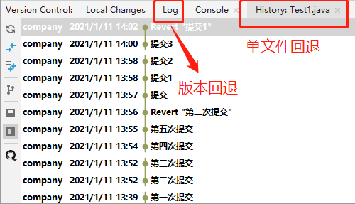

# 一、redis

### 1、springBoot整合Redis实例

#### 1、依赖

```xml
<dependency>
    <groupId>org.springframework.boot</groupId>
    <artifactId>spring-boot-starter-data-redis</artifactId>
    <version>2.1.5.RELEASE</version>
</dependency>
<!--连接池，redis需要-->
<dependency>
    <groupId>org.apache.commons</groupId>
    <artifactId>commons-pool2</artifactId>
</dependency> 
```

#### 2、配置

```yml
spring:
  redis:
    database: 0
    host: 127.0.0.1
    port: 6379
```

#### 3、使用

```java
redisTemplate.opsForValue().set("student", student);
redisTemplate.opsForValue().get(key);
redisTemplate.delete(key);
```


# 二、git

### 1、授权

```sh
#配置公私钥
ssh-keygen -t rsa -C "邮箱账号"  #1.生成公钥
#注意，此步系统让输入密码，建议直接回车，表示不设置密码
#2.复制公钥：复制id_rsa.pub文件中的内容
#3.配置：登录github -> setting -> SSH and GPG keys -> new SSH key ->粘贴公钥。
```


### 2、连接本地与远程

#### 2.1 创建项目

- 必须：本地仓库(init)、本地分支(master)、远程仓库(github)、远程分支(origin master)
- 不是必须的必须：远程url重命名为origin，master追踪origin master

```sh
#1.新建本地仓库
git init #
#2.创建本地分支
#创建.gitgnore文件
git add .
git commit -m "init" #提交到本地仓库，并自动创建分支本地分支master
git branch -M ${BranceName} #重命名当前分支：一般是master、develop（不用）
#3.新建远程仓库：github上创建
git remote add orgin ${url} #在本地重命名远程仓库
git remote -v #查看
#4.创建远程分支并连接
git push orgin ${OriginBranceName} #本地推送到远程，如果远程没有此分支则自动创建，与本地同名，第一次一般为master
git branch -u origin/${OriginBranceName}#追踪远程（本地与远程建立联系）
git branch -vv #查看本地与远程分支关系
```

#### 2.2 clone

```sh
#克隆develop分支
git clone -b develop https://github.com/spsunpeng/studyNotes.git
#不指定则默认master分支，但这没有意义。

#使用ssh协议
git clone git@github.com:spsunpeng/studyNotes.git
```

- clone: 将指定的远程仓库代码拉取到本地，生成本仓库，生成一个创建（自动追踪远程分支的）本地分支

- 默认创建追踪origin/master的本地分支，-b可以指定其他分支。

- https协议克隆时不校验，push/pull时才让输入github的密码。

- ssh协议克隆时就会校验，必须先配置公私钥。

  另外，此步如果要输入密码，则是因为在配置公私钥时设置了密码，建议不要设置密码。


### 3、提交

```sh
#提交
git add
git commit
#查看状态
git status
#查看提交记录
git log
git log --oneline
git reflog
#回退
git reset --hard 版本的索引号/HEAD   #整体回退，reset（重置）
git reset --mixed 版本的索引号/HEAD  #回退本地仓库和暂存区
git reset --soft 版本的索引号/HEAD   #仅回退本地仓库
#查看差异
git  diff  无/版本索引/head  filename #比较暂存区的其它文件的目录，hard（重）
git  diff  无  filename 				#比较的本地与暂存区
```


### 4、分支

#### 4.1 git

```shell
#查看分支
git branch
#-a  查看所有远程
#-v  查看本地分支
#-vv 查看本地分支追踪的远程分支

#增/删分支
git checkout develop #切换分支
git branch (origin) BranceName #新建分支，单独操作没用
git branch -u origin BranceName #追踪远程分支，单独操作没用
git branch -d develop #删除分支
git branch -D develop #强制删除分支

#创建分支（创建、追踪、切换）
git checkout -b {newdev} develop  #根据develop创建newdev分支，本地大改动时用
git checkout -b release origin/release #根据origin/release创建release分支，没什么用
git checkout -b origin/feature origin/develop #不由本地操作，而由远程操作。
#所以，建议创建分支时要明确根据哪个分支创建

#合并分支
git merge BranceName
#指定的分支并入到当前分支
```

#### 4.2 idea

- 新的分支用idea推时，会会调用创建远程分支的命令
- merge时指定的分支并入到当前分支，所以当前分支一般是develop分支。


### 5、回退

#### 5.1 git

```sh
git reset --hard {版本的索引号/HEAD}   #整体回退
git reset --mixed {版本的索引号/HEAD}  #回退本地仓库和暂存区
git reset --soft {版本的索引号/HEAD}   #仅回退本地仓库

git push -f                          #远程仓库回退,强制推送
```

HEAD指针：本地仓库每个分支上的代码的修改都会生成一个commit id信息，HEAD指针指向最近一次的commit提交，通过commit id可以进行版本回退。查看HEAD指针的改动日志为git reflog

#### 5.2 idea



- LOG/History
  - LOG：版本回退，和git的指令一样
  - History：单文件回退，对单个文件的回退，git可能也有相关指令
- 回退位置：回退到这个节点初始
- 回退注意事项：如果加入回退到多个额版本，此时大概率会产生冲突，所以：
  - 尽量选择单文件回退

  - 回退一个版本：不会产生冲突
  - 回退几十个版本：新建分支或tag，然后再回退，解决冲突时直接选择“right”


### 6、冲突

#### 6.1 git


#### 6.2 idea


### 7、idea集成git


### 8、注意

- 先commit再切换分支：一般在什么分支上commit则算这个分支的版本 ，而非在哪个分支上修改，不过很容易出错。
- idea回退
  - 尽量选择单文件回退
  - 回退一个版本：不会产生冲突
  - 回退多个版本：由于中间版本的影响，产生的冲突需要merge
  - 回退几十个版本：新建分支或tag，然后再回退，解决冲突时直接选择“right”


### 9、命令总结

```sh
#配置user.name和user.email
git config --global user.name "sunpengHome"
git config --global user.email "476567162@qq.com"
#初始化
git init
#提交
git add
git commit
#查看状态
git status
#查看提交记录
git log
git log --oneline
git reflog
#回退
git reset --hard 版本的索引号/HEAD   #整体回退，reset（重置）
git reset --mixed 版本的索引号/HEAD  #回退本地仓库和暂存区
git reset --soft 版本的索引号/HEAD   #仅回退本地仓库
#查看差异
git  diff  无/版本索引/head  filename #比较暂存区的其它文件的目录，hard（重）
git  diff  无  filename 				#比较的本地与暂存区

#查看分支
git branch
#-a  查看所有远程
#-v  查看本地分支
#-vv 查看本地分支追踪的远程分支
#增/删分支
git checkout develop #切换分支
git branch (origin) BranceName #新建分支，单独操作没用
git branch -u origin BranceName #追踪远程分支，单独操作没用
git branch -d develop #删除分支
git branch -D develop #强制删除分支
#创建分支（创建、追踪、切换）
git checkout -b {newdev} develop  #根据develop创建newdev分支，本地大改动时用
git checkout -b release origin/release #根据origin/release创建release分支，没什么用
git checkout -b origin/feature origin/develop #不由本地操作，而由远程操作。
#所以，建议创建分支时要明确根据哪个分支创建
#合并分支
git merge BranceName
```


# 三、jackson

### 1、ObjectMapper

#### 1.1 转换

```java
ObjectMapper objectMapper= new ObjectMapper()
User user = new User();
String string = ""
List<User> userList = new ArrayList<>();
```

| source   | target   | to                                                           |
| -------- | -------- | ------------------------------------------------------------ |
| String   | Object   | objectMapper.readValue(string, User.class) <br />objectMapper.readValue(string, new TypeReference<List<User>>() { }) |
| String   | JsonNode | objectMapper.readTree(string);  (string必须是json，否则报错) |
| Object   | String   | objectMapper.writeValueAsString(user)                        |
| Object   | JsonNode | objectMapper.valueToTree(string);                            |
| JsonNode | Object   | 目前没用到                                                   |
| JsonNode | String   | toString                                                     |


### 2、ObjectNode

#### 2.1 构建ObjectNode

```java
ObjectNode objectNode = objectMapper.createObjectNode();
User user = new User();

//设置string
objectNode.put("name", "suoeng");
//设置objectNode/jsonNode/arrayNode
objectNode.set("user", objectMapper.valueToTree(user)); //作为整体存入
objectNode.setAll(objectMapper.valueToTree(user));      //每个字段单独存入
```


### 3、JsonNode

```java
//取值
JsonNode jsonNode = objectNode;
jsonNode.get(string)
```


### 4、总结

#### 4.1 异常

##### 4.1.1 编译异常

JsonProcessingException

- 运行异常，所以必须处理
- json定义的异常，之所以定义是因为一些方法处理不了null，所以这类方法使用时要校验参数是否未空，比如readValue，反之未见此类异常说明参数可以穿空

##### 4.1.2 String不是json格式

#### 4.2 类型

##### 4.2.1 类型

```java
User user = new User();
//Object类型
System.out.println(User.class);       //class com.example.json.model.User
System.out.println(user.getClass());  //class com.example.json.model.User

//List类型
List<User> userList = new ArrayList<>();
System.out.println(userList.getClass()); //class java.util.ArrayList
System.out.println(List.class);          //interface java.util.List
System.out.println(List<User>.class);       //错误

//List<User>类型 json提供
TypeReference<List<User>> typeReference = new TypeReference<List<User>>() {};
System.out.println(typeReference.getType());//java.util.List<com.example.json.model.User>
```

由此可见，new TypeReference<T>() {} 可以获取类型

##### 4.2.2 类型传递

| 实参                    | 形参                  | 场景                          |
| ----------------------- | --------------------- | ----------------------------- |
| User.class              | Class<T> clazz        | 1.获取实例；2.获取类型clazz   |
| new TypeReference<User> | TypeReference<T> type | 获取类型，如 User、List<User> |
|                         |                       |                               |


