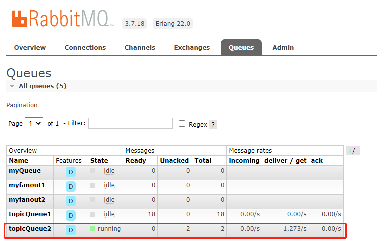

# 一、rabbitmq

## 1、安装

### 1.1 安装Erlang

RabbitMQ是使用Erlang语言编写的，所以需要先配置Erlang

```sh
#1.修改主机名
vim /etc/sysconfig/network
# NETWORKING=yes
# HOSTNAME=smallming
vim /etc/hosts 
# 10.1.20.89 smallming

#2 安装依赖
yum -y install make gcc gcc-c++ kernel-devel m4 ncurses-devel openssl-devel unixODBC unixODBC-devel

#3 上传并解压
cd /usr/local/tmp
tar xf otp_src_22.0.tar.gz #解压时注意，此压缩包不具有gzip属性，解压参数没有z，只有xf

#4 配置参数
mkdir -p /usr/local/erlang
cd otp_src_22.0
./configure --prefix=/usr/local/erlang --with-ssl --enable-threads --enable-smp-support --enable-kernel-poll --enable-hipe --without-javac # 配置参数

#5 编译并安装
make #编译 
make instal #安装

#6 修改环境变量
vim /etc/profile #export PATH=$PATH:/usr/local/erlang/bin
source /etc/profile #运行文件，让修改内容生效

#7 查看配置是否成功
erl -version
```


### 1.2 安装RabbitMQ

​	上传rabbitmq-server-generic-unix-3.7.18.tar.xz到/usr/loca/tmp中

```sh
vim /etc/profile

#1 上传并解压
#上传rabbitmq-server-generic-unix-3.7.18.tar.xz到/usr/loca/tmp中
cd /usr/local/tmp
tar xf rabbitmq-server-generic-unix-3.7.18.tar.xz

#2 复制到local下
cp -r rabbitmq_server-3.7.18 /usr/local/rabbitmq

# 3 配置环境变量
vim /etc/profile #export PATH=$PATH:/usr/local/rabbitmq/sbin
source /etc/profile

#4 开启web管理插件
cd /usr/local/rabbitmq/sbin
./rabbitmq-plugins list #查看插件列表
./rabbitmq-plugins enable rabbitmq_management #生效管理插件

#5 后台运行
./rabbitmq-server -detached #启动rabbitmq
./rabbitmqctl stop_app #停止命令，如果无法停止，使用kill -9 进程号进行关闭

#6 查看web管理界面
#url: http://端口号:15672 （放行端口，或关闭防火墙）
#默认可以在安装rabbitmq的电脑上通过用户名：guest密码guest进行访问web管理界面
#虚拟机外的主机无法通过guest访问
```


### 1.3 RabbitMq账户管理

由于虚拟机外的主机无法通过guest访问，所系需要新建用户

```sh
#1 创建账户
cd /usr/local/rabbitmq/sbin
./rabbitmqctl add_user mashibing mashibing

#2 给用户授予管理员角色
./rabbitmqctl set_user_tags mashibing administrator

#3 给用户授权
./rabbitmqctl set_permissions -p "/" mashibing ".*" ".*" ".*"
# “/” 表示虚拟机
# mashibing 表示用户名
# ".*" ".*" ".*" 表示完整权限

#4 登录
#url http://ip:15672/
#用户名：mashibing
#密码：mashibing
```


## 2、基础例子

- 依赖

```xml
<dependency>
    <groupId>org.springframework.boot</groupId>
    <artifactId>spring-boot-starter-amqp</artifactId>
</dependency>
```

- 配置

  ```yaml
  spring:
    rabbitmq:
      host: 10.1.20.89
      username: mashibing
      password: mashibing
  ```

- provider

  ```java
  import org.springframework.amqp.core.*;
  import org.springframework.context.annotation.Bean;
  import org.springframework.context.annotation.Configuration;
  
  @Configuration
  public class RabbitmqConfig {
      @Bean
      protected Queue queue(){
          return new Queue("myQueue"); //构建队列myQueue
      }
  }
  ```

  ```java
  @SpringBootTest
  class ProviderApplicationTests {
      @Test
      void test1(){
          amqpTemplate.convertAndSend("myQueue", "这是内容"); //向队列myQueue中发消息
          System.out.println("发送成功");
      }
  }
  ```

-  consumer

   ```java
   @RabbitListener(queues = "myQueue") //接收队列myQueue的消息
   public void demo1(String msg){
       System.out.println("demo1获取到的内容："+msg); 
   }
   ```


## 3、交换器类型

### 3.1 交换器类型

交换器负责接收客户端传递过来的消息，并转发到对应的队列中。在RabbitMQ中支持四种交换器，第2节中的例子对应默认交换器

| 交换器   | 直连交换器（默认）         | 扇形交换器                 | 主题交换器                   | 首部交换器      |
| -------- | -------------------------- | -------------------------- | ---------------------------- | --------------- |
| Exchange | Direct Exchange            | Fanout Exchange            | Topic Exchange               | Header Exchange |
| 队列     | 一个交换器只能绑定一个队列 | 一个交换器可以绑定多个队列 | 一个交换器可以绑定多个队列   |                 |
| 消费者   | 多个消费者轮询消费         | 只有一个消费者能消费       | 只有一个消费者能消费         |                 |
| 注意     |                            |                            | *代表一个单词，#表示多个单词 |                 |

### 3.2 使用

#### 3.2.1 provider

```java
package com.msb.provider.config;

import org.springframework.amqp.core.*;
import org.springframework.context.annotation.Bean;
import org.springframework.context.annotation.Configuration;

@Configuration
public class RabbitmqConfig {

    /*
    直连交换器
    */
    @Bean
    protected Queue queue(){
        return new Queue("myQueue");
    }

    /*
    扇形交换器
    */
    @Bean
    public Queue queue1(){
        return new Queue("myfanout1");
    }
    @Bean
    public Queue queue2(){
        return new Queue("myfanout2");
    }
    @Bean
    public FanoutExchange getFanoutExchange(){
        return new FanoutExchange("amq.fanout");
    }
    @Bean
    public Binding binding(Queue queue1, FanoutExchange getFanoutExchange){
        return BindingBuilder.bind(queue1).to(getFanoutExchange);
    }
    @Bean
    public Binding binding2(Queue queue2, FanoutExchange getFanoutExchange){
        return BindingBuilder.bind(queue2).to(getFanoutExchange);
    }

    /*
    主题交换器
    */
    @Bean
    public Queue topicQueue1(){
        return new Queue("topicQueue1");
    }
    @Bean
    public Queue topicQueue2(){
        return new Queue("topicQueue2");
    }
    @Bean
    public TopicExchange topicExchange(){
        return new TopicExchange("amq.topic");
    }
    @Bean
    public Binding bindingTopic1(Queue topicQueue1, TopicExchange topicExchange){
        return BindingBuilder.bind(topicQueue1).to(topicExchange).with("com.msb.*");
        //*代表一个单词，#表示多个单词
    }
    @Bean
    public Binding bindingTopic2(Queue topicQueue2, TopicExchange topicExchange){
        return BindingBuilder.bind(topicQueue2).to(topicExchange).with("com.msb.a");
    }

}
```

#### 3.2.2 provier 测试

```java
package com.msb.provider;

import org.junit.jupiter.api.Test;
import org.springframework.amqp.core.AmqpTemplate;
import org.springframework.beans.factory.annotation.Autowired;
import org.springframework.boot.test.context.SpringBootTest;

@SpringBootTest
class ProviderApplicationTests {
    
    @Autowired
    private AmqpTemplate amqpTemplate;
    
    @Test
    void test1(){
        amqpTemplate.convertAndSend("myQueue", "这是内容");
        System.out.println("发送成功");
    }

    @Test
    void test2(){
        amqpTemplate.convertAndSend("amq.fanout", "core", "fanout类型的消息");
        System.out.println("发送成功");
    }

    @Test
    void test3(){
        amqpTemplate.convertAndSend("amq.topic", "com.msb.a", "topic类型的消息");
        System.out.println("发送成功");
    }
}
```


## 4、消息接收确认

| acknowledge-mode                  | none   | auto                  | manual                     |
| --------------------------------- | ------ | --------------------- | -------------------------- |
| 含义                              | 不确认 | 自动确认              | 手动确认                   |
| 使用                              | 无特殊 | 无特殊                | 代码需要确认消息（注2）    |
| 消费者异常时如何确认              | 不存在 | 不断消费此消息        | 服务每次重启都要消费此消息 |
| 消费者异常时阻塞不                | 不存在 | 不阻塞                | 不阻塞                     |
| 生命周期(异常-停止-重启异常)(注3) | 不存在 | Unacked-Ready-Unacked | Unacked-Ready-Unacked      |

注一：消息模式的

```yaml
spring:
    listener:
      simple:
        acknowledge-mode: auto #none/auto/manual
```

注二：确认消息代码

```java
@RabbitListener(queues = "topicQueue2")
public void demo7(String msg, Channel channel, @Header(AmqpHeaders.DELIVERY_TAG) long tag){
    try {
        channel.basicAck(tag, false);
    } catch (IOException e) {
        e.printStackTrace();
    }
}
```

注三：异常时的生命周期



注四：自动确认和手动确认

自动确认和手动确认区别在于碰到异常时自动确认会不断消费此消息，我怀疑是因为，自动确认会把消息重新放回到Ready中，手动确认指挥因为消费者端停止消息回到Ready。但是，从rabbitmq中看不到任何不同，自动确认消息的状态不会在Ready和Unacked中来回切换。


